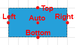

# Connectors

The __RadDiagramShape__ and __RadDiagramContainerShape__ visuals have 5 default connectors - Top, Right, Bottom, Left and Auto. Those are the predefined points where you can connect a __RadDiagramConnection__ to the shape.



* __Top__: The connector point positioned in the middle of the top border of a shape			
* __Bottom__: The connector point positioned in the middle of the bottom border of a shape	
* __Right__: The connector point positioned in the middle of the right border of a shape 
* __Left__: The connector point positioned in the middle of the left border of a shape
* __Auto__: The connector positioned at the center of a shape. If you attach a RadDiagramConnection to this point, the connector point of the connection will dynamically change based on the shortest path to the shape.			

## Get the Connectors

All connector points of a shape can be accessed through the __Connectors__ property of RadDiagramShape. It is a collection of __RadDiagramConnector__ items. Each item represents a RadDiagramShape connector and can give you information about the coordinates of each connector point, its position and if the connector is active. A connector is active when the connection tool activates it in order to prepare it to start drawing a connection.		

## Using Gliding Connectors

The gliding connectors feature says to a shape that it doesn't have any explicitly pisitioned connectors. This allows a connection to glide through the edges of the shape. 

To enable the gliding connectors you can set the __UseGlidingConnector__ property of __RadDiagramShape__ to True. 

This feature comes with a set of predefined shape forms determining the form of edges through which a gliding connection can slide. These shapes are described by the __GlidingStyle__ property, which is a GlidingStyle enumeration exposing the following members:

* __Rectangle__: The connections attached to a gliding connector will glide along a rectangle with dimensions equal to the bounds of the shape. This is the default value.

* __Ellipse__: The connections attached to a gliding connector will glide along an ellipse with dimensions equal to the bounds of the shape.			

* __Diamond__: The connections attached to a gliding connector will glide along a rhombus (diamond polygon) with dimensions equal to the bounds of the shape.			

* __RightTriangle__: The connections attached to a gliding connector will glide along a right triangle with dimensions equal to the bounds of the shape.			

* __Triangle__: The connections attached to a gliding connector will glide along a triangle with dimensions equal to the bounds of the shape.			


## Hiding the Default Connectors

To hide the default connectors you can set the __UseDefaultConnectors__ property of the RadDiagramShape and RadDiagramContainerShape to **False**.

## Using Custom Connectors 

You can see how to use custom connectors in the [Custom Connectors]() article.

Additionally, you can customize the default appearance of the connector points through the __ConnectorStyle__ property of RadDiagramShape which allows you to apply a custom style on them.

## Undo Command When Using Custom Connectors

The diagram doesn't support undo custom type connectors when __Undo command__ is executed. Executing the command will create the connectors of type __RadDiagramConnector__ by default. To Undo custom connectors, your custom class needs to implement the __ICloneable__ interface. Then you can implement its Clone() method and return your custom type.

__Example 1: Undo Custom Connectors__

```C#
	public class CustomConnector : RadDiagramConnector, ICloneable
	{
		object ICloneable.Clone()
		{
			CustomConnector diagramConnector = new CustomConnector();
			diagramConnector.Name = this.Name;
			diagramConnector.Offset = this.Offset;
			return diagramConnector;
		}
	}
```

## See Also  
 * [Structure]()
 * [Getting Started]() 
 * [Connections]()
 * [Items Events]()
 * [Diagram Shape]()
