# Predefined Shape Geometries

The __Telerik Diagramming Framework__ provides three types of predefined shape geometries - __ArrowShapes__, __CommonShapes__ and __FlowChartShapes__. For each of these types the framework exposes xaml markup extensions that can be applied at the __RadDiagramShape.Geometry__ property as a shortcut way of creating a shape.

This article contains a list with the available geometries and shows how to set a geometry.

__Create a geometry in code behind__ 
```C#
	Geometry arrowGeometry = ShapeFactory.GetShapeGeometry(ArrowShapeType.Arrow1);
	diagramShape.Geometry = arrowGeometry;
```

## ArrowShapes

__Arrow1__ 
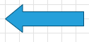

#### __XAML__
```XAML
	<telerik:RadDiagramShape Geometry="{telerik:ArrowShape ShapeType=Arrow1}" />
```

__Arrow2__ 
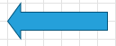

#### __XAML__
```XAML
	<telerik:RadDiagramShape Geometry="{telerik:ArrowShape ShapeType=Arrow2}" />
```

__Arrow3__
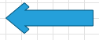

#### __XAML__
```XAML
	<telerik:RadDiagramShape Geometry="{telerik:ArrowShape ShapeType=Arrow3}" />
```

__Arrow4__ 
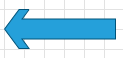

#### __XAML__
```XAML
	<telerik:RadDiagramShape Geometry="{telerik:ArrowShape ShapeType=Arrow4}" />  
```

__Arrow5__ 
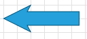

#### __XAML__
```XAML
	<telerik:RadDiagramShape Geometry="{telerik:ArrowShape ShapeType=Arrow5}"/>
```

__Arrow6__ 
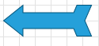

#### __XAML__
```XAML
	<telerik:RadDiagramShape Geometry="{telerik:ArrowShape ShapeType=Arrow6}" />
```

__Arrow7__ 
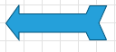

#### __XAML__
```XAML
	<telerik:RadDiagramShape Geometry="{telerik:ArrowShape ShapeType=Arrow7}"/>
```

__Arrow8__ 
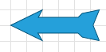

#### __XAML__
```XAML
	<telerik:RadDiagramShape Geometry="{telerik:ArrowShape ShapeType=Arrow8}"/>				  						  
```

__DoubleArrow1__ 	
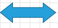

#### __XAML__
```XAML
	<telerik:RadDiagramShape Geometry="{telerik:ArrowShape ShapeType=DoubleArrow1}" />				  						  
```

__DoubleArrow2__ 
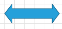

#### __XAML__
```XAML
	<telerik:RadDiagramShape Geometry="{telerik:ArrowShape ShapeType=DoubleArrow2}" />				  						  
```

__DoubleArrow3__ 
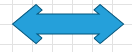

#### __XAML__
```XAML
	<telerik:RadDiagramShape Geometry="{telerik:ArrowShape ShapeType=DoubleArrow3}" />
```

__DoubleArrow4__ 
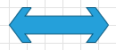

#### __XAML__
```XAML
	<telerik:RadDiagramShape Geometry="{telerik:ArrowShape ShapeType=DoubleArrow4}" />
```

__DoubleArrow5__ 
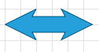

#### __XAML__
```XAML
	<telerik:RadDiagramShape Geometry="{telerik:ArrowShape ShapeType=DoubleArrow5}" />
```
	
### CommonShapes
					
__CloudShape__ 
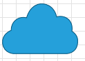

#### __XAML__
```XAML
	<telerik:RadDiagramShape Geometry="{telerik:CommonShape ShapeType=CloudShape}" />				  
```

__Cross2Shape__ 
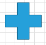

#### __XAML__
```XAML
	<telerik:RadDiagramShape Geometry="{telerik:CommonShape ShapeType=Cross2Shape}"/>
```

__CrossShape__ 
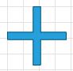

#### __XAML__
```XAML
	<telerik:RadDiagramShape Geometry="{telerik:CommonShape ShapeType=CrossShape}" />				  
```

__EllipseShape__ 
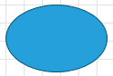

#### __XAML__
```XAML
	<telerik:RadDiagramShape Geometry="{telerik:CommonShape ShapeType=EllipseShape}" />				  
```

__HexagonShape__ 
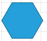

#### __XAML__
```XAML
	<telerik:RadDiagramShape Geometry="{telerik:CommonShape ShapeType=HexagonShape}"/>				  						  
```

__OctagonShape__ 
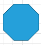

#### __XAML__
```XAML
	<telerik:RadDiagramShape Geometry="{telerik:CommonShape ShapeType=OctagonShape}" />
```

__PentagonShape__ 
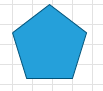

#### __XAML__
```XAML
	<telerik:RadDiagramShape Geometry="{telerik:CommonShape ShapeType=PentagonShape}" />
```

__RectangleShape__ 
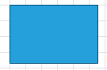

#### __XAML__
```XAML
	<telerik:RadDiagramShape Geometry="{telerik:CommonShape ShapeType=RectangleShape}"/>				  						  
```

__RightTriangleShape__ 
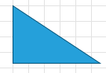

#### __XAML__
```XAML
	<telerik:RadDiagramShape Geometry="{telerik:CommonShape ShapeType=RightTriangleShape}" />				  						  
```

__RoundedRectangleShape__ 
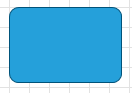

#### __XAML__
```XAML
	<telerik:RadDiagramShape Geometry="{telerik:CommonShape ShapeType=RoundedRectangleShape}" />				  						  
```

__Star5Shape__ 
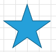

#### __XAML__
```XAML
	<telerik:RadDiagramShape Geometry="{telerik:CommonShape ShapeType=Star5Shape}"/>				  
```

__Star6Shape__ 
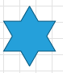

#### __XAML__
```XAML
	<telerik:RadDiagramShape Geometry="{telerik:CommonShape ShapeType=Star6Shape}" />
```

__Star7Shape__ 
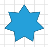

#### __XAML__
```XAML
	<telerik:RadDiagramShape Geometry="{telerik:CommonShape ShapeType=Star7Shape}" />
```

__TriangleShape__ 
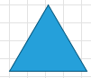

#### __XAML__
```XAML
	<telerik:RadDiagramShape Geometry="{telerik:CommonShape ShapeType=TriangleShape}"/>	
```
	
### FlowChartShapes

__BeginLoopShape__ 
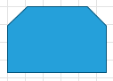

#### __XAML__
```XAML
	<telerik:RadDiagramShape Geometry="{telerik:FlowChartShape ShapeType=BeginLoopShape}" />
```

__CardShape__ 
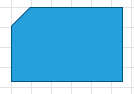

#### __XAML__
```XAML
	<telerik:RadDiagramShape Geometry="{telerik:FlowChartShape ShapeType=CardShape}"/>
```

__CollateShape__ 
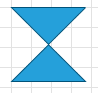

#### __XAML__
```XAML
	<telerik:RadDiagramShape Geometry="{telerik:FlowChartShape ShapeType=CollateShape}" />				  					  
```

__CreateRequestShape__ 
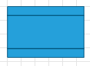

#### __XAML__
```XAML
	<telerik:RadDiagramShape Geometry="{telerik:FlowChartShape ShapeType=CreateRequestShape}" />
```

__Database1Shape__ 
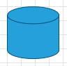

#### __XAML__
```XAML
	<telerik:RadDiagramShape Geometry="{telerik:FlowChartShape ShapeType=Database1Shape}"/>				  
```

__Database2Shape__ 
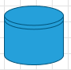

#### __XAML__
```XAML
	<telerik:RadDiagramShape Geometry="{telerik:FlowChartShape ShapeType=Database2Shape}" />				  
```

__Database3Shape__ 
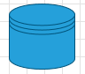

#### __XAML__
```XAML
	<telerik:RadDiagramShape Geometry="{telerik:FlowChartShape ShapeType=Database3Shape}"/>
```

__DataShape__ 
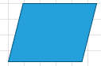

#### __XAML__
```XAML
	<telerik:RadDiagramShape Geometry="{telerik:FlowChartShape ShapeType=DataShape}" />
```

__DataStoreShape__ 
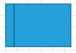

#### __XAML__
```XAML
	<telerik:RadDiagramShape Geometry="{telerik:FlowChartShape ShapeType=DataStoreShape}" />
```

__DecisionShape__ 
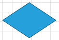

#### __XAML__
```XAML
	<telerik:RadDiagramShape Geometry="{telerik:FlowChartShape ShapeType=DecisionShape}"/>
```

__DelayShape__ 
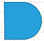

#### __XAML__
```XAML
	<telerik:RadDiagramShape Geometry="{telerik:FlowChartShape ShapeType=DelayShape}" />				  						  
```

__DevidedProcessShape__ 
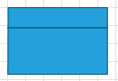

#### __XAML__
```XAML
	<telerik:RadDiagramShape Geometry="{telerik:FlowChartShape ShapeType=DevidedProcessShape}" />
```

__DirectDataShape__ 


#### __XAML__
```XAML
	<telerik:RadDiagramShape Geometry="{telerik:FlowChartShape ShapeType=DirectDataShape}"/>
```

__DisplayShape__ 
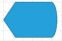

#### __XAML__
```XAML
	<telerik:RadDiagramShape Geometry="{telerik:FlowChartShape ShapeType=DisplayShape}" />				  
```

__DocumentShape__ 
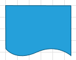

#### __XAML__
```XAML
	<telerik:RadDiagramShape Geometry="{telerik:FlowChartShape ShapeType=DocumentShape}" />				  
```

__DuplicatingShape__ 
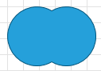

#### __XAML__
```XAML
	<telerik:RadDiagramShape Geometry="{telerik:FlowChartShape ShapeType=DuplicatingShape}"/>				  
```
		
__ExternalDataShape__ 
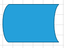

#### __XAML__
```XAML
	<telerik:RadDiagramShape Geometry="{telerik:FlowChartShape ShapeType=ExternalDataShape}" />
```

__FeedbackShape__ 
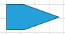

#### __XAML__
```XAML
	<telerik:RadDiagramShape Geometry="{telerik:FlowChartShape ShapeType=FeedbackShape}" />
```
	
__FramedRectangleShape__ 


#### __XAML__
```XAML
	<telerik:RadDiagramShape Geometry="{telerik:FlowChartShape ShapeType=FramedRectangleShape}"/>
```

__InternalStorageShape__ 
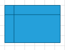

#### __XAML__
```XAML
	<telerik:RadDiagramShape Geometry="{telerik:FlowChartShape ShapeType=InternalStorageShape}" />
```

__LinedDocumentShape__ 
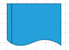

#### __XAML__
```XAML
	<telerik:RadDiagramShape Geometry="{telerik:FlowChartShape ShapeType=LinedDocumentShape}" />
```

__LoopLimitShape__ 
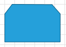

#### __XAML__
```XAML
	<telerik:RadDiagramShape Geometry="{telerik:FlowChartShape ShapeType=LoopLimitShape}"/>				  
```

__ManualInputShape__ 
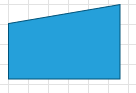

#### __XAML__
```XAML
	<telerik:RadDiagramShape Geometry="{telerik:FlowChartShape ShapeType=ManualInputShape}" />
```

__ManualOperationShape__ 
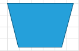

#### __XAML__
```XAML
	<telerik:RadDiagramShape Geometry="{telerik:FlowChartShape ShapeType=ManualOperationShape}" />
```

__MessageFromUserShape__ 
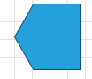

#### __XAML__
```XAML
	<telerik:RadDiagramShape Geometry="{telerik:FlowChartShape ShapeType=MessageFromUserShape}"/>
```

__MessageToUserShape__ 


#### __XAML__
```XAML
	<telerik:RadDiagramShape Geometry="{telerik:FlowChartShape ShapeType=MessageToUserShape}" />
```

__MicroformProcessingShape__ 


#### __XAML__
```XAML
	<telerik:RadDiagramShape Geometry="{telerik:FlowChartShape ShapeType=MicroformProcessingShape}" />
```

__MicroformRecordingShape__ 


#### __XAML__
```XAML
	<telerik:RadDiagramShape Geometry="{telerik:FlowChartShape ShapeType=MicroformRecordingShape}"/>
```

__MultipleDocumentShape__ 


#### __XAML__
```XAML
	<telerik:RadDiagramShape Geometry="{telerik:FlowChartShape ShapeType=MultipleDocumentShape}" />
```

__OffPageConnectionShape__ 


#### __XAML__
```XAML
	<telerik:RadDiagramShape Geometry="{telerik:FlowChartShape ShapeType=OffPageConnectionShape}" />
```

__OffPageLinkShape__ 


#### __XAML__
```XAML
	<telerik:RadDiagramShape Geometry="{telerik:FlowChartShape ShapeType=OffPageLinkShape}"/>
```

__OffPageReflectionShape__ 


#### __XAML__
```XAML
	<telerik:RadDiagramShape Geometry="{telerik:FlowChartShape ShapeType=OffPageReflectionShape}" />
```

__OrShape__ 


#### __XAML__
```XAML
	<telerik:RadDiagramShape Geometry="{telerik:FlowChartShape ShapeType=OrShape}" />
```

__PaperTapeShape__ 


#### __XAML__
```XAML
	<telerik:RadDiagramShape Geometry="{telerik:FlowChartShape ShapeType=PaperTapeShape}"/>
```

__PredefinedShape__ 


#### __XAML__
```XAML
	<telerik:RadDiagramShape Geometry="{telerik:FlowChartShape ShapeType=PredefinedShape}"  />
```

__PreparationShape__ 


#### __XAML__	
```XAML
	<telerik:RadDiagramShape Geometry="{telerik:FlowChartShape ShapeType=PreparationShape}" />
```

__PrimitiveFromCallShape__ 


#### __XAML__
```XAML
	<telerik:RadDiagramShape Geometry="{telerik:FlowChartShape ShapeType=PrimitiveFromCallShape}"/>
```

__PrimitiveToCallShape__ 


#### __XAML__
```XAML
	<telerik:RadDiagramShape Geometry="{telerik:FlowChartShape ShapeType=PrimitiveToCallShape}"  />
```

__SequentialDataShape__ 


#### __XAML__
```XAML
	<telerik:RadDiagramShape Geometry="{telerik:FlowChartShape ShapeType=SequentialDataShape}" />						  
```

__SortShape__ 


#### __XAML__
```XAML
	<telerik:RadDiagramShape Geometry="{telerik:FlowChartShape ShapeType=SortShape}"/>
```

__StartShape__ 


#### __XAML__
```XAML
	<telerik:RadDiagramShape Geometry="{telerik:FlowChartShape ShapeType=StartShape}"  />
```

__StoredDataShape__


#### __XAML__
```XAML
	<telerik:RadDiagramShape Geometry="{telerik:FlowChartShape ShapeType=StoredDataShape}" />
```

__SummingJunctionShape__ 


#### __XAML__
```XAML
	<telerik:RadDiagramShape Geometry="{telerik:FlowChartShape ShapeType=SummingJunctionShape}"/>
```

__TerminatorShape__ 


#### __XAML__
```XAML
	<telerik:RadDiagramShape Geometry="{telerik:FlowChartShape ShapeType=TerminatorShape}"  />
```

__TransmittalTapeShape__ 


#### __XAML__
```XAML
	<telerik:RadDiagramShape Geometry="{telerik:FlowChartShape ShapeType=TransmittalTapeShape}" />
```

## See Also  
 * [Structure]()
 * [Getting Started]() 
 * [Connections]()
 * [Items Events]()
 * [Diagram Shape]()