# Predefined Shape Geometries

The __Telerik Diagramming Framework__ provides three types of predefined shape geometries - __ArrowShapes__, __CommonShapes__ and __FlowChartShapes__. For each of these types the framework exposes xaml markup extensions that can be applied at the __RadDiagramShape.Geometry__ property as a shortcut way of creating a shape.

This article contains a list with the available geometries and shows how to set a geometry.

__Create a geometry in code behind__ 
<snippet id='raddiagram-diagram-items-shape-raddiagrams-features-shapes-predefined-shapes-create_a_geometry_in_code_behind-cs' />

## ArrowShapes

__Arrow1__ 
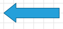

<snippet id='raddiagram-diagram-items-shape-raddiagrams-features-shapes-predefined-shapes-arrow1-xaml' />

__Arrow2__ 
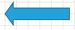

<snippet id='raddiagram-diagram-items-shape-raddiagrams-features-shapes-predefined-shapes-arrow2-xaml' />

__Arrow3__
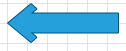

<snippet id='raddiagram-diagram-items-shape-raddiagrams-features-shapes-predefined-shapes-arrow3-xaml' />

__Arrow4__ 
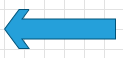

<snippet id='raddiagram-diagram-items-shape-raddiagrams-features-shapes-predefined-shapes-arrow4-xaml' />

__Arrow5__ 
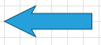

<snippet id='raddiagram-diagram-items-shape-raddiagrams-features-shapes-predefined-shapes-arrow5-xaml' />

__Arrow6__ 
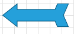

<snippet id='raddiagram-diagram-items-shape-raddiagrams-features-shapes-predefined-shapes-arrow6-xaml' />

__Arrow7__ 
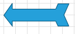

<snippet id='raddiagram-diagram-items-shape-raddiagrams-features-shapes-predefined-shapes-arrow7-xaml' />

__Arrow8__ 
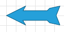

<snippet id='raddiagram-diagram-items-shape-raddiagrams-features-shapes-predefined-shapes-arrow8-xaml' />

__DoubleArrow1__ 	
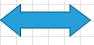

<snippet id='raddiagram-diagram-items-shape-raddiagrams-features-shapes-predefined-shapes-doublearrow1-xaml' />

__DoubleArrow2__ 
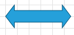

<snippet id='raddiagram-diagram-items-shape-raddiagrams-features-shapes-predefined-shapes-doublearrow2-xaml' />

__DoubleArrow3__ 
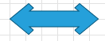

<snippet id='raddiagram-diagram-items-shape-raddiagrams-features-shapes-predefined-shapes-doublearrow3-xaml' />

__DoubleArrow4__ 
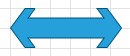

<snippet id='raddiagram-diagram-items-shape-raddiagrams-features-shapes-predefined-shapes-doublearrow4-xaml' />

__DoubleArrow5__ 
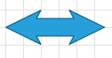

<snippet id='raddiagram-diagram-items-shape-raddiagrams-features-shapes-predefined-shapes-doublearrow5-xaml' />

	
### CommonShapes
					
__CloudShape__ 
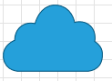

<snippet id='raddiagram-diagram-items-shape-raddiagrams-features-shapes-predefined-shapes-cloudshape-xaml' />

__Cross2Shape__ 
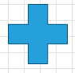

<snippet id='raddiagram-diagram-items-shape-raddiagrams-features-shapes-predefined-shapes-cross2shape-xaml' />

__CrossShape__ 
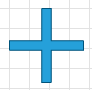

<snippet id='raddiagram-diagram-items-shape-raddiagrams-features-shapes-predefined-shapes-crossshape-xaml' />

__EllipseShape__ 
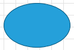

<snippet id='raddiagram-diagram-items-shape-raddiagrams-features-shapes-predefined-shapes-ellipseshape-xaml' />

__HexagonShape__ 
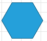

<snippet id='raddiagram-diagram-items-shape-raddiagrams-features-shapes-predefined-shapes-hexagonshape-xaml' />

__OctagonShape__ 
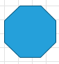

<snippet id='raddiagram-diagram-items-shape-raddiagrams-features-shapes-predefined-shapes-octagonshape-xaml' />

__PentagonShape__ 
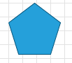

<snippet id='raddiagram-diagram-items-shape-raddiagrams-features-shapes-predefined-shapes-pentagonshape-xaml' />

__RectangleShape__ 
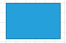

<snippet id='raddiagram-diagram-items-shape-raddiagrams-features-shapes-predefined-shapes-rectangleshape-xaml' />

__RightTriangleShape__ 
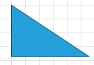

<snippet id='raddiagram-diagram-items-shape-raddiagrams-features-shapes-predefined-shapes-righttriangleshape-xaml' />

__RoundedRectangleShape__ 
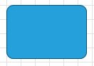

<snippet id='raddiagram-diagram-items-shape-raddiagrams-features-shapes-predefined-shapes-roundedrectangleshape-xaml' />

__Star5Shape__ 
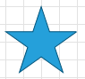

<snippet id='raddiagram-diagram-items-shape-raddiagrams-features-shapes-predefined-shapes-star5shape-xaml' />

__Star6Shape__ 
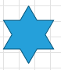

<snippet id='raddiagram-diagram-items-shape-raddiagrams-features-shapes-predefined-shapes-star6shape-xaml' />

__Star7Shape__ 
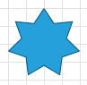

<snippet id='raddiagram-diagram-items-shape-raddiagrams-features-shapes-predefined-shapes-star7shape-xaml' />

__TriangleShape__ 
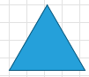

<snippet id='raddiagram-diagram-items-shape-raddiagrams-features-shapes-predefined-shapes-triangleshape-xaml' />

	
### FlowChartShapes

__BeginLoopShape__ 
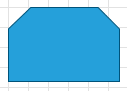

<snippet id='raddiagram-diagram-items-shape-raddiagrams-features-shapes-predefined-shapes-beginloopshape-xaml' />

__CardShape__ 
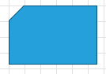

<snippet id='raddiagram-diagram-items-shape-raddiagrams-features-shapes-predefined-shapes-cardshape-xaml' />

__CollateShape__ 
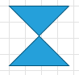

<snippet id='raddiagram-diagram-items-shape-raddiagrams-features-shapes-predefined-shapes-collateshape-xaml' />

__CreateRequestShape__ 
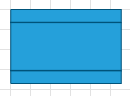

<snippet id='raddiagram-diagram-items-shape-raddiagrams-features-shapes-predefined-shapes-createrequestshape-xaml' />

__Database1Shape__ 
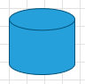

<snippet id='raddiagram-diagram-items-shape-raddiagrams-features-shapes-predefined-shapes-database1shape-xaml' />

__Database2Shape__ 
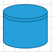

<snippet id='raddiagram-diagram-items-shape-raddiagrams-features-shapes-predefined-shapes-database2shape-xaml' />

__Database3Shape__ 
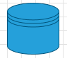

<snippet id='raddiagram-diagram-items-shape-raddiagrams-features-shapes-predefined-shapes-database3shape-xaml' />

__DataShape__ 
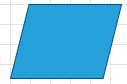

<snippet id='raddiagram-diagram-items-shape-raddiagrams-features-shapes-predefined-shapes-datashape-xaml' />

__DataStoreShape__ 
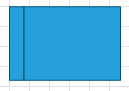

<snippet id='raddiagram-diagram-items-shape-raddiagrams-features-shapes-predefined-shapes-datastoreshape-xaml' />

__DecisionShape__ 
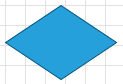

<snippet id='raddiagram-diagram-items-shape-raddiagrams-features-shapes-predefined-shapes-decisionshape-xaml' />

__DelayShape__ 
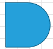

<snippet id='raddiagram-diagram-items-shape-raddiagrams-features-shapes-predefined-shapes-delayshape-xaml' />

__DevidedProcessShape__ 
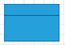

<snippet id='raddiagram-diagram-items-shape-raddiagrams-features-shapes-predefined-shapes-devidedprocessshape-xaml' />

__DirectDataShape__ 
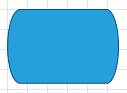

<snippet id='raddiagram-diagram-items-shape-raddiagrams-features-shapes-predefined-shapes-directdatashape-xaml' />

__DisplayShape__ 
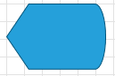

<snippet id='raddiagram-diagram-items-shape-raddiagrams-features-shapes-predefined-shapes-displayshape-xaml' />

__DocumentShape__ 
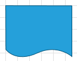

<snippet id='raddiagram-diagram-items-shape-raddiagrams-features-shapes-predefined-shapes-documentshape-xaml' />

__DuplicatingShape__ 
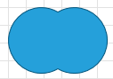

<snippet id='raddiagram-diagram-items-shape-raddiagrams-features-shapes-predefined-shapes-duplicatingshape-xaml' />

		
__ExternalDataShape__ 
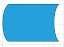

<snippet id='raddiagram-diagram-items-shape-raddiagrams-features-shapes-predefined-shapes-externaldatashape-xaml' />

__FeedbackShape__ 
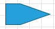

<snippet id='raddiagram-diagram-items-shape-raddiagrams-features-shapes-predefined-shapes-feedbackshape-xaml' />

	
__FramedRectangleShape__ 
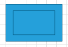

<snippet id='raddiagram-diagram-items-shape-raddiagrams-features-shapes-predefined-shapes-framedrectangleshape-xaml' />

__InternalStorageShape__ 
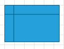

<snippet id='raddiagram-diagram-items-shape-raddiagrams-features-shapes-predefined-shapes-internalstorageshape-xaml' />

__LinedDocumentShape__ 
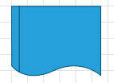

<snippet id='raddiagram-diagram-items-shape-raddiagrams-features-shapes-predefined-shapes-lineddocumentshape-xaml' />

__LoopLimitShape__ 
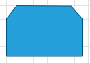

<snippet id='raddiagram-diagram-items-shape-raddiagrams-features-shapes-predefined-shapes-looplimitshape-xaml' />

__ManualInputShape__ 
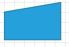

<snippet id='raddiagram-diagram-items-shape-raddiagrams-features-shapes-predefined-shapes-manualinputshape-xaml' />

__ManualOperationShape__ 
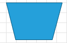

<snippet id='raddiagram-diagram-items-shape-raddiagrams-features-shapes-predefined-shapes-manualoperationshape-xaml' />

__MessageFromUserShape__ 
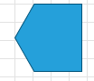

<snippet id='raddiagram-diagram-items-shape-raddiagrams-features-shapes-predefined-shapes-messagefromusershape-xaml' />

__MessageToUserShape__ 
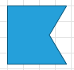

<snippet id='raddiagram-diagram-items-shape-raddiagrams-features-shapes-predefined-shapes-messagetousershape-xaml' />

__MicroformProcessingShape__ 
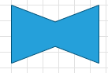

<snippet id='raddiagram-diagram-items-shape-raddiagrams-features-shapes-predefined-shapes-microformprocessingshape-xaml' />

__MicroformRecordingShape__ 
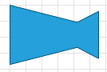

<snippet id='raddiagram-diagram-items-shape-raddiagrams-features-shapes-predefined-shapes-microformrecordingshape-xaml' />

__MultipleDocumentShape__ 
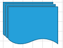

<snippet id='raddiagram-diagram-items-shape-raddiagrams-features-shapes-predefined-shapes-multipledocumentshape-xaml' />

__OffPageConnectionShape__ 
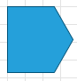

<snippet id='raddiagram-diagram-items-shape-raddiagrams-features-shapes-predefined-shapes-offpageconnectionshape-xaml' />

__OffPageLinkShape__ 
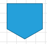

<snippet id='raddiagram-diagram-items-shape-raddiagrams-features-shapes-predefined-shapes-offpagelinkshape-xaml' />

__OffPageReflectionShape__ 
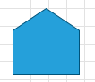

<snippet id='raddiagram-diagram-items-shape-raddiagrams-features-shapes-predefined-shapes-offpagereflectionshape-xaml' />

__OrShape__ 
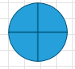

<snippet id='raddiagram-diagram-items-shape-raddiagrams-features-shapes-predefined-shapes-orshape-xaml' />

__PaperTapeShape__ 
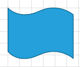

<snippet id='raddiagram-diagram-items-shape-raddiagrams-features-shapes-predefined-shapes-papertapeshape-xaml' />

__PredefinedShape__ 
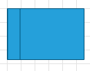

<snippet id='raddiagram-diagram-items-shape-raddiagrams-features-shapes-predefined-shapes-predefinedshape-xaml' />

__PreparationShape__ 
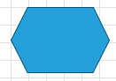

	
<snippet id='raddiagram-diagram-items-shape-raddiagrams-features-shapes-predefined-shapes-preparationshape-xaml' />

__PrimitiveFromCallShape__ 
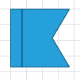

<snippet id='raddiagram-diagram-items-shape-raddiagrams-features-shapes-predefined-shapes-primitivefromcallshape-xaml' />

__PrimitiveToCallShape__ 
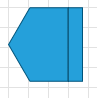

<snippet id='raddiagram-diagram-items-shape-raddiagrams-features-shapes-predefined-shapes-primitivetocallshape-xaml' />

__SequentialDataShape__ 

<snippet id='raddiagram-diagram-items-shape-raddiagrams-features-shapes-predefined-shapes-sequentialdatashape-xaml' />

__SortShape__ 
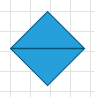

<snippet id='raddiagram-diagram-items-shape-raddiagrams-features-shapes-predefined-shapes-sortshape-xaml' />

__StartShape__ 
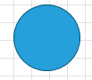

<snippet id='raddiagram-diagram-items-shape-raddiagrams-features-shapes-predefined-shapes-startshape-xaml' />

__StoredDataShape__
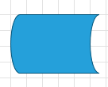

<snippet id='raddiagram-diagram-items-shape-raddiagrams-features-shapes-predefined-shapes-storeddatashape-xaml' />

__SummingJunctionShape__ 
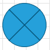

<snippet id='raddiagram-diagram-items-shape-raddiagrams-features-shapes-predefined-shapes-summingjunctionshape-xaml' />

__TerminatorShape__ 
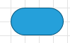

<snippet id='raddiagram-diagram-items-shape-raddiagrams-features-shapes-predefined-shapes-terminatorshape-xaml' />

__TransmittalTapeShape__ 
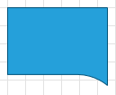

<snippet id='raddiagram-diagram-items-shape-raddiagrams-features-shapes-predefined-shapes-transmittaltapeshape-xaml' />

## See Also  
 * [Structure]()
 * [Getting Started]() 
 * [Connections]()
 * [Items Events]()
 * [Diagram Shape]()