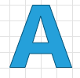
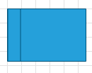
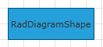
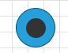
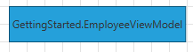
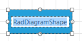
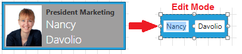

# Diagram Shape

This tutorial will walk you through the functionality and the main features of the __RadDiagramShape__.

* [Overview](#overview)
* [Setting the Position of a Shape](#setting-the-position-of-a-shape)
* [Setting the Content of a Shape](#setting-the-content-of-a-shape)
* [Common Properties](#common-properties)
* [Customize the Shape Appearance](#customize-the-shape-appearance)
* [Diagramming Framework Predefined Shape Geometries](#diagramming-framework-predefined-shape-geometries)

>Before proceeding with this topic, it is recommended to get familiar with the [Visual Structure]() of the Diagramming Framework.

## Overview

>Please note that the examples in this tutorial are showcasing Telerik Windows8 theme. In the [Setting a Theme](http://www.telerik.com/help/silverlight/common-styling-apperance-setting-theme.html#Setting_Application-Wide_Built-In_Theme_in_the_Code-Behind)[Setting a Theme](http://www.telerik.com/help/wpf/common-styling-apperance-setting-theme-wpf.html#Setting_Application-Wide_Built-In_Theme_in_the_Code-Behind) article you can find more information on how to set an application-wide theme.		  

The __RadDiagramShape__ is an object that describes the nodes of the diagram. You can configure its form using the __Geometry__ property as it allows you to define a custom geometry:		

```XAML
    <telerik:RadDiagramShape Width="80"
                             Height="80"
                             Geometry="M16.35,6.39 C16.28,7.36 12.26,20.45 12.26,20.45 L20.56,20.45 C20.56,20.45 16.64,7.54 16.53,6.39 z M12.30,0.50 L20.97,0.50 L32.50,33.50 L24.54,33.50 L22.23,26.16 L10.70,26.16 L8.42,33.50 L0.50,33.50 z"
                             Position="160,80" />		  
```



or to use one of the predefined shape geometries:		

```XAML
    <telerik:RadDiagramShape x:Name="ConditionShape"
                    Width="80"
                    Height="80"
                    Content="condition"
                    FontWeight="Bold"
                    Geometry="{telerik:FlowChartShape ShapeType=PredefinedShape}"
                    Position="160,80" />
```

```C#
    RadDiagramShape shape = new RadDiagramShape();
    shape.Geometry = ShapeFactory.GetShapeGeometry(FlowChartShapeType.PredefinedShape);
```
```VB.NET
    Dim shape As New RadDiagramShape()
    shape.Geometry = ShapeFactory.GetShapeGeometry(FlowChartShapeType.PredefinedShape)
```
	
>The __ShapeFactory__ class allows you to get a shape geometry from the __enums__ with predefined shapes. This way you can create a __RadDiagramShape__ in code-behind still taking advantage of the predefined list of shapes. The predefined shapes can be accesses in code-behind through the following enumerations:
>	- __ArrowShapeType__ - describes all ArrowShapes
>	- __CommonShapeType__ - describes all CommonShapes
>	- __FlowChartShapeType__ - describes all FlowChartShapes 


	
## Setting the Position of a Shape

The __RadDiagramShape.Position__ property is of type __Point__ and it gets or sets the coordinates of the top left point of a shape. By default its value is a __Point__ with coordinates __(0,0)__.

## Setting the Content of a Shape

You can add content in the __RadDiagramShape__ using its __Content__ property. It allows you to define the content as a string, a __UIElement__ or a business property.

* Define a sample string value for the __RadDiagramShape.Content__ property:			

	```XAML
		<Grid>
			<telerik:RadDiagram x:Name="MyDiagram">
				<telerik:RadDiagramShape Content="RadDiagramShape" />
			</telerik:RadDiagram>
		</Grid>
	```

	

* Define __UIElements__ in the __Content__ of the shape:

	```XAML
		<Grid>
			<telerik:RadDiagram x:Name="MyDiagram">
				<telerik:RadDiagramShape x:Name="EndShape"
											Width="50"
											Height="50"
											FontWeight="Bold"
											Geometry="{telerik:CommonShape ShapeType=EllipseShape}"
											Position="185,450">
					<telerik:RadDiagramShape.ContentTemplate>
						<DataTemplate>
							<Ellipse Width="25"
									 Height="25"
									 Fill="#FF333333" />
						</DataTemplate>
					</telerik:RadDiagramShape.ContentTemplate>
				</telerik:RadDiagramShape>
			</telerik:RadDiagram>
		</Grid>
	```

	

* Bind the __Content__ to a business property: For the purpose of this tutorial, let's define a sample business class and set it as the __DataContext__ of the UserControlWindow.

	```C#
		public class EmployeeViewModel
		{
			public string ImagePath { get; set; }
			public string JobPosition { get; set; }
			public string FirstName { get; set; }
			public string LastName { get; set; }
		}
			....
		this.DataContext = new EmployeeViewModel()
		{
			ImagePath = "Images/NancyDavolio.jpg",
			FirstName = "Nancy",
			LastName = "Davolio",
			JobPosition = "President Marketing"
		};
	```
	```VB.NET
		Public Class EmployeeViewModel
			Public Property ImagePath() As String
			Public Property JobPosition() As String
			Public Property FirstName() As String
			Public Property LastName() As String
		End Class
		...
		Me.DataContext = New EmployeeViewModel() With {
		  .ImagePath = "Images/NancyDavolio.jpg",
		  .FirstName = "Nancy",
		  .LastName = "Davolio",
		  .JobPosition = "President Marketing"
		  }
	```

	```XAML
			<Grid>
				<telerik:RadDiagram x:Name="MyDiagram">
					<telerik:RadDiagramShape Content="{Binding LastName}"
											 Position="20,40" />
				</telerik:RadDiagram>
			</Grid>
	```

	
	When you bind the __Content__ to a business class, the __RadDiagramShape__ will display the result of the business item __ToString()__ method. If you bind to a business property, then the value of the property will be displayed as the content of the shape.

* If you want to customize the visual representation of the bound property, you can take advantage of the __RadDiagramShape ContentTemplate__ property:			

	```XAML
		<Grid>
			<telerik:RadDiagram x:Name="MyDiagram">
				<telerik:RadDiagramShape Content="{Binding}"
										 Position="20,40"
						 Padding="0">
					<telerik:RadDiagramShape.ContentTemplate>
						<DataTemplate>
							<Grid Width="200"
								  Height="74"
								  Background="#FF9F9E9E">
								<Grid.ColumnDefinitions>
									<ColumnDefinition Width="Auto" />
									<ColumnDefinition Width="*" />
								</Grid.ColumnDefinitions>
								<Image Width="61"
									   Height="70"
									   Margin="2"
									   Source="{Binding ImagePath}"
									   Stretch="Fill" />
								<StackPanel Grid.Column="1"
											Margin="5 0 0 0"
											HorizontalAlignment="Left"
											VerticalAlignment="Top">
									<TextBlock Margin="0 5 0 0"
											   FontWeight="Bold"
											   Text="{Binding JobPosition}" />
									<TextBlock Width="80"
											   HorizontalAlignment="Left"
											   FontFamily="Segoe UI Light"
											   FontSize="19"
											   Foreground="#FFFFFFFF"
											   Text="{Binding FirstName}"
											   TextWrapping="Wrap" />
									<TextBlock Width="80"
											   HorizontalAlignment="Left"
											   FontFamily="Segoe UI Light"
											   FontSize="19"
											   Foreground="#FFFFFFFF"
											   Text="{Binding LastName}"
											   TextWrapping="Wrap" />
								</StackPanel>
							</Grid>
						</DataTemplate>
					</telerik:RadDiagramShape.ContentTemplate>
				</telerik:RadDiagramShape>
			</telerik:RadDiagram>
		</Grid>
	```

	

## Common Properties

The __RadDiagramShape__ class exposes multiple properties that allow you to control the state and appearance of a shape.		

### Shape Bounds

You can get the bounds of a __RadDiagramShape__ through the __Bounds__ and __ActualBounds__ properties:			

* __Bounds__ - this property is of type __Rect__ and it gets the width, height and location of the shape's bounds.				

* __ActualBounds__ - this property is of type __Rect__ and it gets the width, height and location of a rotated shape's bounds.				

### Shape Connections

You can get all incoming and outgoing connections related to the shape through the following properties:			

* __IncomingLinks__ - this property is an enumeration that gets all incoming connections. It gives you information about the connections type, starting and ending points as well as the related connector positions.				

* __OutgoingLinks__ - this property is an enumeration that gets all outgoing connections. It gives you information about the connections type, starting and ending points as well as the related connector positions.				

### Rotation Angle

Telerik __RadDiagramShape__ supports rotation. You can get or set the rotation angle of a shape using the __RotationAngle__ property.			

### Edit Mode

You can set the __RadDiagramShape__ in edit mode using the __IsInEditMode__ property. By default when a shape enters edit mode, the __RadDiagramShape.Content__ is displayed inside a __TextBox__ control so that you can change its value. 


If the __RadDiagramShape.Content__ property is bound to a business item, you can set the connection __EditTemplate__ to define how the business item will be edited. For example if we use the __BusinessItem__ class, defined above, as a __DataContext__ of the __RadDiagram__, we can set up the following connection:			

```XAML
    <Grid>
        <telerik:RadDiagram x:Name="MyDiagram">
            <telerik:RadDiagramShape Content="{Binding}"
                                     Position="20,40">
                <telerik:RadDiagramShape.ContentTemplate>
                    <DataTemplate>
                        <Grid Width="200"
                              Height="74"
                              Background="#FF9F9E9E">
                            <Grid.ColumnDefinitions>
                                <ColumnDefinition Width="Auto" />
                                <ColumnDefinition Width="*" />
                            </Grid.ColumnDefinitions>
                            <Image Width="61"
                                   Height="70"
                                   Margin="2"
                                   Source="{Binding ImagePath}"
                                   Stretch="Fill" />
                            <StackPanel Grid.Column="1"
                                        Margin="5 0 0 0"
                                        HorizontalAlignment="Left"
                                        VerticalAlignment="Top">
                                <TextBlock Margin="0 5 0 0"
                                           FontWeight="Bold"
                                           Text="{Binding JobPosition}" />
                                <TextBlock Width="80"
                                           HorizontalAlignment="Left"
                                           FontFamily="Segoe UI Light"
                                           FontSize="19"
                                           Foreground="#FFFFFFFF"
                                           Text="{Binding FirstName}"
                                           TextWrapping="Wrap" />
                                <TextBlock Width="80"
                                           HorizontalAlignment="Left"
                                           FontFamily="Segoe UI Light"
                                           FontSize="19"
                                           Foreground="#FFFFFFFF"
                                           Text="{Binding LastName}"
                                           TextWrapping="Wrap" />
                            </StackPanel>
                        </Grid>
                    </DataTemplate>
                </telerik:RadDiagramShape.ContentTemplate>
                <telerik:RadDiagramShape.EditTemplate>
                    <DataTemplate>
                        <StackPanel Orientation="Horizontal"
                                    VerticalAlignment="Center"
                                    HorizontalAlignment="Center">
                            <TextBox Text="{Binding FirstName}"
                                     Margin="5,0" />
                            <TextBox Text="{Binding LastName}"
                                     Margin="5,0" />
                        </StackPanel>
                    </DataTemplate>
                </telerik:RadDiagramShape.EditTemplate>
            </telerik:RadDiagramShape>
        </telerik:RadDiagram>
    </Grid>
```



>Apart from setting the __IsInEditMode__ property to __True__, you can also enter edit mode by pressing __F2__ or double-clicking on the shape. For more information please refer to the [Items Editing]() tutorial.			  

### Shape Selection State

The following properties allow you to track and control the selection state of a shape:

* __IsSelected__ - gets or sets whether the shape is selected.

### Shape ZIndex

You can get or set the z-order rendering behavior of the __RadDiagramShape__ through the __ZIndex__ property.			

## Customize the Shape Appearance

You can easily customize the visual appearance of the __RadDiagramShape__ by using the following properties:		

* __Background__ - gets or sets the brush that specifies the __RadDiagramShape__ background color.			

* __BorderBrush__ - gets or sets the brush that specifies the __RadDiagramShape__ border color.			

* __StrokeDashArray__ - gets or sets a collection of __Double__ values that indicate the pattern of dashes and gaps that is used to outline the __RadDiagramShape__.			

* __StrokeThickness__ - gets or sets the width of the __RadDiagramShape__ outline.			

>tip You can use the __RadDiagram.ShapeStyle__ property to explicitly apply a style on all __RadDiagramShapes__ in a __RadDiagram__ instance. [Read more](#customize-the-raddiagramshape-style).		  

## Diagramming Framework Predefined Shape Geometries

You can find a list with all predefined shape geometries and how to set one to a shape in the [Diagramming Framework Predefined Shape Geometries]() article.

## See Also
 * [Structure]()
 * [Getting Started]()
 * [Connectors]()
 * [DataBinding Overview]()
 * [Connections]()
 * [Items Editing]()
 * [Rotation]()
 * [Resizing]()
 * [ZOrder]()
 * [Selection]()
 * [Removing Items]()
 * [Diagram Events]()
 * [Items Events]()