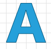
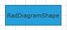
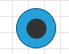
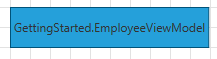
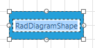
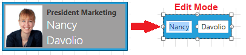

# Diagram Shape

This tutorial will walk you through the functionality and the main features of the __RadDiagramShape__.

* [Overview](#overview)
* [Setting the Position of a Shape](#setting-the-position-of-a-shape)
* [Setting the Content of a Shape](#setting-the-content-of-a-shape)
* [Common Properties](#common-properties)
* [Customize the Shape Appearance](#customize-the-shape-appearance)
* [Diagramming Framework Predefined Shape Geometries](#diagramming-framework-predefined-shape-geometries)

>Before proceeding with this topic, it is recommended to get familiar with the [Visual Structure]() of the Diagramming Framework.

## Overview

>Please note that the examples in this tutorial are showcasing Telerik Windows8 theme. In the [Setting a Theme](http://www.telerik.com/help/silverlight/common-styling-apperance-setting-theme.html#Setting_Application-Wide_Built-In_Theme_in_the_Code-Behind)[Setting a Theme](http://www.telerik.com/help/wpf/common-styling-apperance-setting-theme-wpf.html#Setting_Application-Wide_Built-In_Theme_in_the_Code-Behind) article you can find more information on how to set an application-wide theme.		  

The __RadDiagramShape__ is an object that describes the nodes of the diagram. You can configure its form using the __Geometry__ property as it allows you to define a custom geometry:		

<snippet id='raddiagram-diagram-items-shape-raddiagrams-features-shapes-block_1-xaml' />

or to use one of the predefined shape geometries:		

<snippet id='raddiagram-diagram-items-shape-raddiagrams-features-shapes-block_2-xaml' />

<snippet id='raddiagram-diagram-items-shape-raddiagrams-features-shapes-block_3-cs' />

<snippet id='raddiagram-diagram-items-shape-raddiagrams-features-shapes-block_3-vb' />

	
>The __ShapeFactory__ class allows you to get a shape geometry from the __enums__ with predefined shapes. This way you can create a __RadDiagramShape__ in code-behind still taking advantage of the predefined list of shapes. The predefined shapes can be accesses in code-behind through the following enumerations:
>	- __ArrowShapeType__ - describes all ArrowShapes
>	- __CommonShapeType__ - describes all CommonShapes
>	- __FlowChartShapeType__ - describes all FlowChartShapes 

	
## Setting the Position of a Shape

The __RadDiagramShape.Position__ property is of type __Point__ and it gets or sets the coordinates of the top left point of a shape. By default its value is a __Point__ with coordinates __(0,0)__.

## Setting the Content of a Shape

You can add content in the __RadDiagramShape__ using its __Content__ property. It allows you to define the content as a string, a __UIElement__ or a business property.

* Define a sample string value for the __RadDiagramShape.Content__ property:			

	<snippet id='raddiagram-diagram-items-shape-raddiagrams-features-shapes-block_4-xaml' />

	

* Define __UIElements__ in the __Content__ of the shape:

	<snippet id='raddiagram-diagram-items-shape-raddiagrams-features-shapes-block_5-xaml' />

	

* Bind the __Content__ to a business property: For the purpose of this tutorial, let's define a sample business class and set it as the __DataContext__ of the UserControlWindow.

	<snippet id='raddiagram-diagram-items-shape-raddiagrams-features-shapes-block_6-cs' />

	<snippet id='raddiagram-diagram-items-shape-raddiagrams-features-shapes-block_6-vb' />

	<snippet id='raddiagram-diagram-items-shape-raddiagrams-features-shapes-block_7-xaml' />

	
	When you bind the __Content__ to a business class, the __RadDiagramShape__ will display the result of the business item __ToString()__ method. If you bind to a business property, then the value of the property will be displayed as the content of the shape.

* If you want to customize the visual representation of the bound property, you can take advantage of the __RadDiagramShape ContentTemplate__ property:			

	<snippet id='raddiagram-diagram-items-shape-raddiagrams-features-shapes-block_8-xaml' />

	

## Common Properties

The __RadDiagramShape__ class exposes multiple properties that allow you to control the state and appearance of a shape.		

### Shape Bounds

You can get the bounds of a __RadDiagramShape__ through the __Bounds__ and __ActualBounds__ properties:			

* __Bounds__ - this property is of type __Rect__ and it gets the width, height and location of the shape's bounds.				

* __ActualBounds__ - this property is of type __Rect__ and it gets the width, height and location of a rotated shape's bounds.				

### Shape Connections

You can get all incoming and outgoing connections related to the shape through the following properties:			

* __IncomingLinks__ - this property is an enumeration that gets all incoming connections. It gives you information about the connections type, starting and ending points as well as the related connector positions.				

* __OutgoingLinks__ - this property is an enumeration that gets all outgoing connections. It gives you information about the connections type, starting and ending points as well as the related connector positions.				

### Rotation Angle

Telerik __RadDiagramShape__ supports rotation. You can get or set the rotation angle of a shape using the __RotationAngle__ property.			

### Edit Mode

You can set the __RadDiagramShape__ in edit mode using the __IsInEditMode__ property. By default when a shape enters edit mode, the __RadDiagramShape.Content__ is displayed inside a __TextBox__ control so that you can change its value. 

If the __RadDiagramShape.Content__ property is bound to a business item, you can set the connection __EditTemplate__ to define how the business item will be edited. For example if we use the __BusinessItem__ class, defined above, as a __DataContext__ of the __RadDiagram__, we can set up the following connection:			

<snippet id='raddiagram-diagram-items-shape-raddiagrams-features-shapes-block_9-xaml' />

>Apart from setting the __IsInEditMode__ property to __True__, you can also enter edit mode by pressing __F2__ or double-clicking on the shape. For more information please refer to the [Items Editing]() tutorial.			  

### Shape Selection State

The following properties allow you to track and control the selection state of a shape:

* __IsSelected__ - gets or sets whether the shape is selected.

### Shape ZIndex

You can get or set the z-order rendering behavior of the __RadDiagramShape__ through the __ZIndex__ property.			

## Customize the Shape Appearance

You can easily customize the visual appearance of the __RadDiagramShape__ by using the following properties:		

* __Background__ - gets or sets the brush that specifies the __RadDiagramShape__ background color.			

* __BorderBrush__ - gets or sets the brush that specifies the __RadDiagramShape__ border color.			

* __StrokeDashArray__ - gets or sets a collection of __Double__ values that indicate the pattern of dashes and gaps that is used to outline the __RadDiagramShape__.			

* __StrokeThickness__ - gets or sets the width of the __RadDiagramShape__ outline.			

>tip You can use the __RadDiagram.ShapeStyle__ property to explicitly apply a style on all __RadDiagramShapes__ in a __RadDiagram__ instance. [Read more](#customize-the-raddiagramshape-style).		  

## Diagramming Framework Predefined Shape Geometries

You can find a list with all predefined shape geometries and how to set one to a shape in the [Diagramming Framework Predefined Shape Geometries]() article.

## See Also
 * [Structure]()
 * [Getting Started]()
 * [Connectors]()
 * [DataBinding Overview]()
 * [Connections]()
 * [Items Editing]()
 * [Rotation]()
 * [Resizing]()
 * [ZOrder]()
 * [Selection]()
 * [Removing Items]()
 * [Diagram Events]()
 * [Items Events]()