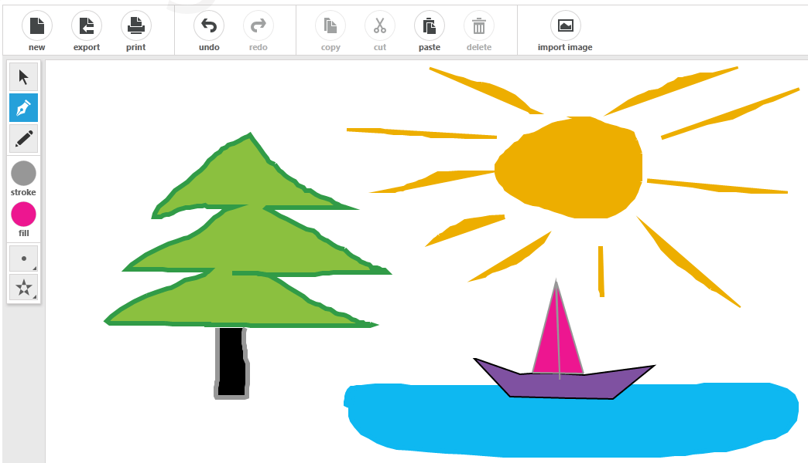

# Drawing Tools

The __Path Tool__ and __Pencil Tool__ of the __RadDiagram__ enable you to create various types of polyline and "free-hand-drawn" shapes runtime. You can activate them through the __ActiveTool__ property.

* __Path Tool__ - this tool allows you to draw polyline shapes. It is not active by default.

* __Pencil Tool__ - this tool allows you to perform free hand drawing thus creating various custom shapes. It is not active by default.

You can examine the full power of this feature in the [Diagrams Drawing demo](https://demos.telerik.com/silverlight/#Diagrams/Drawing)[Diagrams Drawing demo](https://demos.telerik.com/wpf/#Diagrams/Drawing).

## Getting Started

In order to use the Path Tool or Pencil Tool in the RadDiagram, you have to set the __ActiveTool__ property. Its default value is PointerTool.
		
	
<snippet id='raddiagram-diagram-tools-features-drawing-block_1-cs' />

<snippet id='raddiagram-diagram-tools-features-drawing-block_1-vb' />

When the __Path Tool__ is active you click on the RadDiagram and this way you create the polyline points. When you need to finish the drawing you just have to press the Enter key. When the __Pencil Tool__ is active you click the __Mouse Left Button Down__ and move the mouse, this way draw your custom shape. On Mouse Up the shape is added to the Shapes collection of the RadDiagram.

## Customizing Drawing Tools

You are able to set the __Fill__, __Stroke__, __StrokeThickness__ of the shapes you draw via the following attached properties:

<snippet id='raddiagram-diagram-tools-features-drawing-block_2-xaml' />

<snippet id='raddiagram-diagram-tools-features-drawing-block_3-xaml' />

When you use __Path Tool__ you can choose the way the polylines are intersected via the __FillRule__ property:		

FillRule takes one of the following values: __EvenOdd__ or __NonZero__. For more information about the FillRule you can visit [this MSDN article](http://msdn.microsoft.com/en-us/library/system.windows.media.pathgeometry.fillrule.aspx).		

<snippet id='raddiagram-diagram-tools-features-drawing-block_4-xaml' />

The IsShapeFilled and IsShapeClosed properties determine whether the shapes will have Fill and whether the first and last editing points of the shape you draw will be automatically linked.		

<snippet id='raddiagram-diagram-tools-features-drawing-block_5-xaml' />

