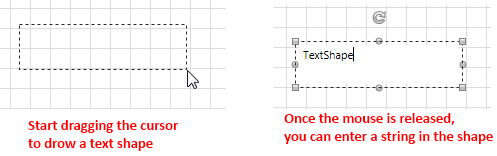

# Text Tool

This article describes the __TextTool__ that was exposed with the Q1 2013 release.

The __TextTool__ allows you to enter the edit mode of a __RadDiagramItem__ as soon as you click on it. Furthermore, you can use this tool to draw text shapes. As it isn't active by default, you can use the __RadDiagram ActiveTool__ property to activate it in XAML:

#### __[XAML] Example 1: Setting the ActiveTool property in XAML__
{{region xaml-raddiagrams-tools-text-tool-0}}
	<telerik:RadDiagram x:Name="xDiagram" ActiveTool="TextTool"/>
{{endregion}}

or in code-behind:

#### __[C#] Example 2: Setting the ActiveTool property in code-behind__
{{region cs-raddiagrams-tools-text-tool-1}}
	xDiagram.ActiveTool = Telerik.Windows.Diagrams.Core.MouseTool.TextTool;
{{endregion}}
	
#### __[VB.NET] Example 2: Setting the ActiveTool property in code-behind__
{{region vb-raddiagrams-tools-text-tool-2}}
	xDiagram.ActiveTool = Telerik.Windows.Diagrams.Core.MouseTool.TextTool
{{endregion}}

Let's consider the following sample __RadDiagram__ definition:

#### __[XAML] Example 3: A diagram with a single shape__
{{region xaml-raddiagrams-tools-text-tool-3}}
	<telerik:RadDiagram x:Name="xDiagram" ActiveTool="TextTool">
		<telerik:RadDiagramShape Content="RectangleShape" Position="50,50" />
	</telerik:RadDiagram>
{{endregion}}

In it we have one shape and a TextTool activated by default. This is why as soon as you click on the shape, you will enter its edit mode. This way you can easily modify its content.

#### __Figure 1: Modifying the content of a shape with the text tool__

And what is more, as soon as you activate the __TextTool__, you can dynamically create a text shape by dragging a rectangle on the diagramming surface:

#### __Figure 2: Creating text shapes by dragging on the diagram's surface__

The shape created when using the text tool in such a manner is of type **RadDiagramTextShape**.

As this class does not inherit from **RadDiagramShape**, you need to also create a style for it when binding the control through its [GraphSource]().

#### __[XAML] Example 4: Style for the RadDiagramTextShape when in a data-binding scenario__
{{region xaml-raddiagrams-tools-text-tool-4}}
		<!-- If you are using the NoXaml binaries, you should base the style on the default one for the theme like so:
        
{{endregion}}

## See Also
 * [Tools Overview]()
 * [Mouse Tools]()
 * [Drawing Tools]()