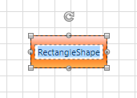
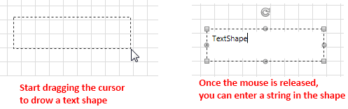

# Text Tool

This article describes the __TextTool__ that was exposed with the Q1 2013 release.

The __TextTool__ allows you to enter the edit mode of a __RadDiagramItem__ as soon as you click on it. Furthermore, you can use this tool to draw text shapes. As it isn't active by default, you can use the __RadDiagram ActiveTool__ property to activate it in XAML:

__Example 1: Setting the ActiveTool property in XAML__
<snippet id='raddiagram-diagram-tools-raddiagrams-tools-text-tool-example_1_setting_the_activetool_property_in_xaml-xaml' />

or in code-behind:

__Example 2: Setting the ActiveTool property in code-behind__
<snippet id='raddiagram-diagram-tools-raddiagrams-tools-text-tool-example_2_setting_the_activetool_property_in_code_behind-cs' />

<snippet id='raddiagram-diagram-tools-raddiagrams-tools-text-tool-example_2_setting_the_activetool_property_in_code_behind-vb' />

Let's consider the following sample __RadDiagram__ definition:

__Example 3: A diagram with a single shape__
<snippet id='raddiagram-diagram-tools-raddiagrams-tools-text-tool-example_3_a_diagram_with_a_single_shape-xaml' />

In it we have one shape and a TextTool activated by default. This is why as soon as you click on the shape, you will enter its edit mode. This way you can easily modify its content.

#### __Figure 1: Modifying the content of a shape with the text tool__

And what is more, as soon as you activate the __TextTool__, you can dynamically create a text shape by dragging a rectangle on the diagramming surface:

#### __Figure 2: Creating text shapes by dragging on the diagram's surface__

The shape created when using the text tool in such a manner is of type **RadDiagramTextShape**.

As this class does not inherit from **RadDiagramShape**, you need to also create a style for it when binding the control through its [GraphSource]().

__Example 4: Style for the RadDiagramTextShape when in a data-binding scenario__
<snippet id='raddiagram-diagram-tools-raddiagrams-tools-text-tool-example_4_style_for_the_raddiagramtextshape_when_in_a_data_binding_scenario-xaml' />

## See Also
 * [Tools Overview]()
 * [Mouse Tools]()
 * [Drawing Tools]()