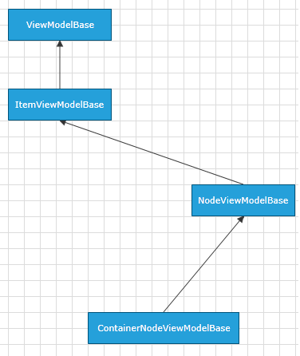

# ContainerNodeViewModelBase

Telerik Diagramming Framework provides a list of __ViewModels__ defined in the __Telerik.Windows.Controls.Diagrams.Extensions.dll__.
	  

This article describes the __ContainerNodeViewModelBase__ defined in the Diagramming Extensions.
	  

## Overview

__ContainerNodeViewModelBase__ is a __ViewModel__ designed to serve as a base __ViewModel__ for __RadDiagramContainerShapes__ in a data-bound __RadDiagram__. The class is defined to expose properties that allow you to track and save the state of a ContainerShape in business models. It derives from the  [NodeViewModelBase]() class and implements the [IContainerItem](http://www.telerik.com/help/silverlight/t_telerik_windows_diagrams_core_icontaineritem.html)[IContainerItem](http://www.telerik.com/help/wpf/t_telerik_windows_diagrams_core_icontaineritem.html) interface.
		

                  ContainerNodeViewModelBase Inheritance Model
              

__ContainerNodeViewModelBase__ has a single constructor - ContainerNodeViewModelBase() that initializes a new instance of the class.
		

## Properties

The __ContainerNodeViewModelBase__ class exposes the following properties:
		
<table>
			Properties
		  <th><tr><td>

Name</td><td>

Description</td></tr></th><tr><td>

<b>InternalItems</b></td><td>

Gets the internal <b>ObservableCollection</b> of nodes that are wrapped in the container.
			</td></tr></table>

And as the class derives from the __NodeViewModelBase__, it also inherits all of its properties:
		
<table>Inherited Properties<th><tr><td>

Name</td><td>

Description</td></tr></th><tr><td>

<b>Width</b></td><td>

Gets or sets a <b>Double</b> value indicating the <b>Width</b> of the represented shape.
			  </td></tr><tr><td>

<b>Height</b></td><td>

Gets or sets a <b>Double</b> value indicating the <b>Height</b> of the represented shape.
			  </td></tr><tr><td>

<b>RotationAngle</b></td><td>

Gets or sets a <b>Double</b> value indicating the rotation angle of the represented shape.
			  </td></tr><tr><td>

<b>Visibility</b></td><td>

Gets or sets the Visibility of the represented shape. The property is of type <b>Visibility</b>.
			  </td></tr><tr><td>

<b>Position</b></td><td>

Gets or sets the coordinates of a <b>Point</b> that represents the position of the represented shape.
			  </td></tr><tr><td>

<b>Content</b></td><td>

Gets or sets an <b>object</b> that represents the content of a shape.
			  </td></tr><tr><td>

<b>IsSelected</b></td><td>

Gets or sets a <b>Boolean</b> value indicating whether the represented shape is selected.
			  </td></tr></table>

## Methods

The __ContainerNodeViewModelBase__ class exposes the following methods:
		  
<table><th><tr><td>

Name</td><td>

Description</td></tr></th><tr><td>

<b>AddItem</b></td><td>

Adds an object to the <b>InternalItems</b> collection. </td></tr><tr><td>

<b>RemoveItem</b></td><td>

Removes an object from the <b>InternalItems</b> collection.
			  </td></tr></table>

# See Also

 * [ItemViewModelBase]()

 * [NodeViewModelBase]()

 * [LinkViewModelBase]()

 * [HierarchicalNodeViewModel]()

 * [GraphSourceBase]()

 * [ObservableGraphSourceBase]()

 * [SerializableGraphSourceBase]()
