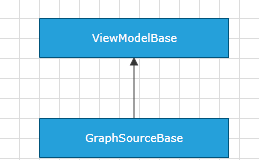

# GraphSourceBase

Telerik Diagramming Framework provides a list of __ViewModels__ defined in the __Telerik.Windows.Controls.Diagrams.Extensions.dll__.
	  

This article describes the __GraphSourceBase<TNode, TLink>__ class defined in the Diagramming Extensions.
	  

## Overview

The __GraphSourceBase<TNode, TLink>__ class is designed to serve as a base __ViewModel__ that represents the collections of nodes and shapes in a data-bound __RadDiagram__. In a __RadDiagram__ you always need to consider the fact that it consists of different types of items - __RadDiagramConnections__ and __RadDiagramShapes__. This is why the __RadDiagram GraphSource__ should be set to an instance of a class that implements the[IGraphSource](http://www.telerik.com/help/silverlight/t_telerik_windows_diagrams_core_igraphsource_1.html)[IGraphSource](http://www.telerik.com/help/wpf/t_telerik_windows_diagrams_core_igraphsource_1.html) interface. This interface defines two collections - one with Items and one with Links.
		

The __GraphSourceBase__ class implements the __IGraphSource__ interface and it also provides methods that work with the __Items__ and __Links__ collections. 
		

>Please keep in mind that in the __GraphSourceBase<TNode, TLink>__ implementation, __TLink__ should derive from the [ILink<T>](http://www.telerik.com/help/silverlight/t_telerik_windows_diagrams_core_ilink_1.html)[ILink<T>](http://www.telerik.com/help/wpf/t_telerik_windows_diagrams_core_ilink_1.html) interface.
		

GraphSourceBase<TNode, TLink> Inheritance Model

__GraphSourceBase__ has one constructor - GraphSourceBase() that initializes a new instance of the class.
		

## Properties

__GraphSourceBase__ exposes the following properties:
		
|Name|Description|
|----|-----------|
|InternalItems|Gets the internal ObservableCollection of business nodes.|
|InternalLinks|Gets the internal ObservableCollection of business links.|
|Items|Gets an IEnumerable collection of business nodes.|
|Links|Gets an IEnumerable collection of business links.|

## Methods

__GraphSourceBase__ exposes the following virtual methods:
		
|Name|Description|
|----|-----------|
|AddNode(TNode)|Adds a specified business node to the InternalItems collection.|
|AddLink(TLink)|Adds a specified business link to the InternalLinks collection.|
|RemoveLink(TLink)|Removes a specified business link from the InternalLinks collection and returns a boolean value indicating whether the operation was successful.|
|RemoveItem(TNode)|Removes a specified business node from the InternalItems collection and returns a boolean value indicating whether the operation was successful.|
|Clear|Removes all nodes and links from the InternalItems and InternalLinks collections.|

>Please note that in your solution it is best to create a custom class deriving from __GraphSourceBase__. Once you do so, you will be able to override all of the above virtual methods and describe a custom __RadDiagram GraphSource__ implementation.
		  

# See Also

 * [ItemViewModelBase]()

 * [NodeViewModelBase]()

 * [LinkViewModelBase]()

 * [ContainerNodeViewModelBase]()

 * [HierarchicalNodeViewModel]()

 * [ObservableGraphSourceBase]()

 * [SerializableGraphSourceBase]()
