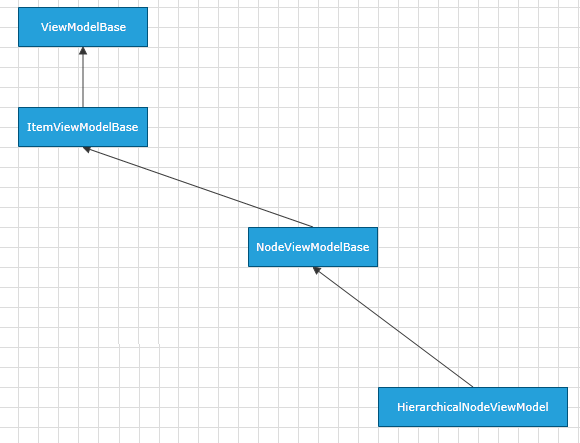

# HierarchicalNodeViewModel

Telerik Diagramming Framework provides a list of __ViewModels__ defined in the __Telerik.Windows.Controls.Diagrams.Extensions.dll__.
	  

This article describes the __HierarchicalNodeViewModel__ defined in the Diagramming Extensions.
	  

## Overview

__HierarchicalNodeViewModel__ is a __ViewModel__ designed to serve as a base __ViewModel__ for hierarchical __RadDiagramShapes__ in a data-bound __RadDiagram__. The class is defined to expose properties that allow you to track and save the children of a hierarchical shape. It derives from the  [NodeViewModelBase]() class.
		

HierarchicalNodeViewModel Inheritance Model

__HierarchicalNodeViewModel__ has a single constructor - HierarchicalNodeViewModel() that initializes a new instance of the class.
		

## Properties

The __HierarchicalNodeViewModel__ class exposes the following properties:
		
<table><th><tr><td>

Name</td><td>

Description</td></tr></th><tr><td>

<b>Children</b></td><td>

Gets or sets an <b>ObservableCollection</b> of <b>HierarchicalNodeViewModel</b> items that represent the children of the current node.
			</td></tr><tr><td>

<b>HasChildren</b></td><td>

Gets a Boolean value indicating whether a <b>HierarchicalNodeViewModel</b> item has any children.
			</td></tr></table>

And as the class derives from the __NodeViewModelBase__, it also inherits all of its properties:
		
<table>Inherited Properties<th><tr><td>

Name</td><td>

Description</td></tr></th><tr><td>

<b>Width</b></td><td>

Gets or sets a <b>Double</b> value indicating the <b>Width</b> of the represented shape.
			  </td></tr><tr><td>

<b>Height</b></td><td>

Gets or sets a <b>Double</b> value indicating the <b>Height</b> of the represented shape.
			  </td></tr><tr><td>

<b>RotationAngle</b></td><td>

Gets or sets a <b>Double</b> value indicating the rotation angle of the represented shape.
			  </td></tr><tr><td>

<b>Visibility</b></td><td>

Gets or sets the Visibility of the represented shape. The property is of type <b>Visibility</b>.
			  </td></tr><tr><td>

<b>Position</b></td><td>

Gets or sets the coordinates of a <b>Point</b> that represents the position of the represented shape.
			  </td></tr><tr><td>

<b>Content</b></td><td>

Gets or sets an <b>object</b> that represents the content of a shape.
			  </td></tr><tr><td>

<b>IsSelected</b></td><td>

Gets or sets a <b>Boolean</b> value indicating whether the represented shape is selected.
			  </td></tr></table>

# See Also

 * [ItemViewModelBase]()

 * [NodeViewModelBase]()

 * [LinkViewModelBase]()

 * [ContainerNodeViewModelBase]()

 * [GraphSourceBase]()

 * [ObservableGraphSourceBase]()

 * [SerializableGraphSourceBase]()
