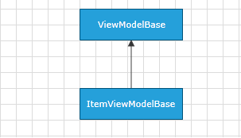

# ItemViewModelBase

Telerik Diagramming Framework provides a list of __ViewModels__ defined in the __Telerik.Windows.Controls.Diagrams.Extensions.dll__.	  

This article describes the __ItemViewModelBase__ class defined in the Diagramming Extensions.

## Overview

The __ItemViewModelBase__ class is designed to serve as a base __ViewModel__ that can describe any __RadDiagramItem__. It implements the [ViewModelBase](http://www.telerik.com/help/silverlight/t_telerik_windows_controls_viewmodelbase.html)[ViewModelBase](http://www.telerik.com/help/wpf/t_telerik_windows_controls_viewmodelbase.html) class.

ItemViewModelBase Inheritance Model
                  

__ItemViewModelBase__ exposes one constructor - ItemViewModelBase() that initializes a new instance of the class.	  

## Properties

The __ItemViewModelBase__ class exposes the following properties:
		
|Name|Description|
|----|-----------|
|Visibility|Gets or sets the Visibility of an item. It is of type Visibility.|
|Position|Gets or sets the coordinates of a Point that represents the position of an item on the diagramming surface.|
|Content|Gets or sets an object that represents the content of an item.|
|IsSelected|Gets or sets a Boolean value indicating whether an item is selected.|

## See Also
 * [NodeViewModelBase]()
 * [LinkViewModelBase]()
 * [ContainerNodeViewModelBase]()
 * [HierarchicalNodeViewModel]()
 * [GraphSourceBase]()
 * [ObservableGraphSourceBase]()
 * [SerializableGraphSourceBase]()