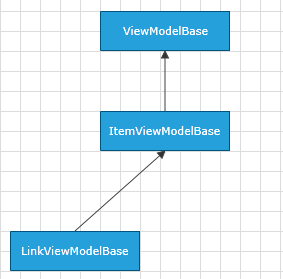

# LinkViewModelBase

Telerik Diagramming Framework provides a list of __ViewModels__ defined in the __Telerik.Windows.Controls.Diagrams.Extensions.dll__.

This article describes the __LinkViewModelBase__ defined in the Diagramming Extensions.

## Overview

The __LinkViewModelBase__ class is a __ViewModel__ designed to serve as a base __ViewModel__ for __RadDiagramConnections__ in a data-bound __RadDiagram__. As the connection can start from one shape and end in another one, the __LinkViewModelBase__ class is defined to expose properties that track these source and target shapes.

Essentially the __LinkViewModelBase__ derives from [ItemViewModelBase]() and therefore the class exposes all properties defined in the __ItemViewModelBase__ class. Moreover, the __LinkViewModelBase__ class inherits the [ILink<T>](http://www.telerik.com/help/silverlight/t_telerik_windows_diagrams_core_ilink_1.html)[ILink<T>](http://www.telerik.com/help/wpf/t_telerik_windows_diagrams_core_ilink_1.html) interface, where __T__ should derive from [NodeViewModelBase]()

LinkViewModelBase Inheritance Model

## Constructors

|Name|Description|
|----|-----------|
|LinkViewModelBase()|Initializes a new instance of the LinkViewModelBase class that represents a link on the diagramming surface.|
|LinkViewModelBase(T source, T target)|Initializes a new instance of the LinkViewModelBase class that represents a link starting from the specified source node and ending at the specified target node.|

## Properties

The __LinkViewModelBase__ class exposes the following properties:
		
Properties: 

|Name|Description|
|----|-----------|
|Source|Gets or sets the source of the connection which should be of type deriving from NodeViewModelBase.|
|Target|Gets or sets the target of the connection which should be of type deriving from NodeViewModelBase.|
|SourceCapType|Gets or sets the CapType of the start of the represented connection. |
|TargetCapType|Gets or sets the CapType of the end of the represented connection. |

Inherited Properties:

|Name|Description|
|----|-----------|
|Visibility|Gets or sets the Visibility of the represented connection. The property is of type Visibility.|
|Position|Gets or sets the coordinates of a Point that represents the position of a connection.|
|Content|Gets or sets an object that represents the content of the represented connection.|
|IsSelected|Gets or sets a Boolean value indicating whether the represented connection is selected.|

## See Also
 * [ItemViewModelBase]()
 * [NodeViewModelBase]()
 * [ContainerNodeViewModelBase]()
 * [HierarchicalNodeViewModel]()
 * [GraphSourceBase]()
 * [ObservableGraphSourceBase]()
 * [SerializableGraphSourceBase]()