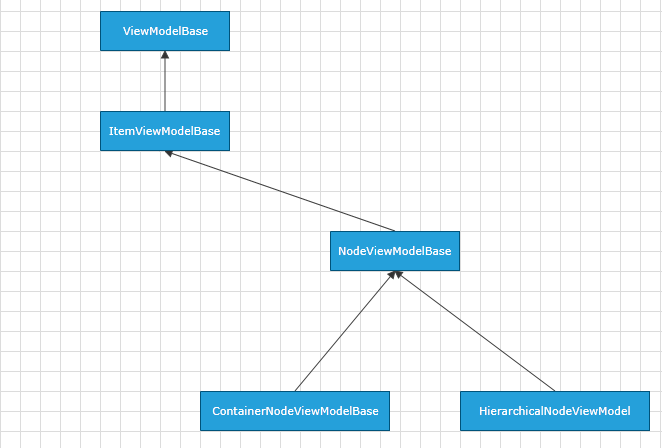

# NodeViewModelBase

Telerik Diagramming Framework provides a list of __ViewModels__ defined in the __Telerik.Windows.Controls.Diagrams.Extensions.dll__.
	  

This article describes the __NodeViewModelBase__ defined in the Diagramming Extensions.
	  

## Overview

__NodeViewModelBase__ is a __ViewModel__ designed to serve as a base __ViewModel__ for __RadDiagramShapes__ in a data-bound __RadDiagram__. The class is defined to expose properties that allow you to track and save the state of a shape in business models. It derives from the  [ItemViewModelBase]() class.
		

NodeViewModelBase Inheritance Model

__NodeViewModelBase__ has a single constructor - NodeViewModelBase() that initializes a new instance of the class.
		

## Properties

Properties
|Name|Description|
|----|-----------|
|Width|Gets or sets a Double value indicating the Width of the represented shape.|
|Height|Gets or sets a Double value indicating the Height of the represented shape.|
|RotationAngle|Gets or sets a Double value indicating the rotation angle of the represented shape.|

Inherited Properties

|Name|Description|
|----|-----------|
|Visibility|Gets or sets the Visibility of the represented shape. The property is of type Visibility.|
|Position|Gets or sets the coordinates of a Point that represents the position of the represented shape.|
|Content|Gets or sets an object that represents the content of a shape.|
|IsSelected|Gets or sets a boolean value indicating whether the represented shape is selected.|

# See Also

 * [ItemViewModelBase]()

 * [ContainerNodeViewModelBase]()

 * [LinkViewModelBase]()

 * [HierarchicalNodeViewModel]()

 * [GraphSourceBase]()

 * [ObservableGraphSourceBase]()

 * [SerializableGraphSourceBase]()
