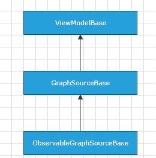

# ObservableGraphSourceBase

Telerik Diagramming Framework provides a list of __ViewModels__ defined in the __Telerik.Windows.Controls.Diagrams.Extensions.dll__.
	  

This article describes the __ObservableGraphSourceBase<TNode, TLink>__ class defined in the Diagramming Extensions.
	  

## Overview

The __ObservableGraphSourceBase<TNode, TLink>__ derives from the [GraphSourceBase]() class and it also implements the [IObservableGraphSource](http://www.telerik.com/help/silverlight/t_telerik_windows_diagrams_core_iobservablegraphsource.html)[IObservableGraphSource](http://www.telerik.com/help/wpf/t_telerik_windows_diagrams_core_iobservablegraphsource.html) interface. Its main purpose is to provide an out-of-the-box ViewModel implementation that supports __TwoWay__ binding to the __RadDiagram GraphSource__ property.
		

ObservableGraphSourceBase<TNode, TLink> Inheritance Model

>tipIf you need to define a data-bound __RadDiagram__ that has to support drag and drop of items, then you need to make sure that your custom __GraphSource__ implementation derives from the __ObservableGraphSourceBase<TNode, TLink>__ or from a class inheriting the __ObservableGraphSourceBase<TNode, TLink>__ class (for instance the [SerializableGraphSourceBase<TNode, TLink>]() class).  Only then the drag/drop operations will be reflected in your __ViewModels__.
		

## Inherited Properties

The __ObservableGraphSourceBase<TNode, TLink>__ class exposes all properties it inherits from the __GraphSourceBase__ class:
		
<table>Inherited Properties<th><tr><td>

Name</td><td>

Description</td></tr></th><tr><td>

<b>InternalItems</b></td><td>

Gets the internal <b>ObservableCollection</b> of business nodes.
			  </td></tr><tr><td>

<b>InternalLinks</b></td><td>

Gets the internal <b>ObservableCollection</b> of business links.
			  </td></tr><tr><td>

<b>Items</b></td><td>

Gets an <b>IEnumerable</b> collection of business nodes.
			  </td></tr><tr><td>

<b>Links</b></td><td>

Gets an <b>IEnumerable</b> collection of business links.
			  </td></tr></table>

## Methods

The __ObservableGraphSourceBase<TNode, TLink>__ class exposes the following virtual methods:
		
<table>Virtual Methods:<th><tr><td>

Name</td><td>

Description</td></tr></th><tr><td>

<b>CreateLink(object source, object target)</b></td><td>

Creates a new <b>ILink</b> object associated with the specified source and target nodes.
			  </td></tr><tr><td>

<b>CreateNode(IShape shape)</b></td><td>

Creates a new instance of the <b>TNode</b> type. And as it receives an <b>IShape</b> object, when you override it, you can use the <b>IShape</b> argument to create a <b>TNode</b> instance associated with the specified shape.
			  </td></tr></table>
<table>Inherited Virtual Methods<th><tr><td>

Name</td><td>

Description</td></tr></th><tr><td>

<b>AddNode(TNode)</b></td><td>

Adds a specified business node to the <b>InternalItems</b> collection.
			  </td></tr><tr><td>

<b>AddLink(TLink)</b></td><td>

Adds a specified business link to the <b>InternalLinks</b> collection.
			  </td></tr><tr><td>

<b>RemoveLink(TLink)</b></td><td>

Removes a specified business link from the <b>InternalLinks</b> collection and returns a boolean value indicating whether the operation was successful.
			  </td></tr><tr><td>

<b>RemoveItem(TNode)</b></td><td>

Removes a specified business node from the <b>InternalItems</b> collection and returns a boolean value indicating whether the operation was successful.
			  </td></tr><tr><td>

<b>Clear</b></td><td>

Removes all nodes and links from the <b>InternalItems</b>	and <b>InternalLinks</b> collections.
			  </td></tr></table>

>Please note that in your solution it is best to create a custom class deriving from __ObservableGraphSourceBase__. Once you do so, you will be able to override all of the above virtual methods. This will allow you to describe a custom __RadDiagram GraphSource__ class that supports __TwoWay__ binding scenarios where any changes in the __RadDiagram__ UI are reflected in your __GraphSource__ implementation.
		  

# See Also

 * [ItemViewModelBase]()

 * [NodeViewModelBase]()

 * [LinkViewModelBase]()

 * [ContainerNodeViewModelBase]()

 * [HierarchicalNodeViewModel]()

 * [GraphSourceBase]()

 * [SerializableGraphSourceBase]()
