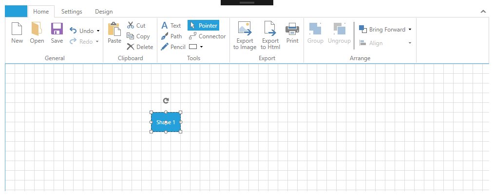

# DiagramRibbon

This article will get you familiar with the __DiagramRibbon__ control that is part of Telerik Diagramming Framework.	  

## Diagram Ribbon Overview

With the __R1 2019__ version Telerik UI for WPF we have introduce __RadDiagramRibbon__ control.
The __DiagramRibbon__ control allows the users to examine and modify the settings of the diagramming items in run-time. __DiagramRibbon__ is a standalone control that can be displayed as the content of any __ContentControl__. Its main purpose is to provide you with a ready-to-use view that contains the most common features and settings of a __RadDiagram__. The DiagramRibbon is fully customizable and scales its child widgets automatically based on the available area. 

>In order to use the __DiagramRibbon__ control along with the __RadDiagram__ in your projects you have to add references to the following assemblies:
>	- Telerik.Windows.Controls.Diagrams
>	- Telerik.Windows.Controls.Diagrams.Ribbon
>	- Telerik.Windows.Controls.RibbonView
>	- Telerik.Windows.Diagrams.Core
>	- Telerik.Windows.Controls.Diagrams.Extensions
>	- Telerik.Windows.Controls
>	- Telerik.Windows.Controls.Navigation
>	- Telerik.Windows.Controls.Input

## Overview

The __DiagramRibbon__ exposes a __Diagram__ property which is used to associate the ribbon with a particular diagram instance. 

#### __[XAML] Example 1: Specify DiagramRibbon in XAML__
{{region raddiagram-extensions-diagramribbon-0}}
	<Grid>
		<Grid.RowDefinitions>
			<RowDefinition Height="Auto"/>
			<RowDefinition Height="*"/>
		</Grid.RowDefinitions>
		<telerik:RadDiagramRibbon Diagram="{Binding ElementName=diagram}"/>
		<telerik:RadDiagram x:Name="diagram" Grid.Row="1">
			<telerik:RadDiagramShape Content="Shape 1"/>
		</telerik:RadDiagram>
	</Grid>
{{endregion}}

#### __Figure 1: DiagramRibbon Overview__ 

>Please note that the examples in this tutorial are showcasing Telerik Windows8 theme. In the [Setting a Theme](http://www.telerik.com/help/silverlight/common-styling-apperance-setting-theme.html#Setting_Application-Wide_Built-In_Theme_in_the_Code-Behind)[Setting a Theme](http://www.telerik.com/help/wpf/common-styling-apperance-setting-theme-wpf.html#Setting_Application-Wide_Built-In_Theme_in_the_Code-Behind) article you can find more information on how to set an application-wide theme.

## DiagramRibbon Extensions

__DiagramRibbon__ control allows easily add one or all of the following RadDiagram and RadRibbonView extensions to the __RadDiagramRibbon__. 

* __DiagramToolBox__: To add __DiagramToolBox__ to the DiagramRibbon the __ToolBox__ property can be bound to a DiagramToolBox using x:Name.

#### __[XAML] Example 2: Add RadDiagramToolbox to DiagramRibbon__
{{region raddiagram-extensions-diagramribbon-1}}
	<Grid>
        <Grid.RowDefinitions>
            <RowDefinition Height="Auto"/>
            <RowDefinition Height="*"/>
            <RowDefinition Height="Auto"/>
        </Grid.RowDefinitions>
        <Grid.ColumnDefinitions>
            <ColumnDefinition Width="Auto"/>
            <ColumnDefinition Width="*"/>
        </Grid.ColumnDefinitions>
        <telerik:RadDiagramRibbon Grid.ColumnSpan="2" Diagram="{Binding ElementName=diagram}" Toolbox="{Binding ElementName=toolBox}"/>
        <telerik:RadDiagram x:Name="diagram" Grid.Row="1" Grid.Column="1">
            <telerik:RadDiagramShape Content="Shape 1"/>
        </telerik:RadDiagram>
        <telerik:RadDiagramToolbox x:Name="toolBox" Grid.Column="0" Grid.Row="1" ItemsSource="{Binding GalleryItems}" />      
    </Grid>
{{endregion}}

* __DiagramNavigationPane__: To add __DiagramNavigationPane__ to the DiagramRibbon the __NavigationPane__ property can be bound to a DiagramToolBox using x:Name.

#### __[XAML] Example 3: Add RadDiagramNavigationPane to DiagramRibbon__
{{region raddiagram-extensions-diagramribbon-2}}
	<Grid>
        <Grid.RowDefinitions>
            <RowDefinition Height="Auto"/>
            <RowDefinition Height="*"/>
            <RowDefinition Height="Auto"/>
        </Grid.RowDefinitions>
        <Grid.ColumnDefinitions>
            <ColumnDefinition Width="Auto"/>
            <ColumnDefinition Width="*"/>
        </Grid.ColumnDefinitions>
        <telerik:RadDiagramRibbon Grid.ColumnSpan="2" 
                                  Diagram="{Binding ElementName=diagram}" 
                                  NavigationPane="{Binding ElementName=navigationPane}"/>
        <telerik:RadDiagram x:Name="diagram" Grid.Row="1" Grid.Column="1">
            <telerik:RadDiagramShape Content="Shape 1"/>
        </telerik:RadDiagram>
        <telerik:RadDiagramNavigationPane Grid.Column="1" Grid.Row="1" x:Name="navigationPane" Diagram="{Binding ElementName=diagram}" HorizontalAlignment="Left" VerticalAlignment="Bottom" />    
    </Grid>
{{endregion}}

* __Ruler__: To add __RadDiagramRuler__ to the DiagramRibbon the __VerticalRuler / HorizontalRuler__ property can be bound to a RadDiagramRuler using x:Name.

#### __[XAML] Example 4: Add RadDiagramRuler to DiagramRibbon__
{{region raddiagram-extensions-diagramribbon-3}}
		<Grid>
			<Grid.RowDefinitions>
				<RowDefinition Height="Auto"/>
				<RowDefinition Height="*"/>
				<RowDefinition Height="Auto"/>
			</Grid.RowDefinitions>
			<Grid.ColumnDefinitions>
				<ColumnDefinition Width="Auto"/>
				<ColumnDefinition Width="*"/>
			</Grid.ColumnDefinitions>
			<telerik:RadDiagramRibbon Grid.Column="1"
									  Diagram="{Binding ElementName=diagram}"    
									  VerticalRuler="{Binding ElementName=verticalRuler}"
									  HorizontalRuler="{Binding ElementName=horizontalRuler}"/>
			<telerik:RadDiagram x:Name="diagram" Grid.Row="1" Grid.Column="1">
				<telerik:RadDiagramShape Content="Shape 1"/>
			</telerik:RadDiagram>
			<telerik:RadDiagramRuler x:Name="verticalRuler" Placement="Left" Diagram="{Binding ElementName=diagram}" Grid.Row="1" Grid.Column="0"/>
			<telerik:RadDiagramRuler x:Name="horizontalRuler" Placement="Bottom" Diagram="{Binding ElementName=diagram}" Grid.Column="1" Grid.Row="2" Grid.RowSpan="2"/>
		</Grid>
{{endregion}}

* __QuickAccessToolBar__: To add __QuickAccessToolBar__ to the DiagramRibbon the __VerticalRuler / HorizontalRuler__ property can be bound to a RadDiagramRuler using x:Name.

#### __[XAML] Example 4: Add QuickAccessToolBar to DiagramRibbon__
{{region raddiagram-extensions-diagramribbon-4}}
		<Grid>
			<Grid.RowDefinitions>
				<RowDefinition Height="Auto"/>
				<RowDefinition Height="*"/>
				<RowDefinition Height="Auto"/>
			</Grid.RowDefinitions>
			<Grid.ColumnDefinitions>
				<ColumnDefinition Width="Auto"/>
				<ColumnDefinition Width="*"/>
			</Grid.ColumnDefinitions>
			<telerik:RadDiagramRibbon Grid.Column="1"
									  Diagram="{Binding ElementName=diagram}"  
									  QuickAccessToolBarPosition="BelowRibbon">
				<telerik:RadDiagramRibbon.QuickAccessToolBar>
					<telerik:QuickAccessToolBar/>
				</telerik:RadDiagramRibbon.QuickAccessToolBar>
			</telerik:RadDiagramRibbon>
			<telerik:RadDiagram x:Name="diagram" Grid.Row="1" Grid.Column="1">
				<telerik:RadDiagramShape Content="Shape 1"/>
			</telerik:RadDiagram>    
		</Grid>
{{endregion}}

* __Backstage__: To add __Backstage__ to the DiagramRibbon the __Backstage__ property can be dirrectly set to __RadRibbonBackstage__ element.

#### __[XAML] Example 5: Add Backstage to DiagramRibbon__
{{region raddiagram-extensions-diagramribbon-5}}
	<Grid x:Name="LayoutRoot">
		<Grid.RowDefinitions>
			<RowDefinition Height="Auto"/>
			<RowDefinition Height="*"/>
			<RowDefinition Height="Auto"/>
		</Grid.RowDefinitions>
		<telerik:RadDiagramRibbon Diagram="{Binding ElementName=diagram}"   
								  BackstageClippingElement="{Binding ElementName=LayoutRoot}">
			<telerik:RadDiagramRibbon.Backstage>
				<telerik:RadRibbonBackstage>
					<telerik:RadRibbonBackstageItem Header="Samples" IsDefault="true">
						<ListBox x:Name="SamplesList" BorderThickness="0" HorizontalAlignment="Center"/>
					</telerik:RadRibbonBackstageItem>
				</telerik:RadRibbonBackstage>
			</telerik:RadDiagramRibbon.Backstage>
		</telerik:RadDiagramRibbon>
		<telerik:RadDiagram x:Name="diagram" Grid.Row="1">
			<telerik:RadDiagramShape Content="Shape 1"/>
		</telerik:RadDiagram>    
	</Grid>
{{endregion}}

## AdditionalTabs / AdditionalGroups

__RadDiagramRibbon__ by design contais three build-in __RibbonTabs__ which holds different type of settings for customizing your __RadDiagram__: __Home, Settings and Design__. To add a new tab or a new group, the __AdditionalTabs__ and __AdditionalGroups__ collection properties can be used for such purposes. 

To add a new tab we can just call the Add() method of the collection or specified dirrectly in __XAML__. The new tab will be placed at the last position.

#### __[XAML] Example 6: Add RadRibbonTab in XAML__
{{region raddiagram-extensions-diagramribbon-5}}
	<telerik:RadDiagramRibbon x:Name="diagramRibbon"
							  Diagram="{Binding ElementName=diagram}" >
		<telerik:RadDiagramRibbon.AdditionalTabs>
			<telerik:RadRibbonTab Header="New Tab"/>
		</telerik:RadDiagramRibbon.AdditionalTabs>		
	</telerik:RadDiagramRibbon>
{{endregion}}

#### __[XAML] Example 7: Add RadRibbonTab in programmatically__
{{region raddiagram-extensions-diagramribbon-5}}
	public MainWindow()
	{
		InitializeComponent();
		diagramRibbon.Loaded += DiagramRibbon_Loaded;
	}
{{endregion}}
## Keyboard Support

__RadDiagramRibbon__ provides a keyboard navigation mechanisms using key tips and the arrow keys. The key tips are enabled by default. This feature can be disabled by setting the __KeyTipService.IsKeyTipsEnabled__ attached property on the __RadDiagramRibbon__ to __False__.

#### __[XAML] Example 6: Disable DiagramRibbon KeyTips__
{{region raddiagram-extensions-diagramribbon-5}}
	<telerik:RadDiagramRibbon telerik:KeyTipService.IsKeyTipsEnabled="False" />
{{endregion}}

## See Also

* [Getting Started]()
* [DiagramExtensions ViewModels]()
* [Extensions Overview]()