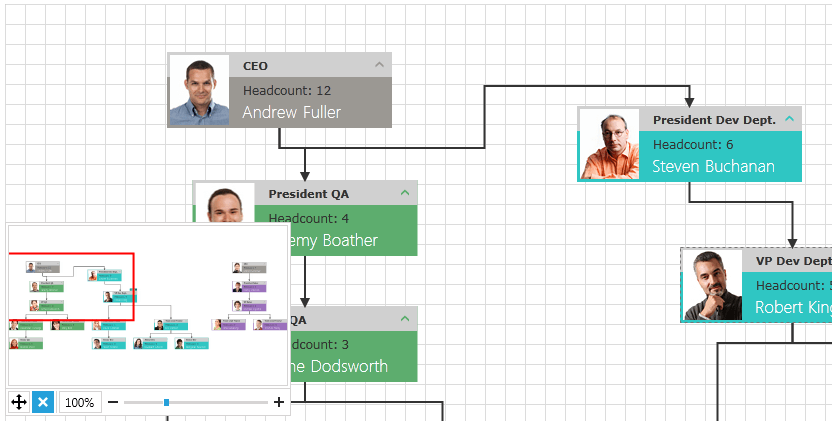
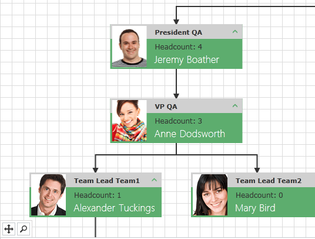
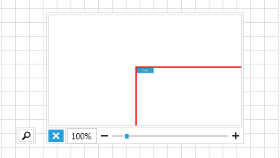

# DiagramNavigationPane

__RadDiagramNavigationPane__ wraps the __RadDiagramThumbnail__ control and gives you the ability to easily __Pan__, __Autofit__ and __Zoom__ the RadDiagram.


>In order to use the __RadDiagramNavigationPane__ control in your projects you have to add references to the following assemblies:
> + __Telerik.Windows.Controls__
> + __Telerik.Windows.Controls.Diagrams__
> + __Telerik.Windows.Controls.Diagram.Extensions__
> + __Telerik.Windows.Controls.Input__
> + __Telerik.Windows.Controls.Navigation__
> + __Telerik.Windows.Data__
> + __Telerik.Windows.Diagrams.Core__  

>Please note that the examples in this tutorial are showcasing Telerik Windows8 theme. In the [Setting a Theme](http://www.telerik.com/help/silverlight/common-styling-apperance-setting-theme.html#Setting_Application-Wide_Built-In_Theme_in_the_Code-Behind)[Setting a Theme](http://www.telerik.com/help/wpf/common-styling-apperance-setting-theme-wpf.html#Setting_Application-Wide_Built-In_Theme_in_the_Code-Behind) article you can find information on how to set an application-wide theme.

## Working with DiagramNavigationPane

RadDiagramNavigationPane is consisted of:

* RadDiagramThumbnail
* AutoFit Button
* ExpandCollapseButton Button
* ZoomPercent Button
* ZoomSlider

In order to use with the DiagramNavigationPane you have to bind its Diagram property to a RadDiagram:		

#### __XAML__
```XAML
	<telerik:RadDiagram x:Name="diagram" />
	<telerik:RadDiagramNavigationPane Diagram="{Binding ElementName=diagram}"
								      HorizontalAlignment="Left"
   									  VerticalAlignment="Bottom"/>
```

Once you bind the Diagram property you have to decide whether the control will be expanded or not.

If you work with bigger diagrams, your application performance will be better if the DiagramNavigatioPane is in "collapsed" mode.

If Visible, the DiagramThumbnail refreshes on every new shape prepared in the RadDiagram which slows down your overall performance.

By setting the __IsExpanded__ property of the NavigationPane to __False__, the Thumbnail is initially collapsed and these refresh operations are not done.


>Make sure that when you use big number of shapes in the RadDiagrams, the DiagramNavigationPane is initially collapsed.

## Controlling Appearance

You are able to customize the look and feel of the DiagramNavigationPane by using the following Style properties:

* __ThumbnailStyle__ - for styling to the DiagramThumbnail. The target type of this style must be __RadDiagramThumbnail__.			

* __SliderStyle__ - for styling the RadSlider. The target type of this style must be __RadSlider__.			

* __AutofitButtonStyle__ - for styling the AutoFitButton. The target type of this style must be __RadButton__.			

* __ExpandButtonStyle__ - for styling the Expand/Collapse button. The target type of this style must be __RadToggleButton__.			

You can also hide the AutoFitButton by using the __IsAutofitButtonVisible__ property and set it to False.		

This way the AutoFitButton will be collapsed in both the mini mode and the expanded mode of the DiagramNavigationPane. 


## See Also
 * [Thumbnail]()