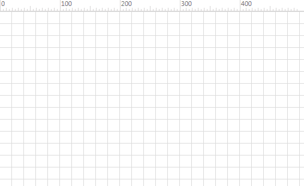
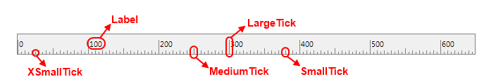

# Ruler

This article describes the features of the __RadDiagramRuler__

>In order to use the control in your projects you have to add references to the following assemblies:
> + __Telerik.Windows.Controls__
> + __Telerik.Windows.Controls.Diagrams__
> + __Telerik.Windows.Controls.Diagrams.Extensions__
> + __Telerik.Windows.Controls.Input__
> + __Telerik.Windows.Controls.Navigation__
> + __Telerik.Windows.Data__
> + __Telerik.Windows.Diagrams.Core__

The __RadDiagramRuler__ is used to provide visual indication about the diagram viewport coordinates. It resides in the  __Telerik.Windows.Controls.Diagrams.Extensions__ namespace. 

## Overview

The __RadDiagramRuler__ exposes a __Diagram__ property which is used to associate the ruler with a particular diagram instance. The ruler uses this instance to collect the required information about the current viewport (position and size) and the zoom level in the diagram. 

#### __XAML__
```XAML
    <Grid>
        <Grid.RowDefinitions>
            <RowDefinition Height="20" />
            <RowDefinition Height="*" />
        </Grid.RowDefinitions>
        <telerik:RadDiagramRuler Diagram="{Binding ElementName=xDiagram}" />
        <telerik:RadDiagram x:Name="xDiagram" Grid.Row="1" />
    </Grid>
```



>Please note that the examples in this tutorial are showcasing Telerik Windows8 theme. In the [Setting a Theme](http://www.telerik.com/help/silverlight/common-styling-apperance-setting-theme.html#Setting_Application-Wide_Built-In_Theme_in_the_Code-Behind)[Setting a Theme](http://www.telerik.com/help/wpf/common-styling-apperance-setting-theme-wpf.html#Setting_Application-Wide_Built-In_Theme_in_the_Code-Behind) z	article you can find more information on how to set an application-wide theme.

## Visual Structure



The structure of a __RadDiagramRuler__ is pretty simple. It consists of four types of ticks - each used to display a different measurement unit and a label.	  

* __XSmallTick__ - the smallest ticks available in the ruler. 			
* __SmallTick__
* __MediumTick__
* __LargeTick__
* __Label__ - the Label is used to display text describing the measurement unit value.			

All of the above visual elements are described by the __DiagramScaleItemDefinition__ class. Essentially the content of the __RadDiagramRuler__ control describes a single scale that displays different scale items. The scale items describe the measurement units and they are calculated based on the zoom level of the associated __RadDiagram__ object. You can easily configure the scale definitions and items to better match your scenario, using the __RadDiagramRuler__ properties.		

## Properties

The __RadDiagramRuler__ can be configured through the following set of properties:	  

* __Placement__ - this property controls the way the labels and ticks are aligned in the ruler. It is of type __Dock__ and therefore it allows you to set the placement as:			

	* __Left__ - rotates the ticks and labels and aligns them to the right of the ruler.					
	* __Top__ - this is the default placement of the ruler and it aligns the ticks and labels on the bottom of the ruler					
	* __Right__ - rotates the ticks and labels and aligns them to the left of the ruler.					
	* __Bottom__ - aligns the ticks and labels on top of the ruler				

* __MeasurementUnit__ - this property controls the measurement units used in the __RadDiagramRuler__. It is an enumeration of type __MeasurementUnit__ which exposes the following members:			

	* __Dip__ - represents device independent pixels. This is the default measurement unit used by the __RadDiagramRuler__.					
	* __Cm__ - represents centimeters.					
	* __Inch__ - represents inches.				

* __ScaleDefinitions__ - this property is of type __DiagramScaleDefinitionCollection__ and it describes a collection of __DiagramScaleDefinition__ objects. Each __DiagramScaleDefinition__ object describes a scale in the ruler.		  

## Customizing the default Scales

The __RadDiagramRuler__ by default sets the __ScaleDefinition__ collection to describe a set of predefined scales. In order to change these default settings, you should set the __ScaleDefinitions__ property to an object of type __DiagramScaleDefinitionCollection__.  The collection should describe different scales, each associated with particular zoom level in the __Diagram__ instance:		

#### __XAML__
```XAML
    <telerik:RadDiagramRuler Diagram="{Binding ElementName=xDiagram}">
        <telerik:RadDiagramRuler.ScaleDefinitions>
            <telerik:DiagramScaleDefinitionCollection>
                <telerik:DiagramScaleDefinition MaxZoom="0.99">
                    <telerik:DiagramScaleItemDefinition Interval="10" Type="SmallTick" />
                    <telerik:DiagramScaleItemDefinition Interval="50" Type="MediumTick" />
                    <telerik:DiagramScaleItemDefinition Interval="100" Type="LargeTick" />
                    <telerik:DiagramScaleItemDefinition Interval="100" Type="Label" />
                </telerik:DiagramScaleDefinition>
                <telerik:DiagramScaleDefinition MaxZoom="1.99">
                    <telerik:DiagramScaleItemDefinition Interval="5" Type="XSmallTick" />
                    <telerik:DiagramScaleItemDefinition Interval="10" Type="SmallTick" />
                    <telerik:DiagramScaleItemDefinition Interval="50" Type="MediumTick" />
                    <telerik:DiagramScaleItemDefinition Interval="100" Type="LargeTick" />
                    <telerik:DiagramScaleItemDefinition Interval="100" Type="Label" />
                </telerik:DiagramScaleDefinition>
                <telerik:DiagramScaleDefinition>
                    <telerik:DiagramScaleItemDefinition Interval="100" Type="LargeTick" />
                    <telerik:DiagramScaleItemDefinition Interval="100" Type="Label" />
                </telerik:DiagramScaleDefinition>
            </telerik:DiagramScaleDefinitionCollection>
        </telerik:RadDiagramRuler.ScaleDefinitions>
    </telerik:RadDiagramRuler>		  
```

In the above sample we've create three __DiagramScaleDefinitions__. The __MaxZoom__ property of type __double__ sets the maximum zoom level of the __RadDiagram__ for which a scale will be displayed in the __RadDiagramRuler__.		

The first __DiagramScaleDefinition__ will be displayed in the __RadDiagramRuler__ when the associated __Diagram__ zoom level is under 1. In this case, the ruler will display three types of ScaleItems - small ticks to indicate each 10th pixel; medium ticks to indicate each 50th pixel and large ticks to indicate each 100th pixel. Next to each large tick, a label will be displayed to show the measurement unit value. 	  

The second scale definition will be displayed when the zoom level in the __RadDiagram__ is between 1 and 2 and it adds one more item to the ruler - extra small ticks which indicate every 5th pixel of the __RadDiagram__ viewport.  	  

The sample also demonstrates how to apply a default scale (without setting the __MaxZoom__property) definition to be used for zoom levels which don't have a manually defined scale definition.

> Even though the __RadDiagramRuler__ visual structure contains multiple tick types and labels, in the logical structure of the control all these elements are described by one class - __DiagramScaleItemDefinition__. Each item allows you to define its recurring interval as well as its type:		

>	- The __Interval__ property is of type __double__ and it represent the recurring interval that controls how often the item will be displayed on the __RadDiagramRuler__ surface. Note that the value of this property is interpreted based on the measurement unit defined in the ruler.				

>	- The __Type__ property is an enumeration that exposes the following members:
>		- __XSmallTick__ - represents extra small ticks 
>		- __SmallTick__ - represents small ticks
>		- __MediumTick__ - represents medium ticks
>		- __LargeTick__ - represents large ticks
>		- __Label__ - represents labels

## Visual Containers

In runtime the __RadDiagramRuler__ generates visual containers for each type of the __DiagramScaleItemDefinition__ objects:		

* __XSmallTickContainer__ - a container that visualizes the __DiagramScaleItemDefinition__ of __Type XSmallTick__.			

* __SmallTickContainer__ - a container that visualizes the __DiagramScaleItemDefinition__ of __Type SmallTick__.			

* __MediumTickContainer__ - a container that visualizes the __DiagramScaleItemDefinition__ of __Type MediumTick__.			

* __LargeTickContainer__ - a container that visualizes the __DiagramScaleItemDefinition__ of __Type LargeTick__.			

* __LabelContainer__ - a container that visualizes the __DiagramScaleItemDefinition__ of __Type Label__.			

The described containers are used to control the visual appearance of the ticks and labels. This is why if you need to customize the default __Style__ or __ControlTemplate__ of a tick or a label, you'll need to create a __Style__ targeting the appropriate visual container.

For example, the default style of the extra small ticks is defined as follows:

#### __XAML__
```XAML
	<Style TargetType="telerik:XSmallTickContainer">
		<Setter Property="Template">
			<Setter.Value>
				<ControlTemplate TargetType="telerik:XSmallTickContainer">
					<Rectangle Fill="Black"
								Width="1"
								Height="3" />
				</ControlTemplate>
			</Setter.Value>
		</Setter>
	</Style>
```