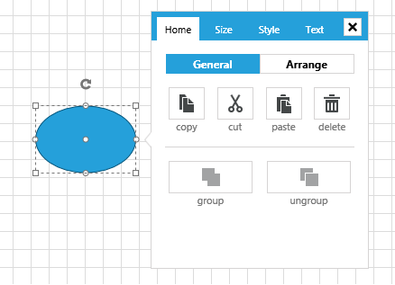
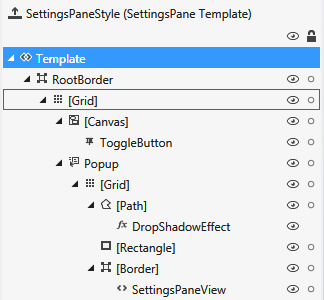
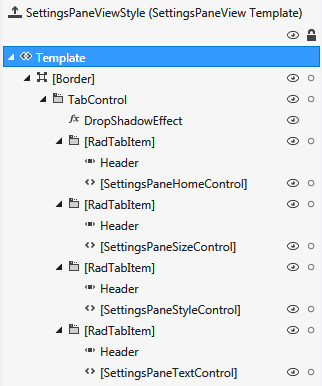

# SettingsPane

This article will get you familiar with the __SettingsPane__ control that is part of Telerik Diagramming Framework.
	  

## SettingsPane Overview

The __SettingsPane__ control allows the users to examine and modify the settings of the diagramming items in run-time.
		

>importantIn order to use the __SettingsPane__ control along with the __RadDiagram__ in your projects you have to add references to the following assemblies:
		  

* Telerik.Windows.Controls.Diagrams

* Telerik.Windows.Diagrams.Core

* Telerik.Windows.Controls.Diagrams.Extensions

* Telerik.Windows.Controls

* Telerik.Windows.Controls.Navigation

* Telerik.Windows.Controls.Input

The __SettingsPane__ control is a standalone control that can be displayed as the content of any __ContentControl__. Its main purpose is to provide you with a ready-to-use view that contains the most common features and settings of a single __RadDiagramItem (Shape or Connection)__. 
	  

In most __Diagramming__ examples you will find the __SettingsPane__ applied as an __AdditionalContent__ on the diagramming surface. This way the control is displayed next to a focused __RadDiagramItem__ thus allowing users to dynamically change the look and feel of the item.  In order to display the __SettingsPane__ this way in your application as well, you can add it through the __ItemInformationAdorner.AdditionalContent__ attached property in the following manner:
		

#### __XAML__

{{region raddiagram-extensions-settingspane-0}}
	<telerik:RadDiagram x:Name="diagram">
	    <primitives:ItemInformationAdorner.AdditionalContent>
	        <telerik:SettingsPane Diagram="{Binding ElementName=diagram}" />
	    </primitives:ItemInformationAdorner.AdditionalContent>
	</telerik:RadDiagram>
	{{endregion}}

## Customization

The __SettingsPane__ has a default view that can be used out-of-the-box in scenarios where you only need to display the common settings of a __RadDiagramItem__. However you can also customize the content of the pane to represent more specific information. These are the basic tasks you might need to implement while customizing your __SettingsPane__ instance:
		

* __Change the tab headers__ - in order to change the headers of the tabs in the default __SettingsPane__, you can change the value of their localization strings. Please take a look at the [Localization]() article to find the localization string of each tab displayed inside the __SettingsPane__.
			

* __Add and remove tabs__ - in order to add or remove tabs from the default __SettingsPane__, you need to edit the __ControlTemplate__ of the __SettingsPaneView__ as this is the control that represents the content of the __SettingsPane__. Please take a look at the [SettingsPaneView ControlTemplate Structure](#settingspaneview-controltemplate-structure) section for more information.
			

* __Edit the content of an existing tab__ - The content of each of the four default __SettingsPane__ tabs – Home, Size, Style, Text, is represented by a different control:
			

* __SettingsPaneHomeControl__ - representing the content of the __Home__ tab
				

* __SettingsPaneSizeControl__ - representing the content of the __Size__ tab
				

* __SettingsPaneStyleControl__ - representing the content of the __Style__ tab
				

* __SettingsPaneTextControl__ - representing the content of the __Text__ tab
				Furthermore, the content of each control is described in its __ControlTemplate__. This is why in order to change the existing content of a __SettingsPane__ tab, you need to edit the __ControlTemplate__ of the appropriate control.
			

## Events

__RadDiagram__ exposes two events that come in handy while working with the default __SettingsPane__:
		

* __PreviewAdditionalContentActivated__ - this event is raised by a __RadDiagram__ to inform layouts that the additional content is going to be activated. The event handler receives two arguments:
			

* The __sender__ argument contains the __RadDiagram__ This argument is of type __object__, but can be cast to the __RadDiagram__ type.
				

* An __AdditionalContentActivatedEventArgs__ object, that gives you access to a __ContextItems__ collection. This collection of __IDiagramItem__ objects represents the items that have activated the additional content. In most cases it contains a single item - the __RadDiagramItem__ that has activated the __SettingsPane__.
				

>tipPlease note that you can handle this event in order to disable the __SettingsPane__ from displaying on certain __RadDiagramItems__.
			

* __AdditionalContentActivated__ - this event is raised by a __RadDiagram__ to inform layouts that the additional content has been activated. The event handler receives two arguments:
			

* The __sender__ argument contains the __RadDiagram__ This argument is of type __object__, but can be cast to the __RadDiagram__ type.
				

* An __AdditionalContentActivatedEventArgs__ object, that gives you access to a __ContextItems__ collection. This collection of __IDiagramItem__ objects represents the items that have activated the additional content. In most cases it contains a single item - the __RadDiagramItem__ that has activated the __SettingsPane__.
				

## SettingsPane ControlTemplate Structure

The __SettingsPane ControlTemplate__ consists of the following elements:
		
<table><tr><td></td><td>

* 

* <b>RootBorder</b> - a <b>Border</b> that represents the main layout control in the <b>SettingsPane</b>

* <b>[Grid]</b> - a <b>Grid</b> that hosts the <b>SettingsPane ControlTemplate</b> elements
					  

* <b>[Canvas]</b> - a <b>Canvas</b> that hosts the <b>ToggleButton</b> element
						  

* <b>ToggleButton</b> - a <b>RadToggleButton</b> control that represents an inactive <b>SettingsPane</b>. Once this button is clicked, the <b>SettingsPaneView</b> gets activated and displayed.
							  

* <b>Popup</b> - a <b>Popup</b> control that represents the active <b>SettingsPane</b>

* <b>[Grid]</b> - a <b>Grid</b> panel that hosts the elements of the active <b>SettingsPane</b>

* <b>[Path]</b> - a <b>Path</b> that represents the callout element of the active <b>SettingsPane</b>

* <b>DropShadowEffect</b> - a <b>DropShadowEffect</b>

* <b>[Rectangle]</b> - a <b>Rectangle</b> element
								  

* <b>[Border]</b> - a <b>Border</b> control wrapping the content of the active <b>SettingsPane</b>

* <b>SettingsPaneView</b> - a <b>SettingsPaneView</b> control representing the content of the active <b>SettingsPane</b></td></tr></table>

## SettingsPaneView ControlTemplate Structure

The __SettingsPaneView__ represents the default content of the __RadDiagram SettingsPane__. This means that if you need to add or remove any tabs from the __SettingsPane__, you'll have to add or remove them from the __SettingsPaneView__ control. You can examine the __SettingsPaneView ControlTemplate__ structure below:
		
<table><tr><td></td><td>

* <b>[Border]</b> - a <b>Border</b> control that hosts the content of the <b>SettingsPaneView</b>

* <b>TabControl</b> - a <b>RadTabControl</b> that represents the content of the <b>SettingsPaneView</b>

* <b>DropShadowEffect</b> - a <b>DropShadowEffect</b>

* <b>[RadTabItem]</b> - a <b>RadTabItem</b> control that represents the <b>Home</b> tab in the <b>SettingsPaneView</b>

* <b>SettingsPaneHomeControl</b> - a <b>SettingsPaneHomeControl</b> that represents the content of the <b>Home</b> tab in the <b>SettingsPaneView</b>

* <b>[RadTabItem]</b> - a <b>RadTabItem</b> control that represents the <b>Size</b> tab in the <b>SettingsPaneView</b>

* <b>SettingsPaneSizeControl</b> - a <b>SettingsPaneSizeControl</b> that represents the content of the <b>Size</b> tab in the <b>SettingsPaneView</b>

* <b>[RadTabItem]</b> - a <b>RadTabItem</b> control that represents the <b>Style</b> tab in the <b>SettingsPaneView</b>

* <b>SettingsPaneStyleControl</b> - a <b>SettingsPaneStyleControl</b> that represents the content of the <b>Style</b> tab in the <b>SettingsPaneView</b>

* <b>[RadTabItem]</b> - a <b>RadTabItem</b> control that represents the <b>Text</b> tab in the <b>SettingsPaneView</b>

* <b>SettingsPaneTextControl</b> - a <b>SettingsPaneTextControl</b> that represents the content of the <b>Text</b> tab in the <b>SettingsPaneView</b></td></tr></table>

>tipPlease note that the content of each tab is represented by a different control. And __Telerik Diagramming Framework__ comes with a predefined style for each of these controls. This means that in order to modify the content of each tab in a __SettingsPane__, you need to actually modify the default __ControlTemplate__ of the appropriate control:
		  

* __SettingsPaneHomeControl__ - representing the content of the __Home__ tab
			  

* __SettingsPaneSizeControl__ - representing the content of the __Size__ tab
			  

* __SettingsPaneStyleControl__ - representing the content of the __Style__ tab
			  

* __SettingsPaneTextControl__ - representing the content of the __Text__ tab
			  

# See Also
