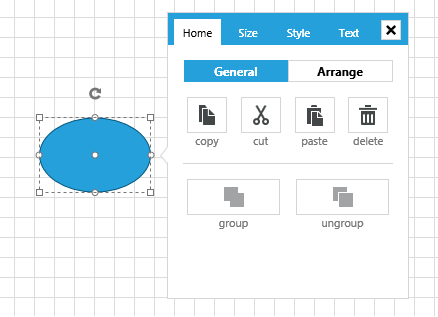

# Overview

The __SettingsPane__ control allows the users to examine and modify the settings of the diagramming items in run-time.

>In order to use the __SettingsPane__ control along with the __RadDiagram__ in your projects you have to add references to the following assemblies:
> + __Telerik.Windows.Controls__
> + __Telerik.Windows.Controls.Diagrams__
> + __Telerik.Windows.Controls.Diagrams.Extensions__
> + __Telerik.Windows.Controls.Input__
> + __Telerik.Windows.Controls.Navigation__
> + __Telerik.Windows.Diagrams.Core__

The __SettingsPane__ control is a standalone control that can be displayed as the content of any __ContentControl__. Its main purpose is to provide you with a ready-to-use view that contains the most common features and settings of a single __RadDiagramItem (Shape or Connection)__. 	  

In most __Diagramming__ examples you will find the __SettingsPane__ applied as an __AdditionalContent__ on the diagramming surface. This way the control is displayed next to a focused __RadDiagramItem__ thus allowing users to dynamically change the look and feel of the item.  In order to display the __SettingsPane__ this way in your application as well, you can add it through the __ItemInformationAdorner.AdditionalContent__ attached property as demonstrated in __Example 1__, where the primitives namespace is defined like this:	

>tip xmlns:primitives="clr-namespace:Telerik.Windows.Controls.Diagrams.Primitives;assembly=Telerik.Windows.Controls.Diagrams"

__Example 1: Adding SettingsPane in XAML__
```XAML
	<telerik:RadDiagram x:Name="diagram">
	    <primitives:ItemInformationAdorner.AdditionalContent>
	        <telerik:SettingsPane Diagram="{Binding ElementName=diagram}" />
	    </primitives:ItemInformationAdorner.AdditionalContent>
	</telerik:RadDiagram>
```
    


## Customization

The __SettingsPane__ has a default view that can be used out-of-the-box in scenarios where you only need to display the common settings of a __RadDiagramItem__. However you can also customize the content of the pane to represent more specific information. These are the basic tasks you might need to implement while customizing your __SettingsPane__ instance:		

* __Change the tab headers__ - in order to change the headers of the tabs in the default __SettingsPane__, you can change the value of their localization strings. Please take a look at the [Localization]() article to find the localization string of each tab displayed inside the __SettingsPane__.			

* __Add and remove tabs__ - in order to add or remove tabs from the default __SettingsPane__, you need to [edit the __ControlTemplate]() of the __SettingsPaneView__ as this is the control that represents the content of the __SettingsPane__.	

* __Edit the content of an existing tab__ - The content of each of the four default __SettingsPane__ tabs – Home, Size, Style, Text, is represented by a different control:			
	* __SettingsPaneHomeControl__: Representing the content of the __Home__ tab
	
	* __SettingsPaneSizeControl__: Representing the content of the __Size__ tab				

	* __SettingsPaneStyleControl__: Representing the content of the __Style__ tab

	* __SettingsPaneTextControl__: Representing the content of the __Text__ tab. Furthermore, the content of each control is described in its __ControlTemplate__. In order to change the existing content of a __SettingsPane__ tab, you need to edit the __ControlTemplate__ of the appropriate control.

## Events

__RadDiagram__ exposes two events that come in handy while working with the default __SettingsPane__:		

* __PreviewAdditionalContentActivated__ - this event is raised by a __RadDiagram__ to inform layouts that the additional content is going to be activated. The event handler receives two arguments:

	* The __sender__ argument contains the __RadDiagram__ This argument is of type __object__, but can be cast to the __RadDiagram__ type.				

	* An __AdditionalContentActivatedEventArgs__ object, that gives you access to a __ContextItems__ collection. This collection of __IDiagramItem__ objects represents the items that have activated the additional content. In most cases it contains a single item - the __RadDiagramItem__ that has activated the __SettingsPane__.				

	>tip Please note that you can handle this event in order to disable the __SettingsPane__ from displaying on certain __RadDiagramItems__.			

* __AdditionalContentActivated__ - this event is raised by a __RadDiagram__ to inform layouts that the additional content has been activated. The event handler receives two arguments:			

	* The __sender__ argument contains the __RadDiagram__ This argument is of type __object__, but can be cast to the __RadDiagram__ type.				
	* An __AdditionalContentActivatedEventArgs__ object, that gives you access to a __ContextItems__ collection. This collection of __IDiagramItem__ objects represents the items that have activated the additional content. In most cases it contains a single item - the __RadDiagramItem__ that has activated the __SettingsPane__.

## See Also  
* [Getting Started]()
* [DiagramExtensions ViewModels]()
* [Extensions Overview]()
