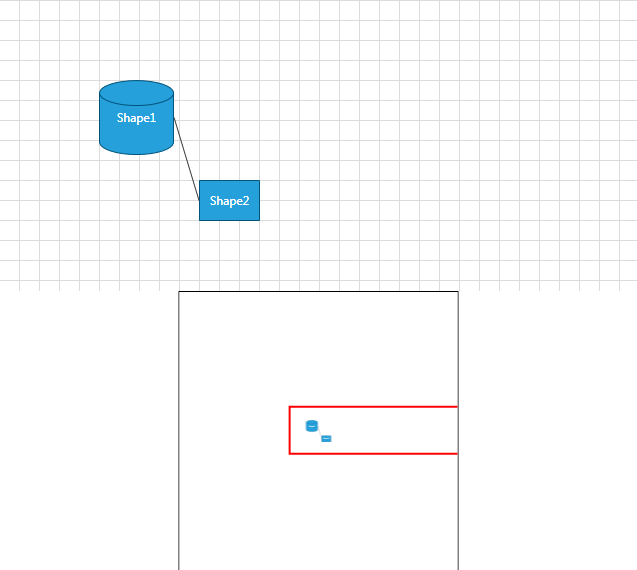
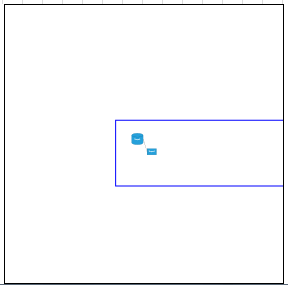
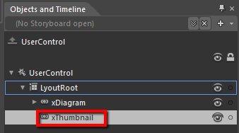
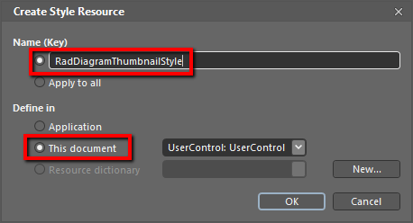
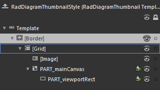

# Thumbnail

This article will get you familiar with the __RadDiagramThumbnail__ control that is part of __Telerik Diagramming Framework__.	  

The __RadDiagramThumbnail__ control provides a preview of the overall layout of the __RadDiagram__. It allows you to easily keep track of your current viewport and its position in the __RadDiagram__

> In order to use the __RadDiagramThumbnail__ control along with the __RadDiagram__ in your projects you have to add references to the following assemblies:
> + __Telerik.Windows.Controls__
> + __Telerik.Windows.Controls.Diagrams__
> + __Telerik.Windows.Controls.Diagram.Extensions__
> + __Telerik.Windows.Controls.Input__
> + __Telerik.Windows.Controls.Navigation__
> + __Telerik.Windows.Data__
> + __Telerik.Windows.Diagrams.Core__  

## Define a RadDiagramThumbnail

You can define the __RadDiagramThumbnail__ in xaml or in your code-behind. In both cases, in order to synchronize it with your diagram, you need to set its __Diagram__ property accordingly.	  


```XAML
    <Grid x:Name="LyoutRoot">
        <Grid.RowDefinitions>
            <RowDefinition Height="*" />
            <RowDefinition Height="Auto" />
        </Grid.RowDefinitions>
        <telerik:RadDiagram x:Name="xDiagram" Width="1800">
            <telerik:RadDiagramShape x:Name="Shape1"
                                     Content="Shape1"
                                     Geometry="{telerik:FlowChartShape ShapeType=Database1Shape}"
                                     Position="100,80" />
            <telerik:RadDiagramShape x:Name="Shape2"
                                     Content="Shape2"
                                     Position="200,180" />
            <telerik:RadDiagramConnection Source="{Binding ElementName=Shape1}" Target="{Binding ElementName=Shape2}" />
        </telerik:RadDiagram>
        <telerik:RadDiagramThumbnail x:Name="xThumbnail"
                                     Grid.Row="1"
                                     Diagram="{Binding ElementName=xDiagram}" />
    </Grid>
```

	
```C#
    RadDiagramThumbnail xDiagramThumbnail= new RadDiagramThumbnail() { Diagram = this.xDiagram };
    ...
    this.LayoutRoot.Children.Add(xDiagramThumbnail);
```
```VB.NET
    Dim xDiagramThumbnail As New RadDiagramThumbnail() With { .Diagram = Me.xDiagram }
    ...
    Me.LayoutRoot.Children.Add(xDiagramThumbnail)		  		  
```



>Please note that the examples in this tutorial are showcasing Telerik Windows8 theme. In the [Setting a Theme](http://www.telerik.com/help/silverlight/common-styling-apperance-setting-theme.html#Setting_Application-Wide_Built-In_Theme_in_the_Code-Behind)[Setting a Theme](http://www.telerik.com/help/wpf/common-styling-apperance-setting-theme-wpf.html#Setting_Application-Wide_Built-In_Theme_in_the_Code-Behind) article you can find more information on how to set an application-wide theme.

If you need to update the __RadDiagramThumbnail__ viewport, you can take advantage of the __RefreshThumbnail()__ method.	  

## Viewport

The __RadDiagramThumbnail__ indicates the current viewport of the __RadDiagram__ through a __Red Rectangle__ element. You can change the style of this rectangle by applying a custom style on it. The __RadDiagramThumbnail__ control exposes a __ViewportStyle__ property which you can use to change the __Stroke__ and the __StrokeThickness__ of the Viewport rectangle.


```XAML
	<telerik:RadDiagramThumbnail x:Name="xThumbnail"
								 Grid.Row="1"
								 Diagram="{Binding ElementName=xDiagram}">
		<telerik:RadDiagramThumbnail.ViewportStyle>
			<Style TargetType="Rectangle">
				<Setter Property="Stroke" Value="Blue" />
			</Style>
		</telerik:RadDiagramThumbnail.ViewportStyle>
	</telerik:RadDiagramThumbnail>
```



If you want to get the size and the position of the __RadDiagramThumbnail's__ Viewport you can use the __RadDiagramThumbnail.ViewportRect__ property. You can also get the zoom factor applied in the diagram through the __RadDiagramThumbnail.Zoom__ property.

## Styling and Templates

The __RadDiagramThumbnail__ can be styled by creating an appropriate Style and setting it to the Style property of the control. You have two options:

* To create an empty style and set it up on your own.

* To copy the default style of the control and modify it.

In order to implement the second one, you have to load your project in Expression Blend and open the view that holds the __RadDiagramThumbnail__. In the 'Objects and Timeline' pane select the thumbnail you want to style.


From the menu choose *Object -> Edit Style -> Edit a Copy*. You will be prompted for the name of the style and where to be placed. 


>tip If you choose to define the style in Application, it would be available for the entire application. This allows you to define a style only once and then reuse it where needed.		  

After clicking 'OK', Expression Blend will generate the default style of the __RadDiagramThumbnail__ control in the Resources section of your view. The properties available for the style will be loaded in the 'Properties' pane and you will be able to modify their default values.

You can modify these properties to achieve the desired appearance. However most of the visual parts of the __RadDiagramThumbnail__  have to be styled in its template. To modify it select the style in the *'Objects and Timeline'* pane, right-click on it and choose *Edit Template -> Edit Current*. In the same pane the element parts for the __RadDiagramThumbnail's__ template will get loaded.


## See Also
 * [DiagramNavigationPane]()