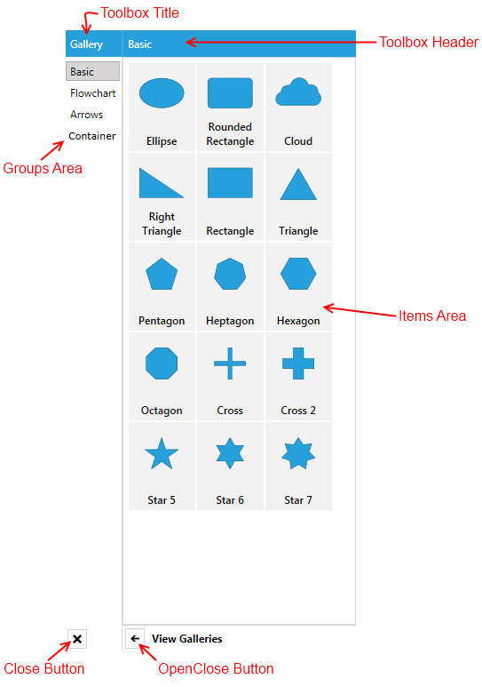
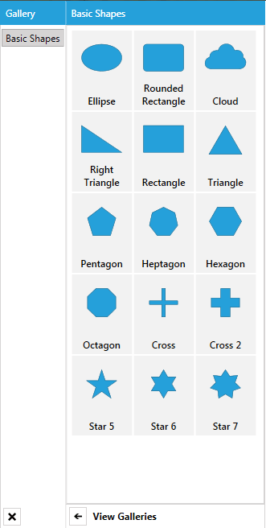
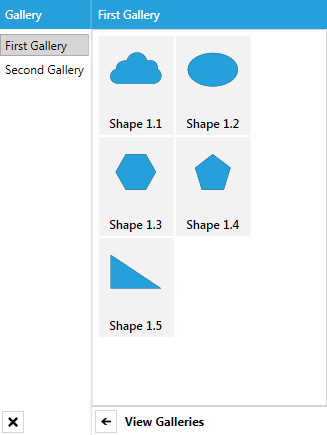

# DiagramToolbox

This article describes the main features and properties of the __RadDiagramToolbox__ control. You can examine the behavior of the control in the [Diagrams DesignToolbox demo](https://demos.telerik.com/silverlight/#Diagrams/DesignToolbox)[Diagrams DesignToolbox demo](https://demos.telerik.com/wpf/#Diagrams/DesignToolbox).            

> In order to use the __RadDiagramToolbox__ control in your projects you have to add references to the following assemblies:
> + __Telerik.Windows.Controls__
> + __Telerik.Windows.Controls.Diagrams__
> + __Telerik.Windows.Controls.Diagrams.Extensions__
> + __Telerik.Windows.Controls.Input__
> + __Telerik.Windows.Controls.Navigation__
> + __Telerik.Windows.Data__
> + __Telerik.Windows.Diagrams.Core__

>Please note that the examples in this tutorial are showcasing Telerik Windows8 theme. In the [Setting a Theme](http://www.telerik.com/help/silverlight/common-styling-apperance-setting-theme.html#Setting_Application-Wide_Built-In_Theme_in_the_Code-Behind)[Setting a Theme](http://www.telerik.com/help/wpf/common-styling-apperance-setting-theme-wpf.html#Setting_Application-Wide_Built-In_Theme_in_the_Code-Behind) article you can find more information on how to set an application-wide theme.                

## Visual Structure And Properties

The __Diagram Extensions__ include a __RadDiagramToolbox__ control. It is designed to display multiple galleries of __RadDiagramShapes__ in a single control. Below you can see a snapshot and explanation of the main visual elements of the control.


The __RadDiagramToolbox__ exposes the following list of properties:                

* __Header__ - gets or sets an __object__ that represents the __RadDiagramToolbox__ header.                        

* __HeaderTemplate__ - gets or sets the __DataTemplate__ used to display the header.                        

* __Title__ - gets or sets an __object__ that represents the __RadDiagramToolbox__ title.                        

* __TitleTemplate__ - gets or sets the __DataTemplate__ used to display the title of the toolbox.                        

* __IsOpen__ - gets or sets a value that indicates whether the groups area of the __RadDiagramToolbox__ control is visible.                        

* __CloseButtonStyle__ - gets or sets the style used by the __Close__ button when it is rendered.                        

* __OpenCloseButtonStyle__ - gets or sets the style used by the __OpenClose__ button when it is rendered.                        

* __Items__  - gets or sets the collection used to generate the content of the __RadDiagramToolbox__.                        

* __ItemsSource__  - gets or sets a business collection used to generate the content of the __RadDiagramToolbox__.                        

## How to Use the Predefined HierarchicalGalleryItemsCollection

The __Diagram Extensions__ provide a __HierarchicalGalleryItemsCollection__ which is an __ObservableCollection__ of galleries with predefined __RadDiagramShapes__. You can use it to populate the __RadDiagramToolbox.ItemsSource__ collection with business items.                

You can use it directly in XAML:

#### __XAML__

```XAML
	<Grid>
			<Grid.DataContext>
				<telerik:HierarchicalGalleryItemsCollection />
			</Grid.DataContext>
			<Grid.Resources>
				<telerik:BooleanToVisibilityConverter x:Key="BooleanToVisibilityConverter" />
				<!--  ToolboxItemTemplate  -->
					<DataTemplate x:Key="ToolboxItemTemplate">
						<Grid Width="76"
							Height="100"
							Margin="0 1 1 0">
							<Grid.RowDefinitions>
								<RowDefinition Height="\*" />
								<RowDefinition Height="42" />
							</Grid.RowDefinitions>
							<Viewbox Margin="5 5 5 0"
									HorizontalAlignment="Center"
									VerticalAlignment="Bottom">
								<ContentPresenter Margin="5"
												Content="{Binding Shape}"
												IsHitTestVisible="False" />
							</Viewbox>
							<TextBlock Grid.Row="1"
									Margin="5"
									HorizontalAlignment="Center"
									VerticalAlignment="Top"
									FontFamily="Segoe UI Semibold"
									FontSize="12"
									Text="{Binding Header}"
									TextAlignment="Center"
									TextWrapping="Wrap" />
						</Grid>
					</DataTemplate>
					<!--  ToolboxGroupTemplate  -->
					<HierarchicalDataTemplate x:Key="ToolboxTemplate"
											ItemTemplate="{StaticResource ToolboxItemTemplate}"
											ItemsSource="{Binding Items}">
						<TextBlock MinWidth="55" Text="{Binding Header}" />
					</HierarchicalDataTemplate>
			</Grid.Resources>
			<Grid.ColumnDefinitions>
			<ColumnDefinition Width="Auto" />
			<ColumnDefinition Width="*" />
			<ColumnDefinition Width="Auto" />
	

		</Grid.ColumnDefinitions>
		
		<telerik:RadDiagramToolbox x:Name="toolbox"
								Title="Gallery"
								Width="330"
								HorizontalAlignment="Right"
								Header="{Binding SelectedItem.Header,
													RelativeSource={RelativeSource Self}}"
								ItemsSource="{Binding}"
								ItemTemplate="{StaticResource ToolboxTemplate}"
								Visibility="{Binding IsChecked,
														ElementName=toolboxButton,
														Converter={StaticResource BooleanToVisibilityConverter}}" />
	
	</Grid>
```

or define a property of type __HierarchicalGalleryItemsCollection__ in your ViewModel:                

#### __C#__

```C#
	public class MainViewModel
	{
	    public HierarchicalGalleryItemsCollection GalleryItems { get; set; }
	
	    public MainViewModel()
	    {
	        this.GalleryItems = new HierarchicalGalleryItemsCollection();
	    }
	}
```

#### __VB.NET__

```VB.NET
	Public Class MainViewModel
		Public Property GalleryItems() As HierarchicalGalleryItemsCollection
			Get
				Return _GalleryItems
			End Get
			Set
				_GalleryItems = Value
			End Set
		End Property
		Private _GalleryItems As HierarchicalGalleryItemsCollection
	
		Public Sub New()
			Me.GalleryItems = New HierarchicalGalleryItemsCollection()
		End Sub
	End Class	
```

#### __XAML__

```XAML
	<Grid>
		<Grid.DataContext>
			 <!-- local is an alias pointing to your local namespace where the MainViewModel class is defined-->
	        <local:MainViewModel />
		</Grid.DataContext>
		<Grid.Resources>
			<telerik:BooleanToVisibilityConverter x:Key="BooleanToVisibilityConverter" />
			   <!--  ToolboxItemTemplate  -->
	            <DataTemplate x:Key="ToolboxItemTemplate">
	                <Grid Width="76"
	                      Height="100"
	                      Margin="0 1 1 0">
	                    <Grid.RowDefinitions>
	                        <RowDefinition Height="\*" />
	                        <RowDefinition Height="42" />
	                    </Grid.RowDefinitions>
	                    <Viewbox Margin="5 5 5 0"
	                             HorizontalAlignment="Center"
	                             VerticalAlignment="Bottom">
	                        <ContentPresenter Margin="5"
	                                          Content="{Binding Shape}"
	                                          IsHitTestVisible="False" />
	                    </Viewbox>
	                    <TextBlock Grid.Row="1"
	                               Margin="5"
	                               HorizontalAlignment="Center"
	                               VerticalAlignment="Top"
	                               FontFamily="Segoe UI Semibold"
	                               FontSize="12"
	                               Text="{Binding Header}"
	                               TextAlignment="Center"
	                               TextWrapping="Wrap" />
	                </Grid>
	            </DataTemplate>
	            <!--  ToolboxGroupTemplate  -->
	            <HierarchicalDataTemplate x:Key="ToolboxTemplate"
	                                      ItemTemplate="{StaticResource ToolboxItemTemplate}"
	                                      ItemsSource="{Binding Items}">
	                <TextBlock MinWidth="55" Text="{Binding Header}" />
	            </HierarchicalDataTemplate>
		</Grid.Resources>
	

		<Grid.ColumnDefinitions>
			<ColumnDefinition Width="Auto" />
			<ColumnDefinition Width="\*" />
			<ColumnDefinition Width="Auto" />
	
		</Grid.ColumnDefinitions>
	
		<telerik:RadDiagramToolbox x:Name="toolbox"
								   Title="Gallery"
								   Width="330"
								   HorizontalAlignment="Right"
								   Header="{Binding SelectedItem.Header,
													RelativeSource={RelativeSource Self}}"
								   ItemsSource="{Binding GalleryItems}"
								   ItemTemplate="{StaticResource ToolboxTemplate}"
								   Visibility="{Binding IsChecked,
														ElementName=toolboxButton,
														Converter={StaticResource BooleanToVisibilityConverter}}" />
	
	</Grid>
```

## Configure a RadDiagramToolbox to Display Part of the HierarchicalGalleryItemsCollection

The __HierarchicalGalleryItemsCollection__ is populated based on the items in the __Telerik.Windows.Controls.Diagrams.Extensions.GalleryItemsCollection__ grouped by the name of each gallery. This is why you can easily recreate it in your ViewModel:

#### __C#__

```C#
	public class MainViewModel
	{
	    public ObservableCollection<Gallery> GalleryItems { get; set; }
	
	    public MainViewModel()
	    {
	        this.GalleryItems = new ObservableCollection<Gallery>();
	        LoadData("Basic", "Flowchart", "Arrow", "Container");
	    }
	
	    private void LoadData(params string[] galleryNames)
	    {
	        var allItems = new GalleryItemsCollection();
	
	        foreach (var galleryName in galleryNames)
	        {
	            var gallery = new Gallery { Header = galleryName };
	            foreach (var item in allItems.GetItemsByType(galleryName).ToArray())
	            {
	                gallery.Items.Add(item);
	            }
	            this.GalleryItems.Add(gallery);
	        }
	    }
	}	
```

#### __VB.NET__

```VB.NET
	Public Class MainViewModel
		Public Property GalleryItems() As ObservableCollection(Of Gallery)
			Get
				Return _GalleryItems
			End Get
			Set
				_GalleryItems = Value
			End Set
		End Property
		Private _GalleryItems As ObservableCollection(Of Gallery)
	
		Public Sub New()
			Me.GalleryItems = New ObservableCollection(Of Gallery)()
			LoadData("Basic", "Flowchart", "Arrow","Container")
		End Sub
	
		Private Sub LoadData(ParamArray galleryNames As String())
			Dim allItems = New GalleryItemsCollection()
	
			For Each galleryName As var In galleryNames
				Dim gallery = New Gallery() With { .Header = galleryName }
				For Each item As var In allItems.GetItemsByType(galleryName).ToArray()
					gallery.Items.Add(item)
				Next
				Me.GalleryItems.Add(gallery)
			Next
		End Sub
	End Class	
```

Next, you can customize your *GalleryItems* collection to display only the Basic Shapes gallery like so:

#### __C#__

```C#
	public class MainViewModel
	{
	    public ObservableCollection<Gallery> GalleryItems { get; set; }
	
	    public MainViewModel()
	    {
	        this.GalleryItems = new ObservableCollection<Gallery>();
	        LoadData("Basic");
	    }
	
	    private void LoadData(params string[] galleryNames)
	    {
	        var allItems = new GalleryItemsCollection();
	
	        foreach (var galleryName in galleryNames)
	        {
	            var gallery = new Gallery { Header = galleryName };
	            foreach (var item in allItems.GetItemsByType(galleryName).ToArray())
	            {
	                gallery.Items.Add(item);
	            }
	            this.GalleryItems.Add(gallery);
	        }
	    }
	}
```

#### __VB.NET__

```VB.NET
	Public Class MainViewModel
		Public Property GalleryItems() As ObservableCollection(Of Gallery)
			Get
				Return _GalleryItems
			End Get
			Set
				_GalleryItems = Value
			End Set
		End Property
		Private _GalleryItems As ObservableCollection(Of Gallery)
	
		Public Sub New()
			Me.GalleryItems = New ObservableCollection(Of Gallery)()
			LoadData("Basic")
		End Sub
	
		Private Sub LoadData(ParamArray galleryNames As String())
			Dim allItems = New GalleryItemsCollection()
	
			For Each galleryName As var In galleryNames
				Dim gallery = New Gallery() With { .Header = galleryName}
				For Each item As var In allItems.GetItemsByType(galleryName).ToArray()
					gallery.Items.Add(item)
				Next
				Me.GalleryItems.Add(gallery)
			Next
		End Sub
	End Class
```



## How to Populate RadDiagramToolbox with Custom Data Items

In case you need to populate a __RadDiagramToolbox__ instance with a custom collection of business items, you will have to create a hierarchical collection of items. The first-level items of the collection should represent the galleries, whilst the second-level items should describe the shapes within the __RadDiagramToolbox__.

For the purpose of this tutorial we will create a class describing our shapes and a custom gallery class that defines a collection of shapes:

#### __C#__

```C#
	public class MyShape
	{
	    public Geometry Geometry { get; set; }
	    public string Header { get; set; }
	}
	public class MyGallery
	{
	    public string Header { get; set; }
	    public ObservableCollection<MyShape> Shapes { get; set; }
	    public MyGallery()
	    {
	        this.Shapes = new ObservableCollection<MyShape>();
	    }
	}
	public class MainViewModel
	{
	    public ObservableCollection<MyGallery> Items { get; set; }
	    public MainViewModel()
	    {
	        this.Items = new ObservableCollection<MyGallery>();
	        //create and populate the first custom gallery
	        MyGallery firstGallery = new MyGallery { Header = "First Gallery" };
	        firstGallery.Shapes.Add(new MyShape
	        {
	            Header = "Shape 1.1",
	            Geometry = ShapeFactory.GetShapeGeometry(CommonShapeType.CloudShape)
	        });
	        firstGallery.Shapes.Add(new MyShape
	        {
	            Header = "Shape 1.2",
	            Geometry = ShapeFactory.GetShapeGeometry(CommonShapeType.EllipseShape)
	        });
	        firstGallery.Shapes.Add(new MyShape
	        {
	            Header = "Shape 1.3",
	            Geometry = ShapeFactory.GetShapeGeometry(CommonShapeType.HexagonShape)
	        });
	        firstGallery.Shapes.Add(new MyShape
	        {
	            Header = "Shape 1.4",
	            Geometry = ShapeFactory.GetShapeGeometry(CommonShapeType.PentagonShape)
	        });
	        firstGallery.Shapes.Add(new MyShape
	        {
	            Header = "Shape 1.5",
	            Geometry = ShapeFactory.GetShapeGeometry(CommonShapeType.RightTriangleShape)
	        });
	        this.Items.Add(firstGallery);
	
	        //create and populate the second custom gallery
	        MyGallery secondGallery = new MyGallery { Header = "Second Gallery" };
	        secondGallery.Shapes.Add(new MyShape
	        {
	            Header = "Shape 2.1",
	            Geometry = ShapeFactory.GetShapeGeometry(FlowChartShapeType.CardShape)
	        });
	        secondGallery.Shapes.Add(new MyShape
	        {
	            Header = "Shape 2.2",
	            Geometry = ShapeFactory.GetShapeGeometry(FlowChartShapeType.Database1Shape)
	        });
	        secondGallery.Shapes.Add(new MyShape
	        {
	            Header = "Shape 2.3",
	            Geometry = ShapeFactory.GetShapeGeometry(FlowChartShapeType.CollateShape)
	        });
	        secondGallery.Shapes.Add(new MyShape
	        {
	            Header = "Shape 2.4",
	            Geometry = ShapeFactory.GetShapeGeometry(FlowChartShapeType.DataShape)
	        });
	        secondGallery.Shapes.Add(new MyShape
	        {
	            Header = "Shape 2.5",
	            Geometry = ShapeFactory.GetShapeGeometry(FlowChartShapeType.DisplayShape)
	        });
	        this.Items.Add(secondGallery);
	    }
	}
```

#### __VB.NET__

```VB.NET
	Public Class MyShape
		Public Property Geometry() As Geometry
		Public Property Header() As String
	End Class
	Public Class MyGallery
		Public Property Header() As String
		Public Property Shapes() As ObservableCollection(Of MyShape)
		Public Sub New()
			Me.Shapes = New ObservableCollection(Of MyShape)()
		End Sub
	End Class
	Public Class MainViewModel
		Public Property Items() As ObservableCollection(Of MyGallery)
		Public Sub New()
			Me.Items = New ObservableCollection(Of MyGallery)()
			'create and populate the first custom gallery'
			Dim firstGallery As MyGallery = New MyGallery With {.Header = "First Gallery"}
			firstGallery.Shapes.Add(New MyShape With {.Header = "Shape 1.1", .Geometry = ShapeFactory.GetShapeGeometry(CommonShapeType.CloudShape)})
			firstGallery.Shapes.Add(New MyShape With {.Header = "Shape 1.2", .Geometry = ShapeFactory.GetShapeGeometry(CommonShapeType.EllipseShape)})
			firstGallery.Shapes.Add(New MyShape With {.Header = "Shape 1.3", .Geometry = ShapeFactory.GetShapeGeometry(CommonShapeType.HexagonShape)})
			firstGallery.Shapes.Add(New MyShape With {.Header = "Shape 1.4", .Geometry = ShapeFactory.GetShapeGeometry(CommonShapeType.PentagonShape)})
			firstGallery.Shapes.Add(New MyShape With {.Header = "Shape 1.5", .Geometry = ShapeFactory.GetShapeGeometry(CommonShapeType.RightTriangleShape)})
			Me.Items.Add(firstGallery)
	
			'create and populate the second custom gallery'
			Dim secondGallery As MyGallery = New MyGallery With {.Header = "Second Gallery"}
			secondGallery.Shapes.Add(New MyShape With {.Header = "Shape 2.1", .Geometry = ShapeFactory.GetShapeGeometry(FlowChartShapeType.CardShape)})
			secondGallery.Shapes.Add(New MyShape With {.Header = "Shape 2.2", .Geometry = ShapeFactory.GetShapeGeometry(FlowChartShapeType.Database1Shape)})
			secondGallery.Shapes.Add(New MyShape With {.Header = "Shape 2.3", .Geometry = ShapeFactory.GetShapeGeometry(FlowChartShapeType.CollateShape)})
			secondGallery.Shapes.Add(New MyShape With {.Header = "Shape 2.4", .Geometry = ShapeFactory.GetShapeGeometry(FlowChartShapeType.DataShape)})
			secondGallery.Shapes.Add(New MyShape With {.Header = "Shape 2.5", .Geometry = ShapeFactory.GetShapeGeometry(FlowChartShapeType.DisplayShape)})
			Me.Items.Add(secondGallery)
		End Sub
	End Class
```

Once the ViewModels are all in place, you can use the *MainViewModel* as the __DataContext__ of the __RadDiagramToolbox__ and bind its __ItemsSource__ to the *Items* collection. You will also need to define __DataTemplates__ to visualize the *MyShape* and *MyGallery* items properly.

#### __XAML__

```XAML
	<Grid>
		<Grid.DataContext>
			<local:MainViewModel />
		</Grid.DataContext>
		<Grid.Resources>
			<telerik:BooleanToVisibilityConverter x:Key="BooleanToVisibilityConverter" />
			<!--  ToolboxItemTemplate  -->
			<DataTemplate x:Key="ToolboxItemTemplate">
				<Border Width="76"
						Height="100"
						Margin="0 1 1 0"
						Background="Transparent">
					<Grid>
						<Grid.RowDefinitions>
							<RowDefinition Height="\*" />
							<RowDefinition Height="Auto" />
						</Grid.RowDefinitions>
						<Viewbox Width="64"
								 Height="50"
								 Margin="5 10 5 0"
								 HorizontalAlignment="Center"
								 VerticalAlignment="Top"
								 Stretch="Uniform">
							<telerik:RadDiagramShape Margin="15"
													 VerticalAlignment="Top"
													 HorizontalContentAlignment="Center"
													 VerticalContentAlignment="Center"
													 Geometry="{Binding Geometry}"
													 IsHitTestVisible="False" />
						</Viewbox>
						<TextBlock Grid.Row="1"
								   Margin="0 0 0 5"
								   HorizontalAlignment="Center"
								   FontFamily="Segoe UI Semibold"
								   Padding="4 0"
								   Text="{Binding Header}"
								   TextAlignment="Center"
								   TextWrapping="Wrap" />
					</Grid>
				</Border>
	
			</DataTemplate>
			<!--  ToolboxGroupTemplate  -->
			<HierarchicalDataTemplate x:Key="ToolboxGroupTemplate"
									  ItemsSource="{Binding Shapes}"
									  ItemTemplate="{StaticResource ToolboxItemTemplate}">
				<TextBlock Text="{Binding Header}" />
			</HierarchicalDataTemplate>
		</Grid.Resources>
	
		<Grid.ColumnDefinitions>
			<ColumnDefinition Width="Auto" />
			<ColumnDefinition Width="*" />
			<ColumnDefinition Width="Auto" />
	
		</Grid.ColumnDefinitions>
	
		<telerik:RadDiagramToolbox x:Name="toolbox"
								   Title="Gallery"
								   Width="330"
								   HorizontalAlignment="Right"
								   Header="{Binding SelectedItem.Header,
													RelativeSource={RelativeSource Self}}"
								   ItemsSource="{Binding Items}"
								   ItemTemplate="{StaticResource ToolboxGroupTemplate}"
								   Visibility="{Binding IsChecked,
														ElementName=toolboxButton,
														Converter={StaticResource BooleanToVisibilityConverter}}" />
	
	</Grid>
```



## DragDrop Support

__RadDiagramToolbox__ supports drag/drop operations out-of-the-box. As soon as a __RadDiagramToolboxItem__ is initialized, it is made draggable through the __DragDropManager AllowDrag__ and __AllowCapturedDrag__ properties which are both set to __true__. Moreover, the __Diagramming Framework__ internally handles the __DragDropManager DragInitialize__ event to take from the dragged __RadDiagramToolboxItem__ the shape it represents, if sush exists, and serialize its settings. The serialized settings are then saved in a __DiagramDropInfo__ object along with the actual size of the dragged shape.

>The __DiagramDropInfo__ structure describes a dragged object within a __RadDiagram__ instance. It includes a __SerializationInfo__ property and a __Size__ property – the first one holds the serialized settings of the dragged __RadDiagramItem__, while the second holds the actual size of the dragged item.                    

Due to this built-in __DragDropManager__ drag implementation, you can easily drag shapes and containers out of a __RadDiagramToolbox__ and drop them onto a diagramming surface. __RadDiagram__ knows how to extract the serialized information out of a __DiagramDropInfo__ object to create a new __RadDiagramItem__ on the surface. However, if you create a custom __RadDiagramToolbox__ populated with a business collection of items, you will have to further configure the drag/drop operation. Please have a look at the [How To Drag Items from a Custom Databound DiagramToolbox]() tutorial for instructions on how to implement such a scenario.            

## See Also
 * [Drag Items from a Custom Databound DiagramToolbox]()
 * [Thumbnail]()
 * [DiagramNavigationPane]()
 * [Ruler]()
 * [SettingsPane]()