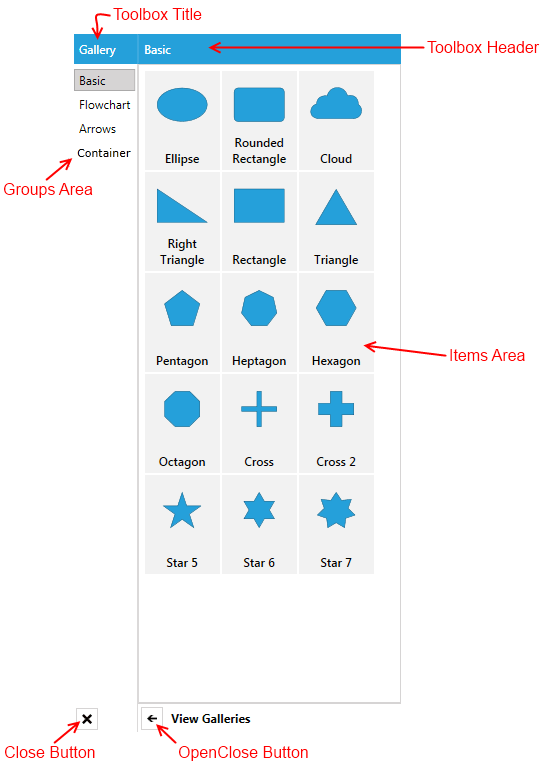
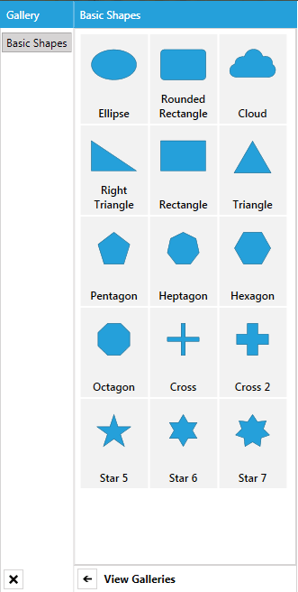
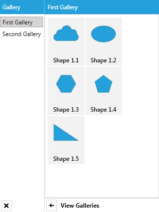

# DiagramToolbox

This article describes the main features and properties of the `RadDiagramToolbox` control. You can examine the behavior of the control in the [Diagrams DesignToolbox demo](https://demos.telerik.com/wpf/#Diagrams/DesignToolbox).

In order to use the RadDiagramToolbox control in your projects you have to add references to the following assemblies:

* __Telerik.Windows.Controls__
* __Telerik.Windows.Controls.Diagrams__
* __Telerik.Windows.Controls.Diagrams.Extensions__
* __Telerik.Windows.Controls.Input__
* __Telerik.Windows.Controls.Navigation__
* __Telerik.Windows.Data__
* __Telerik.Windows.Diagrams.Core__

>important Please note that the examples in this tutorial are showcasing Telerik Windows8 theme. In the [Setting a Theme]() article you can find more information on how to set an application-wide theme.                

## Visual Structure And Properties

The __Diagram Extensions__ include a RadDiagramToolbox control. It is designed to display multiple galleries of `RadDiagramShape` elements in a single control. Below you can see a snapshot and explanation of the main visual elements of the control.

__RadDiagramToolbox Overview__



The RadDiagramToolbox exposes the following list of properties:                

* `Header`&mdash;gets or sets an `object` that represents the RadDiagramToolbox header.                        
* `HeaderTemplate`&mdash;gets or sets the `DataTemplate` used to display the header.                        
* `Title`&mdash;gets or sets an `object` that represents the RadDiagramToolbox title.                        
* `TitleTemplate`&mdash;gets or sets the `DataTemplate` used to display the title of the toolbox.                        
* `IsOpen`&mdash;gets or sets a value that indicates whether the groups area of the RadDiagramToolbox control is visible.                        
* `CloseButtonStyle`&mdash;gets or sets the style used by the __Close__ button when it is rendered.                        
* `OpenCloseButtonStyle`&mdash;gets or sets the style used by the __OpenClose__ button when it is rendered.                        
* `Items`&mdash;gets or sets the collection used to generate the content of the RadDiagramToolbox.                        
* `ItemsSource`&mdash;gets or sets a business collection used to generate the content of the RadDiagramToolbox.                        

## How to Use the Predefined HierarchicalGalleryItemsCollection

The __Diagram Extensions__ provide a `HierarchicalGalleryItemsCollection` which is an `ObservableCollection` of galleries with predefined `RadDiagramShape` elements. You can use it to populate the `RadDiagramToolbox.ItemsSource` collection with business items.                

You can use it directly in XAML:

```XAML
	<Grid>
		<Grid.DataContext>
			<telerik:HierarchicalGalleryItemsCollection />
		</Grid.DataContext>
		<Grid.ColumnDefinitions>
			<ColumnDefinition Width="Auto" />
			<ColumnDefinition Width="\*" />
			<ColumnDefinition Width="Auto" />
		</Grid.ColumnDefinitions>
		<telerik:RadDiagramToolbox x:Name="toolbox"
									Title="Gallery"
									Width="330"
									HorizontalAlignment="Right"
									Header="{Binding SelectedItem.Header, RelativeSource={RelativeSource Self}}"
									ItemsSource="{Binding}"/>
	</Grid>
```

or define a property of type `HierarchicalGalleryItemsCollection` in your ViewModel:                

```C#
	public class MainViewModel
	{
	    public HierarchicalGalleryItemsCollection GalleryItems { get; set; }
	
	    public MainViewModel()
	    {
	        this.GalleryItems = new HierarchicalGalleryItemsCollection();
	    }
	}
```
```VB.NET
	Public Class MainViewModel
		Public Property GalleryItems() As HierarchicalGalleryItemsCollection
			Get
				Return _GalleryItems
			End Get
			Set
				_GalleryItems = Value
			End Set
		End Property
		Private _GalleryItems As HierarchicalGalleryItemsCollection
	
		Public Sub New()
			Me.GalleryItems = New HierarchicalGalleryItemsCollection()
		End Sub
	End Class	
```

```XAML
	<Grid>
		<Grid.DataContext>
			 <!-- local is an alias pointing to your local namespace where the MainViewModel class is defined-->
	        <local:MainViewModel />
		</Grid.DataContext>
		<Grid.Resources>
			<telerik:BooleanToVisibilityConverter x:Key="BooleanToVisibilityConverter" />
		</Grid.Resources>
		<Grid.ColumnDefinitions>
			<ColumnDefinition Width="Auto" />
			<ColumnDefinition Width="\*" />
			<ColumnDefinition Width="Auto" />
		</Grid.ColumnDefinitions>
	
		<telerik:RadDiagramToolbox x:Name="toolbox"
								   Title="Gallery"
								   Width="330"
								   HorizontalAlignment="Right"
								   Header="{Binding SelectedItem.Header, RelativeSource={RelativeSource Self}}"
								   ItemsSource="{Binding GalleryItems}"/>
	</Grid>
```

## Configure a RadDiagramToolbox to Display Part of the HierarchicalGalleryItemsCollection

The `HierarchicalGalleryItemsCollection` is populated based on the items in the __Telerik.Windows.Controls.Diagrams.Extensions.GalleryItemsCollection__ grouped by the name of each gallery. This is why you can easily recreate it in your ViewModel:

```C#
	public class MainViewModel
	{
	    public ObservableCollection<Gallery> GalleryItems { get; set; }
	
	    public MainViewModel()
	    {
	        this.GalleryItems = new ObservableCollection<Gallery>();
	        LoadData("Basic", "Flowchart", "Arrow", "Container");
	    }
	
	    private void LoadData(params string[] galleryNames)
	    {
	        var allItems = new GalleryItemsCollection();
	
	        foreach (var galleryName in galleryNames)
	        {
	            var gallery = new Gallery { Header = galleryName };
	            foreach (var item in allItems.GetItemsByType(galleryName).ToArray())
	            {
	                gallery.Items.Add(item);
	            }
	            this.GalleryItems.Add(gallery);
	        }
	    }
	}	
```
```VB.NET
	Public Class MainViewModel
		Public Property GalleryItems() As ObservableCollection(Of Gallery)
			Get
				Return _GalleryItems
			End Get
			Set
				_GalleryItems = Value
			End Set
		End Property
		Private _GalleryItems As ObservableCollection(Of Gallery)
	
		Public Sub New()
			Me.GalleryItems = New ObservableCollection(Of Gallery)()
			LoadData("Basic", "Flowchart", "Arrow","Container")
		End Sub
	
		Private Sub LoadData(ParamArray galleryNames As String())
			Dim allItems = New GalleryItemsCollection()
	
			For Each galleryName As var In galleryNames
				Dim gallery = New Gallery() With { .Header = galleryName }
				For Each item As var In allItems.GetItemsByType(galleryName).ToArray()
					gallery.Items.Add(item)
				Next
				Me.GalleryItems.Add(gallery)
			Next
		End Sub
	End Class	
```

Next, you can customize your `GalleryItems` collection to display only the Basic Shapes gallery like so:

```C#
	public class MainViewModel
	{
	    public ObservableCollection<Gallery> GalleryItems { get; set; }
	
	    public MainViewModel()
	    {
	        this.GalleryItems = new ObservableCollection<Gallery>();
	        LoadData("Basic");
	    }
	
	    private void LoadData(params string[] galleryNames)
	    {
	        var allItems = new GalleryItemsCollection();
	
	        foreach (var galleryName in galleryNames)
	        {
	            var gallery = new Gallery { Header = galleryName };
	            foreach (var item in allItems.GetItemsByType(galleryName).ToArray())
	            {
	                gallery.Items.Add(item);
	            }
	            this.GalleryItems.Add(gallery);
	        }
	    }
	}
```
```VB.NET
	Public Class MainViewModel
		Public Property GalleryItems() As ObservableCollection(Of Gallery)
			Get
				Return _GalleryItems
			End Get
			Set
				_GalleryItems = Value
			End Set
		End Property
		Private _GalleryItems As ObservableCollection(Of Gallery)
	
		Public Sub New()
			Me.GalleryItems = New ObservableCollection(Of Gallery)()
			LoadData("Basic")
		End Sub
	
		Private Sub LoadData(ParamArray galleryNames As String())
			Dim allItems = New GalleryItemsCollection()
	
			For Each galleryName As var In galleryNames
				Dim gallery = New Gallery() With { .Header = galleryName}
				For Each item As var In allItems.GetItemsByType(galleryName).ToArray()
					gallery.Items.Add(item)
				Next
				Me.GalleryItems.Add(gallery)
			Next
		End Sub
	End Class
```

__RadDiagramToolbox with Basic Shapes Gallery__



## How to Populate RadDiagramToolbox with Custom Data Items

In case you need to populate a RadDiagramToolbox instance with a custom collection of business items, you will have to create a hierarchical collection of items. The first-level items of the collection should represent the galleries, whilst the second-level items should describe the shapes within the RadDiagramToolbox.

For the purpose of this tutorial we will create a class describing our shapes and a custom gallery class that defines a collection of shapes:

```C#
	public class MyShape
	{
	    public Geometry Geometry { get; set; }
	    public string Header { get; set; }
	}
	public class MyGallery
	{
	    public string Header { get; set; }
	    public ObservableCollection<MyShape> Shapes { get; set; }
	    public MyGallery()
	    {
	        this.Shapes = new ObservableCollection<MyShape>();
	    }
	}
	public class MainViewModel
	{
	    public ObservableCollection<MyGallery> Items { get; set; }
	    public MainViewModel()
	    {
	        this.Items = new ObservableCollection<MyGallery>();
	        //create and populate the first custom gallery
	        MyGallery firstGallery = new MyGallery { Header = "First Gallery" };
	        firstGallery.Shapes.Add(new MyShape
	        {
	            Header = "Shape 1.1",
	            Geometry = ShapeFactory.GetShapeGeometry(CommonShapeType.CloudShape)
	        });
	        firstGallery.Shapes.Add(new MyShape
	        {
	            Header = "Shape 1.2",
	            Geometry = ShapeFactory.GetShapeGeometry(CommonShapeType.EllipseShape)
	        });
	        firstGallery.Shapes.Add(new MyShape
	        {
	            Header = "Shape 1.3",
	            Geometry = ShapeFactory.GetShapeGeometry(CommonShapeType.HexagonShape)
	        });
	        firstGallery.Shapes.Add(new MyShape
	        {
	            Header = "Shape 1.4",
	            Geometry = ShapeFactory.GetShapeGeometry(CommonShapeType.PentagonShape)
	        });
	        firstGallery.Shapes.Add(new MyShape
	        {
	            Header = "Shape 1.5",
	            Geometry = ShapeFactory.GetShapeGeometry(CommonShapeType.RightTriangleShape)
	        });
	        this.Items.Add(firstGallery);
	
	        //create and populate the second custom gallery
	        MyGallery secondGallery = new MyGallery { Header = "Second Gallery" };
	        secondGallery.Shapes.Add(new MyShape
	        {
	            Header = "Shape 2.1",
	            Geometry = ShapeFactory.GetShapeGeometry(FlowChartShapeType.CardShape)
	        });
	        secondGallery.Shapes.Add(new MyShape
	        {
	            Header = "Shape 2.2",
	            Geometry = ShapeFactory.GetShapeGeometry(FlowChartShapeType.Database1Shape)
	        });
	        secondGallery.Shapes.Add(new MyShape
	        {
	            Header = "Shape 2.3",
	            Geometry = ShapeFactory.GetShapeGeometry(FlowChartShapeType.CollateShape)
	        });
	        secondGallery.Shapes.Add(new MyShape
	        {
	            Header = "Shape 2.4",
	            Geometry = ShapeFactory.GetShapeGeometry(FlowChartShapeType.DataShape)
	        });
	        secondGallery.Shapes.Add(new MyShape
	        {
	            Header = "Shape 2.5",
	            Geometry = ShapeFactory.GetShapeGeometry(FlowChartShapeType.DisplayShape)
	        });
	        this.Items.Add(secondGallery);
	    }
	}
```
```VB.NET
	Public Class MyShape
		Public Property Geometry() As Geometry
		Public Property Header() As String
	End Class
	Public Class MyGallery
		Public Property Header() As String
		Public Property Shapes() As ObservableCollection(Of MyShape)
		Public Sub New()
			Me.Shapes = New ObservableCollection(Of MyShape)()
		End Sub
	End Class
	Public Class MainViewModel
		Public Property Items() As ObservableCollection(Of MyGallery)
		Public Sub New()
			Me.Items = New ObservableCollection(Of MyGallery)()
			'create and populate the first custom gallery'
			Dim firstGallery As MyGallery = New MyGallery With {.Header = "First Gallery"}
			firstGallery.Shapes.Add(New MyShape With {.Header = "Shape 1.1", .Geometry = ShapeFactory.GetShapeGeometry(CommonShapeType.CloudShape)})
			firstGallery.Shapes.Add(New MyShape With {.Header = "Shape 1.2", .Geometry = ShapeFactory.GetShapeGeometry(CommonShapeType.EllipseShape)})
			firstGallery.Shapes.Add(New MyShape With {.Header = "Shape 1.3", .Geometry = ShapeFactory.GetShapeGeometry(CommonShapeType.HexagonShape)})
			firstGallery.Shapes.Add(New MyShape With {.Header = "Shape 1.4", .Geometry = ShapeFactory.GetShapeGeometry(CommonShapeType.PentagonShape)})
			firstGallery.Shapes.Add(New MyShape With {.Header = "Shape 1.5", .Geometry = ShapeFactory.GetShapeGeometry(CommonShapeType.RightTriangleShape)})
			Me.Items.Add(firstGallery)
	
			'create and populate the second custom gallery'
			Dim secondGallery As MyGallery = New MyGallery With {.Header = "Second Gallery"}
			secondGallery.Shapes.Add(New MyShape With {.Header = "Shape 2.1", .Geometry = ShapeFactory.GetShapeGeometry(FlowChartShapeType.CardShape)})
			secondGallery.Shapes.Add(New MyShape With {.Header = "Shape 2.2", .Geometry = ShapeFactory.GetShapeGeometry(FlowChartShapeType.Database1Shape)})
			secondGallery.Shapes.Add(New MyShape With {.Header = "Shape 2.3", .Geometry = ShapeFactory.GetShapeGeometry(FlowChartShapeType.CollateShape)})
			secondGallery.Shapes.Add(New MyShape With {.Header = "Shape 2.4", .Geometry = ShapeFactory.GetShapeGeometry(FlowChartShapeType.DataShape)})
			secondGallery.Shapes.Add(New MyShape With {.Header = "Shape 2.5", .Geometry = ShapeFactory.GetShapeGeometry(FlowChartShapeType.DisplayShape)})
			Me.Items.Add(secondGallery)
		End Sub
	End Class
```

Once the ViewModels are all in place, you can use the *MainViewModel* as the `DataContext` of the RadDiagramToolbox and bind its `ItemsSource` to the `Items` collection. You will also need to define `DataTemplates` to visualize the `MyShape` and `MyGallery` items properly.

```XAML
	<Grid>
		<Grid.DataContext>
			<local:MainViewModel />
		</Grid.DataContext>
		<Grid.Resources>
			<telerik:BooleanToVisibilityConverter x:Key="BooleanToVisibilityConverter" />
		</Grid.Resources>
	
		<Grid.ColumnDefinitions>
			<ColumnDefinition Width="Auto" />
			<ColumnDefinition Width="\*" />
			<ColumnDefinition Width="Auto" />
		</Grid.ColumnDefinitions>
	
		<telerik:RadDiagramToolbox x:Name="toolbox"
								   Title="Gallery"
								   Width="330"
								   HorizontalAlignment="Right"
								   Header="{Binding SelectedItem.Header,
													RelativeSource={RelativeSource Self}}"
								   ItemsSource="{Binding Items}"/>
	</Grid>
```

__RadDiagramToolbox with custom gallery__



## DragDrop Support

RadDiagramToolbox supports drag/drop operations out-of-the-box. As soon as a `RadDiagramToolboxItem` is initialized, it is made draggable through the `DragDropManager`'s `AllowDrag` and `AllowCapturedDrag` properties which are both set to `true`. Moreover, the Diagramming Framework internally handles the DragDropManager's `DragInitialize` event to take from the dragged `RadDiagramToolboxItem` the shape it represents, if such exists, and serialize its settings. The serialized settings are then saved in a `DiagramDropInfo` object along with the actual size of the dragged shape.

>important The `DiagramDropInfo` structure describes a dragged object within a `RadDiagram` instance. It includes a `SerializationInfo` property and a `Size` property – the first one holds the serialized settings of the dragged `RadDiagramItem`, while the second holds the actual size of the dragged item.                    

Due to this built-in `DragDropManager` drag implementation, you can easily drag shapes and containers out of a RadDiagramToolbox and drop them onto a diagramming surface. `RadDiagram` knows how to extract the serialized information out of a `DiagramDropInfo` object to create a new `RadDiagramItem` on the surface. However, if you create a custom RadDiagramToolbox populated with a business collection of items, you will have to further configure the drag/drop operation. Please have a look at the [How To Drag Items from a Custom Databound DiagramToolbox]() tutorial for instructions on how to implement such a scenario.            

## See Also
 * [Drag Items from a Custom Databound DiagramToolbox]()
 * [Thumbnail]()
 * [DiagramNavigationPane]()
 * [Ruler]()
 * [SettingsPane]()