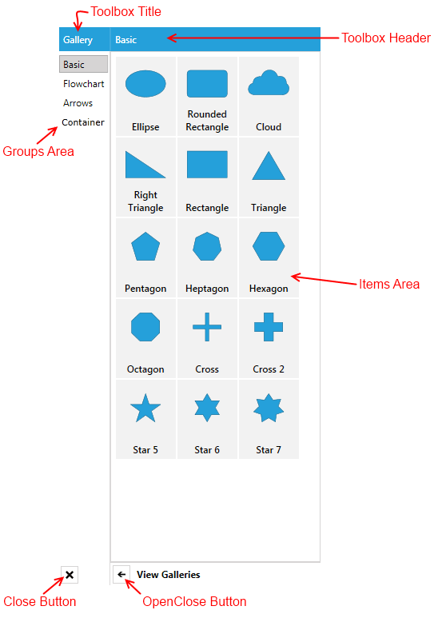
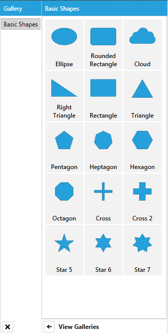
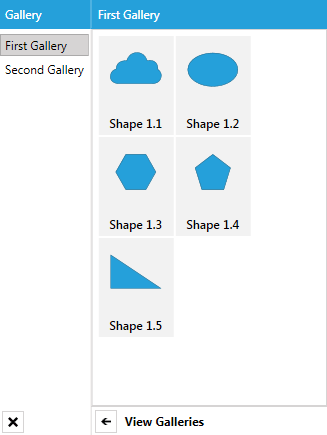

# DiagramToolbox

This article describes the main features and properties of the `RadDiagramToolbox` control. You can examine the behavior of the control in the [Diagrams DesignToolbox demo](https://demos.telerik.com/wpf/#Diagrams/DesignToolbox).

In order to use the RadDiagramToolbox control in your projects you have to add references to the following assemblies:

* __Telerik.Windows.Controls__
* __Telerik.Windows.Controls.Diagrams__
* __Telerik.Windows.Controls.Diagrams.Extensions__
* __Telerik.Windows.Controls.Input__
* __Telerik.Windows.Controls.Navigation__
* __Telerik.Windows.Data__
* __Telerik.Windows.Diagrams.Core__

>important Please note that the examples in this tutorial are showcasing Telerik Windows8 theme. In the [Setting a Theme]() article you can find more information on how to set an application-wide theme.                

## Visual Structure And Properties

The __Diagram Extensions__ include a RadDiagramToolbox control. It is designed to display multiple galleries of `RadDiagramShape` elements in a single control. Below you can see a snapshot and explanation of the main visual elements of the control.

__RadDiagramToolbox Overview__

The RadDiagramToolbox exposes the following list of properties:                

* `Header`&mdash;gets or sets an `object` that represents the RadDiagramToolbox header.                        
* `HeaderTemplate`&mdash;gets or sets the `DataTemplate` used to display the header.                        
* `Title`&mdash;gets or sets an `object` that represents the RadDiagramToolbox title.                        
* `TitleTemplate`&mdash;gets or sets the `DataTemplate` used to display the title of the toolbox.                        
* `IsOpen`&mdash;gets or sets a value that indicates whether the groups area of the RadDiagramToolbox control is visible.                        
* `CloseButtonStyle`&mdash;gets or sets the style used by the __Close__ button when it is rendered.                        
* `OpenCloseButtonStyle`&mdash;gets or sets the style used by the __OpenClose__ button when it is rendered.                        
* `Items`&mdash;gets or sets the collection used to generate the content of the RadDiagramToolbox.                        
* `ItemsSource`&mdash;gets or sets a business collection used to generate the content of the RadDiagramToolbox.                        

## How to Use the Predefined HierarchicalGalleryItemsCollection

The __Diagram Extensions__ provide a `HierarchicalGalleryItemsCollection` which is an `ObservableCollection` of galleries with predefined `RadDiagramShape` elements. You can use it to populate the `RadDiagramToolbox.ItemsSource` collection with business items.                

You can use it directly in XAML:

<snippet id='raddiagram-extensions-toolbox-raddiagramtoolbox_overview-xaml' />

or define a property of type `HierarchicalGalleryItemsCollection` in your ViewModel:                

<snippet id='raddiagram-extensions-toolbox-raddiagramtoolbox_overview-cs' />

<snippet id='raddiagram-extensions-toolbox-raddiagramtoolbox_overview-vb' />

<snippet id='raddiagram-extensions-toolbox-raddiagramtoolbox_overview-xaml' />

## Configure a RadDiagramToolbox to Display Part of the HierarchicalGalleryItemsCollection

The `HierarchicalGalleryItemsCollection` is populated based on the items in the __Telerik.Windows.Controls.Diagrams.Extensions.GalleryItemsCollection__ grouped by the name of each gallery. This is why you can easily recreate it in your ViewModel:

<snippet id='raddiagram-extensions-toolbox-raddiagramtoolbox_overview-cs' />

<snippet id='raddiagram-extensions-toolbox-raddiagramtoolbox_overview-vb' />

Next, you can customize your `GalleryItems` collection to display only the Basic Shapes gallery like so:

<snippet id='raddiagram-extensions-toolbox-raddiagramtoolbox_overview-cs' />

<snippet id='raddiagram-extensions-toolbox-raddiagramtoolbox_overview-vb' />

__RadDiagramToolbox with Basic Shapes Gallery__

## How to Populate RadDiagramToolbox with Custom Data Items

In case you need to populate a RadDiagramToolbox instance with a custom collection of business items, you will have to create a hierarchical collection of items. The first-level items of the collection should represent the galleries, whilst the second-level items should describe the shapes within the RadDiagramToolbox.

For the purpose of this tutorial we will create a class describing our shapes and a custom gallery class that defines a collection of shapes:

<snippet id='raddiagram-extensions-toolbox-raddiagramtoolbox_with_basic_shapes_gallery-cs' />

<snippet id='raddiagram-extensions-toolbox-raddiagramtoolbox_with_basic_shapes_gallery-vb' />

Once the ViewModels are all in place, you can use the *MainViewModel* as the `DataContext` of the RadDiagramToolbox and bind its `ItemsSource` to the `Items` collection. You will also need to define `DataTemplates` to visualize the `MyShape` and `MyGallery` items properly.

<snippet id='raddiagram-extensions-toolbox-raddiagramtoolbox_with_basic_shapes_gallery-xaml' />

__RadDiagramToolbox with custom gallery__

## DragDrop Support

RadDiagramToolbox supports drag/drop operations out-of-the-box. As soon as a `RadDiagramToolboxItem` is initialized, it is made draggable through the `DragDropManager`'s `AllowDrag` and `AllowCapturedDrag` properties which are both set to `true`. Moreover, the Diagramming Framework internally handles the DragDropManager's `DragInitialize` event to take from the dragged `RadDiagramToolboxItem` the shape it represents, if such exists, and serialize its settings. The serialized settings are then saved in a `DiagramDropInfo` object along with the actual size of the dragged shape.

>important The `DiagramDropInfo` structure describes a dragged object within a `RadDiagram` instance. It includes a `SerializationInfo` property and a `Size` property – the first one holds the serialized settings of the dragged `RadDiagramItem`, while the second holds the actual size of the dragged item.                    

Due to this built-in `DragDropManager` drag implementation, you can easily drag shapes and containers out of a RadDiagramToolbox and drop them onto a diagramming surface. `RadDiagram` knows how to extract the serialized information out of a `DiagramDropInfo` object to create a new `RadDiagramItem` on the surface. However, if you create a custom RadDiagramToolbox populated with a business collection of items, you will have to further configure the drag/drop operation. Please have a look at the [How To Drag Items from a Custom Databound DiagramToolbox]() tutorial for instructions on how to implement such a scenario.            

## See Also
 * [Drag Items from a Custom Databound DiagramToolbox]()
 * [Thumbnail]()
 * [DiagramNavigationPane]()
 * [Ruler]()
 * [SettingsPane]()