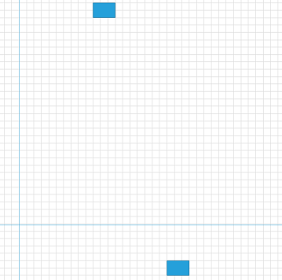
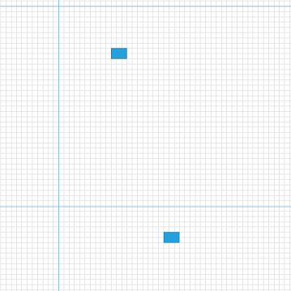

# Bring Into View and Auto Fit Support

The RadDiagram component allows you to bring a specific item(s) or position in its view port through couple of methods – __BringIntoView()__ and __AutoFit()__.

## BringIntoView

The __BringIntoView__ method can be used to bring a section of the diagram’s surface in the view port. The method has few overloads which bring different components into view. 

* The method can bring a specific Rect into the view. In other words the diagram can fit the view port into coordinates and the size of the Rect element.
* The method can bring a specific IDiagramItem (RadDiagramShape, RadDiagramConnection, etc.) and then center it into the view port.
* The method can bring a particular position into the top left coordinates of the view port

## AutoFit

The AutoFit method adjusts the view port so that all items which are plotted on the diagram are visible. The method expose an additional overload which takes a Thickness objects as an argument that represents the margin used as a white space border around the diagram items.

>tip RadDiagram also provides AutoFitAsync() method which executes the same action as the AutoFit() but asynchronically.

## How to use the BringIntoView and FitAuto methods

This section demonstrates the use of the BringIntoView and AutoFit methods. For the sake of the examples the following RadDiagram XAML declaration will be used:

#### __XAML__
	<telerik:RadDiagram x:Name="diagram" Width="600" Height="600">
		<telerik:RadDiagramShape x:Name="diagramShape" Position="200 160" />
		<telerik:RadDiagramShape Position="400 860" />
	</telerik:RadDiagram>

Here is the visual result rendered by the RadDiagram’s definition above:

* __BringIntoView__ - The method exposes several overloads:
	* __BringIntoView(Rect newViewPort, [bool useAnimation = true])__ – this overload accepts a Rect object that defines the new view port of the diagram and fits it inside the Rect. The second argument is optional and it determines if the bring into view should be performed with an animation. 
	
		#### __C#__
			this.diagram.BringIntoView(new Rect(220, 180, 300, 100));

		

	* __BringIntoView(object item, [double zoomLevel = 1], [bool useAnimation =  true])__ – this overload accepts an object that contains the shape which should be brought into the view. The last two arguments define the zoom level which should be applied and if an animation should be performed. The shape will be positioned at the center of the view port.
	
		#### __C#__
			this.diagram.BringIntoView(this.diagramShape);

		
	
	* __BringIntoView(Point position, [double zoomLevel = 1], [bool useAnimation =  true])__ – this overload gets a Point object which determines the top left position of the view port. The last two arguments define the zoom level which should be applied and if an animation should be performed.
		
		#### __C#__
			this.diagram.BringIntoView(new Point(200, 160));
		
		

* __AutoFit__ - the method provides two overloads: 
	
	* __AutoFit()__ – this overload will fit the items without using any margin as a white space border.
		#### __C#__
			this.diagram.AutoFit();
		
		
		
	* __AutoFit(Thickness margin, [bool useAnimation = true])__  - this overload accepts a Thickness object as an argument that determines the margin used as a white space border around the diagram items. 
		
		#### __C#__
				this.diagram.AutoFit(new Thickness(100));
		
		

# See Also
 * [Populating with Data]()
 * [Shapes]()
 * [Populating with Data]()