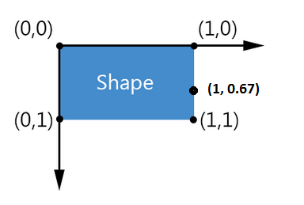
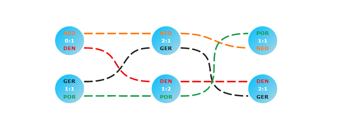

# Custom Connectors

Custom Connectors increase your experience when using __Diagrams__ by enabling you to define custom connector points around the shapes.	

## Defining Custom Connectors

By default a shape has five connectors:		

* Four (Left, Right, Top, Bottom) connectors located in the middle of the four sides of the shape's bounding rectangle.

* A central connector (aka auto-connector) which acts as an auto-switch. If you connect to this one the framework will choose automatically between the standard four connectors with logic based on shortest paths between shapes.			  

Besides these connectors you can define custom connectors or remove the existing connectors.

>The internal logic of the auto-connector depends on the four additional connectors, if you remove one or more of these connectors it will lead to issues if attaching to the auto-connector. Best practice is to either leave the five connectors (besides your own custom connectors) or remove all of them at the same time.			

Adding a custom connector can be done by simply adding a RadDiagramConnector to the Connectors collection of the shape:

__Example 1: Adding a custom Connector__
```C#
    var shape = new RadDiagramShape();
    var connector = new RadDiagramConnector(){Offset = new Point(1, 0.67), Name = "CustomConnector1"};
    shape.Connectors.Add(connector);
```
```VB.NET
	Dim shape = New RadDiagramShape()
	Dim connector = New RadDiagramConnector() With { 
		 .Offset = New Point(1, 0.67), 
		 .Name = "CustomConnector1" 
	}
	shape.Connectors.Add(connector)
```

>Please note that __setting the name of the connector is almost mandatory__ if you are going to use it later in your application.



The Offset property  defines the location of the custom connector with respect to the shape's bounds. For example, an Offset of:		

* (0,0) corresponds to the upper-left corner of the shape.

* (.5,.5) corresponds to the center of the shape.

* (1,1) corresponds to the bottom-right of the shape.

You can go outside the [0,1] range but the following should be considered:		

* The bounds of the shape do not take the connectors into account. If you put a connector at an Offset of (23,55) for instance the shape's width will not be scaled to 23 times the actual shape's width. This also means that when using a graph layout the layout will organize shapes with respect to the actual or visual bounds.			  

* The visual interpretation of a connector put at a large Offset might lead to confusion since it potentially can be interpreted as the connector of another shape. In addition, if a connection is bound to a connector far off its parent shape it might be interpreted as a floating connection.			  

So, in practice you can go outside the actual bounds of the  shape but some moderation is advised.	

## Using Custom Connectors

Now let's define some shapes and custom connectors and use them. First, we will create 6 shapes with the following template:		

__Example 2: Creating shapes__
```XAML
	<telerik:RadDiagramShape x:Name="match1shape" 
							 Geometry="{telerik:CommonShape ShapeType=EllipseShape}"
							 Position="100 100">					
		<StackPanel>
			<TextBlock Text="NED" Foreground="#FFFF7402" FontWeight="Bold"/>
			<TextBlock Text="0:1" HorizontalAlignment="Center" FontWeight="Bold"/>
			<TextBlock Text="DEN" Foreground="#FFF20808" FontWeight="Bold"/>
		</StackPanel>					
	</telerik:RadDiagramShape>
	...
```

We will define 4 custom connectors for each shape in the diagram. __Naming them is mandatory__:
		
__Example 3: Creating custom connectors__
```C#
	this.diagram.Shapes.ToList().ForEach(x =>
	{
		var connectorUpRight = new RadDiagramConnector() { Offset = new Point(1, 0.25), Name = x.Name + "Connector1" };
		var connectorDownRight = new RadDiagramConnector() { Offset = new Point(1, 0.75), Name = x.Name + "Connector2" };
		var connectorLeftUp = new RadDiagramConnector() { Offset = new Point(0, 0.25), Name = x.Name + "Connector3" };
		var connectorLeftDown = new RadDiagramConnector() { Offset = new Point(0, 0.75), Name = x.Name + "Connector4" };
	
		x.Connectors.Add(connectorUpRight);
		x.Connectors.Add(connectorDownRight);
		x.Connectors.Add(connectorLeftUp);
		x.Connectors.Add(connectorLeftDown);
	});
```
```VB.NET
	Me.diagram.Shapes.ToList().ForEach(Function(x) 
		Dim connectorUpRight = New RadDiagramConnector() With {
			 .Offset = New Point(1, 0.25),  .Name = x.Name.ToString() & "Connector1"
		}
		Dim connectorDownRight = New RadDiagramConnector() With {
			 .Offset = New Point(1, 0.75), 	 .Name = x.Name.ToString() & "Connector2" 
		}
		Dim connectorLeftUp = New RadDiagramConnector() With { 
			 .Offset = New Point(0, 0.25),  .Name = x.Name.ToString() & "Connector3" 
		}
		Dim connectorLeftDown = New RadDiagramConnector() With { 
			 .Offset = New Point(0, 0.75),  .Name = x.Name.ToString() & "Connector4" 
		}
	
		x.Connectors.Add(connectorUpRight)
		x.Connectors.Add(connectorDownRight)
		x.Connectors.Add(connectorLeftUp)
		x.Connectors.Add(connectorLeftDown)
	
	End Function)
```

Next step is to add some connections between the custom connectors. The first four connections below are created with the RadDiagram.AddConnection() method with the overload that takes 2 shapes and 2 custom connectors given by their names.

The next four connections are attached with the RadDiagramConnection.Attach() method which takes two connectors.
		
__Example 4: Attaching connections__
```C#
		var connection = this.diagram.AddConnection(this.diagram.Shapes[0], this.diagram.Shapes[1], "match1shapeConnector1", "match2shapeConnector3");
		(connection as RadDiagramConnection).Stroke = new SolidColorBrush() { Color = Color.FromArgb(255, 255, 116, 2) };
	
		var connection2 = this.diagram.AddConnection(this.diagram.Shapes[1], this.diagram.Shapes[2], "match2shapeConnector1", "match3shapeConnector4");
		(connection2 as RadDiagramConnection).Stroke = new SolidColorBrush() { Color = Color.FromArgb(255, 255, 116, 2) };
	
	
		var connection3 = this.diagram.AddConnection(this.diagram.Shapes[0], this.diagram.Shapes[4], "match1shapeConnector2", "match5shapeConnector3");
		(connection3 as RadDiagramConnection).Stroke = new SolidColorBrush() { Color = Color.FromArgb(255, 242, 8, 8) };
	
		var connection4 = this.diagram.AddConnection(this.diagram.Shapes[4], this.diagram.Shapes[5], "match5shapeConnector1", "match6shapeConnector3");
		(connection4 as RadDiagramConnection).Stroke = new SolidColorBrush() { Color = Color.FromArgb(255, 242, 8, 8) };
	
		var connection5 = new RadDiagramConnection(){Stroke = new SolidColorBrush(){Color = Color.FromArgb(255, 30, 30, 27)}};
		connection5.Attach(this.diagram.Shapes[3].Connectors[5], this.diagram.Shapes[1].Connectors[8]);
		this.diagram.Items.Add(connection5);
	
		var connection6 = new RadDiagramConnection() { Stroke = new SolidColorBrush() { Color = Color.FromArgb(255, 30, 30, 27) } };
		connection6.Attach(this.diagram.Shapes[1].Connectors[6], this.diagram.Shapes[5].Connectors[8]);
		this.diagram.Items.Add(connection6);
	
		var connection7 = new RadDiagramConnection() { Stroke = new SolidColorBrush() { Color = Color.FromArgb(255, 23, 156, 72) } };
		connection7.Attach(this.diagram.Shapes[3].Connectors[6], this.diagram.Shapes[4].Connectors[8]);
		this.diagram.Items.Add(connection7);
	
		var connection8 = new RadDiagramConnection() { Stroke = new SolidColorBrush() { Color = Color.FromArgb(255, 23, 156, 72) } };
		connection8.Attach(this.diagram.Shapes[4].Connectors[6], this.diagram.Shapes[2].Connectors[7]);
		this.diagram.Items.Add(connection8);
```
```VB.NET
	Dim connection = Me.diagram.AddConnection(Me.diagram.Shapes(0), Me.diagram.Shapes(1), "match1shapeConnector1", "match2shapeConnector3")
	TryCast(connection, RadDiagramConnection).Stroke = New SolidColorBrush() With { .Color = Color.FromArgb(255, 255, 116, 2) }
	
	Dim connection2 = Me.diagram.AddConnection(Me.diagram.Shapes(1), Me.diagram.Shapes(2), "match2shapeConnector1", "match3shapeConnector4")
	TryCast(connection2, RadDiagramConnection).Stroke = New SolidColorBrush() With { .Color = Color.FromArgb(255, 255, 116, 2) }
	
	
	Dim connection3 = Me.diagram.AddConnection(Me.diagram.Shapes(0), Me.diagram.Shapes(4), "match1shapeConnector2", "match5shapeConnector3")
	TryCast(connection3, RadDiagramConnection).Stroke = New SolidColorBrush() With { .Color = Color.FromArgb(255, 242, 8, 8) }
	
	Dim connection4 = Me.diagram.AddConnection(Me.diagram.Shapes(4), Me.diagram.Shapes(5), "match5shapeConnector1", "match6shapeConnector3")
	TryCast(connection4, RadDiagramConnection).Stroke = New SolidColorBrush() With { .Color = Color.FromArgb(255, 242, 8, 8) }
	
	Dim connection5 = New RadDiagramConnection() With { .Stroke = New SolidColorBrush() With { .Color = Color.FromArgb(255, 30, 30, 27) } }
	connection5.Attach(Me.diagram.Shapes(3).Connectors(5), Me.diagram.Shapes(1).Connectors(8))
	Me.diagram.Items.Add(connection5)
	
	Dim connection6 = New RadDiagramConnection() With { .Stroke = New SolidColorBrush() With { .Color = Color.FromArgb(255, 30, 30, 27) } }
	connection6.Attach(Me.diagram.Shapes(1).Connectors(6), Me.diagram.Shapes(5).Connectors(8))
	Me.diagram.Items.Add(connection6)
	
	Dim connection7 = New RadDiagramConnection() With { .Stroke = New SolidColorBrush() With { .Color = Color.FromArgb(255, 23, 156, 72) } }
	connection7.Attach(Me.diagram.Shapes(3).Connectors(6), Me.diagram.Shapes(4).Connectors(8))
	Me.diagram.Items.Add(connection7)
	
	Dim connection8 = New RadDiagramConnection() With { .Stroke = New SolidColorBrush() With { .Color = Color.FromArgb(255, 23, 156, 72) } }
	connection8.Attach(Me.diagram.Shapes(4).Connectors(6), Me.diagram.Shapes(2).Connectors(7))
	Me.diagram.Items.Add(connection8)
```

Below you can see a possible result of the code so far (some additional styling is applied):



>tip Find a runnable project of the previous example in the [WPF Samples GitHub repository](https://github.com/telerik/xaml-sdk/tree/master/Diagram/CustomConnectors).

## Connectors Visibility 

Note that the Connectors are made visible on selection or when [ConnectorTool]() is active. When you are defining a custom shape you can control the visibility of the Connectors by disabling the ConnectorsAdornerVisible VisualState.

> You can find the ConnectorsAdornerVisible VisualState in the ControlTemplate of the RadDigramShape.

__Example 5: Making a custom shape's connectors always visible__
```C#
    public class CustomShape : RadDiagramShape
   	{
       static CustomShape()
       {
           DefaultStyleKeyProperty.OverrideMetadata(typeof(CustomShape), new FrameworkPropertyMetadata(typeof(CustomShape)));
       }
 
       protected override void UpdateVisualStates()
       {
           base.UpdateVisualStates();
           VisualStateManager.GoToState(this, "ConnectorsAdornerVisible", false);
       }
   	}
```
```VB.NET
	Public Class CustomShape
		Inherits RadDiagramShape
		Shared Sub New()
			DefaultStyleKeyProperty.OverrideMetadata(GetType(CustomShape), New FrameworkPropertyMetadata(GetType(CustomShape)))
		End Sub

		Protected Overrides Sub UpdateVisualStates()
			MyBase.UpdateVisualStates()
			VisualStateManager.GoToState(Me, "ConnectorsAdornerVisible", False)
		End Sub
	End Class
```              

## See Also
 * [Populating with Data]()
 * [Shapes]()
 * [Populating with Data]()