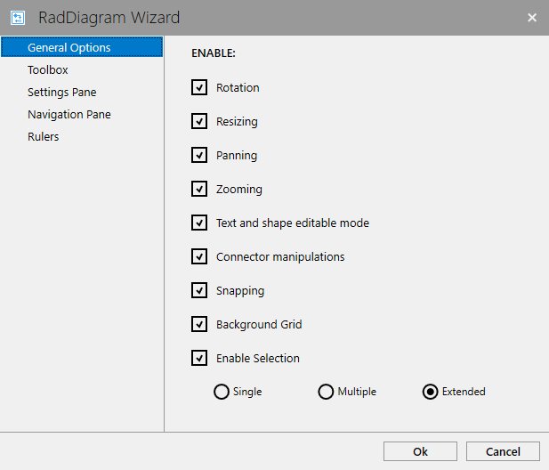
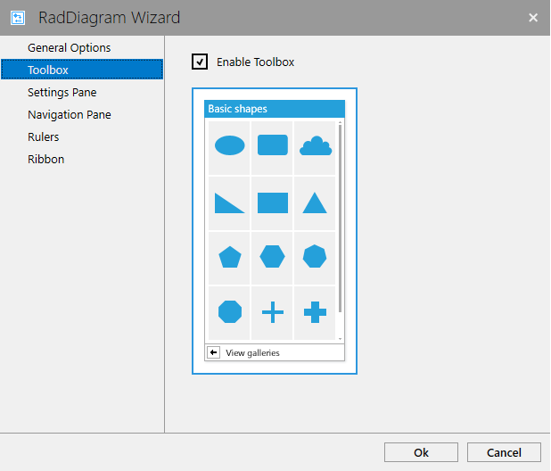
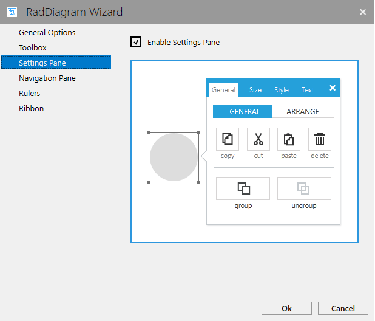
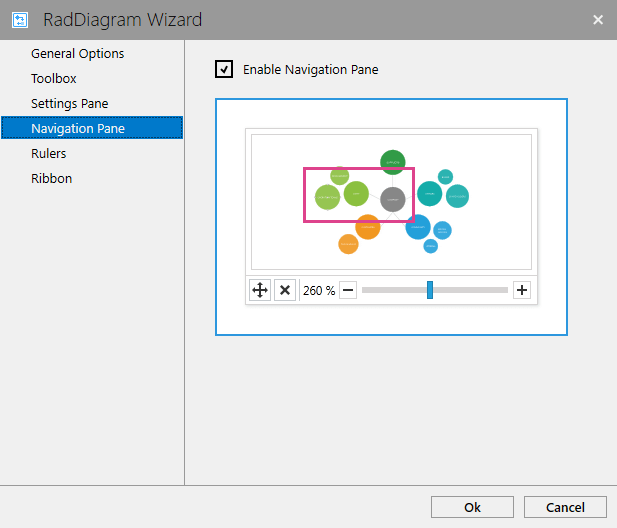
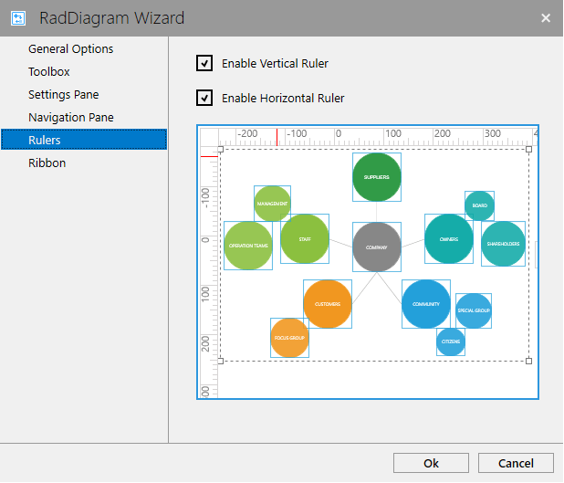
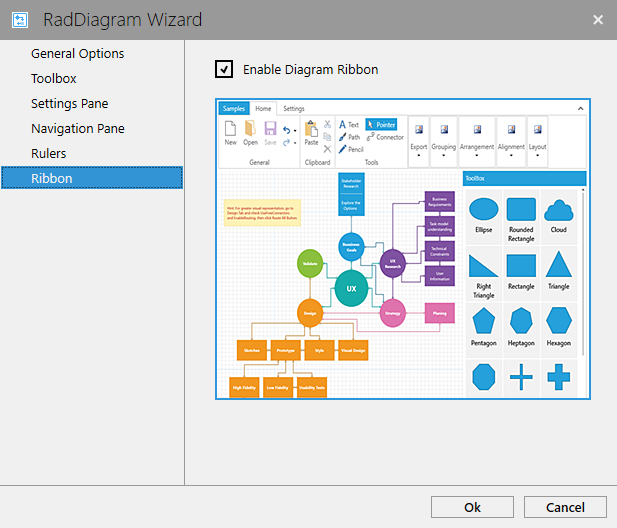

# Design-time Support

The __RadDiagram__ provides the developer with the possibility to enable or disable many of its features when it is added through the Visual Studio [ToolBox](https://docs.microsoft.com/en-us/visualstudio/ide/reference/toolbox?view=vs-2017). This article will show which features of the control can be configured through the design-time wizard.

## RadDiagram Design-time Wizard

When dragging and dropping the __RadDiagram__ from the Visual Studio ToolBox, you will be presented with a wizard which allows you to configure the control before adding it in xaml.

#### __Figure 1: RadDiagram Design-time wizard__


## Design-time Wizard Options

The design-time wizard lets you configure the following options: 

* __General options__ (refer to __Figure 1__). They allow you to enable/disable the following features of the RadDiagram:
    * [Rotation]() 
    * [Resizing]()
    * [Pan and Zoom]()
    * [Items Editing]()
    * [Snapping](#snap-to-grid)
    * [Background surface](#controlling-the-diagramming-surface-appearance)
    * [Selection mode](#selection-modes)

* Enabling the [RadDiagram Toolbox]() as demonstrated in __Figure 2__.

    #### __Figure 2: Enabling the RadDiagram Toolbox__
    

* Enabling the [SettingsPane]() as demonstrated in __Figure 3__.

    #### __Figure 3: Enabling the RadDiagram SettingsPane__
    

* Enabling the [DiagramNavigationPane]() as demonstrated in __Figure 4__.

    #### __Figure 4: Enabling the DiagramNavigationPane__
    

* Enabling the [RadDiagram rulers]() as demonstrated in __Figure 5__.

    #### __Figure 5: Enabling the RadDiagram rulers__
    


* Enabling the [RadDiagramRibbon]() as demonstrated in __Figure 6__.

    #### __Figure 6: Enabling the RadDiagramRibbon__
    



## See Also
* [Getting Started]()
* [FAQ]()
* [DataBinding]()
