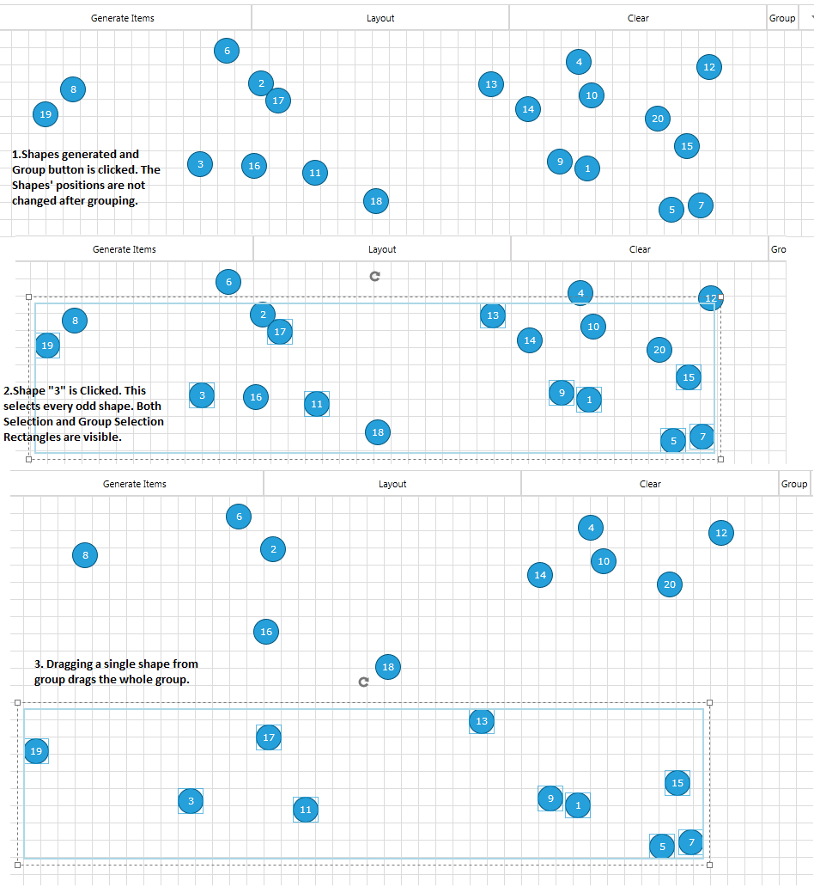
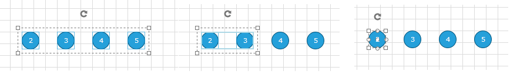
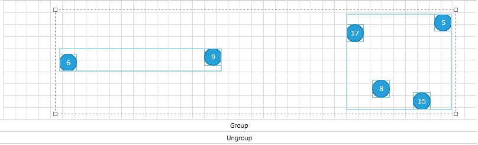

# Grouping

__Grouping__ in the __RadDiagram__ is a way of organizing shapes and connections in logical groups. Groups are non-visual, logical collections of shapes and/or connections and/or other groups which can be created in code behind or with Commands.

>Please note that the examples in this tutorial are showcasing Telerik Windows8 theme. In the [Setting a Theme](http://www.telerik.com/help/silverlight/common-styling-apperance-setting-theme.html#Setting_Application-Wide_Built-In_Theme_in_the_Code-Behind)[Setting a Theme](http://www.telerik.com/help/wpf/common-styling-apperance-setting-theme-wpf.html#Setting_Application-Wide_Built-In_Theme_in_the_Code-Behind) article you can find more information on how to set an application-wide theme.

## Grouping API

__IGroup__, __IShape__ and __IConnection__ implement the __IGroupable__ interface.

IGroup provides a collection of IGroupable Items. This practically means that you can have groups of shapes, connections and other groups. This allows you to have unlimited levels of nested logical groups.

The __IGroupable__ interface has two members:

* __ParentGroup__ - of type IGroup.			

* __ParentGroupChanged__ event- of type EventHandler<PropertyEventArgs<IGroup>>.			

The __IGroup__ has the following members		

* __IsSelected__- of type boolean.			

* __Items__ - IList<IGroupable>.			

* __Name__ - string.			

* __ItemsChanged__ - of type NotifyCollectionChangedEventHandler.			

* __SelectionChanged__ - of type EventHandler.			

The __RadDiagram__ provides the following "grouping" members:		

* __Group__([string groupName], params IGroupable[] items)) - creates an IGroup from a given Array of IGroupable items.			

* __Ungroup__(params IGroup[] items)- removes the logical groups previously created.			

* __Groups__ - IEnumerable<IGroup>. The list of root-level Groups created in the RadDiagram.			

* __GroupsChanged__ - of type EventHandler. Fires when grouping or ungrouping is performed. Does not fire when an Item's ParentGroup is changed.			

* __GroupStyle__ - Style that applies to the Selection Rectangle around the logical groups.			

The __DiagramCommands__ class has __Group__ and __Ungroup__ which are both __RoutedUICommands__. The Group Command groups the selected IGroupable-s and the Ungroup command ungroups the selected IGroups.		

## Grouping In Code Behind

In the next example we will create 20 shapes with contents - "1", "2",... "20" and we will group them by their parity.

Let's first create some random shapes:

<snippet id='raddiagram-features-grouping-block_1-cs' />

<snippet id='raddiagram-features-grouping-block_1-vb' />

Now let's implement some grouping logic on Button's Click:

<snippet id='raddiagram-features-grouping-block_2-cs' />

<snippet id='raddiagram-features-grouping-block_2-vb' />

Below you can see how the grouping works:

Now let's play with grouping and upgrouping. Below are some code examples and the result of the code execution:

<snippet id='raddiagram-features-grouping-block_3-cs' />

<snippet id='raddiagram-features-grouping-block_3-vb' />

This makes group "123" with items __{Shapes[1],Shapes[2]}__ and "345" with items __{Shapes[3], Shapes[4], Shapes[5]}__.		

The creation of the second group excludes Shapes[3] from group "123".

Alternatively if we use one name in the method:

<snippet id='raddiagram-features-grouping-block_4-cs' />

<snippet id='raddiagram-features-grouping-block_4-vb' />

This produces a __single group "123"__ with the 5 elements Shapes[1]-Shapes[5].		

__How To Create SubGroups__

__Subgrouping__ must be done from subgroups to parentgroups. __In other words, creating a parent group, then creating its subgroup is not possible__.		

Below is an example of creating a subgroups and a parent group.

<snippet id='raddiagram-features-grouping-how_to_create_subgroups-cs' />

<snippet id='raddiagram-features-grouping-how_to_create_subgroups-vb' />

In the picture below you can see a how consecutive clicks on a shape reflects the selection of groups.

First click selects the outermost (the biggest group), second click selects the smaller group and the third selects only the shape.The forth click will select the biggest group and so on.

> __If you need to select particular items without selecting the whole group, you can use Rectangular Selection.__

What will happen if we try to create parent group then create subgroups?

<snippet id='raddiagram-features-grouping-how_to_create_subgroups-cs' />

<snippet id='raddiagram-features-grouping-how_to_create_subgroups-vb' />

This will create two separate groups - "1-2-3-4" with items {Shapes[3], Shapes[4]} and "1-2" with items {Shapes[1], Shapes[2]}.

> __Creating a parent group then creating its subgroup is not possible.__

__Ungrouping__

You can Ungroup one or several groups with the __Ungroup__ method of RadDiagram:		

<snippet id='raddiagram-features-grouping-ungrouping-cs' />

<snippet id='raddiagram-features-grouping-ungrouping-vb' />

## Grouping With Commands

Using the DiagramCommands Group and Ungroup is straightforward. Group applies to the selected IGroupables and Ungroup applies to the selected IGroups.

<snippet id='raddiagram-features-grouping-ungrouping-xaml' />

## See Also
 * [Commands]()