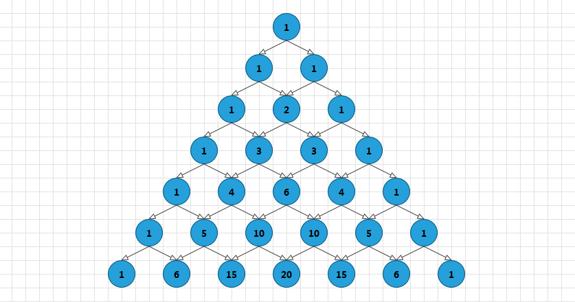
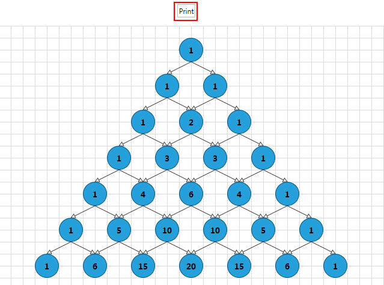
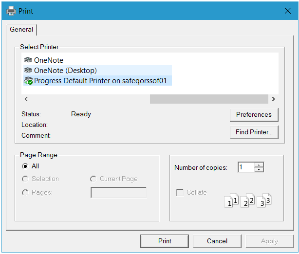
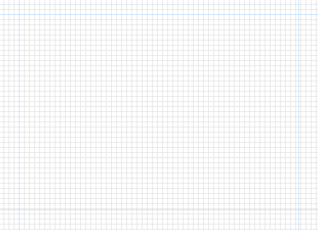
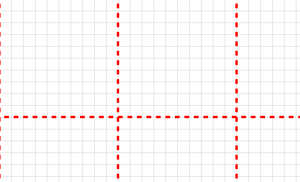
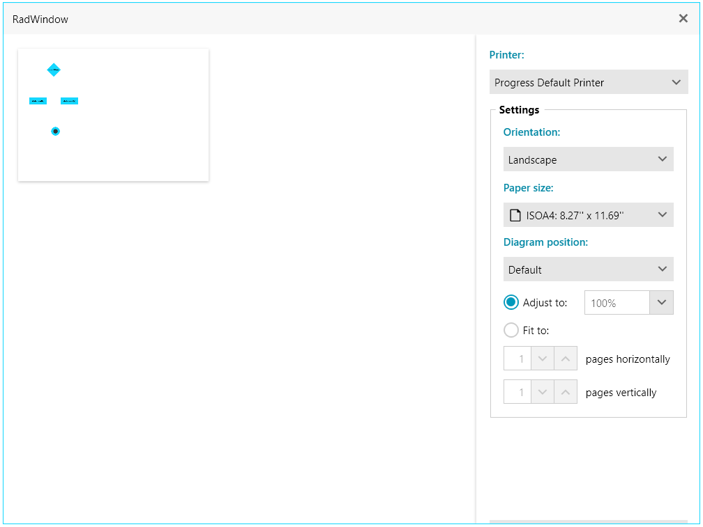
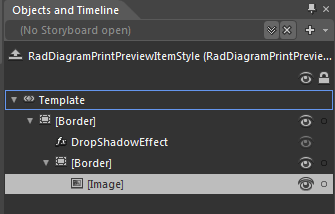

# Printing

This tutorial describes the Diagramming framework printing functionality.

The `RadDiagram` exposes a method and command that allow you to print its content.	  

## RadDiagram Print Support

###  RadDiagram.Print() method		  

The `RadDiagram.Print()` method allows you to print the content of the Diagramming canvas. The `Print()` method has one optional argument of type `RadDiagramPrintSettings`, which exposes the following members:			

* `Title`&mdash;this property is of type `string` and it determines the name of the printing job in the print queue of a printer				

* `PageMargin`&mdash;this property is of type `Thickness` and it provides control over the size of the document's page margins when printed.
	
	>You can take advantage of the `RadDiagramPrintPreview` to see the RadDiagram print document's page margins before printing.
	

* `DiagramPosition`&mdash;this property allows to customize the position of the RadDiagram over the print pages. The property is of type `DiagramPrintPosition`, which is enumeration with the following values:
	* `Default`
	* `TopLeft`
	* `BottomLeft`
	* `Center`
	* `TopRight`
	* `BottomRight`

* `ScaleFactor`&mdash;this property gets the value that indicates the scale that is applied to the printed RadDiagram element.

* `PageHorizontalCount`&mdash;this property gets the value that indicates the columns' count of the printed pages.

* `PageVerticalCount`&mdash;this property gets the value that indicates the rows' count of the printed pages.

#### __C#__
```C#
    xDiagram.Print(new RadDiagramPrintSettings("My Diagramming Solution",new Thickness(22,15,22,15)));		  
```
	
#### __VB.NET__
```VB.NET
    xDiagram.Print(New RadDiagramPrintSettings("My Diagramming Solution", New Thickness(22, 15, 22, 15)))		  
```

If you don't define any `RadDiagramPrintSettings` when invoking the `Print()` method, by default the Diagramming framework will name your printing job __"RadDiagram Print Document"__ and it will set the `PageMargin` to `15`.	

The `RadDiagramPrintSettings`'s constructor have an optional parameter that defines the resolution (`DPI`) used during printing. The default DPI is 96. If you need better quality of the print result you can pass bigger value in the settings' constructor.

#### __C#__
```C#
	xDiagram.Print(new RadDiagramPrintSettings("My Diagramming Solution",new Thickness(22,15,22,15), 300));
```

#### __VB.NET__
```VB.NET
	xDiagram.Print(New RadDiagramPrintSettings("My Diagramming Solution", New Thickness(22, 15, 22, 15), 300))
```

### Print() Method Example

For the purpose of this tutorial we will try to print the sample Diagramming solution demonstrated in the [DataBinding]() section of this documentation:



>Please note that the examples in this tutorial are showcasing Telerik Windows8 theme. In the [Setting a Theme](http://www.telerik.com/help/silverlight/common-styling-apperance-setting-theme.html#Setting_Application-Wide_Built-In_Theme_in_the_Code-Behind)[Setting a Theme](http://www.telerik.com/help/wpf/common-styling-apperance-setting-theme-wpf.html#Setting_Application-Wide_Built-In_Theme_in_the_Code-Behind) article you can find more information on how to set an application-wide theme.			  

Now let's add a Print `RadButton` in our layout and handle its `Click` event to invoke the RadDiagram.Print() method:
			
#### __XAML__
```XAML
    <Grid x:Name="LayoutRoot">
        <Grid.Resources>
          ...
        </Grid.Resources>
        <Grid.RowDefinitions>
            <RowDefinition Height="50" />
            <RowDefinition Height="*" />
        </Grid.RowDefinitions>
        <telerik:RadButton Content="Print" Click="Print" HorizontalAlignment="Center" VerticalAlignment="Center"/>
        <telerik:RadDiagram x:Name="diagram" Grid.Row="1"
                            ConnectionStyle="{StaticResource pascalEdgeStyle}"
                            ShapeStyle="{StaticResource pascalNodeStyle}" />
    </Grid>
```

#### __C#__
```C#
    private void Print(object sender, RoutedEventArgs e)
    {
        this.diagram.Print();
    }
```

#### __VB.NET__
```VB.NET
    Private Sub Print(sender As Object, e As RoutedEventArgs)
        Me.diagram.Print()
    End Sub
```

Now if you run your solution and hit the __Print__ button:


A PrintDialog will be opened, allowing you to set up the printing operation:



### Print Command

Telerik Diagramming Framework provides a `Print` command as well. It is part of the `DiagramExtensionCommands` class implementation defined in the `Telerik.Windows.Controls.Diagrams.Extensions` namespace and  you can apply it on your buttons and use it to invoke the print dialog:			

#### __XAML__
```XAML
    <telerik:RadButton xmlns:extensions="clr-namespace:Telerik.Windows.Controls.Diagrams.Extensions;assembly=Telerik.Windows.Controls.Diagrams.Extensions"
					Content="Print" 
					Command="extensions:DiagramExtensionCommands.Print" 
					CommandTarget="{Binding ElementName=diagram}" 
					HorizontalAlignment="Center" 
					VerticalAlignment="Center"/>			  
```

>You need to keep in mind that the Print command can only be executed on a `RadDiagram`, populated with `DiagramItems`.			

## Pages Preview Canvas

The RadDiagram supports pages preview canvas. The pages background is enabled by default but you can control its visibility and appearance through the following set of attached properties:		

* `BackgroundPageGrid.IsGridVisible`&mdash;this is a `Boolean` property that controls the visibility of the page preview canvas. Its default value is `True`.			

* `BackgroundPageGrid.PageSize`&mdash;this property is of type `Size` and it determines the size that describes a single page in the `RadDiagram` surface. The default value of the property is a size of 1092x763 units - the size of an A4 page format.			

* `BackgroundPageGrid.LineStroke`&mdash;this property is of type `Brush` and it specifies how the pages outline is painted.			

* `BackgroundPageGrid.LineStrokeDashArray`&mdash;this property gets or sets a collection of `double` values that indicate the pattern of dashes and gaps that is used to outline the pages.			

* `BackgroundPageGrid.LineStrokeThickness`&mdash;this property is of type `double` and it gets or sets the thickness of the lines that visualize the pages.			

>tip The `BackgroundPageGrid` attached properties are defined in the `Telerik.Windows.Controls.Diagrams.Primitives` namespace. This is why in order to use them you need to add a using statement for that namespace in code-behind or define an alias in XAML: `xmlns:primitives="clr-namespace:Telerik.Windows.Controls.Diagrams.Primitives;assembly=Telerik.Windows.Controls.Diagrams"`

The default look and size of the page preview canvas is demonstrated in the next snapshot:		

The PagesPreview canvas in a zoomed RadDiagram


And in order to modify it, you can change some or all of the previously described properties: 

#### __XAML__
```XAML
    <telerik:RadDiagram primitives:BackgroundPageGrid.LineStroke="Red"
                        primitives:BackgroundPageGrid.LineStrokeDashArray="2 2"
                        primitives:BackgroundPageGrid.LineStrokeThickness="4"
                        primitives:BackgroundPageGrid.PageSize="200 200"/>		  
```

Customized PagesPreview canvas



>tip The `RadDiagram` exposes an `IsBackgroundSurfaceVisible` property that determines the visibility of the background surface and the pages preview canvas at the same time. It is important to have this in mind when considering whether to set the `IsBackgroundSurfaceVisible` to `False`.


## RadDiagramPrintPreview

With the official release of the `RadDiagrams`, Telerik an Extensions assembly to the diagrams assembly. The purpose of this assembly is to provide predefined Diagramming tools and controls to facilitate your efforts when creating Diagramming solution. One of the controls provided by the `Telerik.Windows.Controls.Diagrams.Extensions` assembly is the `RadDiagramPrintPreview` control.

> You can find more information about the `Extensions` provided by `Telerik RadDiagrams` [here](). Also, please keep in mind that in order to take advantage of the controls provided in the assembly, you have to reference the following dlls in your project as well:
>	- Telerik.Windows.Controls.Navigation
>	- Telerik.Windows.Controls.Input

The `RadDiagramPrintPreview` is a stand-alone control which you can use to preview your `RadDiagram` print document before printing it. You can also use it to choose the printer and the settings of the pages. Usually the control is used in a `Window` dialog and this is why the next example illustrates how to wrap the control in a `RadWindow` dialog.

#### __XAML__
```XAML
	<Grid x:Name="LayoutRoot" 
		  xmlns:extensions="clr-namespace:Telerik.Windows.Controls.Diagrams.Extensions;assembly=Telerik.Windows.Controls.Diagrams.Extensions">
		<Grid.Resources>
		   ...
		</Grid.Resources>
		<Grid.RowDefinitions>
			<RowDefinition Height="50" />
			<RowDefinition Height="*" />
		</Grid.RowDefinitions>
		<StackPanel Orientation="Horizontal">
			<telerik:RadButton Content="PrintPreview" HorizontalAlignment="Center" VerticalAlignment="Center" Click="OpenPrintPreview"/>
			<telerik:RadButton Content="Print" Command="extensions:DiagramExtensionCommands.Print" CommandTarget="{Binding ElementName=diagram}" HorizontalAlignment="Center" VerticalAlignment="Center" />
		</StackPanel>

		<telerik:RadDiagram x:Name="diagram" Grid.Row="1"
							ConnectionStyle="{StaticResource pascalEdgeStyle}"
							ShapeStyle="{StaticResource pascalNodeStyle}" />
	</Grid>
```

#### __C#__
```C#
	private void OpenPrintPreview(object sender, RoutedEventArgs e)
	{
		var printPreviewWindow = new Telerik.Windows.Controls.RadWindow();
		var printPreview = new RadDiagramPrintPreview { Diagram = this.diagram};
		printPreviewWindow.Content = printPreview;
		printPreviewWindow.ResizeMode = ResizeMode.NoResize;
		printPreviewWindow.Width = 800;
		printPreviewWindow.Height = 600;
		printPreviewWindow.ShowDialog();
	}	
```
	
#### __VB.NET__
```VB.NET
	Private Sub OpenPrintPreview(sender As Object, e As RoutedEventArgs)
		Dim printPreviewWindow = New Telerik.Windows.Controls.RadWindow()
		Dim printPreview = New RadDiagramPrintPreview() With { .Diagram = Me.diagram }
		printPreviewWindow.Content = printPreview
		printPreviewWindow.ResizeMode = ResizeMode.NoResize
		printPreviewWindow.Width = 800
		printPreviewWindow.Height = 600
		printPreviewWindow.ShowDialog()
	End Sub
```
	
If you run this sample and hit the __PrintPreview__ button, the following PrintPreview dialog will open:


### RadDiagramPrintPreview Properties

The `RadDiagramPrintPreview` control exposes the following properties:
* `Diagram`&mdash;this property is of type `RadDiagram` and it determines the Diagramming object that should be printed

* `ItemStyle`&mdash;this property allows you to create a custom style for the `RadDiagramPrintPreviewItem` which basically represents a page of the diagram print document.	
	You can edit its default settings in Blend, if you select the RadDiagramPrintPreview object in the __Objects and Timeline__ pane and then choose from the Object menu *Edit AdditionalStyles->Edit ItemStyle->Eit a Copy.... * The default structure of the `RadDiagramPrintPreviewItem ControlTemplate` is as follows:  
	
	

* `PrintScaleFactor`&mdash;this property allows you to get or set the scale factor. The default value of this property is `1`.

### RadDiagramPrintPreview Methods and Events

The RadDiagramPrintPreview control exposes the following events:
* `PreviewPrint`&mdash;occurs when a print operation is about to begin

* `Printed`&mdash;occurs when the print operation is over

The control also exposes a `Print(string title)` method which has one required attribute - the name of the printing job.

