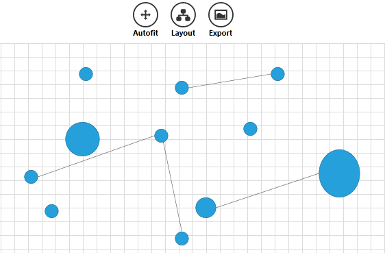

# Commands

`RadDiagram` provides a vast set of `RoutedUICommands` that help you work easily with the control and its items to build better MVVM applications.	  

* [RadDiagram Commands](#raddiagram-commands)
* [ExtensionsCommands](#extensionscommands)
* [Using Diagram Commands](#using-diagram-commands)
* [Overriding Commands](#overriding-commands)

## RadDiagram Commands

The static `DiagramCommands` class is located in __Telerik.Windows.Controls.Diagrams__ assembly and defines the following RoutedUICommands:		

* `Align`&mdash;Aligns the selected shapes.[(Read more)]()
* `Snap`&mdash;Snaps the selected shapes.[(Read more)]()
* `AutoFit`&mdash;Centers and zooms the diagram to display all items.			  
* `Layout`&mdash;Organizes the diagram automatically.[(Read more)]()
* `Copy`&mdash;Copies selected diagram items.[(Read More)]()
* `Paste`&mdash;Pastes selected diagram items.[(Read More)]()
* `Delete`&mdash;Deletes selected diagram items.[(Read More)]()
* `Cut`&mdash;Cut selected diagram items.[(Read More)]()
* `Duplicate`&mdash;Duplicates selected item/s.			  
* `Undo`&mdash;Undoes the last action.[(Read More)]()
* `Redo`&mdash;Redoes the last action.[(Read More)]()
* `BringToFront`&mdash;Brings to front selected diagram items.[(Read More)]()
* `BringForward`&mdash;Brings forward selected diagram items.[(Read More)]()
* `SendToBack`&mdash;Sends to back selected diagram items.[(Read More)]()
* `SendBackward`&mdash;Sends backward selected diagram items.[(Read More)]()
* `Save`&mdash;Saves the current diagram.[(Read More)]()
* `Clear`&mdash;Clears the diagram.[(Read More)]()
* `Open`&mdash;Opens a saved diagram.[(Read More)]()
* `BeginEdit`&mdash;Begins editing diagram item.[(Read More)]()
* `CommitEdit`&mdash;Commit the edited changes.[(Read More)]()
* `CancelEdit`&mdash;Cancel the edited changes.[(Read More)]()
* `SelectAll`&mdash;Selects all shapes in the diagram.[(Read More)]()
* `Nudge`&mdash;Moves selected item/s in a specific direction. You can pass more specifics about the nudge operation through the `CommandParameter`. 
	This parameter can be a single string representing the direction of the nudge:
	* __"Left"__
	* __"Right"__
	* __"Up"__
	* __"Down"__
	It can also be a string in the form of __"direction; amount"__, the __'direction'__ being a value from the above list of direction strings. The __'amount'__ options are:
	* __"Small"__&mdash;if RadDiagram's `IsSnapToGridEnabled` property is set to __true__ then this amount would mean that the nudge should happen once to the appointed direction using the __SnapX/Y__ value as a step. The snap settings can be applied in the  RadDiagram__ definition. If the RadDiagram IsSnapToGridEnabled property is __false__, a __"Small"__ amount indicates a step of __5__ pixels;				  

	* __"Large"__&mdash;if RadDiagram's `IsSnapToGridEnabled` property is set to __true__ then this amount would mean that the nudge should happen once to the appointed direction using __5*SnapX/Y__ value as a step. The snap settings can be applied in the  RadDiagram definition. If the RadDiagram IsSnapToGridEnabled property is false, a __"Large"__ amount indicates a step of __10__ pixels;			  

	* __any number__&mdash;if you provide a number in the `CommandParameter`, this number would indicate the number of pixels to be used as a step for the `Nudge` command. In order for the number to be taken into account, the `IsSnapToGridEnabled` property has to be set to __false__.				  
* `Group`&mdash; Groups the selected items.[(Read More)]()
* `Ungroup`&mdash;Ungroups the selected groups.[(Read More)]()
* `SwitchGridVisibility`&mdash;Hides or shows the background grid.			  
* `Load`&mdash;Loads a diagram.			  
* `Export`&mdash;Exports a diagram.[(Read More)]()

## ExtensionsCommands	  

In the __Telerik.Windows.Controls.Diagrams.Extensions__ namespace you can find another set of commands described in the `ExtensionsCommands` class. This class describes the `Print` command that allows you to print a diagramming structure. You can use this command in XAML to print the content of a RadDiagram instance as follows:		


```XAML
    <telerik:RadButton xmlns:extensions="clr-namespace:Telerik.Windows.Controls.Diagrams.Extensions;assembly=Telerik.Windows.Controls.Diagrams.Extensions"
					Content="Print" 
					Command="extensions:DiagramExtensionCommands.Print" 
					CommandTarget="{Binding ElementName=diagram}" 
					HorizontalAlignment="Center" 
					VerticalAlignment="Center"/>	
```

## Using Diagram Commands

A possible way to use `DiagramCommands` in __XAML__ is to bind the `Command` property of a `RadButton` to a DiagramCommand and set the RadDiagram as a `CommandTarget` of the button:		

Below is shown how you can use some of the Diagram Commands in an application Note that this syntax is common for every Diagram Command.


```XAML
    <StackPanel Orientation="Horizontal" HorizontalAlignment="Center" x:Name="buttonsStack">
            <telerik:RadGeometryButton Height="55" Width="55" Command="telerik:DiagramCommands.AutoFit"
                    ToolTipService.ToolTip="Autofit" CommandTarget="{Binding ElementName=diagram}" Content="Autofit"
                    Foreground="Black"
                    Background="White"
                    Geometry="M8,0 L11,3 L9,3 L9,7 L13,7 L13,5 L16,8.1666641 L13,11 L13,9 L9,9 L9,13 L11,13 L8,16 L5,13 L7,13 L7,9 L3,9 L3,11 L0,7.9999971 L3,5 L3,7 L7,7 L7,3 L5,3 z" />
            <telerik:RadGeometryButton Height="55" Width="55" Command="telerik:DiagramCommands.Layout"
                    ToolTipService.ToolTip="Layout" CommandTarget="{Binding ElementName=diagram}" Content="Layout"
                    HorizontalContentAlignment="Stretch" VerticalContentAlignment="Stretch" Foreground="Black"
                    Background="White"
                    Geometry="M8.9999962,0 L12.999996,0 C14.104566,3.8743019E-07 14.999996,0.89543086 14.999996,2 L14.999996,5 C14.999996,6.1045694 14.104566,7 12.999996,7 L12,7 L12,9 L19,9 L19,11 L19,12 L20,12 C21.10457,12 22,12.895431 22,14 L22,17 C22,18.10457 21.10457,19 20,19 L16,19 C14.895432,19 14,18.10457 14,17 L14,14 C14,12.895431 14.895432,12 16,12 L17,12 L17,11 L5,11 L5,12 L6,12 C7.1045694,12 8,12.895431 8,14 L8,17 C8,18.10457 7.1045694,19 6,19 L2,19 C0.89543056,19 0,18.10457 0,17 L0,14 C0,12.895431 0.89543056,12 2,12 L3,12 L3,11 L3,9 L10,9 L10,7 L8.9999962,7 C7.8954268,7 6.9999962,6.1045694 6.9999962,5 L6.9999962,2 C6.9999962,0.89543086 7.8954268,3.8743019E-07 8.9999962,0 z" />
            <telerik:RadGeometryButton Height="55" Width="55" ToolTipService.ToolTip="Export As Png" Foreground="Black" Background="White" Content="Export" Command="telerik:DiagramCommands.Export"
                    CommandParameter="Png" CommandTarget="{Binding ElementName=diagram}"					
                    Geometry="M6.7093377,5.0820007 C10.505837,5.0813236 12.205385,8.5835428 13.709369,8.4989958 C15.616847,8.3917685 16.999527,6.8087606 16.999527,6.8087606 L17.000025,13.080002 L3.0000243,13.080002 L3.0000243,7.9753876 C3.0000243,7.9753876 4.842936,5.0823336 6.7093377,5.0820007 z M1.9999999,2.0000048 L1.9999999,13.999995 L18,13.999995 L18,2.0000048 z M1.1920929E-06,0 L20,0 L20,16 L0,16 z" />
        </StackPanel>
```



__Commands Parameters__

You can customize the functionality of the Delete, Export and Align Commands currently.		

* `Align`&mdash;you can pass Top, Left, Right, Center, Middle, Bottom as CommandParameter.			  
* `Export`&mdash;you can pass Bmp or Png. The default export format is Png.			  
* `Delete`&mdash;you can pass the item you wish to delete.			  

## Overriding Commands

You can see how to replace the default behavior of a command in the [Override Diagram Command]() help article.

## See Also
 * [Getting Started]()
 * [Populating with Data]()
 * [Shapes]()
 * [Connections]()
 * [Keyboard Support]()
 * [Selection]()
 * [Pan and Zoom]()
 * [Removing Items]()
 * [Clipboard Operations]()
 * [Align and Snap ]()
 * [Diagram Events]()
 * [Items Events]()