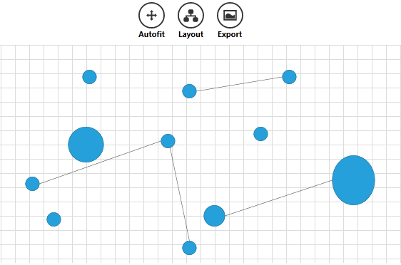

# Commands

`RadDiagram` provides a vast set of `RoutedUICommands` that help you work easily with the control and its items to build better MVVM applications.	  

* [RadDiagram Commands](#raddiagram-commands)
* [ExtensionsCommands](#extensionscommands)
* [Using Diagram Commands](#using-diagram-commands)
* [Overriding Commands](#overriding-commands)

## RadDiagram Commands

The static `DiagramCommands` class is located in __Telerik.Windows.Controls.Diagrams__ assembly and defines the following RoutedUICommands:		

* `Align`&mdash;Aligns the selected shapes.[(Read more)]()
* `Snap`&mdash;Snaps the selected shapes.[(Read more)]()
* `AutoFit`&mdash;Centers and zooms the diagram to display all items.			  
* `Layout`&mdash;Organizes the diagram automatically.[(Read more)]()
* `Copy`&mdash;Copies selected diagram items.[(Read More)]()
* `Paste`&mdash;Pastes selected diagram items.[(Read More)]()
* `Delete`&mdash;Deletes selected diagram items.[(Read More)]()
* `Cut`&mdash;Cut selected diagram items.[(Read More)]()
* `Duplicate`&mdash;Duplicates selected item/s.			  
* `Undo`&mdash;Undoes the last action.[(Read More)]()
* `Redo`&mdash;Redoes the last action.[(Read More)]()
* `BringToFront`&mdash;Brings to front selected diagram items.[(Read More)]()
* `BringForward`&mdash;Brings forward selected diagram items.[(Read More)]()
* `SendToBack`&mdash;Sends to back selected diagram items.[(Read More)]()
* `SendBackward`&mdash;Sends backward selected diagram items.[(Read More)]()
* `Save`&mdash;Saves the current diagram.[(Read More)]()
* `Clear`&mdash;Clears the diagram.[(Read More)]()
* `Open`&mdash;Opens a saved diagram.[(Read More)]()
* `BeginEdit`&mdash;Begins editing diagram item.[(Read More)]()
* `CommitEdit`&mdash;Commit the edited changes.[(Read More)]()
* `CancelEdit`&mdash;Cancel the edited changes.[(Read More)]()
* `SelectAll`&mdash;Selects all shapes in the diagram.[(Read More)]()
* `Nudge`&mdash;Moves selected item/s in a specific direction. You can pass more specifics about the nudge operation through the `CommandParameter`. 
	This parameter can be a single string representing the direction of the nudge:
	* __"Left"__
	* __"Right"__
	* __"Up"__
	* __"Down"__
	It can also be a string in the form of __"direction; amount"__, the __'direction'__ being a value from the above list of direction strings. The __'amount'__ options are:
	* __"Small"__&mdash;if RadDiagram's `IsSnapToGridEnabled` property is set to __true__ then this amount would mean that the nudge should happen once to the appointed direction using the __SnapX/Y__ value as a step. The snap settings can be applied in the  RadDiagram__ definition. If the RadDiagram IsSnapToGridEnabled property is __false__, a __"Small"__ amount indicates a step of __5__ pixels;				  

	* __"Large"__&mdash;if RadDiagram's `IsSnapToGridEnabled` property is set to __true__ then this amount would mean that the nudge should happen once to the appointed direction using __5*SnapX/Y__ value as a step. The snap settings can be applied in the  RadDiagram definition. If the RadDiagram IsSnapToGridEnabled property is false, a __"Large"__ amount indicates a step of __10__ pixels;			  

	* __any number__&mdash;if you provide a number in the `CommandParameter`, this number would indicate the number of pixels to be used as a step for the `Nudge` command. In order for the number to be taken into account, the `IsSnapToGridEnabled` property has to be set to __false__.				  
* `Group`&mdash; Groups the selected items.[(Read More)]()
* `Ungroup`&mdash;Ungroups the selected groups.[(Read More)]()
* `SwitchGridVisibility`&mdash;Hides or shows the background grid.			  
* `Load`&mdash;Loads a diagram.			  
* `Export`&mdash;Exports a diagram.[(Read More)]()

## ExtensionsCommands	  

In the __Telerik.Windows.Controls.Diagrams.Extensions__ namespace you can find another set of commands described in the `ExtensionsCommands` class. This class describes the `Print` command that allows you to print a diagramming structure. You can use this command in XAML to print the content of a RadDiagram instance as follows:		

<snippet id='raddiagram-features-raddiagrams-commands-block_1-xaml' />

## Using Diagram Commands

A possible way to use `DiagramCommands` in __XAML__ is to bind the `Command` property of a `RadButton` to a DiagramCommand and set the RadDiagram as a `CommandTarget` of the button:		

Below is shown how you can use some of the Diagram Commands in an application Note that this syntax is common for every Diagram Command.

<snippet id='raddiagram-features-raddiagrams-commands-block_2-xaml' />

__Commands Parameters__

You can customize the functionality of the Delete, Export and Align Commands currently.		

* `Align`&mdash;you can pass Top, Left, Right, Center, Middle, Bottom as CommandParameter.			  
* `Export`&mdash;you can pass Bmp or Png. The default export format is Png.			  
* `Delete`&mdash;you can pass the item you wish to delete.			  

## Overriding Commands

You can see how to replace the default behavior of a command in the [Override Diagram Command]() help article.

## See Also
 * [Getting Started]()
 * [Populating with Data]()
 * [Shapes]()
 * [Connections]()
 * [Keyboard Support]()
 * [Selection]()
 * [Pan and Zoom]()
 * [Removing Items]()
 * [Clipboard Operations]()
 * [Align and Snap ]()
 * [Diagram Events]()
 * [Items Events]()