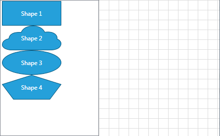
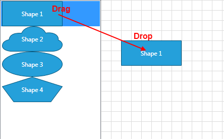
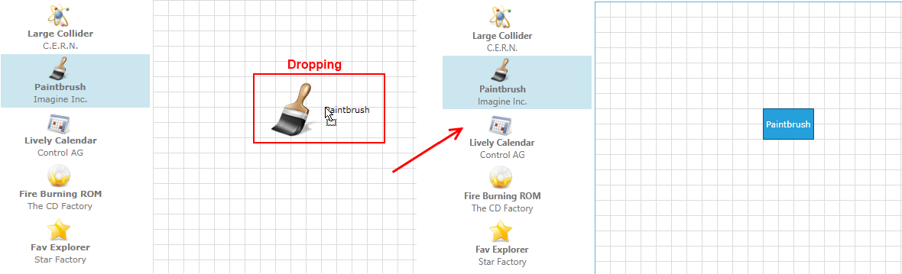

# Drag and Drop Support

This article will get you familiar with the __RadDiagram__ drag/drop support.            

The __RadDiagram__ framework supports drag/drop operations out-of-the-box for a list of scenarios. For every scenario outside that list, it allows you to easily define your custom drop logic.            

## Enable Drag/Drop

To allow drag and drop functionality in the __RadDiagram__, set the __AllowDrop__ attribute to __True__.                

<snippet id='raddiagram-features-raddiagrams-drag-drop-block_1-xaml' />

The drag and drop behavior can be enabled in the code-behind as well. In order to do that you need to set the __AllowDrop__ property of an instance of the __RadDiagram__ class to __True__.                

<snippet id='raddiagram-features-raddiagrams-drag-drop-block_2-cs' />

<snippet id='raddiagram-features-raddiagrams-drag-drop-block_2-vb' />

>tip Please note that the __RadDiagram AllowDrop__ property is set to __True__ by default.                    

## Automatically Supported Drop Operations

The __RadDiagram__ framework allows you to drop:                

* __Image Files__ - You can just drag and drop onto the Diagramming surface any image file from the following list of supported formats:                        

	* JPEG(*.jpg)
	* PNG(*.png)
	
	* BMP(*.bmp)
	* TIFF(*.tiff)
	* GIF(*.gif)
	

* __Text Files__ - You can drag __.TXT__ files directly onto the diagramming surface to create text shapes. The operation will take the content of the __.TXT__ file and will place it as a content of a text shape.                        

* __Text__ - You can drag chunks of text from your documents onto the diagramming surface directly.                        

* __Serialization XML string__ - You can drag the serialization xml string of a __RadDiagram__ native element. You can find more information on how to serialize the __RadDiagram__ native elements in an XML string, please have a look at the [Serialization]() topic.                        

## Custom Drop Operations

By default, the __RadDiagram__ can handle drop operations out-of-the-box as long as the dropped data represents a serialized __RadDiagramItem__. This is why if you create an __ItemsControl__ containing a list of __RadDiagramItems__, you will only have to set the dragged data to represent a serialized __RadDiagramItem__. However, if you have an __ItemsControl__ displaying custom business data, then you will have to manually configure how to drag and drop the business items.                

>Please note that the examples in this tutorial are showcasing Telerik Windows8 theme. In the [Setting a Theme](http://www.telerik.com/help/silverlight/common-styling-apperance-setting-theme.html#Setting_Application-Wide_Built-In_Theme_in_the_Code-Behind)[Setting a Theme](http://www.telerik.com/help/wpf/common-styling-apperance-setting-theme-wpf.html#Setting_Application-Wide_Built-In_Theme_in_the_Code-Behind) article you can find more information on how to set an application-wide theme.                    

### Dragging RadDiagramShapes from an ItemsControl

Let's examine a scenario where you create a __ListBox__ populated with __RadDiagramShapes__ and a __RadDiagram__ component next to it:                        

<snippet id='raddiagram-features-raddiagrams-drag-drop-block_3-xaml' />

In order to allow a drag of a __ListBoxItem__, you need to apply a style that makes the __ListBoxItems__ draggable:                        

<snippet id='raddiagram-features-raddiagrams-drag-drop-block_4-xaml' />

In this scenario, the __RadDiagram__ instance can automatically handle the drop of the __RadDiagramShapes__ as long as they are serialized. In order to serialize them you need to create a handler for the __ListBox DragDropManager.DragInitialized__ event:                        

<snippet id='raddiagram-features-raddiagrams-drag-drop-block_5-cs' />

<snippet id='raddiagram-features-raddiagrams-drag-drop-block_5-vb' />

In the above example you can drag an entire __ListBoxItem__ but you may need to only drag the __RadDiagramShape__ contained within the item. In that case, you will have to create a custom style targeting the __RadDiagramShapes__ within the __ListBox__ control. Please note that you have to apply this style only on those shapes defined within the __ListBox__ control.                        

<snippet id='raddiagram-features-raddiagrams-drag-drop-block_6-xaml' />

And you will also have to slightly modify the __OnDragInitialize()__ implementation as it now looks for a __ListBoxItem__ as its __OriginalSource__. Once the __ListBoxItems__ aren't marked as draggable and only the shapes are defined as such, the __OriginalSource__ of the event will be a shape instance.                        

<snippet id='raddiagram-features-raddiagrams-drag-drop-block_7-cs' />

<snippet id='raddiagram-features-raddiagrams-drag-drop-block_7-vb' />

### Dragging business data from an ItemsControl

In MVVM scenarios, the business data is usually displayed within __ItemsControls__. And if you need to drag the items of these controls and drop them on a diagramming surface, you need to customize the drag/drop operations on both sides - in the source of the drag and in the targeted __RadDiagram__.                        

For the purpose of this tutorial, we will examine a sample scenario describing how to implement a drag operation from a __ListBox__ control to a __RadDiagram__. Our goal would be to create a __RadDiagramShape__ to wrap the dragged data.                        

* First, let's create a sample data source for the __ListBox__:                                

	<snippet id='raddiagram-features-raddiagrams-drag-drop-block_8-cs' />

	<snippet id='raddiagram-features-raddiagrams-drag-drop-block_8-vb' />

* Now that we have defined our __MainViewModel__ class, we can use it as a __DataContext__ of our main view:

	<snippet id='raddiagram-features-raddiagrams-drag-drop-block_9-xaml' />

	>The *local* alias points to the namespace where the __MainViewModel__ class is defined.                                    

* Next we can set up our layout. We will need a __ListBox__ definition and a __RadDiagram__ definition. Also, as we have to allow drag/drop operations between them, we need to apply the __DragDropManager.AllowCapturedDrag__ attached property on the __ListBoxItems__ and we can set the __AllowDrop__ property to __True__ in the __RadDiagram__ definition.                                

	<snippet id='raddiagram-features-raddiagrams-drag-drop-block_10-xaml' />

* As the layout is all in place, we can go ahead and start implementing our dragging logic. For that purpose, we need to decide how to interpret the dragged items and what to pass as the __Data__ of the drag operation. We can implement this logic in the __DragInitialize__ event handler:                                

	<snippet id='raddiagram-features-raddiagrams-drag-drop-block_11-cs' />

	<snippet id='raddiagram-features-raddiagrams-drag-drop-block_11-vb' />

	And the __ApplicationTemplate__ definition should be in the __Resources__ section of our view:

	<snippet id='raddiagram-features-raddiagrams-drag-drop-block_12-xaml' />

	>tip You can find more information about the features and events of the __DragDropManager__ in [its documentation](http://www.telerik.com/help/wpf/dragdropmanager-getting-started.html)[its documentation](http://www.telerik.com/help/silverlight/dragdropmanager-getting-started.html).                                    

* Finally, we need to customize the __RadDiagram__ drop logic to create a __RadDiagramShape__ to wrap the dragged data. We can also apply a __Position__ property on the __RadDiagramShape__ to reflect the exact position of the mouse during the drop.                                

	>tip The easiest way to get the position of the mouse in the __Drop__ event handler is through the __DragEventsArgs GetPosition()__ method. However, as __RadDiagram__ supports different scaling operations (pan, zoom), you need to get the coordinates of the drop target point in the context of the __RadDiagram__. For that purpose you can use the __RadDiagram GetTransformedPoint__ extension method. It takes a point, applies any pan and/or zoom settings defined by the __RadDiagram__ current state and returns a point, transformed in the context of the diagram. This allows you to correctly position a __RadDiagramItem__ in a panned or zoomed diagramming surface.
	Please note that the __GetTransformedPoint()__ extension method is defined in the __Telerik.Windows.Controls.Diagrams__ namespace so you need to include this namespace in your class definition before getting advantage of the method.
	
	<snippet id='raddiagram-features-raddiagrams-drag-drop-block_13-cs' />

	<snippet id='raddiagram-features-raddiagrams-drag-drop-block_13-vb' />

	
	Please note that we've set the __Position__ property of the __RadDiagramShape__

	>Please note that you have to handle the __Drop__ event in order to stop its default logic and implement your own instead.

	