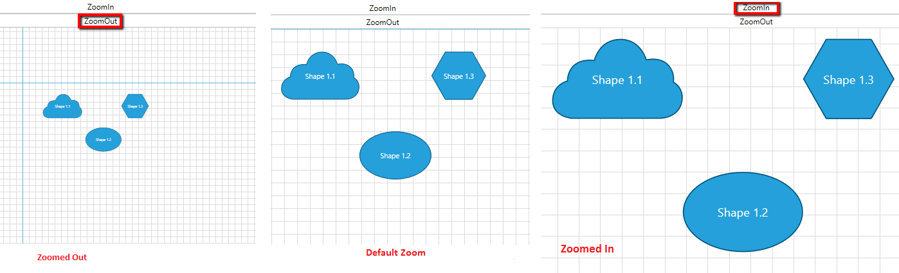
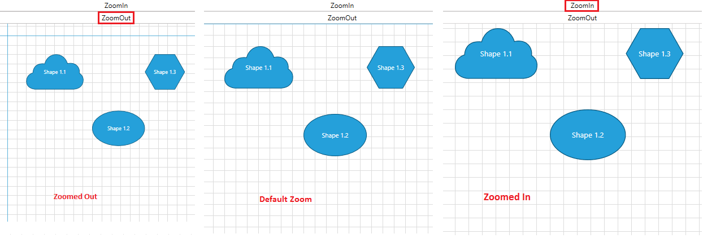
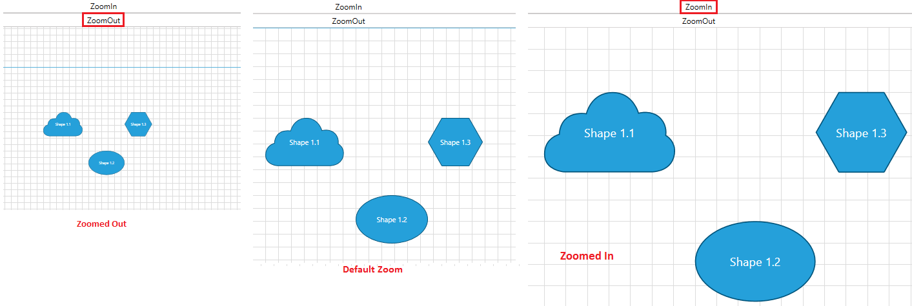
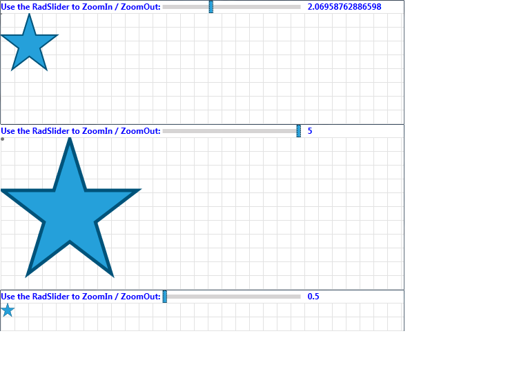

# Pan and Zoom

In __RadDiagram__ you can easily pan, zoom in or out of your current diagramming structure. This tutorial will get you familiar with the pan and zoom implementation within the __Diagramming Framework__.            

>Please note that the examples in this tutorial are showcasing Telerik Windows8 theme. In the [Setting a Theme](http://www.telerik.com/help/silverlight/common-styling-apperance-setting-theme.html#Setting_Application-Wide_Built-In_Theme_in_the_Code-Behind)[Setting a Theme](http://www.telerik.com/help/wpf/common-styling-apperance-setting-theme-wpf.html#Setting_Application-Wide_Built-In_Theme_in_the_Code-Behind) article you can find more information on how to set an application-wide theme.                

## Pan

__RadDiagram__ exposes an __IsPanEnabled__ property which defines whether the pan operation is allowed. The default value of the property is __True__.                

In order to start a panning operation you need to either hold down the __Ctrl key and drag the viewport with the mouse__ or use a __swipe__ touch gesture. In both cases the pan operation is triggered by a user interaction.                

You can also activate the __Pan__[ MouseTool]() to start a pan operation simply by dragging the current viewport with the mouse.                

## Pan Animation            

The __DiagrammingFramework__ also provides a built-in pan animation. By default this animation isn't activated which means that you have to manually activate it in case you need to utilize it in your solution. The animation can be set through the __DiagramAnimations.IsPanAnimationEnabled__ attached property.
             
<snippet id='raddiagram-features-raddiagrams-pan-zoom-block_1-xaml' />

## Pan Events

__RadDiagram__ exposes two panning events:                

* __PreviewPan__ - this event is fired before executing the pan operation. Its event handler receives two arguments:                        
	* The __sender__ argument that contains the __RadDiagram__ instance that fired the event.
	* A [PositionChangedRoutedEventArgs](http://www.telerik.com/help/wpf/t_telerik_windows_controls_diagrams_positionchangedroutedeventargs.html)[PositionChangedRoutedEventArgs](http://www.telerik.com/help/silverlight/t_telerik_windows_controls_diagrams_positionchangedroutedeventargs.html) object that provides information regarding the current and the next position of the diagram through the __OldPosition__ and __NewPosition__ properties. This event can be handled to cancel a particular pan operation. For that purpose the __PositionChangedRoutedEventArgs Handled__ property needs to be set to __True__.                        

* __Pan__ - this event is raised by the __RadDiagram__ to inform that a pan operation has completed. Its event handler receives two arguments:
	* The __sender__ argument that contains the __RadDiagram__ instance that fired the event.
	* A [PositionChangedRoutedEventArgs](http://www.telerik.com/help/wpf/t_telerik_windows_controls_diagrams_positionchangedroutedeventargs.html)[PositionChangedRoutedEventArgs](http://www.telerik.com/help/silverlight/t_telerik_windows_controls_diagrams_positionchangedroutedeventargs.html) object that provides information regarding the current and the next position of the diagram through the __OldPosition__ and __NewPosition__ properties.                                

>Please note that if you handle the __PreviewPan__ event, the __Pan__ event will not be fired at all.                    

## Zoom

__RadDiagram__ supports zooming out-of-the-box. The feature is controlled through the __RadDiagram IsZoomEnabled__ property which default value is __True__. The user can initiate a zoom using the __mouse wheel__ or a __pinch__ touch gesture.                

The zoom range is controlled through two __DiagramConstants__:                

* __MinimumZoom__ - a __double__ value which indicates the minimum zoom level. Its default value is __0.5__.                        

* __MaximumZoom__ - a __double__ value which indicates the maximum zoom level. Its default value is __5__.                        

<snippet id='raddiagram-features-raddiagrams-pan-zoom-block_2-cs' />

<snippet id='raddiagram-features-raddiagrams-pan-zoom-block_2-vb' />

The current zoom value in a __RadDiagram__ instance is controlled through the __Zoom__ property. It represents a __double__ value which cannot be null, infinity or NaN. Additionally, this value is coerced to be within the range defined by the __MinimumZoom__ and __MaximumZoom__ constants. The default __Zoom__ value is __1__.                

>tip Please note that in the diagramming framework we talk about "zooming out" when the zoom value is less than 1. Alternatively, a __Zoom__ value greater than 1 is considered a "zoom in".                    

## Zoom Methods

By default the zoom operation uses an arithmetic progression to increase/decrease the zoom. The common difference used to build the progression is calculated based on a zoom factor. If such a value is not specifically defined, then __RadDiagram__ uses the __DiagramConstants ZoomScaleFactor__ value as a zoom factor.                

If you need to initiate a zoom through code-behind, __RadDiagram__ provides two methods:                

* __ZoomIn()__ - this method performs an incremental zoom in taking into account the previous zoom operations. It can take up to 3 parameters:                        
	* a __double__ value which indicates a zoom factor.
	* a __Point__ value which indicates the coordinates of the point that should be used as a center of the zoom operation. Please note that if you decide to use this parameter, then you have to make sure the coordinates you provide are in the context of the current viewport.
	* a __boolean__ value indicating whether animations should be used during the zoom in operation.                                

	>Please note that all 3 parameters described above are __optional__.                            

* __ZoomOut()__ - this method performs an incremental zoom out taking into account the previous zoom operations. It can take up to 3 parameters:
	* a __double__ value which indicates a zoom factor.
	* a __Point__ value which indicates the coordinates of the point that should be used as a center of the zoom operation. Please note that if you decide to use this parameter, then you have to make sure the coordinates you provide are in the context of the current viewport.
	* a __boolean__ value indicating whether animations should be used during the zoom out operation.

	>Please note that all 3 parameters described above are __optional__.                            

Below you can find a few examples demonstrating how you can use __RadDiagram ZoomIn()__ and __ZoomOut()__ methods:                

* __Zooming in and out with a custom factor:__

	<snippet id='raddiagram-features-raddiagrams-pan-zoom-block_3-cs' />

	<snippet id='raddiagram-features-raddiagrams-pan-zoom-block_3-vb' />

	

* __Zooming in and out around a center point:__

	<snippet id='raddiagram-features-raddiagrams-pan-zoom-block_4-cs' />

	<snippet id='raddiagram-features-raddiagrams-pan-zoom-block_4-vb' />

	

* __Zooming in and out around a center point with a customized zoom factor:__

	<snippet id='raddiagram-features-raddiagrams-pan-zoom-block_5-cs' />

	<snippet id='raddiagram-features-raddiagrams-pan-zoom-block_5-vb' />

	

## Zoom Animation

The __DiagrammingFramework__ also provides a built-in zoom animation. By default this animation is activated, but you can easily deactivate and activate it again through the __DiagramAnimations.IsZoomAnimationEnabled__ attached property.

<snippet id='raddiagram-features-raddiagrams-pan-zoom-block_6-xaml' />

## Zoom Events

__RadDiagram__ exposes two zooming events:                

* __PreviewZoom__ - this event is fired before executing the zoom operation. Its event handler receives two arguments:
	* The __sender__ argument that contains the __RadDiagram__ instance that fired the event.
	* A [DiagramZoomEventArgs](http://www.telerik.com/help/wpf/t_telerik_windows_controls_diagrams_diagramzoomeventargs.html)[DiagramZoomEventArgs](http://www.telerik.com/help/silverlight/t_telerik_windows_controls_diagrams_diagramzoomeventargs.html) object that provides information regarding:                                
		* __Zoom__ - a __double__ value representing the previous zoom value.                                        
		* __TargetZoom__ - a __double__ value that gets or sets the result zoom. By default this property contains the coerced new zoom value. Please note that if you decide to change that value, it will be coerced first and then applied on the diagramming instance.
		* __ZoomPoint__ - a __Point__ value representing the center point of the zoom operation.
		* __IsAnimationRunning__ - a __boolean__ value indicating whether a zoom animation is currently running. This event can be handled to cancel a particular zoom operation. For that purpose the __DiagramZoomEventArgs Handled__ property needs to be set to __True__.                        

* __ZoomChanged__ - this event is raised by the __RadDiagram__ to inform that a zoom operation has completed. Its event handler receives two arguments:                        
	* The __sender__ argument that contains the __RadDiagram__ instance that fired the event.
	* A [RadRoutedPropertyChangedEventArgs<double>](http://www.telerik.com/help/wpf/t_telerik_windows_radroutedpropertychangedeventargs_1.html)[RadRoutedPropertyChangedEventArgs<double>](http://www.telerik.com/help/silverlight/t_telerik_windows_radroutedpropertychangedeventargs_1.html) object that provides information regarding the old and the new value of the diagram zoom through the __OldValue__ and __NewValue__ properties.                                

>Please note that if you handle the __PreviewZoom__ event, the __ZoomChanged__ event will not be fired at all.                    

## AutoFit

__RadDiagram__ also allows you to auto fit its items using the following methods:		  

* __AutoFit()__ - this method centers and zooms the diagram in order to display all its items within the currently visible area of the diagramming canvas.			  

* __AutoFitAsync()__ - this method asyncronously centers and zooms the diagram in order to display all its items within the currently visible area of the diagramming canvas.			  

__RadDiagram__ also exposes an __AutoFit__ command. In order to use it in your solution, you can follow the steps outlined in the [Commands]() tutorial.		  

## Customizing the Zoom operation            

As described above, the zoom operation uses an arithmetic progression to increase/decrease the zoom. By default the common difference used to build the progression is 0.5. This is why once you start zooming in, the __RadDiagram Zoom__ value changes like follows: 1->1.5->2->2.5...                

If you need to change the default behavior, the best place to plug-in and customize that logic, is the __RadDiagram PreviewZoom__ event. Below we will examine two examples of a customized zoom:                

##### 1. Zooming RadDiagram using a geometric progression so that the __Zoom__ value changes in the following manner: 1->1.5->2.25->3.75... This means that we need to use a common ratio of 1.5:                        

<snippet id='raddiagram-features-raddiagrams-pan-zoom-block_7-xaml' />

<snippet id='raddiagram-features-raddiagrams-pan-zoom-block_8-cs' />

<snippet id='raddiagram-features-raddiagrams-pan-zoom-block_8-vb' />

##### 2. Zooming RadDiagram using a custom set of zoom values:

<snippet id='raddiagram-features-raddiagrams-pan-zoom-block_9-xaml' />

<snippet id='raddiagram-features-raddiagrams-pan-zoom-block_10-cs' />

<snippet id='raddiagram-features-raddiagrams-pan-zoom-block_10-vb' />

## Zooming RadDiagram with RadSlider

You can use the __RadSlider__ control to visualize the current zoom value of a __RadDiagram__ instance. You can easily bind the __RadSlider Value__ property to the __RadDiagram Zoom__ property as demonstrated below:

<snippet id='raddiagram-features-raddiagrams-pan-zoom-block_11-xaml' />

## See Also
 * [Getting Started]()
 * [Populating with Data]()
 * [Shapes]()
 * [Connections]()
 * [Items Editing]()
 * [Clipboard Operations]()
 * [Undo and Redo]()
 * [Align and Snap ]()
 * [Commands]()
 * [Keyboard Support]()
 * [Mouse Tools]()