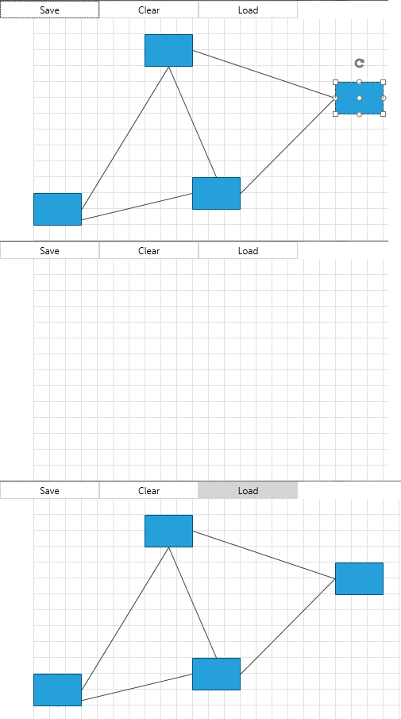

# Serialization

`RadDiagram` allows you to serialize (save) your current diagram in an XML string and later deserialize it (load). You can achieve this with the `RadDiagram.Save()` and `RadDiagram.Load(string serializationString)` methods. You can also use the DiagramCommands `Save` and `Open`.			

## Save And Load A RadDiagram

In the code below you can see how to save and load a RadDiagram using Commands. Please note that before saving the current diagramming structure, it is best to check whether there are any items to save:				

>Please note that the examples in this tutorial are showcasing Telerik Windows8 theme. In the [Setting a Theme](http://www.telerik.com/help/wpf/common-styling-apperance-setting-theme-wpf.html#Setting_Application-Wide_Built-In_Theme_in_the_Code-Behind) article, you can find more information on how to set an application-wide theme.

#### __[XAML] RadDiagram Xaml__
{{region xaml-raddiagrams_features_serialization_0}}
	<Grid>
		<Grid.RowDefinitions>
			<RowDefinition Height="Auto" />
			<RowDefinition Height="*" />
		</Grid.RowDefinitions>
		<StackPanel Orientation="Horizontal">
			<telerik:RadButton Width="125" 
							   Command="telerik:DiagramCommands.Save"
							   CommandTarget="{Binding ElementName=diagram}"
							   Content="Save" />
			<telerik:RadButton Width="125" 
							   Command="telerik:DiagramCommands.Clear"
							   CommandTarget="{Binding ElementName=diagram}"
							   Content="Clear" />
			<telerik:RadButton Width="125" 
							   Command="telerik:DiagramCommands.Open"
							   CommandTarget="{Binding ElementName=diagram}"
							   Content="Load" />
		</StackPanel>
		<telerik:RadDiagram x:Name="diagram" Grid.Row="1">
			<telerik:RadDiagramShape  />
			<telerik:RadDiagram.CommandBindings>
				<CommandBinding Command="telerik:DiagramCommands.Save" Executed="CommandBinding_Executed_Save" CanExecute="CommandBinding_CanExecute"/>
				<CommandBinding Command="telerik:DiagramCommands.Open" Executed="CommandBinding_Executed_Open" />
			</telerik:RadDiagram.CommandBindings>
		</telerik:RadDiagram>
	</StackPanel>
{{endregion}}

#### __[C#] Save-Load logic__
{{region cs-raddiagrams_features_serialization_2}}
	private string diagramXMLString;       
	
	public MainWindow()
	{
		StyleManager.ApplicationTheme = new Windows8Theme();
		InitializeComponent();          
	}
	
	private void CommandBinding_Executed_Save(object sender, ExecutedRoutedEventArgs e)
	{
	   diagramXMLString =  this.diagram.Save();
	}
	
	private void CommandBinding_Executed_Open(object sender, ExecutedRoutedEventArgs e)
	{
		if (diagramXMLString != null)
		{
			this.diagram.Load(diagramXMLString);
		}
	}
	
	private void CommandBinding_CanExecute(object sender, CanExecuteRoutedEventArgs e)
	{
		e.CanExecute = this.diagram.Items.Count > 0;
	}
{{endregion}}

#### __[VB.NET] Save-Load logic__
{{region vb-raddiagrams_features_serialization_3}}
	Private diagramXMLString As String
	
	Public MainWindow()
		StyleManager.ApplicationTheme = New Windows8Theme()
		InitializeComponent()
	End Sub
	
	Private Sub CommandBinding_Executed_Save(ByVal sender As Object, ByVal e As ExecutedRoutedEventArgs)
		diagramXMLString = Me.diagram.Save()
	End Sub
	
	Private Sub CommandBinding_Executed_Open(ByVal sender As Object, ByVal e As ExecutedRoutedEventArgs)
		If diagramXMLString IsNot Nothing Then
			Me.diagram.Load(diagramXMLString)
		End If
	End Sub
	
	Private Sub CommandBinding_CanExecute(ByVal sender As Object, ByVal e As CanExecuteRoutedEventArgs)
		e.CanExecute = Me.diagram.Items.Count > 0
	End Sub
{{endregion}}

__RadDiagram Serialization__

>Please note that the Content of the Shapes and the Connections is serialized as String. This means that if you have control like ListBox or TreeView as a Content , it will be not serialized successfully.					

## Save/Load Diagram ViewPort

When zooming with a mouse or panning the RadDiagram, the ViewPort position will be changed. The viewPort is not saved/load during the serialization mechanism, thus you will have to manually restore it. The BringIntoView(position, zoom level) method can be used for this purpose. The following example demonstrates how you can preserve and restore the ViewPort position.

#### __[C#] Save-Load Diagram ViewPort__
{{region cs-raddiagrams_features_serialization_4}}
	private double savedZoomFactor;
	Point savedDiagramPosition;
	private void CommandBinding_Executed_Save(object sender, ExecutedRoutedEventArgs e) 
	{ 
		savedZoomFactor = this.diagram.Zoom;
		savedDiagramPosition = this.diagram.Viewport.TopLeft;
		diagramXMLString =  this.diagram.Save(); 
	} 
	 
	private void CommandBinding_Executed_Open(object sender, ExecutedRoutedEventArgs e) 
	{ 
		if (diagramXMLString != null) 
		{ 
			this.diagram.Load(diagramXMLString);
			this.diagram.BringIntoView(savedDiagramPosition, savedZoomFactor);			
		} 
	}
{{endregion}}

## Extending RadDiagram Serialization

By default, not every property of the RadDiagramItem is serialized. Below is the list of the properties that are automatically serialized:		

>important These properties are serialized in scenarios where data bindings are __not__ involved. If you are using Binding in styles targeting any of the diagram items, you need to manually serialise and deserialize all the properties that are bound. This is demonstrated in the [Manual Serialization/Deserialization](#manual-serializationdeserialization) section of this article.

* `RadDiagram`
	* AllowCopy
	* AllowCut
	* AllowDelete
	* AllowPaste
	* Background
	* BackgroundGrid.CellSize
	* BackgroundGrid.LineStroke
	* BackgroundGrid.LineStrokeDashArray
	* BackgroundGrid.LineStrokeThickness
	* ConnectionBridges
	* ConnectionRoundedCorners
	* IsBackgroundSurfaceVisible
	* IsConnectorsManipulationEnabled
	* IsDraggingEnabled
	* IsEditable
	* IsManipulationAdornerVisible
	* IsPanEnabled
	* IsResizingEnabled
	* IsRotationEnabled
	* IsSnapEnabled
	* IsZoomEnabled
	* Metadata
	* Position
	* RouteConnections
	* SelectionMode
	* SnapX
	* SnapY
	* Zoom

* `RadDiagramShape`
	* AllowCopy
	* AllowDelete
	* AllowPaste
	* Background
	* BorderBrush
	* BorderThickness
	* Content
	* FontFamily
	* FontSize
	* FontWeight
	* Foreground
	* Geometry
	* GlidingStyle
	* Id
	* IsConnectorsManipulationEnabled
	* IsDraggingEnabled
	* IsEditable
	* IsResizingEnabled
	* IsRotationEnabled
	* MaxHeight
	* MaxWidth
	* MinHeight
	* MinWidth
	* ParentGroup
	* Position
	* RotationAngle
	* Size
	* Stroke
	* StrokeDashArray
	* StrokeThickness
	* UseDefaultConnectors
	* ZIndex

* `RadDiagramConnection`
	* AllowCopy
	* AllowDelete
	* AllowPaste
	* Background
	* BezierEndPoint    
	* BezierStartPoint    
	* BezierTention    
	* BorderBrush    
	* BorderThickness
	* ConnectionPoints    
	* ConnectionType    
	* Content    
	* EndPoint
	* FontFamily    
	* FontSize
	* FontWeight    
	* Foreground    
	* Id
	* IsConnectorsManipulationEnabled
	* IsDraggingEnabled
	* IsEditable    
	* IsModified    
	* IsResizingEnabled
	* IsRotationEnabled
	* ParentGroup
	* Position
	* Source
	* SourceCapSize
	* SourceCapType
	* SourceConnectorPosition
	* StartPoint
	* Stroke
	* StrokeDashArray
	* StrokeThickness
	* Target    
	* TargetCapSize
	* TargetCapType
	* TargetConnectorPosition
	* ZIndex
	* UseFreeConnectors 

For every other property that you need to be part of the Serialization/Deserialization process, you have to use the `RadDiagram.ShapeDeserialized` and `RadDiagram.ShapeSerialized` or `RadDiagram.ConnectionDeserialized` and `RadDiagram.ConnectionSerialized` events. Below is shown how you can serialize the `Opacity` property of the shapes:			

## Manual Shape Serialization/Deserialization

>If you are using MVVM approach and need to serialize databound properties you can take a look at our [Serialize a Databound Diagram]() article.

#### __[C#] Handling the ShapeSerialized and ShapeDeserialized events__
{{region raddiagrams-features-serialization-5}}
	void diagram_ShapeDeserialized(object sender, ShapeSerializationRoutedEventArgs e)
	{
		 // load the saved property
		 (e.Shape as RadDiagramShape).Opacity = Convert.ToDouble(e.SerializationInfo["Opacity"], CultureInfo.InvariantCulture);
	}

	void diagram_ShapeSerialized(object sender, ShapeSerializationRoutedEventArgs e)
	{
		 // save custom or other property
		 e.SerializationInfo["Opacity"] = (e.Shape as RadDiagramShape).Opacity.ToInvariant();
	}		  
{{endregion}}

#### __[VB.NET] Handling the ShapeSerialized and ShapeDeserialized events__		
{{region raddiagrams-features-serialization-6}}  
	Private Sub diagram_ShapeDeserialized(ByVal sender As Object, ByVal e As ShapeSerializationRoutedEventArgs)
		 ' load the saved property'
		 TryCast(e.Shape, RadDiagramShape).Opacity = Convert.ToDouble(e.SerializationInfo("Opacity"), CultureInfo.InvariantCulture)
	End Sub

	Private Sub diagram_ShapeSerialized(ByVal sender As Object, ByVal e As ShapeSerializationRoutedEventArgs)
		 ' save custom or other property'
		 e.SerializationInfo("Opacity") = (TryCast(e.Shape, RadDiagramShape)).Opacity.ToInvariant()
	End Sub	
{{endregion}}

>Please note that the `Double.ToInvariant()` extension method is defined in the __Telerik.Windows.Diagrams.Core__ namespace and in order to use it in your application, you'll have to add a using statement: using Telerik.Windows.Diagrams.Core;

>tip If you decide to manually save one of the [properties](#extending-raddiagram-serialization) automatically saved by the diagram, make sure to give it a custom key (different from the default one used for saving). Also, implement both, the saving and loading logic in the ShapeSerialize and ShapeDeserialized event handlers. For example, if you want to manually save the FontWeight property of a RadDiagramShape, you can use a key different than "FontWeight" in the SerializationInfo (example: "MyFontWeight"). We recommend this as a precaution, because internally the diagram parses the value given in the SerializationInfo and if it doesn't match a specific format an exception will be thrown. 

## Serialize/Deserialize RadDiagram Properties

To include additional information in the generated XML when the RadDiagram control is being serialized, you can handle its `MetadataSerialized` event.

#### __[C#] Handling the MetadataSerialized event__
{{region raddiagrams-features-serialization-7}}
	private void OnMetadataSerialized(object sender, DiagramSerializationRoutedEventArgs e)
	{
	    RadDiagram diagram = (RadDiagram)sender; 
	    e.SerializationInfo["Opacity"] = diagram.Opacity.ToInvariant();
	}
{{endregion}}

#### __[VB.NET] Handling the MetadataSerialized event__
{{region raddiagrams-features-serialization-8}}
    Private Sub OnMetadataSerialized(ByVal sender As Object, ByVal e As DiagramSerializationRoutedEventArgs)
        Dim diagram As RadDiagram = CType(sender, RadDiagram)
        e.SerializationInfo("Opacity") = diagram.Opacity.ToInvariant()
    End Sub
{{endregion}}

To load the serialized property of the RadDiagram control, handle its `MetadataDeserialized` event. 

#### __[C#] Handling the MetadataDeserialized event__
{{region raddiagrams-features-serialization-9}}
	private void OnMetadataDeserialized(object sender, Telerik.Windows.Controls.Diagrams.DiagramSerializationRoutedEventArgs e)
    {
    	RadDiagram diagram = (RadDiagram)sender;
    	diagram.Opacity = Convert.ToDouble(e.SerializationInfo["Opacity"], CultureInfo.InvariantCulture);
    }
{{endregion}}

#### __[VB.NET] Handling the MetadataDeserialized event__
{{region raddiagrams-features-serialization-10}}
    Private Sub OnMetadataDeserialized(ByVal sender As Object, ByVal e As Telerik.Windows.Controls.Diagrams.DiagramSerializationRoutedEventArgs)
        Dim diagram As RadDiagram = CType(sender, RadDiagram)
        diagram.Opacity = Convert.ToDouble(e.SerializationInfo("Opacity"), CultureInfo.InvariantCulture)
    End Sub
{{endregion}}

## Preserve Bindings to the Automatically Serialized Properties of the RadDiagram's Items

If you have a binding between a RadDiagramItem property that is [automatically serialized](#extending-raddiagram-serialization) and a property from the item’s view model the binding won’t work after the deserialization. This is because the serialization/deserialization logic of the diagram sets those properties locally which has bigger priority than a binding. You can read more about the value setting precedence in the [Dependency Property Value Precedence](https://msdn.microsoft.com/en-us/library/vstudio/ms743230(v=vs.100).aspx) MSDN article.

In order to preserve the binding you can remove the value of the property from the serialization info and use another key to serialize/deserialize it.

For example, if you have a binding to the Position property you can use the following approach for saving the binding:

* Override the `SerializeNode()` method of the diagram’s `GraphSource` and set the value of the bound property to __null__ in the `SerializationInfo`. Then add the value with a new key in the serialization info. 
	#### __[C#] SerializeNode override__
	{{region raddiagrams-features-serialization-11}}
		public override void SerializeNode(NodeViewModelBase node, SerializationInfo info)
		{
			   var position = info["Position"];
			   info["Position"] = null;
			   info["MyPosition"] = position;
			   base.SerializeNode(node, info);
		}	
	{{endregion}}
	
	#### __[VB.NET] SerializeNode override__
	{{region raddiagrams-features-serialization-12}}
		public Overrides Sub SerializeNode(node As NodeViewModelBase, info As SerializationInfo)
			Dim position = info("Position")
			info("Position") = Nothing
			info("MyPosition") = position
			MyBase.SerializeNode(node, info)
		End Sub
	{{endregion}}
	
* Override the `DeserializeNode()` method of the diagram’s `GraphSource` and get the value of the bound property. Then assign it to the property of the view model.
	#### __[C#] DeserializeNode override__
	{{region raddiagrams-features-serialization-13}}
		public override NodeViewModelBase DeserializeNode(IShape shape, Telerik.Windows.Diagrams.Core.SerializationInfo info)
		{
			var node = base.DeserializeNode(shape, info);
			if (info["MyPosition"] != null)
			{
				 var position = Utils.ToPoint(info["MyPosition"].ToString());
			 node.Position = position.Value;
			}
			return node;
		}
	{{endregion}}
	
	#### __[VB.NET] DeserializeNode override__
	{{region raddiagrams-features-serialization-14}}
		Public Overrides Function DeserializeNode(shape As IShape, info As Telerik.Windows.Diagrams.Core.SerializationInfo) As NodeViewModelBase
			Dim node = MyBase.DeserializeNode(shape, info)
			If info("MyPosition") IsNot Nothing Then
				Dim position = Utils.ToPoint(info("MyPosition").ToString())
				node.Position = position.Value
			End If
			Return node
		End Function
	{{endregion}}
		
> The code snippets above demonstrate how to preserve the bindings in an __MVVM__ scenario with a custom GraphSource. If you have statically declared shapes you can use the `ShapeSerialized` and `ShapeDeserialized` events of the diagram.

>important If you are using the [RadDiagramToolbox]() in order to drag and drop shapes and you have bindings declared in a style, make sure that the style is added in the Application's Resources as in the above example. 

#### __[XAML] Style containing Position binding in Application's Resources__
{{region raddiagrams-features-serialization-15}}
	<Application.Resources>
        
    </Application.Resources>
{{endregion}}

## Preserve Bindings of the Automatically Serialized Properties of the RadDiagram's Metadata

To preserve the bindings of the automatically serialized properties of RadDiagram's metadata, you can derive from it and override the `Deserialize` method. Through the __info__ parameter, you can retrieve the property that is used in a data-binding scenario and set its value to __null__. This will avoid the local setting of a value for it in the base implementation of the `Deserialize` method.

#### __[C#] Extending the RadDiagram control and overriding the Deserialize method__
{{region raddiagrams-features-serialization-16}}
    public class CustomDiagram : RadDiagram
    {
        public override void Deserialize(SerializationInfo info)
        {
            info[SerializationConstants.BackgroundGridLineStroke] = null;

            base.Deserialize(info);
        }
    }
{{endregion}}

#### __[VB.NET] Extending the RadDiagram control and overriding the Deserialize method__
{{region raddiagrams-features-serialization-17}}
    Public Class CustomDiagram
        Inherits RadDiagram

        Public Overrides Sub Deserialize(ByVal info As SerializationInfo)
            info(SerializationConstants.BackgroundGridLineStroke) = Nothing
            MyBase.Deserialize(info)
        End Sub
    End Class
{{endregion}}

## See Also
 * [Getting Started]()
 * [Populating with Data]()
 * [Shapes]()
 * [Connections]()
 * [Virtualization]()
 * [Commands]()
 * [Diagram Events]()
 * [Items Events]()