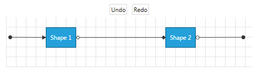

# Undo and Redo

>Please note that the examples in this tutorial are showcasing Telerik Windows8 theme. In the [Setting a Theme](http://www.telerik.com/help/silverlight/common-styling-apperance-setting-theme.html#Setting_Application-Wide_Built-In_Theme_in_the_Code-Behind)[Setting a Theme](http://www.telerik.com/help/wpf/common-styling-apperance-setting-theme-wpf.html#Setting_Application-Wide_Built-In_Theme_in_the_Code-Behind) article you can find more information on how to set an application-wide theme.		

## Undo/Redo Overview

__Telerik Diagramming Framework__ exposes Undo/Redo functionality. The framework allows you to keep track of the changes made in a Diagramming structure and trigger an undo or redo action using commands, methods or keyboard shortcuts.		

### Undo/Redo Methods

Telerik __RadDiagram__ class exposes two methods that allow you to take advantage of the undo/redo functionality.			

* __Undo()__ - this method reverts the last operation in the __RadDiagram__.

* __Redo()__ - this method reapplies the last operation that was undone in the __RadDiagram__.				  


```XAML
	<Grid>
		<Grid.RowDefinitions>
			<RowDefinition Height="Auto" />
			<RowDefinition Height="*" />
		</Grid.RowDefinitions>
		<StackPanel HorizontalAlignment="Center" Orientation="Horizontal">
			<telerik:RadButton Margin="5,0"
							   Click="Undo"
							   Content="Undo" />
			<telerik:RadButton Margin="5,0"
							   Click="Redo"
							   Content="Redo" />
		</StackPanel>
		<telerik:RadDiagram x:Name="diagram"
							Grid.Row="1"
							Margin="5">
			<telerik:RadDiagramShape x:Name="Shape1"
									 Content="Shape 1"
									 Position="80,20" />
			<telerik:RadDiagramShape x:Name="Shape2"
									 Content="Shape 2"
									 Position="320,20" />

			<telerik:RadDiagramConnection SourceCapType="Arrow6Filled"
										  Target="{Binding ElementName=Shape1}"
										  TargetCapType="Arrow1Filled"
										  StartPoint="5,40" />
			<telerik:RadDiagramConnection Source="{Binding ElementName=Shape1}"
										  SourceCapType="Arrow5"
										  Target="{Binding ElementName=Shape2}"
										  TargetCapType="Arrow5Filled" />
			<telerik:RadDiagramConnection Source="{Binding ElementName=Shape2}"
										  SourceCapType="Arrow6"
										  TargetCapType="Arrow6Filled"
										  EndPoint="480,40" />
		</telerik:RadDiagram>
	</Grid>
```

	
```C#
    private void Undo(object sender, RoutedEventArgs e)
    {
        diagram.Undo();
    }

    private void Redo(object sender, RoutedEventArgs e)
    {
        diagram.Redo();
    }				  
```

	
```VB.NET
    Private Sub Undo(sender As Object, e As RoutedEventArgs)
        diagram.Undo()
    End Sub

    Private Sub Redo(sender As Object, e As RoutedEventArgs)
        diagram.Redo()
    End Sub			
```	



### Undo/Redo Commands

__Telerik Diagramming Framework__ exposes a set of commands that allow you to easily implement __RadDiagram__ interaction logic in MVVM solutions. In order to trigger the Undo/Redo functionality you can use the __DiagramCommands.Undo__ and __DiagramCommands.Redo__ commands. Please keep in mind that in order to use those commands for reverting back and forward __RadDiagram__ operations, you need to explicitly set the diagram as the target of the commands.			

>For a full list of the Telerik __DiagramCommands__, please refer to the [Commands]() tutorial.			  


```XAML
    <Grid Margin="20">
        <Grid.RowDefinitions>
            <RowDefinition Height="Auto" />
            <RowDefinition Height="*" />
        </Grid.RowDefinitions>
        <StackPanel HorizontalAlignment="Center" Orientation="Horizontal">
            <telerik:RadButton Margin="5,0"
                               Command="telerik:DiagramCommands.Undo"
                               CommandTarget="{Binding ElementName=diagram}"
                               Content="Undo" />
            <telerik:RadButton Margin="5,0"
                               Command="telerik:DiagramCommands.Redo"
                               CommandTarget="{Binding ElementName=diagram}"
                               Content="Redo" />
        </StackPanel>
        <telerik:RadDiagram x:Name="diagram"
                            Grid.Row="1"
                            Margin="5">
            <telerik:RadDiagramShape x:Name="Shape1"
                                     Content="Shape 1"
                                     Position="80,20" />
            <telerik:RadDiagramShape x:Name="Shape2"
                                     Content="Shape 2"
                                     Position="320,20" />

            <telerik:RadDiagramConnection SourceCapType="Arrow6Filled"
                                          Target="{Binding ElementName=Shape1}"
                                          TargetCapType="Arrow1Filled"
                                          StartPoint="5,40" />
            <telerik:RadDiagramConnection Source="{Binding ElementName=Shape1}"
                                          SourceCapType="Arrow5"
                                          Target="{Binding ElementName=Shape2}"
                                          TargetCapType="Arrow5Filled" />
            <telerik:RadDiagramConnection Source="{Binding ElementName=Shape2}"
                                          SourceCapType="Arrow6"
                                          TargetCapType="Arrow6Filled"
                                          EndPoint="480,40" />
        </telerik:RadDiagram>
    </Grid>
```

### UndoRedoService

You can further extend the undo/redo functionality of your Diagramming solution using the __RadDiagram.UndoRedoService__ property. It exposes the following properties:

* __RedoStack__ - use it to get the __IEnumerable__ collection of redid actions.				

* __RedoBufferSize__ - use it to get or set the redo actions buffer size.				

* __UndoStack__ - use it to get the __IEnumerable__ collection of undid actions.				

* __UndoBufferSize__ - use it to get or set the undo actions buffer size.				

The __UndoRedoService__ also exposes undo/redo methods:			

* __CanRedo()__ - this method determines if the __RadDiagram__ instance can redo operations.				

* __Redo()__ - this method reapplies the last operation that was undone in the __RadDiagram__.				

* __CanUndo()__ - this method determines if the __RadDiagram__ instance can undo operations.				

* __Undo()__ - this method reverts the last operation in the __RadDiagram__.				

* __ExecuteCommand()__ - this method allows you to execute a custom command. It takes as an argument a __Telerik.Windows.Diagrams.Core.ICommand__ command and it also allwos you to pass a state parameter as its second argument.				

You can use the __UndoRedoService UndoStack/RedoStack__ properties to create a DropDownMenu displaying the list of undid or redid actions in your application. You can find a solution showcasing this approach in our online [demos](https://demos.telerik.com/silverlight/#Diagrams/FirstLook)[demos](https://demos.telerik.com/wpf/#Diagrams/FirstLook).			

### Keyboard Support

You can also trigger an undo or redo action using a keyboard combination:

* __Ctrl+Z__ - this key combination will trigger an Undo action.				

* __Ctrl+Y__ - this key combination will trigger a Redo action.				

>More information about the __Telerik Diagramming Framework__ keyboard shortcuts you can find in the [Shortcuts]() tutorial.			  

## See Also
 * [Getting Started]()
 * [Populating with Data]()
 * [Shapes]()
 * [Connections]()
 * [Items Editing]()
 * [Commands]()
 * [Keyboard Support]()
 * [Pan and Zoom]()
 * [Align and Snap ]()