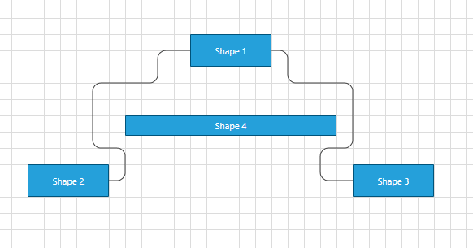
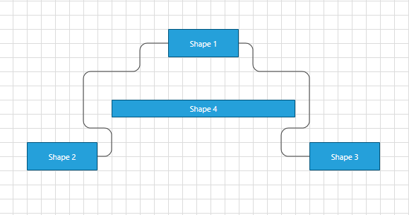
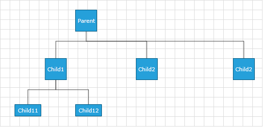
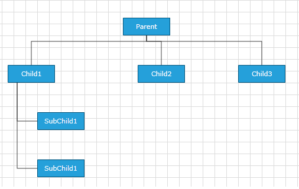
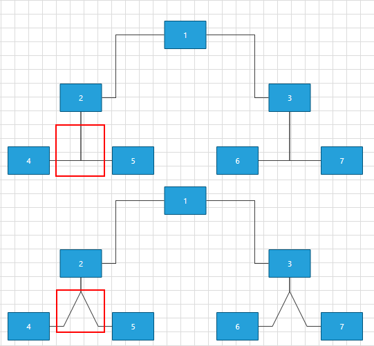
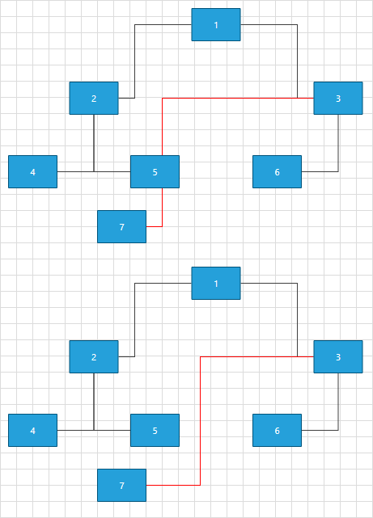
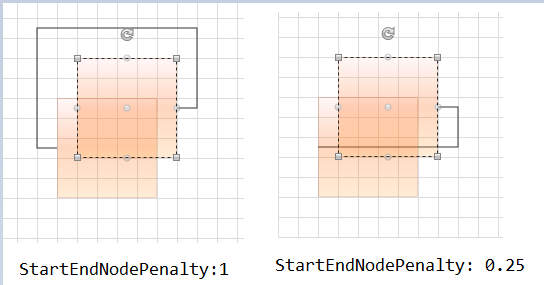
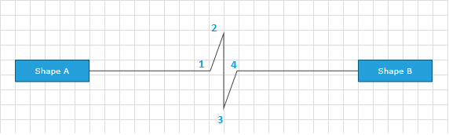

# Routing

A mechanism using algorithms to make sure that the connections don't cross each other while building links/paths between the shapes. 

## Default Routing
	
Routing in __RadDiagram__ is only available if the RadDiagram __RouteConnections__ property is set to __True__.  Please note that its default value is __False__ and you need to explicitly declare you want to enable the routing features.

> For optimal performance and better visual results, we recommend using the AStarRouter algorithm.    

__Example 1: Setting RouteConnections property in XAML__
```XAML
	<Grid>
		<Grid.Resources>
			<Style TargetType="telerik:RadDiagramShape" BasedOn="{StaticResource RadDiagramShapeStyle}">
				<Setter Property="Width" Value="100"/>
				<Setter Property="Height" Value="40"/>
			</Style>
			<Style TargetType="telerik:RadDiagramConnection" BasedOn="{StaticResource RadDiagramConnectionStyle}">
				<Setter Property="ConnectionType" Value="Polyline"/>
			</Style>
		</Grid.Resources>
		<telerik:RadDiagram RouteConnections="True"  ConnectionRoundedCorners="True">

			<telerik:RadDiagramShape x:Name="xShape1"  
							Content="Shape 1" 
							Position="320,60"/>

			<telerik:RadDiagramShape x:Name="xShape2"  
							Content="Shape 2" 
							Position="120,220"/>

			<telerik:RadDiagramShape x:Name="xShape3"  
							Content="Shape 3" 
							Position="520,220"/>

			<telerik:RadDiagramShape x:Name="xShape4" Width="260" Height="25" 
							Content="Shape 4" 
							Position="240,160"/>

			<telerik:RadDiagramConnection x:Name="xConnection1" 
								Source="{Binding ElementName=xShape1}" 
								Target="{Binding ElementName=xShape2}"/>

			<telerik:RadDiagramConnection x:Name="xConnection2" 
								Source="{Binding ElementName=xShape1}" 
								Target="{Binding ElementName=xShape3}"/>
		</telerik:RadDiagram>
	</Grid>  
```

#### __Figure 1: Default routing__


If you want to __exclude/include__ a connection from the routing process, you can use the __Route__ property of the __RadDiagramConnection__. Using the code above we will exclude the second connection from the routing by setting its __Route__ property to __False__.

__Example 2: Setting Route property to False__
```XAML
	<telerik:RadDiagramConnection x:Name="xConnection2" Route="False"
								  SourceConnectorPosition="Bottom"
								  TargetConnectorPosition="Top"
								  Source="{Binding ElementName=xShape1}"
								  Target="{Binding ElementName=xShape3}"/>	
```	

#### __Figure 2: Route property set to False__
	
	
>Please note that the examples in this tutorial are showcasing Telerik Windows8 theme. In the [Setting a Theme](http://www.telerik.com/help/silverlight/common-styling-apperance-setting-theme.html#Setting_Application-Wide_Built-In_Theme_in_the_Code-Behind)[Setting a Theme](http://www.telerik.com/help/wpf/common-styling-apperance-setting-theme-wpf.html#Setting_Application-Wide_Built-In_Theme_in_the_Code-Behind) article you can find more information on how to set an application-wide theme.		  

The routing algorithm can be parametrized using the __DiagramConstants.RoutingGridSize__ constant that has a default value of __40__ units.

This value indicates the size of the cells of the underlying grid used by the algorithm:

* A bigger value will decrease the time to compute the optimal path and will diminish the possible wiggling of the connection path due to obstacles (other shapes). On the other hand, a bigger value will not necessarily lead to an optimal solution in certain circumstances. That is, if your diagram involves a  lot of shapes and a high complexity a bigger __RoutingGridSize__ will not find a path through the maze of shapes.

* A smaller value will increase the time to compute the optimal path and increase the set of possible solutions for the path constraints. On the other hand, a small value leads usually to a lot of stairs/wiggling in the connection's path.

## OrgTreeRouter	  

The __OrgTreeRouter__ is __LayoutType__: Based router that performs a hierarchical routing between parent and child shape. When a shape is being dragged, it removes only the crossings between the connection and its source and target shapes. It should be used when following conditions are satisfied:		

* The __IsConnectorsManipulationEnabled__ is set to false.			

* The __LayoutType__ is among the following 5 - __TipOverTree__, __TreeDown__, __TreeUp__, __TreeLeft__, __TreeRight__.

In order to use the OrgTreeRouter , you have to instantiate an OrgTreeRouter object and set it as current Router of the RadDiagram via the RoutingService:

__Example 3: Setting OrgTreeRouter__

```C#
	public MainPage()
	{
		InitializeComponent();
		OrgTreeRouter router = new OrgTreeRouter()
		{
			 TreeLayoutType = TreeLayoutType.TreeDown,
			 ConnectionOuterSpacing = 20,
		};
		this.diagram.RoutingService.Router = router;
	}
```
```VB.NET
	Public Sub New()
		InitializeComponent()
		Dim router As New OrgTreeRouter() With { 
			 .TreeLayoutType = TreeLayoutType.TreeDown, 
			 .ConnectionOuterSpacing = 20 _
		
		Me.diagram.RoutingService.Router = router
	End Sub
```

The TreeLayoutType points to the type of Layout you wish to use. The routing logic is based on this LayoutType.

The ConnectionOuterSpacing is the Minimum Margin between the Parent/Child Shape and the connection.

__Example 4: Specifing RadDiagram in XAML__
```XAML
	<telerik:RadDiagram IsManipulationAdornerVisible="False" IsConnectorsManipulationEnabled="False" 
					x:Name="diagram" Width="1000" Height="500" Grid.Row="1" RouteConnections="True">
					<telerik:RadDiagramShape Width="45" Height="45" Content="Parent" x:Name="parentShape"/>
					<telerik:RadDiagramShape Width="45" Height="45" Content="Child1" x:Name="childShape1"/>
					<telerik:RadDiagramShape Width="45" Height="45" Content="Child2" x:Name="childShape2"/>
					<telerik:RadDiagramShape Width="45" Height="45" Content="Child2" x:Name="childShape3" />
					<telerik:RadDiagramShape Width="55" Height="25" Content="Child11" x:Name="subchildShape1" />
					<telerik:RadDiagramShape Width="55" Height="25" Content="Child12" x:Name="subchildShape2" />
					<telerik:RadDiagramConnection Source="{Binding ElementName=parentShape}" 
												  Target="{Binding ElementName=childShape1}" />
					<telerik:RadDiagramConnection Source="{Binding ElementName=childShape1}"
												  Target="{Binding ElementName=subchildShape1}" />
						<telerik:RadDiagramConnection Source="{Binding ElementName=childShape1}"
													  Target="{Binding ElementName=subchildShape2}" />
						<telerik:RadDiagramConnection Source="{Binding ElementName=parentShape}" 
													  Target="{Binding ElementName=childShape2}" />
					<telerik:RadDiagramConnection Source="{Binding ElementName=parentShape}"
												  Target="{Binding ElementName=childShape3}" />	
	
	</telerik:RadDiagram>
```

__Figure 3__ demonstrate these shapes after TreeDown Layout operation performed on the Diagram.

#### __Figure 3: TreeDown Layout__


The OrgTreeRouter is used in our __ClassDiagram__ and __OrgChart__ samples of RadDiagram.

## OrgTreeRouter : TipOverTreeRouter	  

When the TreeLayoutType is set to TipOverTree, the OrgTreeRouter uses a special kind of router - the TipOverTreeRouter. It produces best visual results when a custom connectors are added in the bottom-left part of the shapes. In the following lines we will create a quick sample demonstrating the TipOverTree routing and how to configure it properly. Lets first define some shapes:


```XAML
	<Grid.Resources>
		<Style TargetType="telerik:RadDiagramConnection">
			<Setter Property="ConnectionType" Value="Polyline" />
		</Style>
		<Style TargetType="telerik:RadDiagramShape">
			<Setter Property="Width" Value="80" />
			<Setter Property="Height" Value="30" />
		</Style>
	</Grid.Resources>
	<StackPanel>
		<telerik:RadButton Width="300" Height="30" HorizontalAlignment="Center" Content="Layout"
				Click="RadButton_Click" />
		<telerik:RadDiagram x:Name="diagram" Width="1000" Height="500" RouteConnections="True">
			<telerik:RadDiagramShape Content="Parent" x:Name="root"/>

			<telerik:RadDiagramShape  Content="Child1" x:Name="child1"/>
			<telerik:RadDiagramShape  Content="Child2" x:Name="child2"/>
			<telerik:RadDiagramShape  Content="Child3" x:Name="child3"/>

			<telerik:RadDiagramShape Content="SubChild1" x:Name="subChild1" />
			<telerik:RadDiagramShape Content="SubChild1" x:Name="subChild2" />

			<telerik:RadDiagramConnection Source="{Binding ElementName=root}" Target="{Binding ElementName=child1}" />
			<telerik:RadDiagramConnection Source="{Binding ElementName=root}" Target="{Binding ElementName=child2}" />
			<telerik:RadDiagramConnection Source="{Binding ElementName=root}" Target="{Binding ElementName=child3}" />

			<telerik:RadDiagramConnection Source="{Binding ElementName=child1}" Target="{Binding ElementName=subChild1}" />
			<telerik:RadDiagramConnection Source="{Binding ElementName=child1}" Target="{Binding ElementName=subChild2}" />

		</telerik:RadDiagram>
	</StackPanel>
```

On a button's click event handler we will perform 3 base steps:

* Create custom connector points for every shape.
* Create TreeLayoutSettings and configure it.
* Create Router and assign it to be the default one.


```C#
	private void RadButton_Click(object sender, RoutedEventArgs e)
	{
		PrepareShapesForTipOverTreeRouting();
		TreeLayoutSettings settings = new TreeLayoutSettings()
		{
			TreeLayoutType = TreeLayoutType.TipOverTree,
			UnderneathVerticalSeparation = 50,
			VerticalDistance = 50,
			UnderneathHorizontalOffset = 50,
			UnderneathVerticalTopOffset = 50
		};
		settings.Roots.Add(this.diagram.Shapes[0]);
		OrgTreeRouter router = new OrgTreeRouter()
		{
			TreeLayoutType = TreeLayoutType.TipOverTree,
			ConnectionOuterSpacing = 10
		};
		this.diagram.RoutingService.Router = router;
		this.diagram.Layout(LayoutType.Tree, settings);
	}

	private void PrepareShapesForTipOverTreeRouting()
	{
		foreach (var item in this.diagram.Shapes)
		{
			var connector = new RadDiagramConnector(){Offset = new Point(0.2, 1)};
			connector.Name = CustomConnectorPosition.TreeLeftBottom;
			item.Connectors.Add(connector);
		}
	}
```
```VB.NET
	Private Sub RadButton_Click(sender As Object, e As RoutedEventArgs)
		PrepareShapesForTipOverTreeRouting()
		Dim settings As New TreeLayoutSettings() With { 
			 .TreeLayoutType = TreeLayoutType.TipOverTree, 
			 .UnderneathVerticalSeparation = 50, 
			 .VerticalDistance = 50, 
			 .UnderneathHorizontalOffset = 50, 
			 .UnderneathVerticalTopOffset = 50 
		}
		settings.Roots.Add(Me.diagram.Shapes(0))
		Dim router As New OrgTreeRouter() With { 
			 .TreeLayoutType = TreeLayoutType.TipOverTree, 
			 .ConnectionOuterSpacing = 10 
		}
		Me.diagram.RoutingService.Router = router
		Me.diagram.Layout(LayoutType.Tree, settings)
	End Sub
	
	Private Sub PrepareShapesForTipOverTreeRouting()
		For Each item As var In Me.diagram.Shapes
			Dim connector = New RadDiagramConnector() With {
				.Offset = New Point(0.2, 1)
			}
			connector.Name = CustomConnectorPosition.TreeLeftBottom
			item.Connectors.Add(connector)
		Next
	End Sub
```

Here is a possible result in Windows8 theme:

#### __Figure 4: TreeLayoutType set to TipOverTree__


## AStarRouter

As the name suggest this is a connection router that uses a version of the [A* search algorithm](http://en.wikipedia.org/wiki/A*_search_algorithm) to find the best route between two points. There are several ways to parameterize the algorithm:

>tip The routing connection algorithm of the AStarRouter support two types of connection: Polyline and Spline.

#### Using Diagram Constants

* __DiagramConstants.RoutingGridSize__: A property of type double that gets or sets the routing grid size.

#### __Figure 5: Setting RoutingGridSize property__


* __DiagramConstants.RouterInflationValue__: A properly of type double that gets or sets the size of the restricted area around the shapes.

#### Using properties of the router

* __AvoidShapes__: Boolean property controlling the logic that makes the connections go around the shapes. This property is __True__ by default.

#### __Figure 6: Setting AvoidShapes property__


* __WallOptimization__: Boolean property controlling router optimization logic. If you set this property to __True__ the router will try to optimize some of the steps so that there are the least corners. 

With the __R1 2019__ version of __Telerik UI for WPF__, several properties were created which can be used to further modify the algorithm for the routing connections. In order, the changes to be applied to the algorithm the __AvoidConnectionOverlap__ property of the __AStarRouter__ need to be set to __True__.

* __AvoidConnectionOverlap__: Boolean property that gets or sets a value which indicates whether the routing algorithm should try to minimize connection overlaps. The default value is False.

#### __Figure 7: Setting AvoidConnectionOverlap property__


* __SegmentOverlapPenalty__: A property of type double that indicates the penalty of a given path when it overlaps an existing diagram connection. Decreasing the value close to 0, the connections behavior will become very close to when __AvoidConnectionOverlap__ is set to __False__. The connections will start to cross each other. At another hand increasing this property, the connections might start to cross a given shape (avoiding connection will be with higher priority than avoiding a shape). There is no strict number when one is more important than the other. It dependents on the concrete 
scenario. The default value is __0.5__.

* __ShapeCrossPenalty__: A property of type double that indicates the penalty of a given path when it overlaps an existing diagram shape other than its start or end shape. This property has effect only when **AvoidShapes** is `true`. The default value is __1__.

* __StartOrEndShapeWallPenalty__: A property of type double that indicates the penalty value for a connection which crosses its start or end shape. When decreasing this value, paths crossing the start/end shape become more likely to be chosen from the AStar algorithm for finding the optimal path. The default value is __3__.

#### __Figure 8: Setting StartOrEndShapeWallPenalty property__


* __SegmentOverlapDistance__: A property of type double that gets or sets the surrounding area of a segment in which an overlap is detected. This property require __AvoidConnectionOverlap__ to be set to __True__.

#### Using virtual methods

If the customization provided by these properties does not cover your requirements, you can create your custom router deriving from ours. This will allow you to customize the algorithm by overriding the following methods:

* __GetSiblingNodes__: This method receives the current state and the end target and should return the next possible nodes 

>The order in which the steps are returned is important - if you have two steps with the same price we'll choose the first one.

* __CalculateWallPenalty__: This method calculates the penalty for the node that we give it. By default if the node is inside a shape we return the penaltyBaseValue which is the heuristic distance to the endpoint.

* __CalculateBendAlteration__: This method calculates the bend alteration. By default the result value can be positive - a penalty for changing the direction or negative - a bonus for keeping the direction.

>If the source and target positions of your connections are Auto this router will adjust them so that the path is minimal.

## InflatedRectRouter

The InflatedRectRouter is a simple connection router whos goal is to create a route with least bends. This router doesn't try go around shapes except the start and end shape.

## ReflexiveRouter

The ReflexiveRouter is responsible for creating connections when the source and the target is the same shape.In order to learn how to prevent such connections, read the [How to Prevent Shapes from Being Connected to Themselves]() KB article.

## Custom Router

In the following section we will create a custom Router. This way we will be able to set the routing points of our Polyline Connections.

Lets first create some items:


```XAML
    <telerik:RadDiagram x:Name="diagram">
	<telerik:RadDiagramShape Position="100 100" Width="100" Height="30" Content="Shape A" x:Name="shapeA"/>
	<telerik:RadDiagramShape Position="300 100" Width="100" Height="30" Content="Shape B" x:Name="shapeB"/>
	<telerik:RadDiagramConnection Source="{Binding ElementName=shapeA}" Target="{Binding ElementName=shapeB}" ConnectionType="Polyline"/>
	</telerik:RadDiagram>
```

Now we have to create class that implements the __IRouter__ interface and override the GetRoutePoints() method:
		

```C#
	public class CustomRouter : IRouter
	{
		public System.Collections.Generic.IList<Point> GetRoutePoints(IConnection connection, bool showLastLine)
		{
			List<Point> pointList = new List<Point>();
			Point start = connection.StartPoint;
			Point end = connection.EndPoint;
	
			pointList.Add(new Point(start.X + (end.X - start.X)*0.45, start.Y));
			pointList.Add(new Point((start.X + end.X)/2 , (start.Y + end.Y) / 2 - 50));
			pointList.Add(new Point((start.X + end.X)/2, (start.Y + end.Y) / 2 + 50));
			pointList.Add(new Point(start.X + (end.X - start.X) * 0.55, end.Y));	
	
			return pointList;
		}
	}
```
```VB.NET
	Public Class CustomRouter
		Implements IRouter
		Public Function GetRoutePoints(connection As IConnection, showLastLine As Boolean) As System.Collections.Generic.IList(Of Point)
			Dim pointList As New List(Of Point)()
			Dim start As Point = connection.StartPoint
			Dim [end] As Point = connection.EndPoint
	
			pointList.Add(New Point(start.X + ([end].X - start.X) * 0.45, start.Y))
			pointList.Add(New Point((start.X + [end].X) / 2, (start.Y + [end].Y) / 2 - 50))
			pointList.Add(New Point((start.X + [end].X) / 2, (start.Y + [end].Y) / 2 + 50))
			pointList.Add(New Point(start.X + ([end].X - start.X) * 0.55, [end].Y))
	
			Return pointList
		End Function
	End Class
```

Please note that we only have to add in the list the route points, no need to add the start and the end point of the connection.

The final step is to make our Router the current one of the Diagram. This is done via Diagram's Routing Service;


```C#
	this.diagram.RoutingService.Router = new CustomRouter();
```
```VB.NET
	this.diagram.RoutingService.Router = new CustomRouter();
```

Below you can see a possible output (Windows8 theme is applied). The custom points that router creates are marked with 1,2,3,4:


> If you have the gliding connectors of a shape enabled avoid using the StartPoint and EndPoint properties of the corresponding connection to calculate the route in the GetRoutePoints method. This could create a circular dependency between the ConnectionPoints and the Start/EndPoint property, thus leading to an unexpected behavior. Instead, when using gliding connectors and a custom router, use the Bounds property of the Target and Source shapes of the connection - example: `connection.Target.Bounds;`.

## See Also
 * [Populating with Data]()
 * [Layout]()