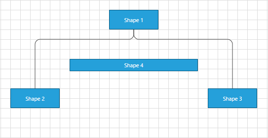

# Routing

__Routing__ - a mechanism using algorithms to make sure that the connections don't cross each other while building links/paths between the shapes. 

## Default Routing

Routing in __RadDiagram__ is only available if the __RadDiagram RouteConnections__ property is set to __True__.  Please note that its default value is __False__ and you need to explicitly declare you want to enable the routing features.
		  

	#### __XAML__
    <Grid>
      <Grid.Resources>
        
      </Grid.Resources>
      <telerik:RadDiagram RouteConnections="True"/>
    </Grid>
		  

>Please note that the examples in this tutorial are showcasing Telerik Windows8 theme. In the [Setting a Theme](http://www.telerik.com/help/silverlight/common-styling-apperance-setting-theme.html#Setting_Application-Wide_Built-In_Theme_in_the_Code-Behind)[Setting a Theme](http://www.telerik.com/help/wpf/common-styling-apperance-setting-theme-wpf.html#Setting_Application-Wide_Built-In_Theme_in_the_Code-Behind) article you can find more information on how to set an application-wide theme.
		  

The routing algorithm can be parametrized using the __DiagramConstants.RoutingGridSize__ constant that has a default value of __40__ units.

This value indicates the size of the cells of the underlying grid used by the algorithm:

* A bigger value will decrease the time to compute the optimal path and will diminish the possible wiggling of the connection path due to obstacles (other shapes). On the other hand, a bigger value will not necessarily lead to an optimal solution in certain circumstances. That is, if your diagram involves a  lot of shapes and a high complexity a bigger __RoutingGridSize__ will not find a path through the maze of shapes.

* A smaller value will increase the time tom compute the optimal path and increase the set of possible solutions for the path constraints. On the other hand, a small value leads usually to a lot of stairs/wiggling in the connection's path.

## OrgTreeRouter
	  

The __OrgTreeRouter__ is __LayoutType__ - based router that performs a hierarchical routing between parent and child shape. When a shape is being dragged, it removes only the crossings between the connection and its source and target shapes. It should be used when following conditions are satisfied:
		

* The __IsConnectorsManipulationEnabled__ is set to false.
			

* The __LayoutType__ is among the following 5 - __TipOverTree__, __TreeDown__, __TreeUp__, __TreeLeft__, __TreeRight__.

In order to use the OrgTreeRouter , you have to instantiate an OrgTreeRouter object and set it as current Router of the RadDiagram via the RoutingService:
#### __C#__
{{region raddiagram-features-routing-0}}
	public MainPage()
	{
		InitializeComponent();
		OrgTreeRouter router = new OrgTreeRouter()
		{
			 TreeLayoutType = TreeLayoutType.TreeDown,
			 ConnectionOuterSpacing = 20,
		};
		this.diagram.RoutingService.Router = router;
	}
	{{endregion}}

#### __VB.NET__

{{region raddiagram-features-routing-0}}
	Public Sub New()
		InitializeComponent()
		Dim router As New OrgTreeRouter() With { 
			 .TreeLayoutType = TreeLayoutType.TreeDown, 
			 .ConnectionOuterSpacing = 20 _
		
		Me.diagram.RoutingService.Router = router
	End Sub
	{{endregion}}

The TreeLayoutType points to the type of Layout you wish to use. The routing logic is based on this LayoutType.

The ConnectionOuterSpacing is the Minimum Margin between the Parent/Child Shape and the connection.
#### __XAML__
{{region raddiagram-features-routing-0}}
	<telerik:RadDiagram IsManipulationAdornerVisible="False" IsConnectorsManipulationEnabled="False" 
					x:Name="diagram" Width="1000" Height="500" Grid.Row="1" RouteConnections="True">
					<telerik:RadDiagramShape Width="45" Height="45" Content="Parent" x:Name="parentShape"/>
					<telerik:RadDiagramShape Width="45" Height="45" Content="Child1" x:Name="childShape1"/>
					<telerik:RadDiagramShape Width="45" Height="45" Content="Child2" x:Name="childShape2"/>
					<telerik:RadDiagramShape Width="45" Height="45" Content="Child2" x:Name="childShape3" />
					<telerik:RadDiagramShape Width="55" Height="25" Content="Child11" x:Name="subchildShape1" />
					<telerik:RadDiagramShape Width="55" Height="25" Content="Child12" x:Name="subchildShape2" />
					<telerik:RadDiagramConnection Source="{Binding ElementName=parentShape}" 
												  Target="{Binding ElementName=childShape1}" />
					<telerik:RadDiagramConnection Source="{Binding ElementName=childShape1}"
												  Target="{Binding ElementName=subchildShape1}" />
						<telerik:RadDiagramConnection Source="{Binding ElementName=childShape1}"
													  Target="{Binding ElementName=subchildShape2}" />
						<telerik:RadDiagramConnection Source="{Binding ElementName=parentShape}" 
													  Target="{Binding ElementName=childShape2}" />
					<telerik:RadDiagramConnection Source="{Binding ElementName=parentShape}"
												  Target="{Binding ElementName=childShape3}" />	
	
	</telerik:RadDiagram>
	{{endregion}}

Below you can see these shapes after TreeDown Layout operation performed on the Diagram.

The OrgTreeRouter is used in our __ClassDiagram__ and __OrgChart__ samples of RadDiagram.

## OrgTreeRouter : TipOverTreeRouter
	  

When the TreeLayoutType is set to TipOverTree, the OrgTreeRouter uses a special kind of router - the TipOverTreeRouter. It produces best visual results when a custom connectors are added in the bottom-left part of the shapes. In the following lines we will create a quick sample demonstrating the TipOverTree routing and how to configure it properly. Lets first define some shapes:
#### __XAML__
{{region raddiagram-features-routing-1}}
	<Grid.Resources>
				
				
			</Grid.Resources>
			<StackPanel>
				<telerik:RadButton Width="300" Height="30" HorizontalAlignment="Center" Content="Layout"
						Click="RadButton_Click" />
				<telerik:RadDiagram x:Name="diagram" Width="1000" Height="500" RouteConnections="True">
					<telerik:RadDiagramShape Content="Parent" x:Name="root"/>
	
					<telerik:RadDiagramShape  Content="Child1" x:Name="child1"/>
					<telerik:RadDiagramShape  Content="Child2" x:Name="child2"/>
					<telerik:RadDiagramShape  Content="Child3" x:Name="child3"/>
	
					<telerik:RadDiagramShape Content="SubChild1" x:Name="subChild1" />
					<telerik:RadDiagramShape Content="SubChild1" x:Name="subChild2" />
	
					<telerik:RadDiagramConnection Source="{Binding ElementName=root}" Target="{Binding ElementName=child1}" />
					<telerik:RadDiagramConnection Source="{Binding ElementName=root}" Target="{Binding ElementName=child2}" />
					<telerik:RadDiagramConnection Source="{Binding ElementName=root}" Target="{Binding ElementName=child3}" />
	
					<telerik:RadDiagramConnection Source="{Binding ElementName=child1}" Target="{Binding ElementName=subChild1}" />
					<telerik:RadDiagramConnection Source="{Binding ElementName=child1}" Target="{Binding ElementName=subChild2}" />
	
				</telerik:RadDiagram>
			</StackPanel>
	{{endregion}}

On a button's click event handler we will perform 3 base steps:

* Create custom connector points for every shape.

* Create TreeLayoutSettings and configure it.

* Create Router and assign it to be the default one.
#### __C#__
{{region raddiagram-features-routing-3}}
		private void RadButton_Click(object sender, RoutedEventArgs e)
			{
				PrepareShapesForTipOverTreeRouting();
				TreeLayoutSettings settings = new TreeLayoutSettings()
				{
					TreeLayoutType = TreeLayoutType.TipOverTree,
					UnderneathVerticalSeparation = 50,
					VerticalDistance = 50,
					UnderneathHorizontalOffset = 50,
					UnderneathVerticalTopOffset = 50
				};
				settings.Roots.Add(this.diagram.Shapes[0]);
				OrgTreeRouter router = new OrgTreeRouter()
				{
					TreeLayoutType = TreeLayoutType.TipOverTree,
					ConnectionOuterSpacing = 10
				};
				this.diagram.RoutingService.Router = router;
				this.diagram.Layout(LayoutType.Tree, settings);
			}
	
			private void PrepareShapesForTipOverTreeRouting()
			{
				foreach (var item in this.diagram.Shapes)
				{
					var connector = new RadDiagramConnector(){Offset = new Point(0.2, 1)};
					connector.Name = CustomConnectorPosition.TreeLeftBottom;
					item.Connectors.Add(connector);
				}
			}
	{{endregion}}

#### __VB.NET__

{{region raddiagram-features-routing-3}}
	Private Sub RadButton_Click(sender As Object, e As RoutedEventArgs)
		PrepareShapesForTipOverTreeRouting()
		Dim settings As New TreeLayoutSettings() With { 
			 .TreeLayoutType = TreeLayoutType.TipOverTree, 
			 .UnderneathVerticalSeparation = 50, 
			 .VerticalDistance = 50, 
			 .UnderneathHorizontalOffset = 50, 
			 .UnderneathVerticalTopOffset = 50 
		}
		settings.Roots.Add(Me.diagram.Shapes(0))
		Dim router As New OrgTreeRouter() With { 
			 .TreeLayoutType = TreeLayoutType.TipOverTree, 
			 .ConnectionOuterSpacing = 10 
		}
		Me.diagram.RoutingService.Router = router
		Me.diagram.Layout(LayoutType.Tree, settings)
	End Sub
	
	Private Sub PrepareShapesForTipOverTreeRouting()
		For Each item As var In Me.diagram.Shapes
			Dim connector = New RadDiagramConnector() With {
				.Offset = New Point(0.2, 1)
			}
			connector.Name = CustomConnectorPosition.TreeLeftBottom
			item.Connectors.Add(connector)
		Next
	End Sub
	{{endregion}}

Here is a possible result in Windows8 theme:

## Custom Router
	  

In the following section we will create a custom Router. This way we will be able to set the routing points of our Polyline Connections.

Lets first create some items:

	#### __XAML__
		  <telerik:RadDiagram x:Name="diagram">
		  <telerik:RadDiagramShape Position="100 100" Width="100" Height="30" Content="Shape A" x:Name="shapeA"/>
		  <telerik:RadDiagramShape Position="300 100" Width="100" Height="30" Content="Shape B" x:Name="shapeB"/>
		  <telerik:RadDiagramConnection Source="{Binding ElementName=shapeA}" Target="{Binding ElementName=shapeB}" ConnectionType="Polyline"/>
		  </telerik:RadDiagram>
		

Now we have to create class that implements the __IRouter__interface and override the GetRoutePoints() method:
		
#### __C#__
{{region raddiagram-features-routing-1}}
	public class CustomRouter : IRouter
	{
		public System.Collections.Generic.IList<Point> GetRoutePoints(IConnection connection, bool showLastLine)
		{
			List<Point> pointList = new List<Point>();
			Point start = connection.StartPoint;
			Point end = connection.EndPoint;
	
			pointList.Add(new Point(start.X + (end.X - start.X)*0.45, start.Y));
			pointList.Add(new Point((start.X + end.X)/2 , (start.Y + end.Y) / 2 - 50));
			pointList.Add(new Point((start.X + end.X)/2, (start.Y + end.Y) / 2 + 50));
			pointList.Add(new Point(start.X + (end.X - start.X) * 0.55, end.Y));	
	
			return pointList;
		}
	}
	{{endregion}}

#### __VB.NET__

{{region raddiagram-features-routing-1}}
	Public Class CustomRouter
		Implements IRouter
		Public Function GetRoutePoints(connection As IConnection, showLastLine As Boolean) As System.Collections.Generic.IList(Of Point)
			Dim pointList As New List(Of Point)()
			Dim start As Point = connection.StartPoint
			Dim [end] As Point = connection.EndPoint
	
			pointList.Add(New Point(start.X + ([end].X - start.X) * 0.45, start.Y))
			pointList.Add(New Point((start.X + [end].X) / 2, (start.Y + [end].Y) / 2 - 50))
			pointList.Add(New Point((start.X + [end].X) / 2, (start.Y + [end].Y) / 2 + 50))
			pointList.Add(New Point(start.X + ([end].X - start.X) * 0.55, [end].Y))
	
			Return pointList
		End Function
	End Class
	{{endregion}}

Please note that we only have to add in the list the route points, no need to add the start and the end point of the connection.

The final step is to make our Router the current one of the Diagram. This is done via Diagram's Routing Service;
#### __C#__
{{region raddiagram-features-routing-2}}
	this.diagram.RoutingService.Router = new CustomRouter();
	{{endregion}}

#### __VB.NET__
{{region raddiagram-features-routing-2}}
	this.diagram.RoutingService.Router = new CustomRouter();
	{{endregion}}

Below you can see a possible output (Windows8 theme is applied). The custom points that router creates are marked with 1,2,3,4:

# See Also

 * [Populating with Data]()

 * [Layout]()
