# Getting Started with {{ site.framework_name }} Diagram

Telerik __RadDiagrams__ are a powerful diagramming framework that can bring to life your rich data-visualization scenarios. This tutorial will walk you through the main concepts and tools of the diagramming framework and help you to create the flow diagram of an "if-else" operator.

#### __Figure 1: Flow diagram example__  
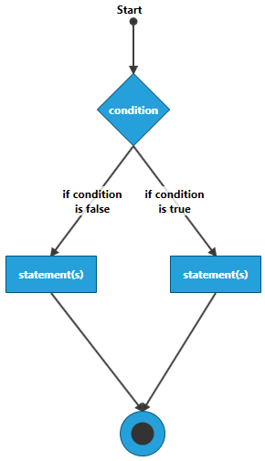

## Adding Telerik Assemblies Using NuGet

To use `RadDiagram` when working with NuGet packages, install the `Telerik.Windows.Controls.Diagrams.for.Wpf.Xaml` package. The [package name may vary]() slightly based on the Telerik dlls set - [Xaml or NoXaml]()

Read more about NuGet installation in the [Installing UI for WPF from NuGet Package]() article.

>tip With the 2025 Q1 release, the Telerik UI for WPF has a new licensing mechanism. You can learn more about it [here]().

## Adding Assembly References Manually

If you are not using NuGet packages, you can add a reference to the following assemblies:

* __Telerik.Licensing.Runtime__
* __Telerik.Windows.Controls__
* __Telerik.Windows.Controls.Diagrams__
* __Telerik.Windows.Diagrams.Core__

To use the RadDiagram [MVVM support]() or one of the extensions tools like the [settings pane]() or the [toolbox]() you will need to add reference also to the following assemblies:

* __Telerik.Windows.Controls.Diagrams.Extensions__ 
* __Telerik.Windows.Controls.Input__
* __Telerik.Windows.Controls.Navigation__

The following picture shows the interdependency between the RadDiagram main assemblies. Note that the Telerik.Windows.Controls.Diagrams.Extensions relies also on Telerik.Windows.Controls.Input and Telerik.Windows.Controls.Navigation.

#### __Figure 2: Interdependency of the RadDiagram control main assemblies__  
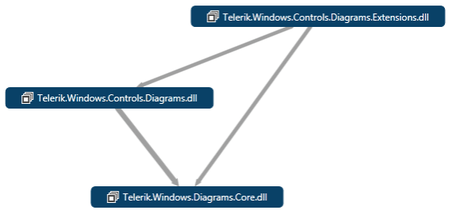

>tip You can find more info about the __Telerik UI for WPF__ dependencies in the [Controls Dependencies]() help article.

## Graph Object Model

The __Graph Object Model__ is the main concept behind the diagramming framework. It contains the following three main objects:		

* __Graph__ - this is the structure that contains the __RadDiagramShapes__ and __RadDiagramConnections__. In the __Telerik Diagramming Framework__, the graph is represented by the __RadDiagram__ class.

* __Shape__ - the shape describes a node of a __Graph__ that in the __Telerik Diagramming Framework__ is represented by the __RadDiagramShape__ class.			

* __Connection__ - the connection describes the edges of the graph and it is basically an object that connects zero, one or two shapes. In the __Telerik Diagramming Framework__, the connection is represented by the __RadDiagramConnection__ class.			

>tip The __RadDiagram__ items are represented by the __RadDiagramItem__ class. Therefore, both __RadDiagramConnection__ and __RadDiagramShape__ classes derive from the __RadDiagramItem__ class.		  

>important In order to populate the __RadDiagram__ with __RadDiagramItems__, you can add __RadDiagramShapes__ and __RadDiagramConnections__ in the __RadDiagram.Items__ collection from code-behind ([read more]()) or declaratively in xaml ([read more]()). Also, because the __RadDiagram__ control is a data-driven control, it supports data binding. In order to bind the __RadDiagram__ to a collection, you can use its __GraphSource__ property. Note that when the __GraphSource__ property is set, the __Items__ collection is made read-only and fixed-size.  For more information, please refer to the [DataBinding]() tutorial.	

>Please note that the examples in this tutorial are showcasing the Telerik Windows8 theme. In the [Setting a Theme](http://www.telerik.com/help/silverlight/common-styling-apperance-setting-theme.html#Setting_Application-Wide_Built-In_Theme_in_the_Code-Behind)[Setting a Theme](http://www.telerik.com/help/wpf/common-styling-apperance-setting-theme-wpf.html#Setting_Application-Wide_Built-In_Theme_in_the_Code-Behind) article you can find more information on how to set an application-wide theme.		

## Setting Up the Drawing Canvas

Before proceeding with adding __RadDiagram__ to your project, make sure the required assembly references are added to the project. When you want to create a diagram in your application, you first need to add the __RadDiagram__ control, as it represents the main canvas onto which the diagramming tools and shapes are drawn.		

#### __[XAML] Example 1: Adding RadDiagram in XAML__  
{{region raddiagram_getting_started_0}}
	<telerik:RadDiagram />
{{endregion}}

#### __Figure 3: Default drawing canvas:__  

> __RadDiagram__ exposes a set of properties that allow you to customize the graph layout and operations. For example, you can set up the active mouse tool, specify if a cut, copy, paste or delete operation is allowed, and customize the background color, the cells' height and width as well as the __GridLine__ thickness of the drawing canvas.		  

## Adding RadDiagramShapes

In order to create a diagram describing the flow of an "if-else" operator, you will need four shapes - two will represent the statements, one will describe the condition and one will represent the final result of the operator.

Let's start with the condition of the "if-else" operator. In a block diagram, a condition is usually described by a diamond shape, called a __decision__ shape.		

>tip The __RadDiagramShape__ exposes a __Geometry__ property that allows you to create a custom geometry or use predefined shape geometry. The predefined shape geometries in the __Telerik Diagramming Framework__ are described by the __ArrowShape__, __CommonShape__ and __FlowChartShape__ extension classes. For more information, pelase refer to the [DiagramShapes]() tutorial.		  

#### __[XAML] Example 2: Adding RadDiagramShape in XAML__  
{{region raddiagram_getting_started_1}}
	<telerik:RadDiagram>
		<telerik:RadDiagramShape Geometry="{telerik:FlowChartShape ShapeType=DecisionShape}" />
	</telerik:RadDiagram>
{{endregion}}

#### __Figure 4: DecisionShape default visual look__  
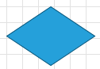

You can define the size of the shape and set its __Content__ and __x:Name__ properties to better describe it.		

#### __[XAML] Example 3: Customize DecisionShape in XAML__  
{{region raddiagram_getting_started_2}}
	<telerik:RadDiagram>
		<telerik:RadDiagramShape x:Name="ConditionShape"
								 Width="80"
								 Height="80"
								 Content="condition"
								 FontWeight="Bold"
								 Geometry="{telerik:FlowChartShape ShapeType=DecisionShape}" />
	</telerik:RadDiagram>
{{endregion}}

#### __Figure 5: Customized DecisionShape visual look__  
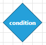

To describe the statements of the "if-else" operator you can use the default geometry of the __RadDiagramShape__.		

#### __[XAML] Example 4: Setting default geometry of the RadDiagramShape in XAML__  
{{region raddiagram_getting_started_3}}
	<telerik:RadDiagram>
		<telerik:RadDiagramShape x:Name="ConditionShape"
								 Width="80"
								 Height="80"
								 Content="condition"
								 FontWeight="Bold"
								 Geometry="{telerik:FlowChartShape ShapeType=DecisionShape}" />
		<telerik:RadDiagramShape x:Name="StatementShape1"
								 Width="100"
								 Content="statement(s)"
								 FontWeight="Bold" />
		<telerik:RadDiagramShape x:Name="StatementShape2"
								 Width="100"
								 Content="statement(s)"
								 FontWeight="Bold" />
	</telerik:RadDiagram>
{{endregion}}

#### __Figure 6: RadDiagramShapes without its Position property set__  
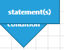

Adding multiple shapes in the __RadDiagram__ without setting their position, by default, will position all shapes at the top left corner of the drawing canvas. In order to rearrange their layout, you need to set the __Position__ property of each shape. This property is of type __Point__ and it gets or sets the coordinates of the top left point of a shape.		

#### __[XAML] Example 5: Set the Position property in XAML__  
{{region raddiagram_getting_started_4}}
	<telerik:RadDiagram>
		<telerik:RadDiagramShape x:Name="ConditionShape"
								 Width="80"
								 Height="80"
								 Content="condition"
								 FontWeight="Bold"
								 Geometry="{telerik:FlowChartShape ShapeType=DecisionShape}"
								 Position="160,80" />
		<telerik:RadDiagramShape x:Name="StatementShape1"
								 Width="100"
								 Content="statement(s)"
								 FontWeight="Bold"
								 Position="60,280" />
		<telerik:RadDiagramShape x:Name="StatementShape2"
								 Width="100"
								 Content="statement(s)"
								 FontWeight="Bold"
								 Position="240,280" />
	</telerik:RadDiagram>
{{endregion}}

#### __Figure 7: RadDiagramShape with its Position property set__  
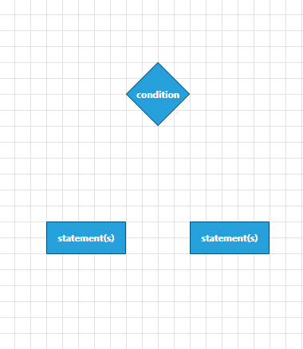

To describe the final result of the operator you can use an ellipse shape. __Telerik Diagramming Framework__ provides such a predefined shape. You can find a shape of type __EllipseShape__ in the __CommonShape__ extension class.		

#### __[XAML] Example 6: Declaring EllipseShape in XAML__  
{{region raddiagram_getting_started_5}}
	<telerik:RadDiagram>
		<telerik:RadDiagramShape x:Name="EndShape"
								 Width="50"
								 Height="50"
								 Content="End"
								 FontWeight="Bold"
								 Geometry="{telerik:CommonShape ShapeType=EllipseShape}" />
	</telerik:RadDiagram>
{{endregion}}

#### __Figure 8: Customized EllipseShape look__  
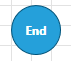

>tip The __RadDiagramItem__ class exposes __ContentTemplate__ and __ContentTemplateSelector__ properties that allow you to customize the content of the __RadDiagramShapes__ and __RadDiagramConnections__.		  

You can customize the content of the ellipse __RadDiagramShape__ to mark it as the end of the "if-else" flow diagram.		

#### __[XAML] Example 7: Customize EllipseShape in XAML__  
{{region raddiagram_getting_started_6}}
	<telerik:RadDiagram>
		<telerik:RadDiagramShape x:Name="ConditionShape"
								 Width="80"
								 Height="80"
								 Content="condition"
								 FontWeight="Bold"
								 Geometry="{telerik:FlowChartShape ShapeType=DecisionShape}"
								 Position="160,80" />
		<telerik:RadDiagramShape x:Name="StatementShape1"
								 Width="100"
								 Content="statement(s)"
								 FontWeight="Bold"
								 Position="60,280" />
		<telerik:RadDiagramShape x:Name="StatementShape2"
								 Width="100"
								 Content="statement(s)"
								 FontWeight="Bold"
								 Position="240,280" />
		<telerik:RadDiagramShape x:Name="EndShape"
								 Width="50"
								 Height="50"
								 FontWeight="Bold"
								 Geometry="{telerik:CommonShape ShapeType=EllipseShape}"
								 Position="185,450">
			<telerik:RadDiagramShape.ContentTemplate>
				<DataTemplate>
					<Ellipse Width="25"
							 Height="25"
							 Fill="#FF333333" />
				</DataTemplate>
			</telerik:RadDiagramShape.ContentTemplate>
		</telerik:RadDiagramShape>
	</telerik:RadDiagram>
{{endregion}}

#### __Figure 9: Customized EllipseShape__

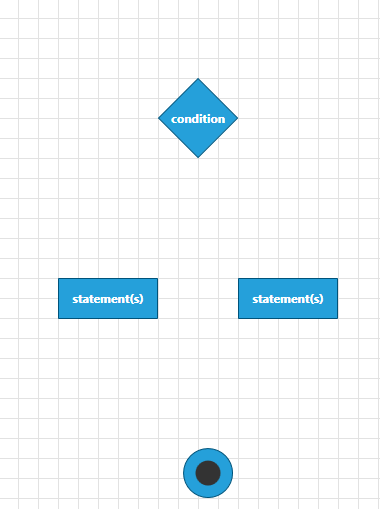

## Adding RadDiagramConnections

Finally, you can connect all shapes using __RadDiagramConnections__.		

>tip The __RadDiagramConnection__ class exposes a set of properties that allow you to define and customize the source and target of the connection. For more information, please refer to the [DiagramConnection]() tutorial.		  

In order to connect the shapes and finish the flow diagram of the "if-else" operator, you need to set up 5 connections: 

* Add connections between the 'condition' shape and the 'statements' shapes:			

	#### __[XAML] Example 8: Adding RadDiagramConnection in XAML__  
	{{region raddiagram_getting_started_7}}
		<telerik:RadDiagramConnection Content="if condition is false"
									  FontWeight="Bold"
									  Source="{Binding ElementName=ConditionShape}"
									  SourceConnectorPosition="Bottom"
									  StrokeThickness="2"
									  Target="{Binding ElementName=StatementShape1}"
									  TargetCapType="Arrow1Filled">
			<telerik:RadDiagramConnection.ContentTemplate>
				<DataTemplate>
					<TextBlock Width="70"
							   TextAlignment="Center"
							   Text="{Binding}"
							   TextWrapping="Wrap" />
				</DataTemplate>
			</telerik:RadDiagramConnection.ContentTemplate>
		</telerik:RadDiagramConnection>
		<telerik:RadDiagramConnection Content="if condition is true"
									  FontWeight="Bold"
									  Source="{Binding ElementName=ConditionShape}"
									  SourceConnectorPosition="Bottom"
									  StrokeThickness="2"
									  Target="{Binding ElementName=StatementShape2}"
									  TargetCapType="Arrow1Filled">
			<telerik:RadDiagramConnection.ContentTemplate>
				<DataTemplate>
					<TextBlock Width="70"
							   TextAlignment="Center"
							   Text="{Binding}"
							   TextWrapping="Wrap" />
				</DataTemplate>
			</telerik:RadDiagramConnection.ContentTemplate>
		</telerik:RadDiagramConnection>
	{{endregion}}

	#### __Figure 10: RadDiagramConnection visual example__
	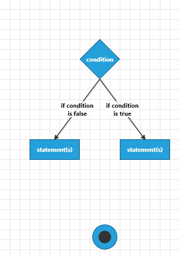

* Add connections between the 'statements' shape and the 'final result' shapes:		

	#### __[XAML] Example 9: Add connection between shapes__
	{{region raddiagram_getting_started_8}}
		<telerik:RadDiagramConnection Source="{Binding ElementName=StatementShape1}"
									  SourceConnectorPosition="Bottom"
									  StrokeThickness="2"
									  Target="{Binding ElementName=EndShape}"
									  TargetCapType="Arrow1Filled" />
		<telerik:RadDiagramConnection Source="{Binding ElementName=StatementShape2}"
									  SourceConnectorPosition="Bottom"
									  StrokeThickness="2"
									  Target="{Binding ElementName=EndShape}"
									  TargetCapType="Arrow1Filled" />
	{{endregion}}

	#### __Figure 11: RadDiagramConnection visual example__
	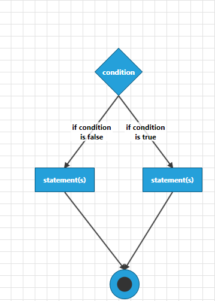

* Add the connection that points to the start of the operator:			

	#### __[XAML] Example 10: Setting custom DataTemplate to RadDiagramConnection__
	{{region raddiagram_getting_started_9}}
		<telerik:RadDiagramConnection HorizontalContentAlignment="Center"
									  VerticalContentAlignment="Top"
									  Content="Start"
									  FontWeight="Bold"
									  SourceCapType="Arrow6Filled"
									  StrokeThickness="2"
									  Target="{Binding ElementName=ConditionShape}"
									  TargetCapType="Arrow1Filled"
									  StartPoint="200,20">
			<telerik:RadDiagramConnection.ContentTemplate>
				<DataTemplate>
					<TextBlock Margin="-18"
							   Text="{Binding}" />
				</DataTemplate>
			</telerik:RadDiagramConnection.ContentTemplate>
		</telerik:RadDiagramConnection>
	{{endregion}}
	
	#### __Figure 12: Customized RadDiagramConnection__
	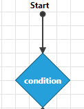

## RadDiagram Example - "if-else" Operator Flow Diagram

You can find the final XAML definition of the "if-else" flow diagram in __Example 11__.

#### __[XAML] Example 11: Final "if-else" flow diagram XAML__
{{region raddiagram_getting_started_10}}
	<telerik:RadDiagram>
		<telerik:RadDiagramShape x:Name="ConditionShape"
								 Width="80"
								 Height="80"
								 Content="condition"
								 FontWeight="Bold"
								 Geometry="{telerik:FlowChartShape ShapeType=DecisionShape}"
								 Position="160,80" />
		<telerik:RadDiagramConnection HorizontalContentAlignment="Center"
									  VerticalContentAlignment="Top"
									  Content="Start"
									  FontWeight="Bold"
									  SourceCapType="Arrow6Filled"
									  StrokeThickness="2"
									  Target="{Binding ElementName=ConditionShape}"
									  TargetCapType="Arrow1Filled"
									  StartPoint="200,20">
			<telerik:RadDiagramConnection.ContentTemplate>
				<DataTemplate>
					<TextBlock Margin="-18" Text="{Binding}" />
				</DataTemplate>
			</telerik:RadDiagramConnection.ContentTemplate>
		</telerik:RadDiagramConnection>
		<telerik:RadDiagramShape x:Name="StatementShape1"
								 Width="100"
								 Content="statement(s)"
								 FontWeight="Bold"
								 Position="60,280" />
		<telerik:RadDiagramConnection Content="if condition is false"
									  FontWeight="Bold"
									  Source="{Binding ElementName=ConditionShape}"
									  SourceConnectorPosition="Bottom"
									  StrokeThickness="2"
									  Target="{Binding ElementName=StatementShape1}"
									  TargetCapType="Arrow1Filled">
			<telerik:RadDiagramConnection.ContentTemplate>
				<DataTemplate>
					<TextBlock Width="70"
							   Text="{Binding}"
							   TextAlignment="Center"
							   TextWrapping="Wrap" />
				</DataTemplate>
			</telerik:RadDiagramConnection.ContentTemplate>
		</telerik:RadDiagramConnection>
		<telerik:RadDiagramShape x:Name="StatementShape2"
								 Width="100"
								 Content="statement(s)"
								 FontWeight="Bold"
								 Position="240,280" />
		<telerik:RadDiagramConnection Content="if condition is true"
									  FontWeight="Bold"
									  Source="{Binding ElementName=ConditionShape}"
									  SourceConnectorPosition="Bottom"
									  StrokeThickness="2"
									  Target="{Binding ElementName=StatementShape2}"
									  TargetCapType="Arrow1Filled">
			<telerik:RadDiagramConnection.ContentTemplate>
				<DataTemplate>
					<TextBlock Width="70"
							   Text="{Binding}"
							   TextAlignment="Center"
							   TextWrapping="Wrap" />
				</DataTemplate>
			</telerik:RadDiagramConnection.ContentTemplate>
		</telerik:RadDiagramConnection>
		<telerik:RadDiagramShape x:Name="EndShape"
								 Width="50"
								 Height="50"
								 FontWeight="Bold"
								 Geometry="{telerik:CommonShape ShapeType=EllipseShape}"
								 Position="185,450">
			<telerik:RadDiagramShape.ContentTemplate>
				<DataTemplate>
					<Ellipse Width="25"
							 Height="25"
							 Fill="#FF333333" />
				</DataTemplate>
			</telerik:RadDiagramShape.ContentTemplate>
		</telerik:RadDiagramShape>
		<telerik:RadDiagramConnection Source="{Binding ElementName=StatementShape1}"
									  SourceConnectorPosition="Bottom"
									  StrokeThickness="2"
									  Target="{Binding ElementName=EndShape}"
									  TargetCapType="Arrow1Filled" />
		<telerik:RadDiagramConnection Source="{Binding ElementName=StatementShape2}"
									  SourceConnectorPosition="Bottom"
									  StrokeThickness="2"
									  Target="{Binding ElementName=EndShape}"
									  TargetCapType="Arrow1Filled" />
	</telerik:RadDiagram>
{{endregion}}

#### __Figure 13: "if-else" operator flow diagram visual look__  
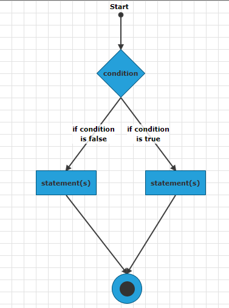

## Setting a Theme

The controls from our suite support different themes. You can see how to apply a theme different than the default one in the [Setting a Theme]() help article.

>important Changing the theme using implicit styles will affect all controls that have styles defined in the merged resource dictionaries. This is applicable only for the controls in the scope in which the resources are merged. 

To change the theme, you can follow the steps below:

* Choose between the themes and add reference to the corresponding theme assembly (ex: **Telerik.Windows.Themes.Windows8.dll**). You can see the different themes applied in the **Theming** examples from our [WPF Controls Examples](https://demos.telerik.com/wpf/)[Silverlight Controls Examples](https://demos.telerik.com/silverlight/#Diagrams/Theming) application.

* Merge the ResourceDictionaries with the namespace required for the controls that you are using from the theme assembly. For the __RadDiagram__, you will need to merge the following resources:

	* __Telerik.Windows.Controls__
	* __Telerik.Windows.Controls.Diagrams__
	* __Telerik.Windows.Controls.Diagrams.Extensions__ 
	* __Telerik.Windows.Controls.Input__
	* __Telerik.Windows.Controls.Navigation__

__Example 12__ demonstrates how to merge the ResourceDictionaries so that they are applied globally for the entire application.

#### __[XAML] Example 12: Merge the ResourceDictionaries__  
{{region raddesktopalert-getting-started_6}}
	<Application.Resources>
		<ResourceDictionary>
			<ResourceDictionary.MergedDictionaries>
				<ResourceDictionary Source="/Telerik.Windows.Themes.Windows8;component/Themes/System.Windows.xaml"/>
				<ResourceDictionary Source="/Telerik.Windows.Themes.Windows8;component/Themes/Telerik.Windows.Controls.xaml"/>
				<ResourceDictionary Source="/Telerik.Windows.Themes.Windows8;component/Themes/Telerik.Windows.Controls.Navigation.xaml"/>
				<ResourceDictionary Source="/Telerik.Windows.Themes.Windows8;component/Themes/Telerik.Windows.Controls.Input.xaml"/>				
				<ResourceDictionary Source="/Telerik.Windows.Themes.Windows8;component/Themes/Telerik.Windows.Controls.Diagrams.xaml"/>
				<ResourceDictionary Source="/Telerik.Windows.Themes.Windows8;component/Themes/Telerik.Windows.Controls.Diagrams.Extensions.xaml"/>
			</ResourceDictionary.MergedDictionaries>
		</ResourceDictionary>
	</Application.Resources>
{{endregion}}

>Alternatively, you can use the theme of the control via the [StyleManager](https://docs.telerik.com/devtools/wpf/styling-and-appearance/stylemanager/common-styling-apperance-setting-theme-wpf)[StyleManager](https://docs.telerik.com/devtools/silverlight/styling-and-appearance/stylemanager/common-styling-apperance-setting-theme).

__Figure 14__ shows a __RadDiagram__ with the **Windows8** theme applied.

#### __Figure 14: RadDiagram with the Windows8 theme__


## Telerik UI for WPF Learning Resources

* [Telerik UI for WPF Diagrams Component](https://www.telerik.com/products/wpf/diagrams.aspx)
* [Getting Started with Telerik UI for WPF Components]()
* [Telerik UI for WPF Installation]()
* [Telerik UI for WPF and WinForms Integration]()
* [Telerik UI for WPF Visual Studio Templates]()
* [Setting a Theme with Telerik UI for WPF]()
* [Telerik UI for WPF Virtual Classroom (Training Courses for Registered Users)](https://learn.telerik.com/learn/course/external/view/elearning/16/telerik-ui-for-wpf) 
* [Telerik UI for WPF License Agreement](https://www.telerik.com/purchase/license-agreement/wpf-dlw-s)


## See Also
 * [Populating with Data]()
 * [Shapes]()
 * [Connections]()
 * [Items Editing]()
 * [Removing Items]()
 * [Mouse Tools]()
 * [Keyboard Support]()
 * [Rotation]()
 * [Resizing]()
 * [ZOrder]()
 * [Selection]()
 * [Diagram Events]()
 * [Items Events]()
 * [Customized Appearance]()
 * [Global Settings]()
