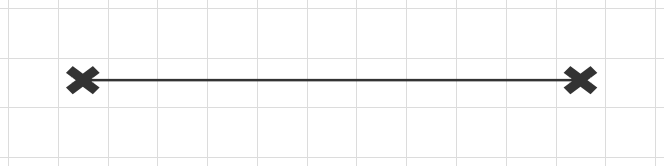
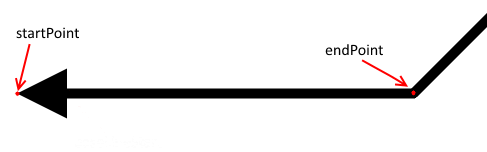
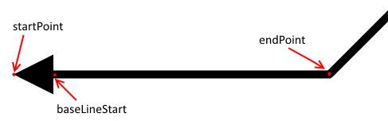
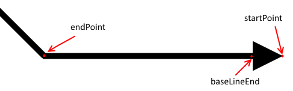
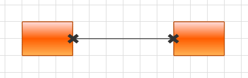

# Create Custom Connection Cap

This tutorial will guide you through the task of creating custom connection cap. The final result will look like this.

>With the __2024 Q3 SP1__ release, the RadDiagram control requires registering the custom types of shapes, connections, and connectors, in order to deserialize them successfully. Read more about this change [here](#allowing-safe-types-and-assemblies).

To implement the neccesary customization you need to create custom class deriving from our RadDiagramConnection and override a couple of methods. Our comopnent exposes the __CreateSourceCapGeometry()__ and __CreateTargetCapGeometry()__ methods which we will take advantage of. As their names imply the CreateSourceCapGeometry() generates the source cap and the CreateTargetCapGeometry() generates the target cap. These methods should return an object of type __PathFigure__ which is further used as the respective cap of the RadDiagramConnection. The customized implementation of those methods should create the desired PathFigures based on three points. Those points are received as parameters of the methods.

In the __CreateSourceCapGeometry()__ method the first parameter is called _startPoint_ and marks the position of the connection's connector. The second parameter is called _endPoint_ and marks the furthest point of the first section of the connection. For better understanding please refer to the next picture.

Based on these two points you can determine the angle of the first section of the connection. This allows you to adjust the cap to that angle so that it follows the direction of the connection's section. The third parameter is named _baseLineStart_. It marks the starting point of the actual line of the connction. 

>The third point should be set in your custom logic. In other words, you can control the starting point of the actual line.

In the __CreateTargetCapGeometry()__ method the parameters serve for the very same purpose and should be used just like the prameter of the other method. For clarification please refer the following picture.

# Example

The next code snippet will create custom connection caps as shown in the beggining of this article.

<snippet id='raddiagram-howto-create-custom-connectioncap-block_1-cs' />

<snippet id='raddiagram-howto-create-custom-connectioncap-block_1-vb' />

After utilising this code you can go in XAML and use your custom connection like this:

<snippet id='raddiagram-howto-create-custom-connectioncap-block_2-xaml' />

		
>"__local__" points to the namespace where the CustomConnection class is defined. Note, that if you are using the NoXaml dlls, you should base the style for the CustomConnection on the [default one for the theme](#styling-custom-controls).

## See Also
* [How To Create Custom Shape]()
* [Connections]()
