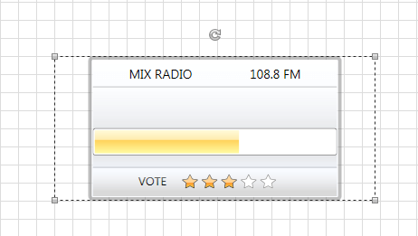

# Create Custom Shape

This tutorial will guide you through the task of creating a custom shape.

In order to create a custom shape control, you need to define a custom control deriving from the __RadDiagramShapeBase__ or the __RadDiagramShape__ class.	

>With the __2024 Q3 SP1__ release, the RadDiagram control requires registering the custom types of shapes, connections, and connectors, in order to deserialize them successfully. Read more about this change [here](#allowing-safe-types-and-assemblies).

>When deciding which class to inherit from, you need to keep in mind that the __RadDiagramShapeBase__ is the base class of the Diagramming shapes and therefore the __RadDiagramShape__ class derives from it. This is why when you need to create a custom shape, it's common to inherit the base class. However if you need a custom shape exposing a __Geometry__ property, then you'll need to derive from the __RadDiagramShape__ class.		  

Let's take this step by step:

* First you need to create a custom control. In order to do so you can use the __Visual Studio -> Add New Item...__ dialog to add __Silverlight Templated Control____WPF Custom Control__

	

	Name the new control *CustomShape* and click OK. This action will create two new files in your application - a class file and a Generic.xaml file with the default style of your custom control.
	
	```C#
		public class CustomShape : Control
		{
			static CustomShape()
			{
				DefaultStyleKeyProperty.OverrideMetadata(typeof(CustomShape), new FrameworkPropertyMetadata(typeof(CustomShape)));
			}
		}	
	```
	
	```XAML
		<Style TargetType="{x:Type local:CustomShape}">
			<Setter Property="Template">
				<Setter.Value>
					<ControlTemplate TargetType="{x:Type local:CustomShape}">
						<Border Background="{TemplateBinding Background}"
								BorderBrush="{TemplateBinding BorderBrush}"
								BorderThickness="{TemplateBinding BorderThickness}">
						</Border>
					</ControlTemplate>
				</Setter.Value>
			</Setter>
		</Style>
	```

* Change the type of the __CustomShape__ class to derive from __RadDiagramShapeBase__:			

	```C#
		public class CustomShape : Telerik.Windows.Controls.Diagrams.RadDiagramShapeBase
		{
		  ...
		}
	```
	
* Modify the default __ControlTemplate__ of the __CustomShape__ to better fit your needs. In this tutorial we will create a radio station loading shape which displays the name and frequency of a radio station. It also indicates the current loading process and the rating of the station. Below you can find the custom __Style__ for that shape:			

	```XAML
		<Style TargetType="local:CustomShape">
			<Setter Property="BorderThickness" Value="4" />
			<Setter Property="BorderBrush" Value="#6C666666" />
			<Setter Property="Width" Value="355" />
			<Setter Property="Height" Value="160" />
			<Setter Property="HorizontalAlignment" Value="Center" />
			<Setter Property="Margin" Value="0" />
			<Setter Property="Background">
				<Setter.Value>
					<LinearGradientBrush StartPoint="0.5,0" EndPoint="0.5,1">
						<GradientStop Color="White" />
						<GradientStop Offset="1" Color="#FFEDF4FF" />
					</LinearGradientBrush>
				</Setter.Value>
			</Setter>
			<Setter Property="Template">
				<Setter.Value>
					<ControlTemplate TargetType="local:CustomShape">
						<Border Margin="{TemplateBinding Margin}"
								HorizontalAlignment="{TemplateBinding HorizontalAlignment}"
								BorderBrush="{TemplateBinding BorderBrush}"
								BorderThickness="{TemplateBinding BorderThickness}"
								CornerRadius="3">
							<Border Background="{TemplateBinding Background}"
									BorderBrush="#E6FBFDFF"
									BorderThickness="1"
									CornerRadius="1">
								<StackPanel>
									<Grid Margin="40 5" VerticalAlignment="Center">
										<TextBlock FontFamily="Segoe UI"
												   FontSize="14"
												   Text="MIX RADIO" />
										<TextBlock HorizontalAlignment="Right"
												   FontFamily="Segoe UI"
												   FontSize="14"
												   Text="108.8 FM" />
									</Grid>

									<Border Height="90"
											BorderBrush="#6C666666"
											BorderThickness="0 1">
										<Border.Background>
											<LinearGradientBrush StartPoint="0.5,0" EndPoint="0.5,1">
												<GradientStop Offset="0" Color="#65FFFFFF" />
												<GradientStop Offset="0.965" Color="#66E7E5E5" />
												<GradientStop Offset="0.609" Color="#9DD9D9D9" />
												<GradientStop Offset="0.826" Color="#A5D9D9D9" />
											</LinearGradientBrush>
										</Border.Background>
										<StackPanel HorizontalAlignment="Center" VerticalAlignment="Center">
											<TextBlock x:Name="BufferingPercentageLabel"
													   Margin="0 0 0 15"
													   HorizontalAlignment="Center"
													   FontFamily="Segoe UI"
													   FontSize="13">
												<TextBlock.Foreground>
													<LinearGradientBrush StartPoint="0.5,0" EndPoint="0.5,1">
														<GradientStop Offset="1" Color="Black" />
														<GradientStop Color="#FF727272" />
													</LinearGradientBrush>
												</TextBlock.Foreground>
											</TextBlock>
											<telerik:RadProgressBar x:Name="BufferingProgressBar"
																	Width="270"
																	Height="30"
																	Maximum="100"
																	Minimum="0"
																	Value="60" />
										</StackPanel>
									</Border>

									<Border Padding="0 5">
										<Border.Background>
											<LinearGradientBrush StartPoint="0.5,0" EndPoint="0.5,1">
												<GradientStop Offset="0.07" Color="#7FFFFFFF" />
												<GradientStop Offset="0.965" Color="#7EE7E5E5" />
												<GradientStop Offset="0.61" Color="#FFD9D9D9" />
												<GradientStop Offset="0.826" Color="#FFD9D9D9" />
											</LinearGradientBrush>
										</Border.Background>
										<StackPanel HorizontalAlignment="Center" Orientation="Horizontal">
											<TextBlock Margin="0 0 0 15"
													   HorizontalAlignment="Center"
													   VerticalAlignment="Center"
													   FontFamily="Segoe UI"
													   FontSize="13"
													   Text="VOTE">
												<TextBlock.Foreground>
													<LinearGradientBrush StartPoint="0.5,0" EndPoint="0.5,1">
														<GradientStop Offset="1" Color="Black" />
														<GradientStop Color="#FF727272" />
													</LinearGradientBrush>
												</TextBlock.Foreground>
											</TextBlock>
											<telerik:RadRating x:Name="Rating"
															   Margin="15 0"
															   HorizontalAlignment="Center"
															   Value="3" />
										</StackPanel>
									</Border>
								</StackPanel>
							</Border>
						</Border>
					</ControlTemplate>
				</Setter.Value>
			</Setter>
		</Style>	
	```		
		
* Now that your custom control is defined and its __ControlTemplate__ is customized, you can use it as a shape in your Diagramming drawing canvas:			

	```XAML
        <telerik:RadDiagram>
            <local:CustomShape />
        </telerik:RadDiagram>			  
	```
	
	>The __local__ alias points to the namespace of the __CustomShape__ class. 
	
As a result you'll get the following custom shape:


Please note that in case you need to bind the __RadDiagram__ control to a collection of business data and you need to display the business data in a custom shape, then you have to create a custom __RadDiagram__. In the custom diagram class you need to override the __IsItemItsOwnShapeContainerOverride__ and __GetShapeContainerForItemOverride__ methods to return the custom shape type:		

> In scenarios where you want to create custom container shapes, you can override the GetShapeContainerForItemOverridem method of the RadDiagram. Inside the method, you can return your custom container shape.

```C#
	public class CustomDiagram : RadDiagram
	{
		protected override bool IsItemItsOwnShapeContainerOverride(object item)
		{
			return item is CustomShape;
		}

		protected override Telerik.Windows.Diagrams.Core.IShape GetShapeContainerForItemOverride(object item)
		{
			return new CustomShape();
		}
	}			  
```
```VB.NET
	Public Class CustomDiagram
		Inherits RadDiagram
		Protected Overrides Function IsItemItsOwnShapeContainerOverride(item As Object) As Boolean
			Return TypeOf item Is CustomShape
		End Function

		Protected Overrides Function GetShapeContainerForItemOverride(item As Object) As Telerik.Windows.Diagrams.Core.IShape
			Return New CustomShape()
		End Function
	End Class		  
```
	
You can download a sample project from our [CodeLibrary](http://www.telerik.com/community/code-library/silverlight/diagrams/how-to-create-a-custom-shape.aspx)[CodeLibrary](http://www.telerik.com/community/code-library/wpf/diagrams/how-to-create-a-custom-shape.aspx).		

## See Also
 * [Shapes]()
 * [Use MVVM in RadDiagram]()
 * [Iterate Over the Diagram Items]()