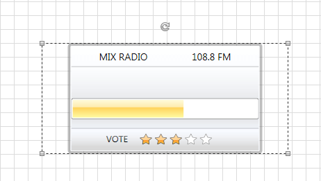

# Create Custom Shape

This tutorial will guide you through the task of creating a custom shape.

In order to create a custom shape control, you need to define a custom control deriving from the __RadDiagramShapeBase__ or the __RadDiagramShape__ class.	

>With the __2024 Q3 SP1__ release, the RadDiagram control requires registering the custom types of shapes, connections, and connectors, in order to deserialize them successfully. Read more about this change [here](#allowing-safe-types-and-assemblies).

>When deciding which class to inherit from, you need to keep in mind that the __RadDiagramShapeBase__ is the base class of the Diagramming shapes and therefore the __RadDiagramShape__ class derives from it. This is why when you need to create a custom shape, it's common to inherit the base class. However if you need a custom shape exposing a __Geometry__ property, then you'll need to derive from the __RadDiagramShape__ class.		  

Let's take this step by step:

* First you need to create a custom control. In order to do so you can use the __Visual Studio -> Add New Item...__ dialog to add __Silverlight Templated Control____WPF Custom Control__

	

	Name the new control *CustomShape* and click OK. This action will create two new files in your application - a class file and a Generic.xaml file with the default style of your custom control.
	
	<snippet id='raddiagram-howto-create-custom-shape-block_1-cs' />

	
	<snippet id='raddiagram-howto-create-custom-shape-block_2-xaml' />

* Change the type of the __CustomShape__ class to derive from __RadDiagramShapeBase__:			

	<snippet id='raddiagram-howto-create-custom-shape-block_3-cs' />

	
* Modify the default __ControlTemplate__ of the __CustomShape__ to better fit your needs. In this tutorial we will create a radio station loading shape which displays the name and frequency of a radio station. It also indicates the current loading process and the rating of the station. Below you can find the custom __Style__ for that shape:			

	<snippet id='raddiagram-howto-create-custom-shape-block_4-xaml' />

		
* Now that your custom control is defined and its __ControlTemplate__ is customized, you can use it as a shape in your Diagramming drawing canvas:			

	<snippet id='raddiagram-howto-create-custom-shape-block_5-xaml' />

	
	>The __local__ alias points to the namespace of the __CustomShape__ class. 
	
As a result you'll get the following custom shape:

Please note that in case you need to bind the __RadDiagram__ control to a collection of business data and you need to display the business data in a custom shape, then you have to create a custom __RadDiagram__. In the custom diagram class you need to override the __IsItemItsOwnShapeContainerOverride__ and __GetShapeContainerForItemOverride__ methods to return the custom shape type:		

> In scenarios where you want to create custom container shapes, you can override the GetShapeContainerForItemOverridem method of the RadDiagram. Inside the method, you can return your custom container shape.

<snippet id='raddiagram-howto-create-custom-shape-block_6-cs' />

<snippet id='raddiagram-howto-create-custom-shape-block_6-vb' />

	
You can download a sample project from our [CodeLibrary](http://www.telerik.com/community/code-library/silverlight/diagrams/how-to-create-a-custom-shape.aspx)[CodeLibrary](http://www.telerik.com/community/code-library/wpf/diagrams/how-to-create-a-custom-shape.aspx).		

## See Also
 * [Shapes]()
 * [Use MVVM in RadDiagram]()
 * [Iterate Over the Diagram Items]()