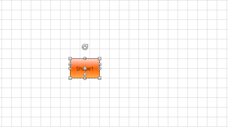

# Using custom connectors in MVVM

This tutorial will guide you through the task of populating RadDiagramShape with custom connectors in MVVM scenario.

To populate the __RadDiagramShape__ with custom connectors in MVVM scenario you can create an attached property. Then bind the value of this property to a collection from your view model. In the property changed callback of the attached property you have access to the shape and its __Connectors__ collection. Using this you can add new connectors to the collection. 

To implement this scenario you can create a collection which holds the custom connectors in your view model.

__Example 1: Creating collection with custom connectors__
```C#
	public class ConnectorProxy
	{
		public string Name { get; set; }
		public System.Windows.Point Position { get; set; }
	}
	public class Node : NodeViewModelBase
	{
		private ObservableCollection<ConnectorProxy> myConnectors = new ObservableCollection<ConnectorProxy>();

		public Node()
		{
			//Add connectors.
			this.MyConnectors.Add(new ConnectorProxy() { Name = "FirstConnector", Position = new Point(0, 0.3) });
			this.MyConnectors.Add(new ConnectorProxy() { Name = "SecondConnector", Position = new Point(1, 0.3) });
			this.MyConnectors.Add(new ConnectorProxy() { Name = "ThirdConnector", Position = new Point(0.5, 0.8) });
		}

		public ObservableCollection<ConnectorProxy> MyConnectors
		{
			get
			{
				return this.myConnectors;
			}
		}
	}
	public class Link : LinkViewModelBase<NodeViewModelBase>
	{       
	}
	public  class MyGraphSource : ObservableGraphSourceBase<Node, Link>
	{
		public MyGraphSource()
		{
			Node shape1 = new Node() {Content = "Shape1", Position=new Point(80,120) };
			this.AddNode(shape1);
		}
	}
```

The next step is to create the attached property.

__Example 2: Creating attached property__
```C#
	public static class AttachedProperties
	{
		public static IEnumerable<ConnectorProxy> GetConnectors(DependencyObject obj)
		{
			return (IEnumerable<ConnectorProxy>)obj.GetValue(ConnectorsProperty);
		}

		public static void SetConnectors(DependencyObject obj, IEnumerable<ConnectorProxy> value)
		{
			obj.SetValue(ConnectorsProperty, value);
		}

		public static readonly DependencyProperty ConnectorsProperty =
			DependencyProperty.RegisterAttached("Connectors", typeof(IEnumerable<ConnectorProxy>), typeof(AttachedProperties), new PropertyMetadata(null, OnConnectorsChanged));

		private static void OnConnectorsChanged(DependencyObject d, DependencyPropertyChangedEventArgs e)
		{
			var shape = d as RadDiagramShape;
			// You can also check if the collection is INotifyCollectionChanged if you want to change the connectors runtime.
			// var connectors = e.NewValue as INotifyCollectionChanged
			var connectors = e.NewValue as ObservableCollection<ConnectorProxy>;
			if (shape != null && connectors != null)
			{
				foreach (var item in connectors)
				{
					//Note: the item.Name should be a valid x:Name
					shape.Connectors.Add(new RadDiagramConnector() { Name = item.Name, Offset = item.Position });
				}
			}
		}
	}
```

Finally, you can create an implicit style and bind the attached property to the custom collection and define a RadDiagram control in the view.

__Example 3: Setting the attached property in XAML__

```C#
	<Window.Resources>
		<local:MyGraphSource x:Key="Source"/>
		<DataTemplate x:Key="contentTemplate">
		    <TextBlock Text="{Binding Content}" />
		</DataTemplate>
		<Style TargetType="telerik:RadDiagramShape">
		    <Setter Property="Position" Value="{Binding Position, Mode=TwoWay}" />
		    <Setter Property="common:AttachedProperties.Connectors" Value="{Binding MyConnectors}" />
		</Style>
	</Window.Resources>
	<Grid>
		<telerik:RadDiagram GraphSource="{StaticResource Source}"
								ShapeTemplate="{StaticResource contentTemplate}" 
								ConnectionTemplate="{StaticResource contentTemplate}">          
		</telerik:RadDiagram>
	</Grid>
```

#### __Figure 1: Custom connectors in RadDiagramShape__


## See Also
 * [Shapes]()
 * [Use MVVM in RadDiagram]()
 * [Iterate Over the Diagram Items]()
