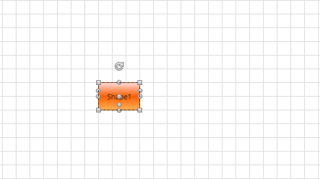

# Using custom connectors in MVVM

This tutorial will guide you through the task of populating RadDiagramShape with custom connectors in MVVM scenario.

To populate the __RadDiagramShape__ with custom connectors in MVVM scenario you can create an attached property. Then bind the value of this property to a collection from your view model. In the property changed callback of the attached property you have access to the shape and its __Connectors__ collection. Using this you can add new connectors to the collection. 

To implement this scenario you can create a collection which holds the custom connectors in your view model.

__Example 1: Creating collection with custom connectors__
<snippet id='raddiagram-howto-custom-connectors-example_1_creating_collection_with_custom_connectors-cs' />

The next step is to create the attached property.

__Example 2: Creating attached property__
<snippet id='raddiagram-howto-custom-connectors-example_2_creating_attached_property-cs' />

Finally, you can create an implicit style and bind the attached property to the custom collection and define a RadDiagram control in the view.

__Example 3: Setting the attached property in XAML__

<snippet id='raddiagram-howto-custom-connectors-example_3_setting_the_attached_property_in_xaml-cs' />

#### __Figure 1: Custom connectors in RadDiagramShape__

## See Also
 * [Shapes]()
 * [Use MVVM in RadDiagram]()
 * [Iterate Over the Diagram Items]()
