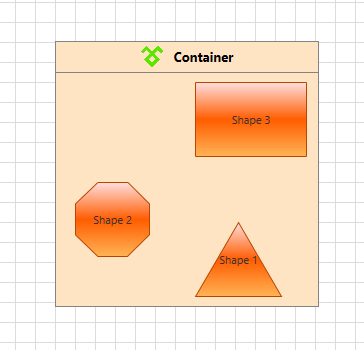

# Customize a ContainerShape

This tutorial describes how to customize the default look and feel of the RadDiagramContainerShape.

## Edit the Header

In order to customize the content of the header part of the __RadDiagramContainerShape__, you can use the __Content__ property. For instance, if you wish to display an icon in the header you can define the following layout:		

#### __XAML__
```XAML
    <telerik:RadDiagram>
        <telerik:RadDiagramContainerShape Width="264" Position="120,120">
            <telerik:RadDiagramContainerShape.Content>
                <Grid Height="Auto">
                    <Grid.ColumnDefinitions>
                        <ColumnDefinition Width="Auto" />
                        <ColumnDefinition Width="*" />
                    </Grid.ColumnDefinitions>
                    <Image Grid.Column="0"
                            Width="25"
                            Height="25"
                            HorizontalAlignment="Center"
                            VerticalAlignment="Center"
                            Source="TelerikIcon.png" />
                    <TextBlock Grid.Column="1"
                                Margin="10,0,0,0"
                                VerticalAlignment="Center"
                                FontSize="13"
                                FontWeight="Bold"
                                Text="Container" />
                </Grid>
            </telerik:RadDiagramContainerShape.Content>
            <telerik:RadDiagramShape Content="Shape 1"
                                        Geometry="{telerik:CommonShape ShapeType=TriangleShape}"
                                        Position="260,300" />
            <telerik:RadDiagramShape Content="Shape 2"
                                        Geometry="{telerik:CommonShape ShapeType=OctagonShape}"
                                        Position="140,260" />
            <telerik:RadDiagramShape Content="Shape 3"
                                        Geometry="{telerik:CommonShape ShapeType=RectangleShape}"
                                        Position="260,160" />
        </telerik:RadDiagramContainerShape>
    </telerik:RadDiagram>
```


## Edit the ControlTemplate

You can further customize the appearance of the __RadDiagramContainerShape__ by editing its default style and template.	  

In Expression Blend, add a __RadDiagram__ control and a __RadDiagramContainerShape__ onto it (accessible via the *Assets* panel).		

Select the container shape and in the *'Objects and Timeline'* panel right-click the object or use the dropdown as shown in the picture below. Select *'Edit template > Edit a copy'*, this will create a copy of the default template which you can customize.


>tip If you choose to define the style in Application, it would be available for the entire application. This allows you to define a style only once and then reuse it where needed.		  

After clicking 'OK', Expression Blend will generate the default style of the __RadDiagramContainerShape__ control in the __Resources__ section of your UserControl/application. The properties available for the style will be loaded in the *'Properties'* pane and you will be able to modify their default values.


If you go to the *'Resources'* pane, you will see an editable list of resources generated together with the style and used by it. In this list you will find the brushes, styles and templates needed to change the visual appearance of the __RadDiagramContainerShape__. Their names indicate to which part of the __RadDiagramContainerShape__'s appearance they are assigned.


If you want to change the __ControlTemplate__ elements of the __RadDiagramContainerShape__ select the style in the *'Objects and Timeline'* pane, right-click on it and choose *Edit Template -> Edit Current*. In the same pane the element parts for the __RadDiagramContainerShape__'s template will get loaded. 

>important Please note that at the moment Expression Blend seems not to extract well the default template as it can't extract the __ItemsSource__ applied on the __ConnectorsControl__ within the template. This is why you'll have to manually add it <Telerik_Windows_Controls_Diagrams_Primitives:ConnectorsControl ItemsSource="{TemplateBinding Connectors}" .../>

The final definition of the __ConnectorsControl__ should look like this:		

#### __XAML__
```XAML
    <Telerik_Windows_Controls_Diagrams_Primitives:ConnectorsControl x:Name="ConnectorsControl"
                                                                Grid.RowSpan="2"
                                                                ItemContainerStyle="{TemplateBinding ConnectorStyle}"
                                                                ItemsSource="{TemplateBinding Connectors}"
                                                                Visibility="Collapsed" />		  
```

The various things which apply to __ControlTemplates__ in general and customization of __RadDiagram__ shapes in particular apply to the __RadDiagramContainerShape__ as well. This means that you can modify the __ControlTemplate__ elements definitions to better fit your requirements.		

For example, let's change the default __Background__ color of the container in the style we extracted:	  

#### __XAML__	
```XAML
    <Style x:Key="RadDiagramContainerShapeStyle" TargetType="{x:Type telerik:RadDiagramContainerShape}">
		<Setter Property="Background" Value="#FFE4C4"/>
		...
    </Style>	
```



## See Also
 * [ContainerShapes]()
 * [Shapes]()
 * [Customize Appearance]()