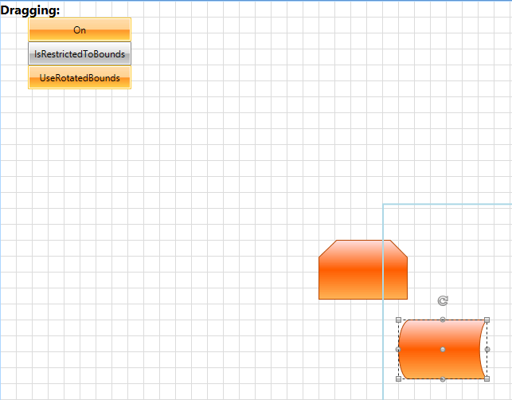

# Restrict the Draggable Area

The __Diagramming Framework__ implements a __DraggingService__ that controls and configures the drag operations on the diagram surface.			

>In order to learn more about the different Diagramming Services, you can examine the [Services]() article.				

This tutorial demonstrates how to customize the default dragging operation and restrict the draggable area so that a shape can only be moved within a predefined range in the diagramming surface.

In order to implement such a scenario, we will need a sample __RadDiagram__ instance with two __RadDiagramShapes__, a __Rectangle__ that describes the draggable area within the diagram and a few buttons to give the user control over the drag operation.				

The scenario described below will provide the user with the following options:

* Drag shapes only while the mouse is within a predefined draggable area.

* Drag shapes only within a predefined draggable area by making sure that no part of the shape is outside this area. 

* Take into account the rotated bounds of a shape when dragging it in a predefined draggable area.

#### __XAML__

```XAML
	<Grid Background="White">
		<telerik:RadDiagram x:Name="diagram">
			<telerik:RadDiagramShape Geometry="{telerik:FlowChartShape ShapeType=BeginLoopShape}" Position="400 300" />
			<telerik:RadDiagramShape Geometry="{telerik:FlowChartShape ShapeType=ExternalDataShape}" Position="500 400" />
		</telerik:RadDiagram>

		<Border x:Name="border"
				Width="840"
				Height="480"
				BorderBrush="LightBlue"
				BorderThickness="2" />

		<StackPanel Width="200" HorizontalAlignment="Left">

			<TextBlock FontSize="16"
					   FontWeight="Bold"
					   Text="Dragging: " />
			<telerik:RadToggleButton x:Name="toggleDrag"
									 Width="130"
									 Height="30"
									 Content="On"
									 IsChecked="True" />
			<telerik:RadToggleButton x:Name="IsRestrictedToBounds"
									 Width="130"
									 Height="30"
									 Content="IsRestrictedToBounds" />
			<telerik:RadToggleButton x:Name="useRotaitonBounds"
									 Width="130"
									 Height="30"
									 Content="UseRotatedBounds"
									 IsChecked="True" />
		</StackPanel>
	</Grid>
```

In order to restrict the __RadDiagramShapes__ dragging area, you need to create a custom dragging service. This means that you have to start this implementation by creating a new class that derives from the __DiagrammingFramework DraggingService__ class.

#### __C#__

```C#
	public class MyDragging : DraggingService
	{
	    public MyDragging(RadDiagram graph)
	        : base(graph as IGraphInternal)
	    {
	
	    }	
	}
```

#### __VB.NET__

```VB.NET
	Public Class MyDragging
	    Inherits DraggingService
	
	    Public Sub New(ByVal graph As RadDiagram)
	        MyBase.New(TryCast(graph, IGraphInternal))
	
	    End Sub	
	End Class
```

Next, we need to add properties that will configure the dragging service from the UI. In this scenario we need to have the following set of properties:

* __IsRestrictedToBounds__ - a __bool__ property that gets or sets a value determining whether the shapes should entirely be within the actual bounds of the draggable area.

* __UseRotaitonBounds__ - a __bool__ property that gets or sets a value determining whether the rotation bounds of a shape should be taken into account when applying dragging restrictions. The rotation bounds are the actual bounds of a shape after rotation.

* __IsOn__ - a __bool__ property that gets or sets a value determining whether to restrict the dragging within a predefined area.						

* __DragAllowedArea__ - a __Rect__ property that gets or sets a value representing the draggable area.						

#### __C#__

```C#
	public class MyDragging : DraggingService, INotifyPropertyChanged
	{
	    private bool isRestrictedToBounds;
	    private bool isOn;
	    private bool useRotationBounds;
	
	    public MyDragging(RadDiagram graph)
	        : base(graph as IGraphInternal)
	    {
	        //initialize the properties of the service
	        this.DragAllowedArea = Rect.Empty;
	        this.IsOn = true;
	        this.UseRotationBounds = true;
	    }
	
	    public event PropertyChangedEventHandler PropertyChanged;
	
	    public Rect DragAllowedArea { get; set; }
	    public bool IsRestrictedToBounds
	    {
	        get
	        {
	            return this.isRestrictedToBounds;
	        }
	        set
	        {
	            if (this.isRestrictedToBounds != value)
	            {
	                this.isRestrictedToBounds = value;
	                this.OnPropertyChanged("IsRestrictedToBounds");
	            }
	        }
	    }
	    public bool UseRotationBounds
	    {
	        get
	        {
	            return this.useRotationBounds;
	        }
	        set
	        {
	            if (this.useRotationBounds != value)
	            {
	                this.useRotationBounds = value;
	                this.OnPropertyChaged("UseRotationBounds");
	            }
	        }
	    }
	    public bool IsOn
	    {
	        get
	        {
	            return this.isOn;
	        }
	        set
	        {
	            if (this.isOn != value)
	            {
	                this.isOn = value;
	                this.OnPropertyChaged("IsOn");
	            }
	        }
	    }
	
	    private void OnPropertyChanged(string name)
	    {
	        if (this.PropertyChanged != null)
	        {
	            this.PropertyChanged(this, new PropertyChangedEventArgs(name));
	        }
	    }
	}
```

#### __VB.NET__

```VB.NET
	Public Class MyDragging
	    Inherits DraggingService
	    Implements INotifyPropertyChanged
	
	    Private restrictedToBounds As Boolean
	    Private isOnValue As Boolean
	    Private useRotateBounds As Boolean
	
	    Public Sub New(ByVal graph As RadDiagram)
	        MyBase.New(TryCast(graph, IGraphInternal))
	        Me.DragAllowedArea = Rect.Empty
	        Me.IsOn = True
	        Me.UseRotaitonBounds = True
	    End Sub
	
	    Public Event PropertyChanged As PropertyChangedEventHandler Implements INotifyPropertyChanged.PropertyChanged
	
	    Public Property DragAllowedArea() As Rect
	    Public Property IsRestrictedToBounds() As Boolean
	        Get
	            Return Me.restrictedToBounds
	        End Get
	        Set(ByVal value As Boolean)
	            If Me.restrictedToBounds <> value Then
	                Me.restrictedToBounds = value
	                Me.OnPropertyChaged("IsRestrictedToBounds")
	            End If
	        End Set
	    End Property
	    Public Property UseRotaitonBounds() As Boolean
	        Get
	            Return Me.useRotateBounds
	        End Get
	        Set(ByVal value As Boolean)
	            If Me.useRotateBounds <> value Then
	                Me.useRotateBounds = value
	                Me.OnPropertyChaged("UseRotaitonBounds")
	            End If
	        End Set
	    End Property
	    Public Property IsOn() As Boolean
	        Get
	            Return Me.isOnValue
	        End Get
	        Set(ByVal value As Boolean)
	            If Me.isOnValue <> value Then
	                Me.isOnValue = value
	                Me.OnPropertyChaged("IsOn")
	            End If
	        End Set
	    End Property
	
	    Private Sub OnPropertyChaged(ByVal name As String)
	        RaiseEvent PropertyChanged(Me, New PropertyChangedEventArgs(name))
	    End Sub
	End Class
```

The __DraggingService__ exposes a virtual method - __Drag__, which can be overridden to customize the default drag operation. In this method we will have to handle all restriction cases.

First, if we need to only restrict the position of the mouse while dragging a shape, then we have to simply track that position and check whether it falls within the bounds of the draggable area. If it doesn't we have to create a property to hold an updated and most importantly - allowed mouse position. Please note that all position calculations will be based on the coordinate system of the diagramming instance: 

#### __C#__

```C#
	public override void Drag(Point newPoint)
	{
		Point dragPoint = newPoint;
	    //if the mouse position during a drag operation should be restricted within the DragAllowedArea
		if (this.DragAllowedArea != Rect.Empty && !this.DragAllowedArea.Contains(newPoint))
		{
	        //calculate the proper position of the dragPoint
			double X = dragPoint.X;
			double Y = dragPoint.Y;
			if (X > this.DragAllowedArea.Right)
				X = this.DragAllowedArea.Right;
			else if (X < this.DragAllowedArea.Left)
				X = this.DragAllowedArea.Left;
	
			if (Y > this.DragAllowedArea.Bottom)
				Y = this.DragAllowedArea.Bottom;
			else if (Y < this.DragAllowedArea.Top)
				Y = this.DragAllowedArea.Top;
	
			dragPoint = new Point(X, Y);
		}
	}
```

#### __VB.NET__

```VB.NET
	Public Overrides Sub Drag(ByVal newPoint As Point)
	    Dim dragPoint As Point = newPoint
	
	    'if the mouse position during a drag operation should be restricted within the DragAllowedArea'
	    If Me.DragAllowedArea <> Rect.Empty AndAlso (Not Me.DragAllowedArea.Contains(newPoint)) Then
	        'calculate the proper position of the dragPoint'
	        Dim X As Double = dragPoint.X
	        Dim Y As Double = dragPoint.Y
	        If X > Me.DragAllowedArea.Right Then
	            X = Me.DragAllowedArea.Right
	        ElseIf X < Me.DragAllowedArea.Left Then
	            X = Me.DragAllowedArea.Left
	        End If
	
	        If Y > Me.DragAllowedArea.Bottom Then
	            Y = Me.DragAllowedArea.Bottom
	        ElseIf Y < Me.DragAllowedArea.Top Then
	            Y = Me.DragAllowedArea.Top
	        End If
	
	        dragPoint = New Point(X, Y)
	    End If
	End Sub
```

With the above code we calculate a new drag position only in the cases when the mouse leaves the designated dragging area. Although these calculations will not stop the mouse from moving across the diagramming surface, they will stop the selected shapes from being dragged further away.

However, if the user wants to configure the shapes to be entirely moved only within a draggable area, we will have to get the __RadDiagram SelectionBounds__. And in order to handle the case that takes into account the rotation of the selected shapes when calculating the __SelectionBounds__, it is best to create a separate method:

#### __C#__

```C#
	 private readonly RadDiagram diagram;
	//this method gets the bounds of the selected DiagramItems 
	private Rect GetSelectionBounds()
	{
		if (this.UseRotaitonBounds)
		{
	        //find the selection bounds after a rotation
			Rect result = Rect.Empty;
			foreach (var item in this.diagram.SelectedItems)
			{
				var container = this.diagram.ContainerGenerator.ContainerFromItem(item);
				var shape = item as IShape;
				if (shape != null)
					result.Union(shape.ActualBounds);
				else
					result.Union(container.Bounds);
			}
	
			return result;
		}
		else
		{
	        //or get the default selection bounds
			return this.diagram.SelectionBounds;
		}
	}
```

#### __VB.NET__

```VB.NET
	Private ReadOnly diagram As RadDiagram
	'this method gets the bounds of the selected DiagramItems '
	Private Function GetSelectionBounds() As Rect
	    If Me.UseRotaitonBounds Then
	        'find the selection bounds after a rotation'
	        Dim result As Rect = Rect.Empty
	        For Each item In Me.diagram.SelectedItems
	            Dim container = Me.diagram.ContainerGenerator.ContainerFromItem(item)
	            Dim shape = TryCast(item, IShape)
	            If shape IsNot Nothing Then
	                result.Union(shape.ActualBounds)
	            Else
	                result.Union(container.Bounds)
	            End If
	        Next item
	
	        Return result
	    Else
	        'or get the default selection bounds'
	        Return Me.diagram.SelectionBounds
	    End If
	End Function
```

In the above implementation we added a __diagram__ field which gets the __RadDiagram__ instance currently using the dragging service. This is why we also have to initialize this field in the constructor of the service:				

#### __C#__

```C#
	public MyDragging(RadDiagram graph)
		: base(graph as IGraphInternal)
	{
	    this.diagram = graph;
				
	    this.DragAllowedArea = Rect.Empty;
		this.IsOn = true;
		this.UseRotaitonBounds = true;
	}
```

#### __VB.NET__

```VB.NET
	Public Sub New(ByVal graph As RadDiagram)
	    MyBase.New(TryCast(graph, IGraphInternal))
	    Me.diagram = graph
	
	    Me.DragAllowedArea = Rect.Empty
	    Me.IsOn = True
	    Me.UseRotaitonBounds = True
	End Sub
```

Then we can use the __GetSelectionBounds()__ method in the logic that customizes the drag of shapes which bounds need to always be within the predefined draggable area:			

#### __C#__

```C#
	public override void Drag(Point newPoint)
	{
		Point dragPoint = newPoint;
		if (this.IsRestrictedToBounds)
		{
	        //get the bounds of the selected RadDiagramItems
			var selectionBounds = this.GetSelectionBounds();
	        //find the drag offset by comparing the coordinates of the last and the new drag position 
			var offset = new Vector(newPoint.X - this.lastPoint.X, newPoint.Y - this.lastPoint.Y);
	        //calculate the new bounds of the dragged selected items
			var newBounds = new Rect(selectionBounds.X + offset.X, selectionBounds.Y + offset.Y, selectionBounds.Width, selectionBounds.Height);
	
	        //if there is no predefined draggable area or 
	        //if the bounds of the dragged selected items are within the predefined draggable area
	        //invoke the default implementation of the DraggingService Drag() method
			if (this.DragAllowedArea == Rect.Empty || this.DragAllowedArea.Contains(newBounds))
			{
				base.Drag(newPoint);
				this.lastPoint = dragPoint;
				return;
			}
	
	        //if the bounds of the selected items is outside the bounds of the draggable area, 
	        //recalculate the coordinates of the drag point to make sure the bounds of the selected items is inside the draggable area 
			if (this.DragAllowedArea.Left > newBounds.Left)
				dragPoint = new Point(dragPoint.X - (newBounds.Left - this.DragAllowedArea.Left), dragPoint.Y);
			else if (this.DragAllowedArea.Right < newBounds.Right)
				dragPoint = new Point(dragPoint.X - (newBounds.Right - this.DragAllowedArea.Right), dragPoint.Y);
	
			if (this.DragAllowedArea.Top > newBounds.Top)
				dragPoint = new Point(dragPoint.X, dragPoint.Y - (newBounds.Top - this.DragAllowedArea.Top));
			else if (this.DragAllowedArea.Bottom < newBounds.Bottom)
				dragPoint = new Point(dragPoint.X, dragPoint.Y - (newBounds.Bottom - this.DragAllowedArea.Bottom));
		}
	}
```

#### __VB.NET__

```VB.NET
	Public Overrides Sub Drag(ByVal newPoint As Point)
	    Dim dragPoint As Point = newPoint
	
	    'if the actual bounds of the shape should be within the DragAllowedArea'
	    If Me.IsRestrictedToBounds Then
	        'get the bounds of the selected RadDiagramItems'
	        Dim selectionBounds = Me.GetSelectionBounds()
	        'find the drag offset by comparing the coordinates of the last and the new drag position '
	        Dim offset = New Vector(newPoint.X - Me.lastPoint.X, newPoint.Y - Me.lastPoint.Y)
	        'calculate the new bounds of the dragged selected items'
	        Dim newBounds = New Rect(selectionBounds.X + offset.X, selectionBounds.Y + offset.Y, selectionBounds.Width, selectionBounds.Height)
	
	        'if there is no predefined draggable area or '
	        'if the bounds of the dragged selected items are within the predefined draggable area'
	        'invoke the default implementation of the DraggingService Drag() method'
	        If Me.DragAllowedArea = Rect.Empty OrElse Me.DragAllowedArea.Contains(newBounds) Then
	            MyBase.Drag(newPoint)
	            Me.lastPoint = dragPoint
	            Return
	        End If
	
	        'if the bounds of the selected items is outside the bounds of the draggable area, '
	        'recalculate the coordinates of the drag point to make sure the bounds of the selected items is inside the draggable area '
	        If Me.DragAllowedArea.Left > newBounds.Left Then
	            dragPoint = New Point(dragPoint.X - (newBounds.Left - Me.DragAllowedArea.Left), dragPoint.Y)
	        ElseIf Me.DragAllowedArea.Right < newBounds.Right Then
	            dragPoint = New Point(dragPoint.X - (newBounds.Right - Me.DragAllowedArea.Right), dragPoint.Y)
	        End If
	
	        If Me.DragAllowedArea.Top > newBounds.Top Then
	            dragPoint = New Point(dragPoint.X, dragPoint.Y - (newBounds.Top - Me.DragAllowedArea.Top))
	        ElseIf Me.DragAllowedArea.Bottom < newBounds.Bottom Then
	            dragPoint = New Point(dragPoint.X, dragPoint.Y - (newBounds.Bottom - Me.DragAllowedArea.Bottom))
	        End If
	    End If
	End Sub
```

No matter which restriction approach we implement (restricting the drag based on the mouse position or the shapes bounds), we always end up recalculating the __dragPoint__ coordinates. This is why as soon as we calculate a valid drag value, we need to invoke the base implementation of the __DraggingService Drag()__ method with the new __dragPoint__. You can find the complete implementation of the overridden __Drag()__ method below:

#### __C#__

```C#
	public override void Drag(Point newPoint)
	{
		Point dragPoint = newPoint;
	
		if (this.IsOn)
		{
	        //if the actual bounds of the shape should be within the DragAllowedArea
			if (this.IsRestrictedToBounds)
			{
	            //get the bounds of the selected RadDiagramItems
				var selectionBounds = this.GetSelectionBounds();
	            //find the drag offset by comparing the coordinates of the last and the new drag position 
				var offset = new Vector(newPoint.X - this.lastPoint.X, newPoint.Y - this.lastPoint.Y);
	            //calculate the new bounds of the dragged selected items
				var newBounds = new Rect(selectionBounds.X + offset.X, selectionBounds.Y + offset.Y, selectionBounds.Width, selectionBounds.Height);
	
	            //if there is no predefined draggable area or 
	            //if the bounds of the dragged selected items are within the predefined draggable area
	            //invoke the default implementation of the DraggingService Drag() method
				if (this.DragAllowedArea == Rect.Empty || this.DragAllowedArea.Contains(newBounds))
				{
					base.Drag(newPoint);
					this.lastPoint = dragPoint;
					return;
				}
	
	            //if the bounds of the selected items is outside the bounds of the draggable area, 
	            //recalculate the coordinates of the drag point to make sure the bounds of the selected items is inside the draggable area 
				if (this.DragAllowedArea.Left > newBounds.Left)
					dragPoint = new Point(dragPoint.X - (newBounds.Left - this.DragAllowedArea.Left), dragPoint.Y);
				else if (this.DragAllowedArea.Right < newBounds.Right)
					dragPoint = new Point(dragPoint.X - (newBounds.Right - this.DragAllowedArea.Right), dragPoint.Y);
	
				if (this.DragAllowedArea.Top > newBounds.Top)
					dragPoint = new Point(dragPoint.X, dragPoint.Y - (newBounds.Top - this.DragAllowedArea.Top));
				else if (this.DragAllowedArea.Bottom < newBounds.Bottom)
					dragPoint = new Point(dragPoint.X, dragPoint.Y - (newBounds.Bottom - this.DragAllowedArea.Bottom));
			}
			else
			{
	            //if the mouse position during a drag operation should be restricted within the DragAllowedArea
				if (this.DragAllowedArea != Rect.Empty && !this.DragAllowedArea.Contains(newPoint))
				{
	                //calculate the proper position of the dragPoint
					double X = dragPoint.X;
					double Y = dragPoint.Y;
					if (X > this.DragAllowedArea.Right)
						X = this.DragAllowedArea.Right;
					else if (X < this.DragAllowedArea.Left)
						X = this.DragAllowedArea.Left;
	
					if (Y > this.DragAllowedArea.Bottom)
						Y = this.DragAllowedArea.Bottom;
					else if (Y < this.DragAllowedArea.Top)
						Y = this.DragAllowedArea.Top;
	
					dragPoint = new Point(X, Y);
				}
			}
		}
	    //invoke the base implementation of the DraggingService Drag() method with the calculated proper coordinates of the dragPoint  
		base.Drag(dragPoint);
	    //update the lastPosition property to always keep track of the last drag position
		this.lastPoint = dragPoint;
	}
```

#### __VB.NET__

```VB.NET
	Public Overrides Sub Drag(ByVal newPoint As Point)
	    Dim dragPoint As Point = newPoint
	
	    If Me.IsOn Then
	        'if the actual bounds of the shape should be within the DragAllowedArea'
	        If Me.IsRestrictedToBounds Then
	            'get the bounds of the selected RadDiagramItems'
	            Dim selectionBounds = Me.GetSelectionBounds()
	            'find the drag offset by comparing the coordinates of the last and the new drag position '
	            Dim offset = New Vector(newPoint.X - Me.lastPoint.X, newPoint.Y - Me.lastPoint.Y)
	            'calculate the new bounds of the dragged selected items'
	            Dim newBounds = New Rect(selectionBounds.X + offset.X, selectionBounds.Y + offset.Y, selectionBounds.Width, selectionBounds.Height)
	
	            'if there is no predefined draggable area or '
	            'if the bounds of the dragged selected items are within the predefined draggable area'
	            'invoke the default implementation of the DraggingService Drag() method'
	            If Me.DragAllowedArea = Rect.Empty OrElse Me.DragAllowedArea.Contains(newBounds) Then
	                MyBase.Drag(newPoint)
	                Me.lastPoint = dragPoint
	                Return
	            End If
	
	            'if the bounds of the selected items is outside the bounds of the draggable area, '
	            'recalculate the coordinates of the drag point to make sure the bounds of the selected items is inside the draggable area '
	            If Me.DragAllowedArea.Left > newBounds.Left Then
	                dragPoint = New Point(dragPoint.X - (newBounds.Left - Me.DragAllowedArea.Left), dragPoint.Y)
	            ElseIf Me.DragAllowedArea.Right < newBounds.Right Then
	                dragPoint = New Point(dragPoint.X - (newBounds.Right - Me.DragAllowedArea.Right), dragPoint.Y)
	            End If
	
	            If Me.DragAllowedArea.Top > newBounds.Top Then
	                dragPoint = New Point(dragPoint.X, dragPoint.Y - (newBounds.Top - Me.DragAllowedArea.Top))
	            ElseIf Me.DragAllowedArea.Bottom < newBounds.Bottom Then
	                dragPoint = New Point(dragPoint.X, dragPoint.Y - (newBounds.Bottom - Me.DragAllowedArea.Bottom))
	            End If
	        Else
	            'if the mouse position during a drag operation should be restricted within the DragAllowedArea'
	            If Me.DragAllowedArea <> Rect.Empty AndAlso (Not Me.DragAllowedArea.Contains(newPoint)) Then
	                'calculate the proper position of the dragPoint'
	                Dim X As Double = dragPoint.X
	                Dim Y As Double = dragPoint.Y
	                If X > Me.DragAllowedArea.Right Then
	                    X = Me.DragAllowedArea.Right
	                ElseIf X < Me.DragAllowedArea.Left Then
	                    X = Me.DragAllowedArea.Left
	                End If
	
	                If Y > Me.DragAllowedArea.Bottom Then
	                    Y = Me.DragAllowedArea.Bottom
	                ElseIf Y < Me.DragAllowedArea.Top Then
	                    Y = Me.DragAllowedArea.Top
	                End If
	
	                dragPoint = New Point(X, Y)
	            End If
	        End If
	    End If
	    'invoke the base implementation of the DraggingService Drag() method with the calculated proper coordinates of the dragPoint  '
	    MyBase.Drag(dragPoint)
	    'update the lastPosition property to always keep track of the last drag position'
	    Me.lastPoint = dragPoint
	End Sub
```

We also need to make sure that the __lastPoint__ property has the coordinates of the position where the drag was initiated. For that purpose we will also override the __DraggingService InitializeDrag()__ method:

#### __C#__

```C#
	//override this method to get the coordinates of the point where the drag started
	public override void InitializeDrag(Point point)
	{
		this.lastPoint = point;
		base.InitializeDrag(point);
	}
```

#### __VB.NET__

```VB.NET
	'override this method to get the coordinates of the point where the drag started'
	Public Overrides Sub InitializeDrag(ByVal point As Point)
	    Me.lastPoint = point
	    MyBase.InitializeDrag(point)
	End Sub
```

Finally, we need to configure the diagram to use our custom dragging implementation instead of the default __DraggingService__. This is why we need to create a new instance of the __MyDragging__ class in the code-behind file of our view. Then we need to bind the properties defined within the custom dragging service to the view elements that control them:

#### __C#__

```C#
	private MyDragging newDraggingService;
	
	public Example()
	{
	    InitializeComponent();
	
	    this.InitializeNewServices();
	}
	
	private void InitializeNewServices()
	{
	    //initialize MyDragging 
	    this.newDraggingService = new MyDragging(this.diagram);
	    //create a binding with Path=IsOn
	    Binding binding = new Binding("IsOn");
	    //use the newDraggingService as a source of the binding
	    binding.Source = this.newDraggingService;
	    binding.Mode = BindingMode.TwoWay;
	    //apply the binding on the toggleDrag RadToggleButton
	    this.toggleDrag.SetBinding(RadToggleButton.IsCheckedProperty, binding);
	           
	    //create a binding with Path=IsRestrictedToBounds
	    binding = new Binding("IsRestrictedToBounds");
	    //use the newDraggingService as a source of the binding
	    binding.Source = this.newDraggingService;
	    binding.Mode = BindingMode.TwoWay;
	    //apply the binding on the IsRestrictedToBounds RadToggleButton
	    this.IsRestrictedToBounds.SetBinding(RadToggleButton.IsCheckedProperty, binding);
	
	    //create a binding with Path=UseRotaitonBounds
	    binding = new Binding("UseRotaitonBounds");
	    //use the newDraggingService as a source of the binding
	    binding.Source = this.newDraggingService;
	    binding.Mode = BindingMode.TwoWay;
	    //apply the binding on the useRotaitonBounds RadToggleButton
	    this.useRotaitonBounds.SetBinding(RadToggleButton.IsCheckedProperty, binding);
	}
```

#### __VB.NET__

```VB.NET
	Private newDraggingService As MyDragging
	
	Public Sub New()
	    InitializeComponent()
	
	    Me.InitializeNewServices()
	End Sub
	
	Private Sub InitializeNewServices()
	    'initialize MyDragging '
	    Me.newDraggingService = New MyDragging(Me.diagram)
	    'create a binding with Path=IsOn'
	    Dim binding As New Binding("IsOn")
	    'use the newDraggingService as a source of the binding'
	    binding.Source = Me.newDraggingService
	    binding.Mode = BindingMode.TwoWay
	    'apply the binding on the toggleDrag RadToggleButton'
	    Me.toggleDrag.SetBinding(RadToggleButton.IsCheckedProperty, binding)
	
	    'create a binding with Path=IsRestrictedToBounds'
	    binding = New Binding("IsRestrictedToBounds")
	    'use the newDraggingService as a source of the binding'
	    binding.Source = Me.newDraggingService
	    binding.Mode = BindingMode.TwoWay
	    'apply the binding on the IsRestrictedToBounds RadToggleButton'
	    Me.IsRestrictedToBounds.SetBinding(RadToggleButton.IsCheckedProperty, binding)
	
	    'create a binding with Path=UseRotaitonBounds'
	    binding = New Binding("UseRotaitonBounds")
	    'use the newDraggingService as a source of the binding'
	    binding.Source = Me.newDraggingService
	    binding.Mode = BindingMode.TwoWay
	    'apply the binding on the useRotaitonBounds RadToggleButton'
	    Me.useRotaitonBounds.SetBinding(RadToggleButton.IsCheckedProperty, binding)
	End Sub
```

And now we can use the __newDraggingService__ instance and register it through the __ServiceLocator__:

#### __C#__

```C#
	public Example()
	{
	    InitializeComponent();
	    this.InitializeNewServices();
	    this.diagram.ServiceLocator.Register<IDraggingService>(this.newDraggingService);
	}
```

#### __VB.NET__

```VB.NET
	Public Sub New()
	    InitializeComponent()
	    Me.InitializeNewServices()
	    Me.diagram.ServiceLocator.Register(Of IDraggingService)(Me.newDraggingService)
	End Sub
```

If you run the solution now, you should see the __On__ button as checked which means that the mouse position during drag should always be within the blue rectangle indicating the draggable area. If you click on the __IsRestrictedToBounds__ button, you will change the drag restrictions to use the shape bounds when identifying the available dragging positions of a shape. And as the __UseRotatedBounds__ button is also checked the rotation bounds of the dragged shapes will also be taken into account while applying the drag restrictions.


You can further extend this example by updating the designated draggable area during pan and zoom operations. In order to do so, you can handle the __RadDiagram ViewportChanged__ event:				

#### __XAML__

```XAML
	<telerik:RadDiagram x:Name="diagram" ViewportChanged="OnDiagramViewportChanged">
		<telerik:RadDiagramShape Geometry="{telerik:FlowChartShape ShapeType=BeginLoopShape}" Position="400 300" />
		<telerik:RadDiagramShape Geometry="{telerik:FlowChartShape ShapeType=ExternalDataShape}" Position="500 400" />
	</telerik:RadDiagram>
```

#### __C#__

```C#
	private void SetRestrictRect(Rect rect)
	{
	    if (this.newDraggingService != null)
	        this.newDraggingService.DragAllowedArea = rect.InflateRect(-rect.Width / 4, -rect.Height / 4);
	}
	
	private void OnDiagramViewportChanged(object sender, PropertyEventArgs<Rect> e)
	{
	    this.SetRestrictRect(e.NewValue);
	    this.border.Width = (e.NewValue.Width / 2) * this.diagram.Zoom;
	    this.border.Height = (e.NewValue.Height / 2) * this.diagram.Zoom;
	}
```

#### __VB.NET__

```VB.NET
	Private Sub SetRestrictRect(ByVal rect As Rect)
	    If Me.newDraggingService IsNot Nothing Then
	        Me.newDraggingService.DragAllowedArea = rect.InflateRect(-rect.Width \ 4, -rect.Height \ 4)
	    End If
	End Sub
	
	Private Sub OnDiagramViewportChanged(ByVal sender As Object, ByVal e As PropertyEventArgs(Of Rect))
	    Me.SetRestrictRect(e.NewValue)
	    Me.border.Width = (e.NewValue.Width / 2) * Me.diagram.Zoom
	    Me.border.Height = (e.NewValue.Height / 2) * Me.diagram.Zoom
	End Sub
```

>tip Find a runnable project of the previous example in the [WPF Samples GitHub repository](https://github.com/telerik/xaml-sdk/tree/master/Diagram/CustomServices).