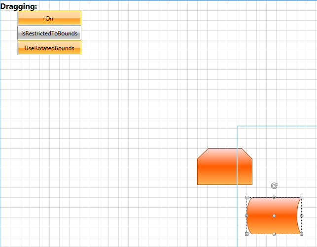

# Restrict the Draggable Area

The __Diagramming Framework__ implements a __DraggingService__ that controls and configures the drag operations on the diagram surface.			

>In order to learn more about the different Diagramming Services, you can examine the [Services]() article.				

This tutorial demonstrates how to customize the default dragging operation and restrict the draggable area so that a shape can only be moved within a predefined range in the diagramming surface.

In order to implement such a scenario, we will need a sample __RadDiagram__ instance with two __RadDiagramShapes__, a __Rectangle__ that describes the draggable area within the diagram and a few buttons to give the user control over the drag operation.				

The scenario described below will provide the user with the following options:

* Drag shapes only while the mouse is within a predefined draggable area.

* Drag shapes only within a predefined draggable area by making sure that no part of the shape is outside this area. 

* Take into account the rotated bounds of a shape when dragging it in a predefined draggable area.

<snippet id='raddiagram-howto-customize-dragging-block_1-xaml' />

In order to restrict the __RadDiagramShapes__ dragging area, you need to create a custom dragging service. This means that you have to start this implementation by creating a new class that derives from the __DiagrammingFramework DraggingService__ class.

<snippet id='raddiagram-howto-customize-dragging-block_2-cs' />

<snippet id='raddiagram-howto-customize-dragging-block_2-vb' />

Next, we need to add properties that will configure the dragging service from the UI. In this scenario we need to have the following set of properties:

* __IsRestrictedToBounds__ - a __bool__ property that gets or sets a value determining whether the shapes should entirely be within the actual bounds of the draggable area.

* __UseRotaitonBounds__ - a __bool__ property that gets or sets a value determining whether the rotation bounds of a shape should be taken into account when applying dragging restrictions. The rotation bounds are the actual bounds of a shape after rotation.

* __IsOn__ - a __bool__ property that gets or sets a value determining whether to restrict the dragging within a predefined area.						

* __DragAllowedArea__ - a __Rect__ property that gets or sets a value representing the draggable area.						

<snippet id='raddiagram-howto-customize-dragging-block_3-cs' />

<snippet id='raddiagram-howto-customize-dragging-block_3-vb' />

The __DraggingService__ exposes a virtual method - __Drag__, which can be overridden to customize the default drag operation. In this method we will have to handle all restriction cases.

First, if we need to only restrict the position of the mouse while dragging a shape, then we have to simply track that position and check whether it falls within the bounds of the draggable area. If it doesn't we have to create a property to hold an updated and most importantly - allowed mouse position. Please note that all position calculations will be based on the coordinate system of the diagramming instance: 

<snippet id='raddiagram-howto-customize-dragging-block_4-cs' />

<snippet id='raddiagram-howto-customize-dragging-block_4-vb' />

With the above code we calculate a new drag position only in the cases when the mouse leaves the designated dragging area. Although these calculations will not stop the mouse from moving across the diagramming surface, they will stop the selected shapes from being dragged further away.

However, if the user wants to configure the shapes to be entirely moved only within a draggable area, we will have to get the __RadDiagram SelectionBounds__. And in order to handle the case that takes into account the rotation of the selected shapes when calculating the __SelectionBounds__, it is best to create a separate method:

<snippet id='raddiagram-howto-customize-dragging-block_5-cs' />

<snippet id='raddiagram-howto-customize-dragging-block_5-vb' />

In the above implementation we added a __diagram__ field which gets the __RadDiagram__ instance currently using the dragging service. This is why we also have to initialize this field in the constructor of the service:				

<snippet id='raddiagram-howto-customize-dragging-block_6-cs' />

<snippet id='raddiagram-howto-customize-dragging-block_6-vb' />

Then we can use the __GetSelectionBounds()__ method in the logic that customizes the drag of shapes which bounds need to always be within the predefined draggable area:			

<snippet id='raddiagram-howto-customize-dragging-block_7-cs' />

<snippet id='raddiagram-howto-customize-dragging-block_7-vb' />

No matter which restriction approach we implement (restricting the drag based on the mouse position or the shapes bounds), we always end up recalculating the __dragPoint__ coordinates. This is why as soon as we calculate a valid drag value, we need to invoke the base implementation of the __DraggingService Drag()__ method with the new __dragPoint__. You can find the complete implementation of the overridden __Drag()__ method below:

<snippet id='raddiagram-howto-customize-dragging-block_8-cs' />

<snippet id='raddiagram-howto-customize-dragging-block_8-vb' />

We also need to make sure that the __lastPoint__ property has the coordinates of the position where the drag was initiated. For that purpose we will also override the __DraggingService InitializeDrag()__ method:

<snippet id='raddiagram-howto-customize-dragging-block_9-cs' />

<snippet id='raddiagram-howto-customize-dragging-block_9-vb' />

Finally, we need to configure the diagram to use our custom dragging implementation instead of the default __DraggingService__. This is why we need to create a new instance of the __MyDragging__ class in the code-behind file of our view. Then we need to bind the properties defined within the custom dragging service to the view elements that control them:

<snippet id='raddiagram-howto-customize-dragging-block_10-cs' />

<snippet id='raddiagram-howto-customize-dragging-block_10-vb' />

And now we can use the __newDraggingService__ instance and register it through the __ServiceLocator__:

<snippet id='raddiagram-howto-customize-dragging-block_11-cs' />

<snippet id='raddiagram-howto-customize-dragging-block_11-vb' />

If you run the solution now, you should see the __On__ button as checked which means that the mouse position during drag should always be within the blue rectangle indicating the draggable area. If you click on the __IsRestrictedToBounds__ button, you will change the drag restrictions to use the shape bounds when identifying the available dragging positions of a shape. And as the __UseRotatedBounds__ button is also checked the rotation bounds of the dragged shapes will also be taken into account while applying the drag restrictions.

You can further extend this example by updating the designated draggable area during pan and zoom operations. In order to do so, you can handle the __RadDiagram ViewportChanged__ event:				

<snippet id='raddiagram-howto-customize-dragging-block_12-xaml' />

<snippet id='raddiagram-howto-customize-dragging-block_13-cs' />

<snippet id='raddiagram-howto-customize-dragging-block_13-vb' />

>tip Find a runnable project of the previous example in the [WPF Samples GitHub repository](https://github.com/telerik/xaml-sdk/tree/master/Diagram/CustomServices).