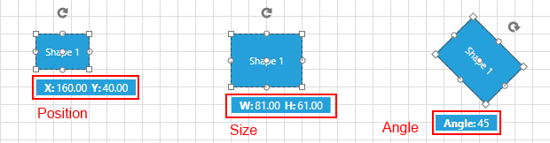
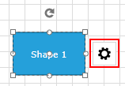

# Customize the ItemInformationAdorner

This article will guide you through  the steps that you need to take to customize how the RadDiagram visualizes information about the shapes.

The __RadDiagram__ uses the __ItemInformationAdorner Control__ to visualize information regarding the position, size and rotation angle of its shapes. This control switches tree predefined __DataTemplates__ at runtime depending on the user’s actions. To do this the __ItemInformationAdorner__ exposes the __InformationTipTemplateSelector__ property. It is of type __DataTemplateSelector__ and can be used to get or set an instance of custom data template selector. For your convenience we ship ready to use selector in our suite and the __RadDiagram__ uses it by default. In order to customize how the information is presented, you only need to define the __SizeChangedTemplate__, __PositionChangedTemplate__ and __RotationChangedTemplate__ properties of the built-in __InformationTipTemplateSelector__ and assign it to the __ItemInformationAdorner.InformationTipTemplateSelector__ property. In order to change the predefined __DataTemplateSelector__ you can use the following __Style__
	
#### __XAML__
```XAML
	<Style TargetType="primitives:ItemInformationAdorner">
		<Setter Property="InformationTipTemplateSelector" Value="{StaticResource informationTemplateSelector}" />
	</Style>
```

Where the *primitives* namespace is defined like this:

#### __XAML__
```XAML
	xmlns:primitives="clr-namespace:Telerik.Windows.Controls.Diagrams.Primitives;assembly=Telerik.Windows.Controls.Diagrams"
```

And the __StaticResource__ is defined like this:

#### __XAML__	
```XAML
	<primitives:InformationTipTemplateSelector x:Key="informationTemplateSelector" 
											   PositionChangedTemplate="{StaticResource PositionTipTemplate}" 
                                               RotationChangedTemplate="{StaticResource RotationTipTemplate}" 
                                               SizeChangedTemplate="{StaticResource SizeTipTemplate}" />
```

As the names of the properties imply the __PositionChangedTemplate__ will be selected when the position of a shape is changed. It will visualize the __X__ and __Y__ component of the current position of the shape. The __RotationChangedTemplate__ will be visualized when the shape is rotated and it will visualize the angle that the shape is rotated to. The __SizeChangedTemplate__ will be visualized when the shape is resized. That template visualizes the current __Width__ and __Height__ of the corresponding shape. In Figure 1 you can see how the default templates look like in our Windows8 theme.
        
##### __Figure 1:__


In order to customize all three templates you can first extract the default ones and use them as starting point. You can find more information about extracting default __ControlTemplates__ in [this article](http://www.telerik.com/help/wpf/styling-apperance-editing-control-templates.html)[this article](http://www.telerik.com/help/silverlight/styling-apperance-editing-control-templates.html) Below you can find the default __Styles__ and __DataTemplates__ used by the __RadDiagram__.        

#### __XAML__	
```XAML
	<Style x:Key="infoTipPanel" TargetType="StackPanel">
		<Setter Property="Orientation" Value="Horizontal" />
		<Setter Property="VerticalAlignment" Value="Center" />
		<Setter Property="Margin" Value="10 2" />
	</Style>
	<Style x:Key="PositionTipTextBlockStyle" TargetType="TextBlock">
		<Setter Property="FontWeight" Value="Bold" />
		<Setter Property="FontFamily" Value="Segoe UI" />
	</Style>
	<DataTemplate x:Key="PositionTipTemplate">
		<StackPanel Style="{StaticResource infoTipPanel}">
			<TextBlock Style="{StaticResource PositionTipTextBlockStyle}" Text="{telerik:LocalizableResource Key=PositionX}" />
			<TextBlock Margin="2 0 0 0" Text="{Binding Path=X, StringFormat=n2}" />
			<TextBlock Margin="5,0,0,0"
					   Style="{StaticResource PositionTipTextBlockStyle}"
					   Text="{telerik:LocalizableResource Key=PositionY}" />
			<TextBlock Margin="2 0 0 0"
					   Text="{Binding Path=Y,
									  StringFormat=n2}" />
		</StackPanel>
	</DataTemplate>
	<DataTemplate x:Key="RotationTipTemplate">
		<StackPanel Style="{StaticResource infoTipPanel}">
			<TextBlock Style="{StaticResource PositionTipTextBlockStyle}" Text="{telerik:LocalizableResource Key=RotationAngle}" />
			<TextBlock Margin="2 0 0 0"
					   Text="{Binding Path=.,
									  StringFormat=n0}" />
		</StackPanel>
	</DataTemplate>
	<DataTemplate x:Key="SizeTipTemplate">
		<StackPanel Style="{StaticResource infoTipPanel}">
			<TextBlock Style="{StaticResource PositionTipTextBlockStyle}" Text="{telerik:LocalizableResource Key=Width}" />
			<TextBlock Margin="2 0 0 0" Text="{Binding Width, StringFormat=n2}" />
			<TextBlock Margin="5 0 0 0"
					   Style="{StaticResource PositionTipTextBlockStyle}"
					   Text="{telerik:LocalizableResource Key=Height}" />
			<TextBlock Margin="2 0 0 0"
					   Text="{Binding Height,
									  StringFormat=n2}" />
		</StackPanel>
	</DataTemplate>
	<primitives:InformationTipTemplateSelector x:Key="informationTemplateSelector"
											   PositionChangedTemplate="{StaticResource PositionTipTemplate}"
											   RotationChangedTemplate="{StaticResource RotationTipTemplate}"
											   SizeChangedTemplate="{StaticResource SizeTipTemplate}" />
	<Style TargetType="primitives:ItemInformationAdorner">
		<Setter Property="InformationTipTemplateSelector" Value="{StaticResource informationTemplateSelector}" />
	</Style>
```

These __Styles__ and __DataTemplates__ can be used as starting point for your customizations.        

Another way to implement the same customizations is to create a new __TemplateSelector__ and use it instead of the provided one. In that custom selector you will be able to implement custom template selecting logic.

#### __C#__
```C#
	  public class MyTemplateSelector:DataTemplateSelector
	  {
		  public DataTemplate SizeTemplate { get; set; }
		  public DataTemplate PositionTemplate { get; set; }
		  public DataTemplate RotationTemplate { get; set; }

		  public override System.Windows.DataTemplate SelectTemplate(object item, System.Windows.DependencyObject container)
		  {
			  if (item is System.Windows.Point)
			  {
				  return this.PositionTemplate;
			  }
			  else if (item is System.Windows.Size)
			  {
				  return this.SizeTemplate;
			  }
			  else if(item is double)
			  {
				  return this.RotationTemplate;
			  }
			  else
			  {
				  return null;
			  }
		  }
	  }
```

#### __VB.NET__
```VB.NET
	  Public Class MyTemplateSelector
		Inherits DataTemplateSelector
		Public Property SizeTemplate() As DataTemplate
			Get
				Return m_SizeTemplate
			End Get
			Set
				m_SizeTemplate = Value
			End Set
		End Property
		Private m_SizeTemplate As DataTemplate
		Public Property PositionTemplate() As DataTemplate
			Get
				Return m_PositionTemplate
			End Get
			Set
				m_PositionTemplate = Value
			End Set
		End Property
		Private m_PositionTemplate As DataTemplate
		Public Property RotationTemplate() As DataTemplate
			Get
				Return m_RotationTemplate
			End Get
			Set
				m_RotationTemplate = Value
			End Set
		End Property
		Private m_RotationTemplate As DataTemplate

		Public Overrides Function SelectTemplate(item As Object, container As System.Windows.DependencyObject) As System.Windows.DataTemplate
			If TypeOf item Is System.Windows.Point Then
				Return Me.PositionTemplate
			ElseIf TypeOf item Is System.Windows.Size Then
				Return Me.SizeTemplate
			ElseIf TypeOf item Is Double Then
				Return Me.RotationTemplate
			Else
				Return Nothing
			End If
		End Function
	End Class
```

Once defined, you will be able to use this custom TemplateSelector in XAML. You will be able to assign custom __DataTemplates__ to the exposed properties thus selecting your custom templates.

#### __XAML__
```XAML
	<local:MyTemplateSelector x:Key="MyTemplateSelector"
							  PositionTemplate="{StaticResource MyPositionTemplate}"
							  RotationTemplate="{StaticResource MyRotationTemplate}"
							  SizeTemplate="{StaticResource MySizeTemplate}" />
								
	<Style TargetType="primitives:ItemInformationAdorner">
		<Setter Property="InformationTipTemplateSelector" Value="{StaticResource MyTemplateSelector}" />
	</Style>
```

The __ItemInformationAdorner__ control can also be used to visualize additional content for the diagram items. This can be done by using the __AdditionalContent__ attached property. This property is of type __object__ and gets or sets the content to be visualized. In order for this property to work  you should set it to the __RadDiagram__. What this means for your application is that all the shapes, containers and connections will visualize the same object whenever a __RadDiagramItem__ is selected. A bright example of taking advantage of this property is the button which opens the [SettingsPane]() extension control. Figure 2 visualizes the mentioned button.

##### __Figure 2:__


The __Visibility__ of the content set as additional is internally controlled by the Boolean __IsAdditionalContentVisible__ property. It exposes only a getter, so that you will be able to keep track of the current state of the content.

Also, the __ItemInformationAdorner__ control exposes the __IsAdditionalContentVisibleChanged__ event. It can be used to trigger custom logic whenever the AdditionalContent is visualized or hidden.