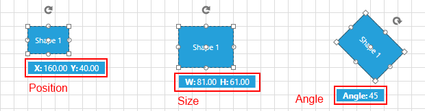
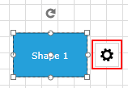

# Customize the ItemInformationAdorner

This article will guide you through  the steps that you need to take to customize how the RadDiagram visualizes information about the shapes.

The __RadDiagram__ uses the __ItemInformationAdorner Control__ to visualize information regarding the position, size and rotation angle of its shapes. This control switches tree predefined __DataTemplates__ at runtime depending on the user’s actions. To do this the __ItemInformationAdorner__ exposes the __InformationTipTemplateSelector__ property. It is of type __DataTemplateSelector__ and can be used to get or set an instance of custom data template selector. For your convenience we ship ready to use selector in our suite and the __RadDiagram__ uses it by default. In order to customize how the information is presented, you only need to define the __SizeChangedTemplate__, __PositionChangedTemplate__ and __RotationChangedTemplate__ properties of the built-in __InformationTipTemplateSelector__ and assign it to the __ItemInformationAdorner.InformationTipTemplateSelector__ property. In order to change the predefined __DataTemplateSelector__ you can use the following __Style__
	

<snippet id='raddiagram-howto-customize-itemiformationadorner-block_1-xaml' />

Where the *primitives* namespace is defined like this:

<snippet id='raddiagram-howto-customize-itemiformationadorner-block_2-xaml' />

And the __StaticResource__ is defined like this:

	
<snippet id='raddiagram-howto-customize-itemiformationadorner-block_3-xaml' />

As the names of the properties imply the __PositionChangedTemplate__ will be selected when the position of a shape is changed. It will visualize the __X__ and __Y__ component of the current position of the shape. The __RotationChangedTemplate__ will be visualized when the shape is rotated and it will visualize the angle that the shape is rotated to. The __SizeChangedTemplate__ will be visualized when the shape is resized. That template visualizes the current __Width__ and __Height__ of the corresponding shape. In Figure 1 you can see how the default templates look like in our Windows8 theme.
        
##### __Figure 1:__

In order to customize all three templates you can first extract the default ones and use them as starting point. You can find more information about extracting default __ControlTemplates__ in [this article](http://www.telerik.com/help/wpf/styling-apperance-editing-control-templates.html)[this article](http://www.telerik.com/help/silverlight/styling-apperance-editing-control-templates.html) Below you can find the default __Styles__ and __DataTemplates__ used by the __RadDiagram__.        

	
<snippet id='raddiagram-howto-customize-itemiformationadorner-block_4-xaml' />

These __Styles__ and __DataTemplates__ can be used as starting point for your customizations.        

Another way to implement the same customizations is to create a new __TemplateSelector__ and use it instead of the provided one. In that custom selector you will be able to implement custom template selecting logic.

<snippet id='raddiagram-howto-customize-itemiformationadorner-block_5-cs' />

<snippet id='raddiagram-howto-customize-itemiformationadorner-block_5-vb' />

Once defined, you will be able to use this custom TemplateSelector in XAML. You will be able to assign custom __DataTemplates__ to the exposed properties thus selecting your custom templates.

<snippet id='raddiagram-howto-customize-itemiformationadorner-block_6-xaml' />

The __ItemInformationAdorner__ control can also be used to visualize additional content for the diagram items. This can be done by using the __AdditionalContent__ attached property. This property is of type __object__ and gets or sets the content to be visualized. In order for this property to work  you should set it to the __RadDiagram__. What this means for your application is that all the shapes, containers and connections will visualize the same object whenever a __RadDiagramItem__ is selected. A bright example of taking advantage of this property is the button which opens the [SettingsPane]() extension control. Figure 2 visualizes the mentioned button.

##### __Figure 2:__

The __Visibility__ of the content set as additional is internally controlled by the Boolean __IsAdditionalContentVisible__ property. It exposes only a getter, so that you will be able to keep track of the current state of the content.

Also, the __ItemInformationAdorner__ control exposes the __IsAdditionalContentVisibleChanged__ event. It can be used to trigger custom logic whenever the AdditionalContent is visualized or hidden.