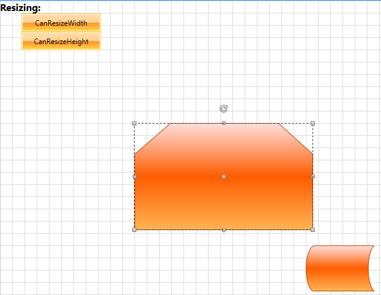

# Disable Horizontal or Vertical Shape Resizing

In __RadDiagram__ each __RadDiagramItem__ can be resized. This operation is internally implemented by a __ResizingService__.			

>In order to learn more about the different Diagramming Services, you can examine the [Services]() article.				

In this tutorial we will examine a solution that allows the user to dynamically configure __RadDiagramShapes__ resizing and decide whether to allow horizontal and vertical resizing.

First we will create a sample __RadDiagram__ definition that has two __RadDiagramShape__ objects:				


```XAML
	<telerik:RadDiagram x:Name="diagram">
	    <telerik:RadDiagramShape Geometry="{telerik:FlowChartShape ShapeType=BeginLoopShape}" Position="400 300" />
	    <telerik:RadDiagramShape Geometry="{telerik:FlowChartShape ShapeType=ExternalDataShape}" Position="500 400" />
	</telerik:RadDiagram>
```

Next, we will add two __RadToggleButtons__ to provide the user with the option to turn on and off the vertical and horizontal resizing of a shape.			


```XAML
	<StackPanel Width="200" HorizontalAlignment="Left">
		<TextBlock FontSize="16"
				   FontWeight="Bold"
				   Text="Resizing: " />
		<telerik:RadToggleButton x:Name="resizeWidth"
								 Width="130"
								 Height="30"
								 Content="CanResizeWidth"
								 IsChecked="True" />
		<telerik:RadToggleButton x:Name="resizeHeight"
								 Width="130"
								 Height="30"
								 Content="CanResizeHeight"
								 IsChecked="True" />
	</StackPanel>
```

Now that we've defined the content of our view, we can start describing the custom resizing implementation. And as we need to disable a resizing operation based on dynamically set values, we will have to customize the default resizing mechanism. This mechanism is controlled by the __ResizingService__ class which exposes a virtual method that calculates how to change the current size of a shape. Therefore we will start by creating a custom resizing service that derives from the __RadDiagram ResizingService__ and we will override the __CalculateNewDelta()__ method.


```C#
	public class MyResizing : ResizingService
	{
	    public MyResizing(RadDiagram owner)
	        : base(owner as IGraphInternal)
	    {
	    }
	
	    protected override Point CalculateNewDelta(Point newPoint)
	    {
	        return base.CalculateNewDelta(newPoint);
	    }
	}
```


```VB.NET
	Public Class MyResizing
	    Inherits ResizingService
	
	    Public Sub New(ByVal owner As RadDiagram)
	        MyBase.New(TryCast(owner, IGraphInternal))
	
	    End Sub
	
	    Protected Overrides Function CalculateNewDelta(ByVal newPoint As Point) As Point
	        Return MyBase.CalculateNewDelta(newPoint)
	    End Function
	End Class
```

Since we added two __RadToggleButtons__ in our view, we need to define two __boolean__ properties to track the checked state of these buttons and use them to control the result of the resizing operation.


```C#
	public class MyResizing : ResizingService, INotifyPropertyChanged
	{
	    private bool canResizeHeight;
	    private bool canResizeWidth;
	
	    public MyResizing(RadDiagram owner)
	        : base(owner as IGraphInternal)
	    {
	        //Initialize the boolean properties that will control the availability of the resizing
	        this.CanResizeWidth = true;
	        this.CanResizeHeight = true;
	    }
	
	    public event PropertyChangedEventHandler PropertyChanged;
	
	    public bool CanResizeWidth
	    {
	        get
	        {
	            return this.canResizeWidth;
	        }
	        set
	        {
	            if (this.canResizeWidth != value)
	            {
	                this.canResizeWidth = value;
	                this.OnPropertyChaged("CanResizeWidth");
	            }
	        }
	    }
	    public bool CanResizeHeight
	    {
	        get
	        {
	            return this.canResizeHeight;
	        }
	        set
	        {
	            if (this.canResizeHeight != value)
	            {
	                this.canResizeHeight = value;
	                this.OnPropertyChaged("CanResizeHeight");
	            }
	        }
	    }
	
	    protected override Point CalculateNewDelta(Point newPoint)
	    {
	        //calculate the size change using the defaul calulation mechanism
	        var newDelta = base.CalculateNewDelta(newPoint);
	        //use the boolean properties to determine whether to apply any changes in the size of the manipulated item
	        return new Point(this.CanResizeWidth ? newDelta.X : 0, this.CanResizeHeight ? newDelta.Y : 0);
	    }
	
	    private void OnPropertyChaged(string name)
	    {
	        if (this.PropertyChanged != null)
	        {
	            this.PropertyChanged(this, new PropertyChangedEventArgs(name));
	        }
	    }
	}
```


```VB.NET
	Public Class MyResizing
	    Inherits ResizingService
	    Implements INotifyPropertyChanged
	
	    Private resizeHeight As Boolean
	    Private resizeWidth As Boolean
	
	    Public Sub New(ByVal owner As RadDiagram)
	        MyBase.New(TryCast(owner, IGraphInternal))
	        'Initialize the boolean properties that will control the availability of the resizing'
	        Me.CanResizeWidth = True
	        Me.CanResizeHeight = True
	    End Sub
	
	    Public Event PropertyChanged As PropertyChangedEventHandler Implements INotifyPropertyChanged.PropertyChanged
	
	    Public Property CanResizeWidth() As Boolean
	        Get
	            Return Me.resizeWidth
	        End Get
	        Set(ByVal value As Boolean)
	            If Me.resizeWidth <> value Then
	                Me.resizeWidth = value
	                Me.OnPropertyChaged("CanResizeWidth")
	            End If
	        End Set
	    End Property
	    Public Property CanResizeHeight() As Boolean
	        Get
	            Return Me.resizeHeight
	        End Get
	        Set(ByVal value As Boolean)
	            If Me.resizeHeight <> value Then
	                Me.resizeHeight = value
	                Me.OnPropertyChaged("CanResizeHeight")
	            End If
	        End Set
	    End Property
	
	    Protected Overrides Function CalculateNewDelta(ByVal newPoint As Point) As Point
	        'calculate the size change using the defaul calulation mechanism'
	        Dim newDelta = MyBase.CalculateNewDelta(newPoint)
	        'use the boolean properties to determine whether to apply any changes in the size of the manipulated item'
	        Return New Point(If(Me.CanResizeWidth, newDelta.X, 0), If(Me.CanResizeHeight, newDelta.Y, 0))
	    End Function
	
	    Private Sub OnPropertyChaged(ByVal name As String)
	        RaiseEvent PropertyChanged(Me, New PropertyChangedEventArgs(name))
	    End Sub
	End Class
```

>Please note that the __CalculateNewDelta()__ method returns a result of type __Point__. However, this result doesn't describe coordinates of a point, but a delta value representing the change that should be applied on __RadDiagramItem(s)__ size. This delta is calculated based on the resizing direction specified by the resizing thumb being used, the coordinates of the mouse when the resize was initiated, the coordinates of the mouse when the operation was finished and the rotation angle. The __X__ porperty of the calculated result reflects the change in the __Width__ of the manipulated item, while the __Y__ property value reflects the change that has to be applied on the __Height__ of the item. This is why when you override the __CalculateNewDelta()__ method to return a __Point__ with __X__ and __Y__ properties set to __0__, you tell __RadDiagram__ that there is no change in the size of the manipulated __RadDiagramItem(s)__.					

If you take a look at the custom __CalculateNewDelta()__ method implementation, you can note that the logic is straight-forward. It takes into account the values of the __CanResizeWidth__ and __CanResizeHeight__ properties to decide whether there should be a change in the __Width__ or __Height__ of the manipulated item. If both boolean properties are set to __false__, then the __CalculateNewDelta()__ method returns a result of __Point(0,0)__ which indicates that there are no changes in the size of the manipulated shape. This way the initiated resizing is ignored and the actual size of the manipulated shape is not changed.				

Finally, we need to configure the __RadDiagram__ instance to use our custom resizing service instead of the default __ResizingService__. This is why we need to create a new instance of the __MyResizing__ class in the code-behind file of our view. Then we need to make sure that the __CanResizeWidth__ and __CanResizeHeight__ properties are used as binding paths for the __IsChecked__ properties of the two __RadToggleButtons__ we defined to control the user ability to resize a shape:				


```C#
	private MyResizing newResizingService;
	
	public Example()
	{
	    InitializeComponent();
	
	    this.InitializeNewServices();
	}
	
	private void InitializeNewServices()
	{
	    //initialize the newResizingService
	    this.newResizingService = new MyResizing(this.diagram);
	     //create a binding with Path=CanResizeWidth
	    Binding binding = new Binding("CanResizeWidth");
	    //use the newResizingService as a source of the binding
	    binding.Source = this.newResizingService;
	    binding.Mode = BindingMode.TwoWay;
	    //apply the binding on the resizeWidth RadToggleButton
	    this.resizeWidth.SetBinding(RadToggleButton.IsCheckedProperty, binding);
	
	    //create a binding with Path=CanResizeHeight
	    binding = new Binding("CanResizeHeight");
	    //use the newResizingService as a source of the binding
	    binding.Source = this.newResizingService;
	    binding.Mode = BindingMode.TwoWay;
	    //apply the binding on the resizeHeight RadToggleButton
	    this.resizeHeight.SetBinding(RadToggleButton.IsCheckedProperty, binding);
	}
```


```VB.NET
	Private newResizingService As MyResizing
	
	Public Sub New()
	    InitializeComponent()
	
	    Me.InitializeNewServices()
	End Sub
	
	Private Sub InitializeNewServices()
	    'initialize the newResizingService'
	    Me.newResizingService = New MyResizing(Me.diagram)
	    'create a binding with Path=CanResizeWidth'
	    Dim binding As New Binding("CanResizeWidth")
	    'use the newResizingService as a source of the binding'
	    binding.Source = Me.newResizingService
	    binding.Mode = BindingMode.TwoWay
	    'apply the binding on the resizeWidth RadToggleButton'
	    Me.resizeWidth.SetBinding(RadToggleButton.IsCheckedProperty, binding)
	
	    'create a binding with Path=CanResizeHeight'
	    binding = New Binding("CanResizeHeight")
	    'use the newResizingService as a source of the binding'
	    binding.Source = Me.newResizingService
	    binding.Mode = BindingMode.TwoWay
	    'apply the binding on the resizeHeight RadToggleButton'
	    Me.resizeHeight.SetBinding(RadToggleButton.IsCheckedProperty, binding)
	End Sub
```

And now we can use the __newResizingService__ instance and register it through the __ServiceLocator__:


```C#
	public Example()
	{
	    InitializeComponent();
	
	    this.InitializeNewServices();
	    this.diagram.ServiceLocator.Register<IResizingService>(this.newResizingService);
	}
```


```VB.NET
	Public Sub New()
	    InitializeComponent()
	
	    Me.InitializeNewServices()	
	    Me.diagram.ServiceLocator.Register(Of IResizingService)(Me.newResizingService)
	End Sub
```

If you run the solution now the resizing buttons will be checked thus allowing all resizing operations.


However, as soon as you uncheck any of the buttons, the related resizing operation will be denied. For instance, if you click the __CanResizeWidth__ button, you will not be able to change the __Width__ of the __RadDiagramShapes__. And as soon as you also uncheck the __CanResizeHeight__ button, the __Height__ will also be locked.

>tip Find a runnable project of the previous example in the [WPF Samples GitHub repository](https://github.com/telerik/xaml-sdk/tree/master/Diagram/CustomServices).

## See Also
 * [Shapes]()
 * [Resizing]()
 * [Services]()
 * [Customize the Rotation Step]()