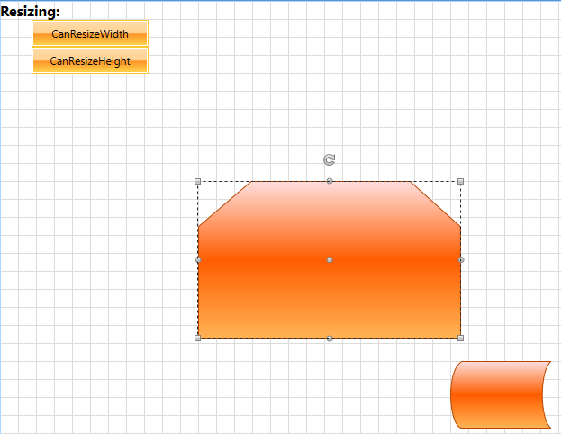

# Disable Horizontal or Vertical Shape Resizing

In __RadDiagram__ each __RadDiagramItem__ can be resized. This operation is internally implemented by a __ResizingService__.			

>In order to learn more about the different Diagramming Services, you can examine the [Services]() article.				

In this tutorial we will examine a solution that allows the user to dynamically configure __RadDiagramShapes__ resizing and decide whether to allow horizontal and vertical resizing.

First we will create a sample __RadDiagram__ definition that has two __RadDiagramShape__ objects:				

<snippet id='raddiagram-howto-customize-resizing-block_1-xaml' />

Next, we will add two __RadToggleButtons__ to provide the user with the option to turn on and off the vertical and horizontal resizing of a shape.			

<snippet id='raddiagram-howto-customize-resizing-block_2-xaml' />

Now that we've defined the content of our view, we can start describing the custom resizing implementation. And as we need to disable a resizing operation based on dynamically set values, we will have to customize the default resizing mechanism. This mechanism is controlled by the __ResizingService__ class which exposes a virtual method that calculates how to change the current size of a shape. Therefore we will start by creating a custom resizing service that derives from the __RadDiagram ResizingService__ and we will override the __CalculateNewDelta()__ method.

<snippet id='raddiagram-howto-customize-resizing-block_3-cs' />

<snippet id='raddiagram-howto-customize-resizing-block_3-vb' />

Since we added two __RadToggleButtons__ in our view, we need to define two __boolean__ properties to track the checked state of these buttons and use them to control the result of the resizing operation.

<snippet id='raddiagram-howto-customize-resizing-block_4-cs' />

<snippet id='raddiagram-howto-customize-resizing-block_4-vb' />

>Please note that the __CalculateNewDelta()__ method returns a result of type __Point__. However, this result doesn't describe coordinates of a point, but a delta value representing the change that should be applied on __RadDiagramItem(s)__ size. This delta is calculated based on the resizing direction specified by the resizing thumb being used, the coordinates of the mouse when the resize was initiated, the coordinates of the mouse when the operation was finished and the rotation angle. The __X__ porperty of the calculated result reflects the change in the __Width__ of the manipulated item, while the __Y__ property value reflects the change that has to be applied on the __Height__ of the item. This is why when you override the __CalculateNewDelta()__ method to return a __Point__ with __X__ and __Y__ properties set to __0__, you tell __RadDiagram__ that there is no change in the size of the manipulated __RadDiagramItem(s)__.					

If you take a look at the custom __CalculateNewDelta()__ method implementation, you can note that the logic is straight-forward. It takes into account the values of the __CanResizeWidth__ and __CanResizeHeight__ properties to decide whether there should be a change in the __Width__ or __Height__ of the manipulated item. If both boolean properties are set to __false__, then the __CalculateNewDelta()__ method returns a result of __Point(0,0)__ which indicates that there are no changes in the size of the manipulated shape. This way the initiated resizing is ignored and the actual size of the manipulated shape is not changed.				

Finally, we need to configure the __RadDiagram__ instance to use our custom resizing service instead of the default __ResizingService__. This is why we need to create a new instance of the __MyResizing__ class in the code-behind file of our view. Then we need to make sure that the __CanResizeWidth__ and __CanResizeHeight__ properties are used as binding paths for the __IsChecked__ properties of the two __RadToggleButtons__ we defined to control the user ability to resize a shape:				

<snippet id='raddiagram-howto-customize-resizing-block_5-cs' />

<snippet id='raddiagram-howto-customize-resizing-block_5-vb' />

And now we can use the __newResizingService__ instance and register it through the __ServiceLocator__:

<snippet id='raddiagram-howto-customize-resizing-block_6-cs' />

<snippet id='raddiagram-howto-customize-resizing-block_6-vb' />

If you run the solution now the resizing buttons will be checked thus allowing all resizing operations.

However, as soon as you uncheck any of the buttons, the related resizing operation will be denied. For instance, if you click the __CanResizeWidth__ button, you will not be able to change the __Width__ of the __RadDiagramShapes__. And as soon as you also uncheck the __CanResizeHeight__ button, the __Height__ will also be locked.

>tip Find a runnable project of the previous example in the [WPF Samples GitHub repository](https://github.com/telerik/xaml-sdk/tree/master/Diagram/CustomServices).

## See Also
 * [Shapes]()
 * [Resizing]()
 * [Services]()
 * [Customize the Rotation Step]()